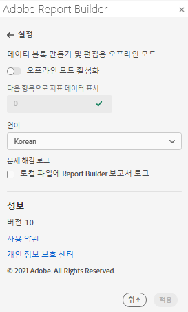
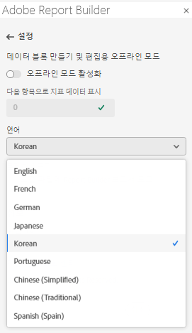

# Report Builder 설정

**설정** 창을 사용하여 UI에서 표시하는 언어와 같은 응용 프로그램 수준 설정 또는 오프라인 모드에서 작업할지 여부를 구성합니다. 설정은 즉시 적용되며, 변경될 때까지 모든 향후 세션에 대해 설정됩니다.

Report Builder 설정을 변경하려면

1. **설정** 아이콘을 클릭합니다.

1. 오프라인 모드를 변경하거나, 언어를 선택하거나, 문제 해결 로그 설정을 활성화합니다.

1. **적용**&#x200B;을 클릭합니다.

   

## 오프라인 모드

오프라인 모드에서 데이터 블록을 만들고 편집할 때 데이터가 검색되지 않습니다. 대신 시뮬레이션 데이터가 사용되므로 요청이 실행될 때까지 기다리지 않고 데이터 블록을 빠르게 만들고 편집할 수 있습니다. 다시 온라인 상태가 되면 *데이터 블록 새로 고침* 명령 또는 *모든 데이터 블록 새로 고침* 명령은 실제 데이터로 만든 데이터 블록을 새로 고칩니다.

오프라인 모드를 활성화하려면

1. **설정** 아이콘을 클릭합니다.

1. **오프라인 모드 활성화**&#x200B;를 선택합니다.

1. **지표 데이터를** 필드로 표시 필드에 양의 정수를 입력합니다.

1. **적용**&#x200B;을 클릭합니다.

## 언어

Report Builder UI에 사용할 언어를 선택할 수 있습니다. 지원되는 모든 Adobe Analytics 언어를 사용할 수 있습니다.

Report Builder UI에 사용된 언어를 선택하려면

1. 설정을 클릭합니다.

1. **언어** 드롭다운 메뉴에서 언어를 선택합니다.

   

1. **적용을 클릭합니다.**

## 문제 해결

모든 클라이언트/서버 데이터를 로컬 파일에 기록하려면 문제 해결 설정을 사용합니다. 이 옵션을 사용하여 지원 티켓을 해결합니다.

문제 해결 옵션을 활성화하려면 **로컬 파일에 Report Builder 요청 로그**&#x200B;를 선택합니다.
