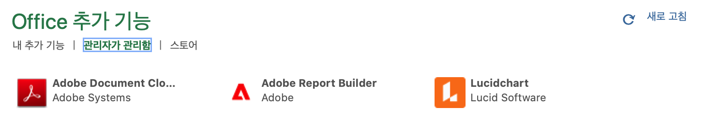
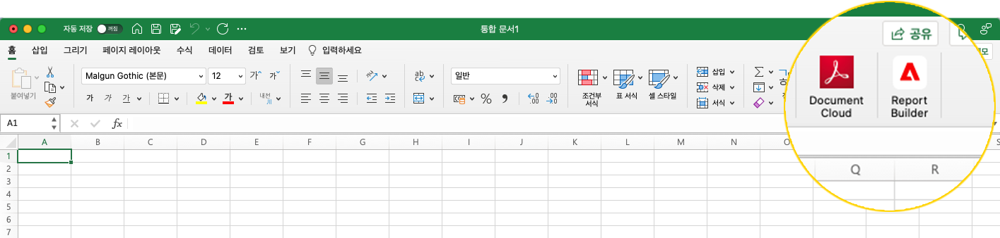
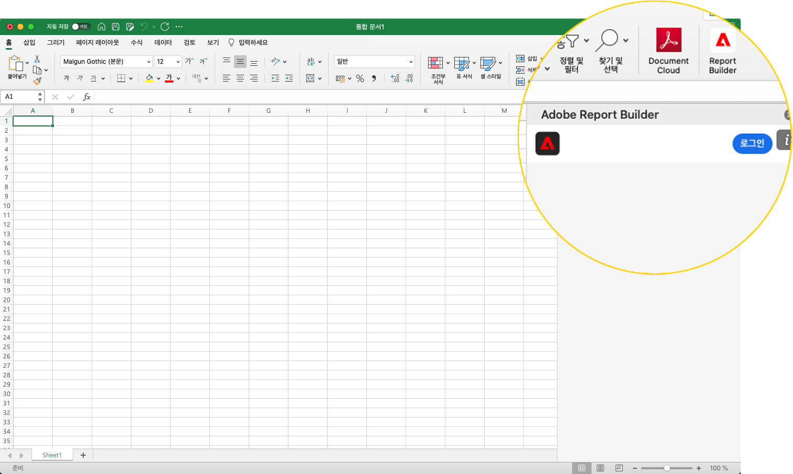
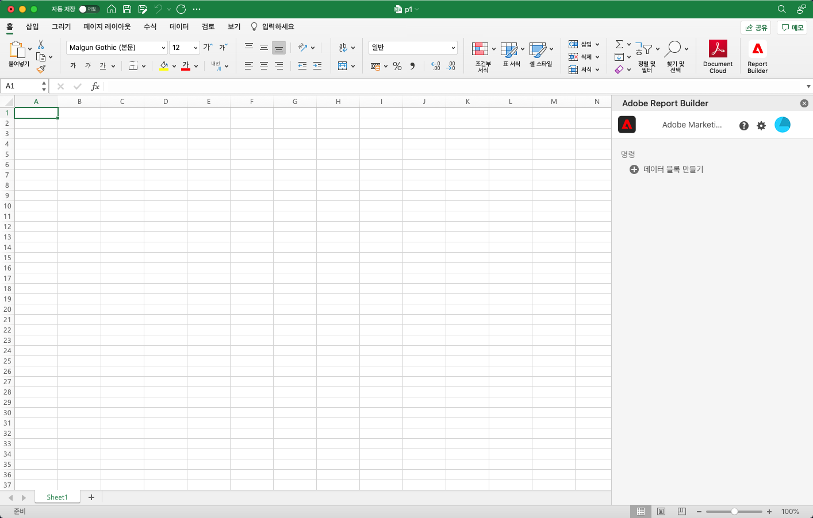
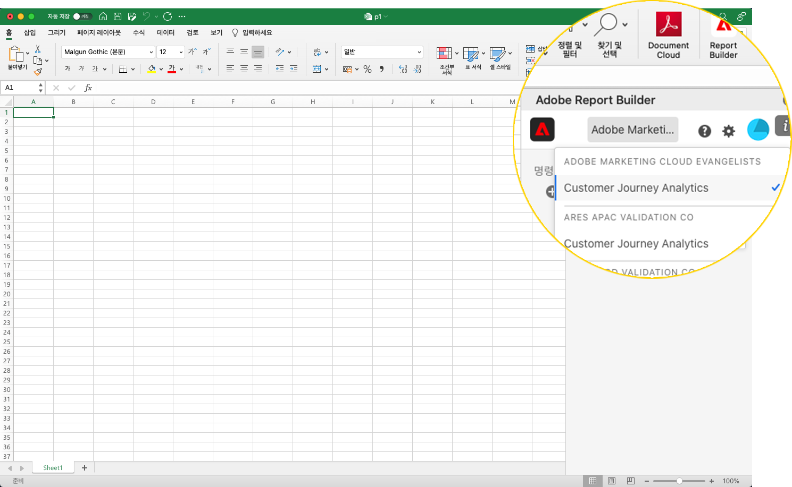
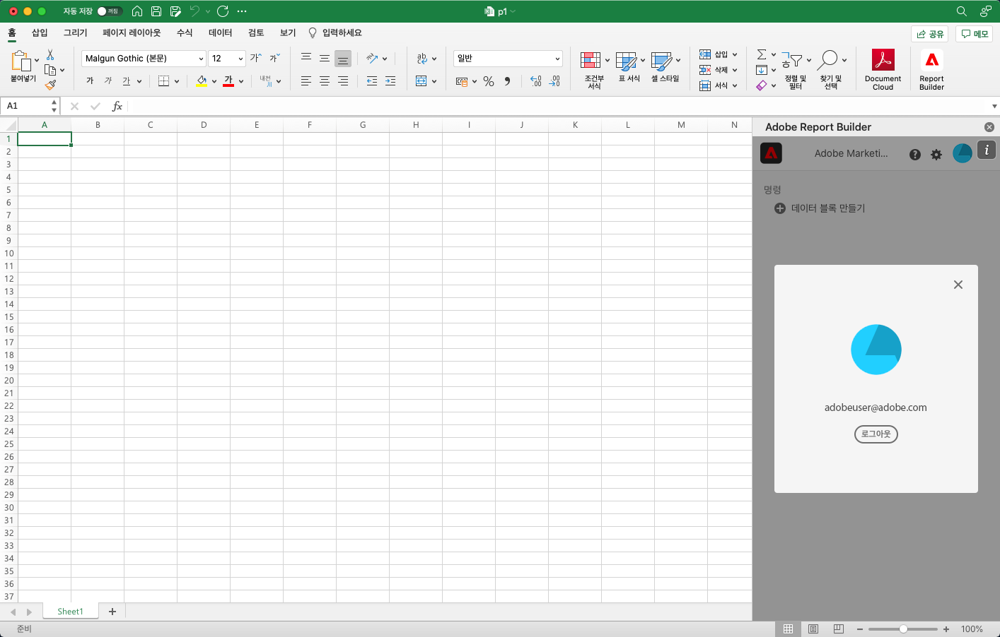

# Report Builder 설정

Excel 추가 기능 메뉴를 사용하여 Report Builder에 빠르게 액세스할 수 있습니다.

## 요구 사항

Customer Journey Analytics Report Builder은 다음 운영 체제 및 웹 브라우저에서 지원됩니다.

### macOS

- macOS 버전 10.x 이상
- 모든 Excel 버전

### Windows

- Windows 10, 버전 1904 이상
- Excel 버전 2106 이상

   모든 Windows 데스크톱 Excel 사용자는 추가 기능을 사용하려면 Microsoft Edge Webview2를 설치해야 합니다. 컨트롤러를 설치하려면

   1. <http://aka.ms/webview2installer> 으로 이동합니다.
   1. Evergreen Standalone Installer를 선택하고 다운로드합니다.
   1. 설치 프롬프트가 나타납니다.

### 웹 오피스

- 모든 브라우저 및 버전을 지원합니다

## Report Builder Excel 추가 기능

Customer Journey Analytics에 Report Builder을 사용하려면 Excel Report Builder 추가 기능을 설치해야 합니다. Excel Report Builder 추가 기능을 설치하면 열려 있는 Excel 통합 문서 내에서 Report Builder에 액세스할 수 있습니다.

### Report Builder 추가 기능을 다운로드하여 설치합니다

Report Builder 추가 기능을 다운로드하여 설치하려면 다음을 수행하십시오

1. Excel을 실행하고 새 통합 문서를 엽니다.

1. 삽입 > 추가 기능 가져오기를 선택합니다.

1. Office 추가 기능 대화 상자에서 저장소 탭을 선택합니다.

1. &quot;Report Builder&quot;을 검색하고 추가를 클릭합니다.

1. 사용 약관 및 개인 정보 보호 정책 대화 상자에서 계속을 클릭합니다.

**저장소 탭이 표시되지 않으면**

1. Excel에서 파일 > 계정 > 설정 관리를 선택합니다.

1. &quot;연결된 선택 사항 환경 활성화&quot; 옆에 있는 상자를 선택합니다

1. Excel을 다시 시작합니다.

**조직에서 Microsoft 스토어에 대한 액세스를 차단하는 경우**

Report Builder 추가 기능에 대한 승인을 요청하려면 IT 또는 보안 팀에 문의하십시오. 승인을 받은 후 Office 추가 기능 대화 상자에서 관리 탭을 선택합니다.

Report Builder 추가 기능을 설치한 후 홈 탭 아래의 Excel 리본에 Report Builder 아이콘이 표시됩니다.

## Report Builder에 로그인

운영 체제 또는 브라우저의 Report Builder for Excel 추가 기능을 설치한 후 다음 단계에 따라 Report Builder에 로그인합니다.

1. Excel 통합 문서를 엽니다.

1. Report Builder 아이콘을 클릭하여 Report Builder을 시작합니다.

1. Adobe Report Builder 도구 모음에서 **로그인**&#x200B;을 클릭합니다.

   

1. Adobe Experience ID 계정 정보를 입력합니다. 계정 정보는 Customer Journey Analytics 자격 증명과 일치해야 합니다.

   

로그인하면 로그인 아이콘 및 조직이 패널 맨 위에 나타납니다

## 조직 전환

처음 로그인하면 프로필에 할당된 기본 조직에 로그인합니다.

1. 로그인할 때 표시되는 조직 이름을 클릭합니다.

1. 사용 가능한 조직 목록에서 조직을 선택합니다. 액세스 권한이 있는 조직만 나열됩니다.

   

## 로그아웃

사용자 프로필에서 Report Builder에서 로그아웃할 수 있습니다.

1. 열려 있는 통합 문서에 변경 사항을 저장합니다.

1. 아바타 아이콘을 클릭하여 사용자 프로필을 표시합니다.

   

1. **로그아웃**&#x200B;을 클릭합니다.
