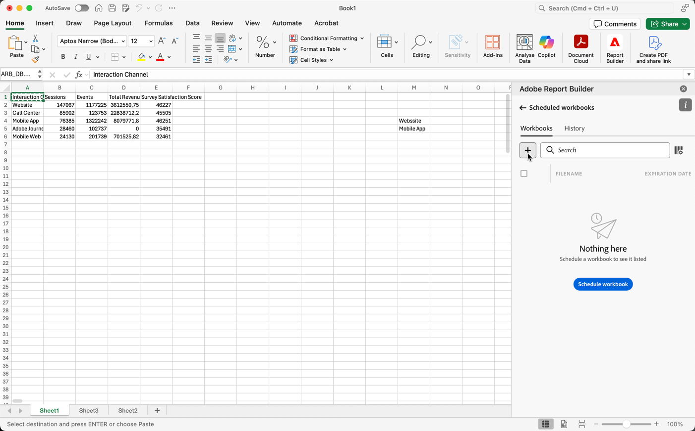
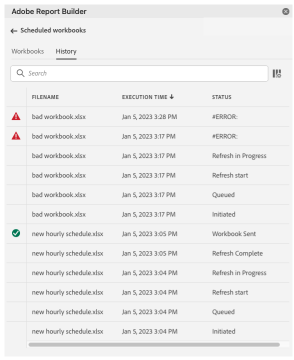

# 통합 문서 예약

통합 문서를 저장하고 분석을 완료한 후 예약 기능을 사용하여 팀의 다른 사용자와 통합 문서를 쉽게 공유할 수 있습니다. 예약 기능을 사용하면 통합 문서에서 데이터를 자동으로 새로 고치고 Excel 통합 문서 .xlsx 파일을 특정 날짜 및 시간에 지정된 대상에 대한 첨부 파일로 이메일로 보내는 예약을 만들 수 있습니다. 일정을 설정하면 수신자가 정기적으로 자동으로 업데이트됩니다. 예약 기능을 사용하여 자동 업데이트를 예약하지 않고 통합 문서를 한 번 보낼 수도 있습니다.

단일 통합 문서에 대해 여러 일정을 만들 수 있습니다. 예를 들어, 매일 팀에 통합 문서를 보낼 수 있으며, 두 개의 다른 일정을 만들어 일주일에 한 번 통합 문서를 관리자에게 보낼 수 있습니다.

예약 기능을 사용하면 통합 문서에 대해 암호 보호를 설정하고 이전에 예약된 통합 문서를 편집할 수도 있습니다.

>[!VIDEO](https://video.tv.adobe.com/v/3413079/?quality=12&learn=on)

## 통합 문서 예약

통합 문서 Excel 파일(.xlsx)을 개인 또는 그룹에 자동으로 배포할 수 있도록 Report Builder 허브의 작업 예약 단추를 사용하여 일정을 빠르게 만듭니다.

1. Report Builder 허브에서 예약 단추를 클릭합니다.

   {width="55%"}

1. 통합 문서 예약 을 클릭하거나 왼쪽 상단의 더하기 단추를 클릭하여 예약된 새 통합 문서를 만듭니다.

   {width="55%"}

   예약 창에는 통합 문서 이름 및 통합 문서가 수정된 마지막 날짜와 같은 통합 문서에 대해 사전 정의된 정보가 표시됩니다.

   {width="55%"}

1. (선택 사항) 파일 이름을 입력합니다.

   통합 문서 파일 이름은 기본적으로 통합 문서의 이름으로 설정되지만 원하는 경우 변경할 수 있습니다. 동일한 통합 문서를 여러 대상에게 보내고 특정 대상에게 좀 더 친숙한 이름으로 지정하려면 이름을 변경할 수 있습니다.

1. (선택 사항) 선택 **파일 이름에 타임스탬프 추가**.

   파일 이름에 타임스탬프를 추가하여 통합 문서가 업데이트된 날짜를 식별할 수 있습니다. 이 기능은 특정 날짜에 전송된 통합 문서의 버전을 빠르게 확인하는 데 유용합니다. 다음 **파일 이름 미리 보기** 통합 문서가 배포될 때 전자 메일에 통합 문서 파일 이름이 표시되는 방식을 표시합니다. 타임스탬프 형식은 YYYY-MM-DD입니다.

1. (선택 사항) 선택 **.zip 압축** 파일을 압축하고 파일에 암호 보호를 설정하려면 다음을 수행하십시오.

   이 옵션을 선택하면 파일을 열 암호를 입력하라는 메시지가 표시됩니다. 데이터 보안에 대한 우려 사항이 있고 통합 문서를 암호로 보호하려는 경우 유용합니다. 암호를 사용하여 파일을 보호하려면 **.zip 압축**. 암호는 8자 이상이어야 하며 숫자와 특수 문자를 포함해야 합니다.

   {width="55%"}

1. Enter 키 **수신자**. 조직에서 인식되는 개인의 이름을 입력하거나 조직 내부 또는 외부 개인의 이메일 주소를 입력할 수 있습니다.

1. 을(를) 입력합니다. **제목** 전자 메일 및 수신자를 위한 설명 중에서 선택할 수 있습니다. 제목은 기본적으로 통합 문서 파일 이름이지만 필요한 경우 제목을 수정할 수 있습니다. 설명 섹션에서 세부 사항을 추가할 수 있습니다.

   {width="55%"}

1. 예약 옵션을 설정하여 통합 문서를 수신자에게 이메일로 전송할 날짜와 시간을 설정합니다.

   시작 및 종료 날짜 및 기간을 선택합니다. 오늘의 날짜나 미래의 날짜가 될 수 있습니다.

   을(를) 선택합니다 **빈도** 를 클릭합니다. 특정 날짜에 시간별, 일별, 주별, 월별 또는 연도별 빈도를 설정할 수 있습니다. 예를 들어, 통합 문서를 해당 월의 첫 번째 일요일 밤에 보내도록 일정을 설정하여 수신자가 월요일 아침에 받은 편지함에 있는 전자 메일을 맨 먼저 받도록 할 수 있습니다.

   {width="55%"}

1. 일정을 설정한 후 **일정에 따라 보내기**.

   {width="55%"}

   Report Builder 허브의 하단에 확인 토스트가 표시되며, 예약된 통합 문서는 통합 문서 탭 아래에 나열됩니다.

   {width="55%"}

## 통합 문서를 한 번만 보냅니다

통합 문서를 한 번만 보낼 수도 있습니다.

1. 확인 취소 **예약 옵션 표시**

   {width="40%"}

1. **지금 보내기**&#x200B;를 클릭합니다.

## 예약된 통합 문서 보기 및 편집

통합 문서 탭 아래에서 한 위치에서 예약된 통합 문서를 모두 보고 관리할 수 있습니다.

1. Report Builder 허브의 예약 섹션에서 통합 문서 탭을 클릭합니다. 예약된 모든 통합 문서 목록을 보려면 이 보기를 사용합니다.

1. 통합 문서를 선택합니다. 통합 문서를 편집하고, 일정을 변경하고, 일정을 일시 중지한 후 다시 시작하거나, 일정을 삭제할 수 있는 몇 가지 도구가 표시됩니다.

   {width="55%"}

* (선택 사항) 연필 아이콘을 클릭하여 통합 문서 일정을 편집합니다.

* (선택 사항) 예약된 각 작업의 기록을 보려면 시계 아이콘을 클릭합니다.

* (선택 사항) 일시 중지 아이콘을 클릭하여 배포 일정을 일시 중지하고 다시 시작합니다. 이 기능은 통합 문서를 보내기 전에 통합 문서를 수정해야 하는 경우에 유용합니다. 배포를 다시 시작하려면 일시 중지 아이콘을 다시 클릭합니다.

* (선택 사항) 일정을 삭제하려면 휴지통을 클릭합니다.

## 예약된 작업의 상태 검토

작업 내역 보기를 사용하면 예약된 각 작업의 상태를 검토할 수 있습니다. 각 예약된 작업의 상태 변경을 문서화하는 별도의 행이 있습니다. 아래 표시된 예에서 *새 시간별 일정* 가 1월 5일 오후 3시에 시작되었습니다. 오후 3시 5분까지 성공적으로 새로 고침되고 수신자에게 전송됩니다. 다음 통합 문서 *잘못된 통합 문서*&#x200B;를 새로 고치는 동안 오류가 발생했습니다. 통합 문서를 보내지 못하면 내역 탭에서 오류가 발생한 위치를 표시하여 문제를 해결하는 데 도움이 됩니다. 이 경우 통합 문서를 성공적으로 새로 고치지 못하게 하는 일부 데이터 블록 오류나 누락된 구성 요소 때문일 수 있습니다.

녹색 확인 표시는 통합 문서가 성공적으로 전송되었음을 나타냅니다. 빨간색 삼각형의 느낌표는 오류가 발생했음을 나타냅니다.

검색 창 오른쪽에 있는 열 설정 아이콘을 클릭하여 기록 탭에 표시할 열을 선택할 수 있습니다.

{width="55%"}

통합 문서 탭으로 이동하여 통합 문서를 선택하고 내역 아이콘을 클릭하여 예약된 통합 문서 중 하나만 표시하도록 기록을 필터링할 수 있습니다.

통합 문서 탭에서 특정 통합 문서의 내역을 볼 수도 있습니다. 통합 문서 탭에서 통합 문서를 선택한 다음 내역 아이콘을 클릭합니다.

{width="55%"}

그러면 통합 문서 필터가 내역 맨 위에 나타납니다. 예약된 모든 작업의 기록을 다시 보려면 필터 옆에 있는 x 를 클릭합니다.

{width="55%"}

