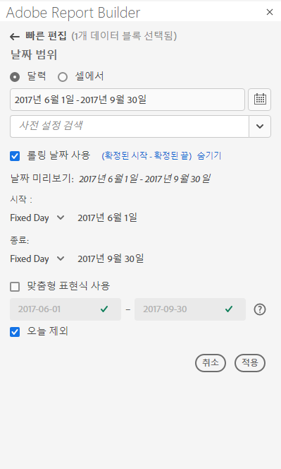
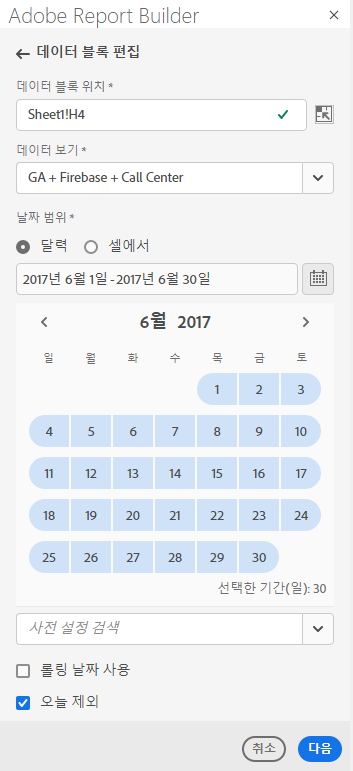
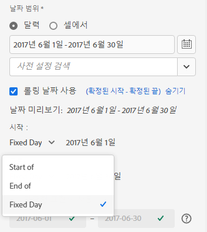
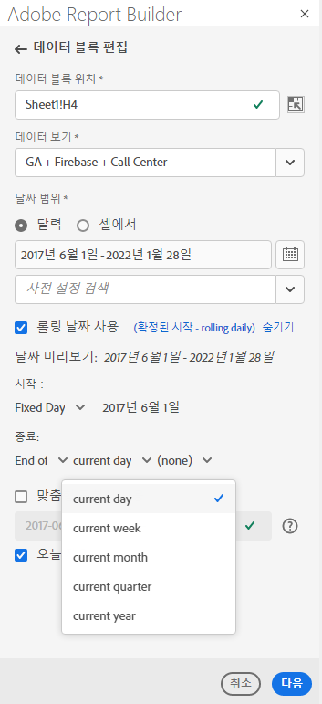
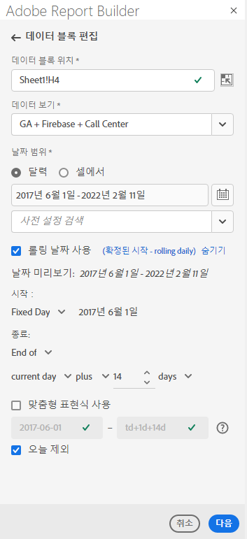
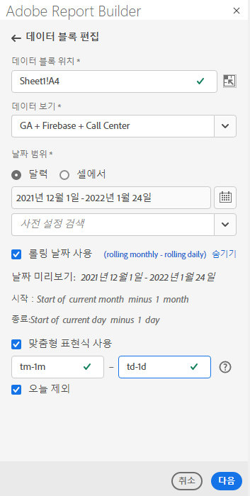
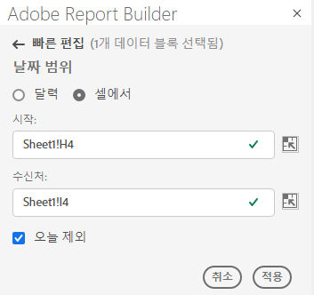

# 날짜 범위 선택

기존 데이터 블록의 날짜 범위를 변경하려면 데이터 블록 편집을 선택하거나 빠른 편집 패널을 사용합니다.

데이터 블록의 날짜 범위를 변경하려면 다음 옵션을 사용합니다.

**달력**

달력 을 사용하면 다음 옵션을 사용하여 정적 또는 롤링 날짜를 만들 수 있습니다.

- 날짜 범위 필드
- 달력
- 사전 설정 드롭다운 메뉴
- 롤링 날짜 모드
- 표현식 사용자 지정


**셀에서**

시작 셀 옵션을 사용하면 워크시트 셀에 입력한 날짜를 참조할 수 있습니다.

선택한 날짜 범위에서 오늘을 제외하는 선택 사항이 있습니다.



## 달력 사용

**달력**&#x200B;을 사용하는 경우 날짜 범위 필드에는 데이터 블록 요청에 대한 현재 날짜 범위가 표시됩니다. 날짜 범위 필드에 날짜를 직접 입력하거나 데이터 범위 선택 옵션을 사용할 수 있습니다.

### 날짜 범위 필드

날짜 범위 필드에 직접 날짜를 입력하려면

1. 달력 아이콘 옆에 있는 날짜 범위 필드를 클릭합니다.

1. 날짜 범위에 대한 시작 및 종료 날짜를 입력합니다.

### 달력

달력을 사용하여 날짜를 선택하려면 다음을 수행하십시오

1. 달력 아이콘을 클릭하여 월별 달력을 표시합니다.

1. 시작 날짜를 클릭합니다.

1. 종료 날짜를 클릭합니다.

날짜 범위를 반대로 설정하려면 먼저 종료 날짜를 클릭한 다음 시작 날짜를 클릭합니다.



### 사전 설정 드롭다운 메뉴

사전 설정 드롭다운 메뉴에는 저장한 데이터 보기에 대한 사전 설정된 날짜 범위 및 날짜 범위 구성 요소 집합 또는 사용자와 공유된 데이터 보기가 포함됩니다.

### 순환 날짜

롤링 날짜 옵션을 사용하면 롤링 날짜를 사용하여 날짜 범위를 선택할 수 있습니다.

1. **롤링 날짜 사용**&#x200B;을 선택합니다.

1. 시작 및 종료 날짜에 대한 롤링 표현식을 선택합니다.

   

   **시작**  — 일, 주, 월, 분기 또는 연도의 시작을 선택할 수 있습니다.

   **끝**  — 일, 주, 월, 분기 또는 연도의 끝을 선택할 수 있습니다.

   **고정 일**  — 다른 날짜가 롤링 중인 동안 시작 또는 종료 날짜를 수정할 수 있습니다.

1. 일, 주, 월, 분기 또는 연도를 순환 기간으로 선택합니다.

   

1. 롤링 날짜에서 일, 주, 월, 분기 또는 연도를 추가하거나 제거합니다.

   

1. 다음 을 클릭하여 데이터 범위를 정의합니다.

   날짜 미리 보기를 사용하여 결과 날짜 범위가 원하는 범위인지 확인합니다.

### 사용자 지정 표현식

사용자 지정 표현식 옵션을 사용하면 사용자 지정 표현식을 만들어 날짜 범위를 변경하거나 산술 공식을 입력할 수 있습니다.

1. **롤링 날짜 사용**&#x200B;을 선택합니다.

1. **사용자 지정 표현식 사용**&#x200B;을 선택합니다.

   **사용자 지정 표현식 사용** 옵션을 선택하면 표준 롤링 날짜 범위 컨트롤이 비활성화됩니다.

   

1. 사용자 지정 표현식을 입력합니다.

   사용자 지정 표현식의 샘플 목록은 **날짜 표현식**&#x200B;을 참조하십시오.

1. 날짜 미리 보기를 사용하여 결과 날짜 범위가 원하는 범위인지 확인합니다.

#### 사용자 지정 표현식 만들기

1. **날짜 참조**&#x200B;를 입력합니다.

1. 날짜를 과거 또는 미래로 이동하려면 **Date 연산자**&#x200B;를 추가합니다.

```tm-11m-1d``` 등의 여러 연산자를 포함하는 사용자 지정 날짜 표현식을 입력할 수 있습니다.

#### 참조 날짜

다음 표에는 날짜 참조 예가 나와 있습니다.

| 날짜 참조 | 유형 | 설명 |
|----------------|--------------|----------------------------|
| 1/1/10 | 정적 날짜 | ISO 날짜 형식으로 입력됨 |
| td | 롤링 날짜 | 오늘 시작 |
| tw | 롤링 날짜 | 이번 주 시작 |
| tm | 롤링 날짜 | 이번 달 시작 |
| tq | 롤링 날짜 | 이번 분기 시작 |
| ty | 롤링 날짜 | 올해 시작 |

#### 날짜 연산자

다음 표에는 날짜 연산자 예가 나와 있습니다.

| 날짜 연산자 | 단위 | 설명 |
|----------------|---------|--------------------|
| +6d | 일 | 날짜 참조에 6일 추가 |
| +1w | 주 | 날짜 참조에 1주일 추가 |
| -2m | 월 | 날짜 참조에 2개월 빼기 |
| -4q | 분기 | 날짜 참조에 4분기 빼기 |
| -1y | 년 | 날짜 참조에 1년 빼기 |

#### 날짜 표현식

다음 표에는 날짜 표현식 예가 나와 있습니다.

| 날짜 표현식 | 의미 |
|-----------------|--------------------------------------|
| td-1w | 지난 주의 첫 날 |
| tm-1d | 이전 달의 마지막 날 |
| td-52w | 같은 날, 52주 전 |
| tm-11m-1d | 작년 같은 달의 마지막 날 |
| &quot;2020-09-06&quot; | 2020년 9월 9일 |

## 셀의 날짜 범위

날짜 범위는 워크시트 셀에서 지정할 수 있습니다. **셀의 날짜 범위** 옵션을 사용하여 선택한 셀에서 데이터 블록 시작 및 종료 날짜를 선택합니다. **셀**&#x200B;에서 옵션을 선택하면 패널에 **From** 및 **To** 필드가 표시됩니다. 여기서 셀 위치를 입력할 수 있습니다.



## 오늘 제외

선택한 날짜 범위에서 오늘을 제외하려면 **오늘 제외** 옵션을 선택합니다. 오늘 을 포함하도록 선택하면 오늘의 불완전한 데이터를 가져올 수 있습니다.

선택한 경우 **오늘 제외** 선택 사항은 달력, 롤링 날짜 또는 사용자 지정 표현식을 포함한 모든 날짜 범위 모드에서 현재 일을 제외합니다.

## 유효한 날짜 범위

다음 목록에서는 유효한 날짜 범위 형식을 설명합니다.

- 시작 및 종료 날짜는 다음 형식이어야 합니다. YYYY-MM-DD

- 시작 날짜가 종료 날짜보다 이전이거나 같아야 합니다. 두 날짜 모두 미래로 설정할 수 있습니다.

- 롤링 날짜를 사용할 때는 시작 날짜가 오늘 또는 과거여야 합니다. **오늘 제외**&#x200B;가 선택된 경우 과거 상태여야 합니다.

- 미래에 대한 정적 날짜 범위 세트를 만들 수 있습니다. 예를 들어, 다음 주에 마케팅 캠페인 실행을 위해 미래 날짜를 설정해야 할 수도 있습니다. 이 옵션은 미리 캠페인을 모니터링하는 통합 문서를 만듭니다.

## 날짜 범위 변경

명령 패널에서 데이터 블록 편집 을 선택하거나 빠른 편집 패널에서 날짜 범위 링크를 선택하여 기존 데이터 블록의 날짜 범위를 편집할 수 있습니다.

**데이터 블록 편집**  — 단일 데이터 블록에 대해 날짜 범위를 포함하여 여러 데이터 블록 매개 변수를 편집할 수 있습니다.

**빠른 편집: 날짜 범위**  — 하나 이상의 데이터 블록의 날짜 범위를 편집할 수 있습니다.

[빠른 편집] 패널에서 날짜 범위를 편집하려면

1. 워크시트에서 하나 이상의 데이터 블록 내에서 셀을 선택합니다.

1. 빠른 편집 패널에서 **날짜 범위** 링크를 클릭합니다.

1. 날짜 선택 옵션 중 하나를 사용하여 날짜 범위를 선택합니다.

1. **적용**&#x200B;을 클릭합니다.


Report Builder은 선택 영역의 모든 데이터 블록에 새 날짜 범위를 적용합니다.
