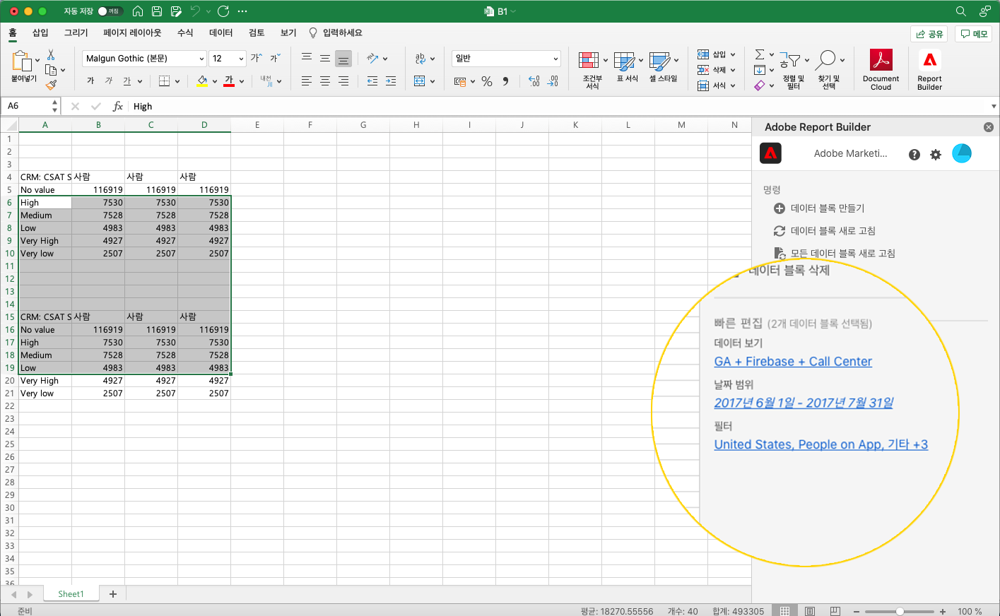

# Report Builder에서 필터 작업

새 데이터 블록을 만들 때 또는 명령 패널에서 **데이터 블록 편집** 옵션을 선택할 때 필터를 적용할 수 있습니다.

## 데이터 블록에 필터 적용

전체 데이터 블록에 필터를 적용하려면 필터를 더블 클릭하거나 구성 요소 목록에서 테이블의 필터 섹션으로 필터를 드래그 앤 드롭합니다.

## 개별 지표에 필터 적용

개별 지표에 필터를 적용하려면 테이블의 지표로 필터를 드래그 앤 드롭합니다. 테이블 창에서 지표 오른쪽에 있는 **...** 아이콘을 클릭한 다음 **필터 지표**&#x200B;를 선택할 수도 있습니다. 적용된 필터를 보려면 테이블 창에서 지표 위로 마우스를 이동하거나 선택합니다. 필터가 적용된 지표에는 필터 아이콘이 표시됩니다.

<!--  -->

## 빠른 편집 필터

빠른 편집 패널을 사용하여 기존 데이터 블록에 대한 필터를 추가하거나 제거하거나 바꿀 수 있습니다.

스프레드시트에서 셀 범위를 선택하면 빠른 편집 패널의 **필터** 링크에 해당 선택 항목의 데이터 블록이 사용하는 필터의 요약 목록이 표시됩니다.

빠른 편집 패널을 사용하여 필터를 편집하려면

1. 하나 이상의 데이터 블록에서 셀 범위를 선택합니다.

   

1. 필터 링크를 클릭하여 빠른 편집 - 필터 패널을 시작합니다.

   

### 필터 추가 또는 제거

추가/제거 옵션을 사용하여 필터를 추가하거나 제거할 수 있습니다.

1. 빠른 편집 필터 패널에서 **추가/제거** 탭을 선택합니다.

   선택한 데이터 블록에 적용된 모든 필터가 빠른 편집 필터 패널에 나열됩니다. 선택 항목의 모든 데이터 블록에 적용된 필터는 **선택한 모든 데이터 블록에 적용됨** 머리글 아래에 나열됩니다. 모든 데이터 블록이 아닌 일부에 적용된 필터는 **하나 이상의 선택한 데이터 블록에 적용됨** 머리글 아래에 나열됩니다.

   선택한 데이터 블록에 여러 필터가 있는 경우 **필터 추가** 검색 필드를 사용하여 특정 필터를 검색할 수 있습니다.

   

1. **필터 추가** 드롭다운 메뉴에서 필터를 선택하여 필터를 추가합니다.

   검색 가능한 필터 목록에는 선택한 데이터 블록 중 하나 이상에 있는 데이터 보기에 액세스할 수 있는 모든 필터와 조직에서 전역적으로 사용할 수 있는 모든 필터가 포함됩니다.

   필터를 추가하면 선택 항목의 모든 데이터 블록에 필터가 적용됩니다.

1. 필터를 제거하려면 **적용된 필터** 목록에서 필터 오른쪽에 있는 삭제 아이콘 **x**&#x200B;을 클릭합니다.

1. **적용**&#x200B;을 클릭하여 변경 사항을 저장하고 허브 패널로 돌아갑니다.

   Report Builder가 적용된 필터 변경 사항을 확인하는 메시지를 표시합니다.

### 필터 바꾸기

기존 필터를 다른 필터로 교체하여 데이터 필터링 방법을 변경할 수 있습니다.

1. 빠른 편집 필터 패널에서 **바꾸기** 탭을 선택합니다.

   

1. **검색 목록** 검색 필드를 사용하여 특정 필터를 찾습니다.

1. 바꾸려는 필터를 하나 이상 선택합니다.

1. 다음으로 바꾸기 필드에서 하나 이상의 필터를 검색합니다.

   필터를 선택하면 **다음으로 바꾸기**... 목록에 필터가 추가됩니다.

   

1. **적용**&#x200B;을 클릭합니다.

   Report Builder는 필터 목록을 업데이트하여 바꾸기 내용을 반영합니다.

### 셀에서 데이터 블록 필터 정의

데이터 블록은 셀의 필터를 참조할 수 있습니다. 여러 데이터 블록이 필터에 대해 동일한 셀을 참조할 수 있으므로 여러 데이터 블록에 대한 필터를 한 번에 쉽게 전환할 수 있습니다.

셀에서 필터를 적용하려면

1. 데이터 블록 만들기 또는 편집 프로세스의 2단계로 이동합니다. 다음을 참조하십시오 [데이터 블록 만들기](./create-a-data-block.md).
1. 다음을 클릭합니다. **필터** 탭을 사용하여 필터를 정의합니다.
1. 클릭 **셀에서 필터 만들기**.

   

1. 데이터 블록이 필터를 참조할 셀을 선택합니다.

1. 필터를 두 번 클릭하거나 필터를 포함된 필터 섹션으로 끌어다 놓아 셀에 추가하려는 필터 선택 사항을 추가합니다.

   참고: 주어진 셀에 대해 한 번에 하나의 선택만 선택할 수 있습니다.

   

1. 클릭 **적용** 참조 셀을 생성합니다.

1. 다음에서 **필터** 탭에서 새로 만든 참조 셀 필터를 데이터 블록에 추가합니다.

   

1. **마침**&#x200B;을 클릭합니다.

   이제 이 셀은 필터의 다른 데이터 블록에서 참조할 수 있습니다. 참조 셀을 다른 데이터 블록에 필터로 적용하려면 필터 탭에서 해당 필터에 셀 참조를 추가하면 됩니다.

#### 참조 셀을 사용하여 데이터 블록 필터 변경

1. 스프레드시트에서 참조 셀을 선택합니다.

1. 아래의 링크를 클릭합니다. **셀에서 필터** 를 클릭합니다.

   

1. 드롭다운 메뉴에서 필터를 선택합니다.

   

1. **적용**&#x200B;을 클릭합니다.