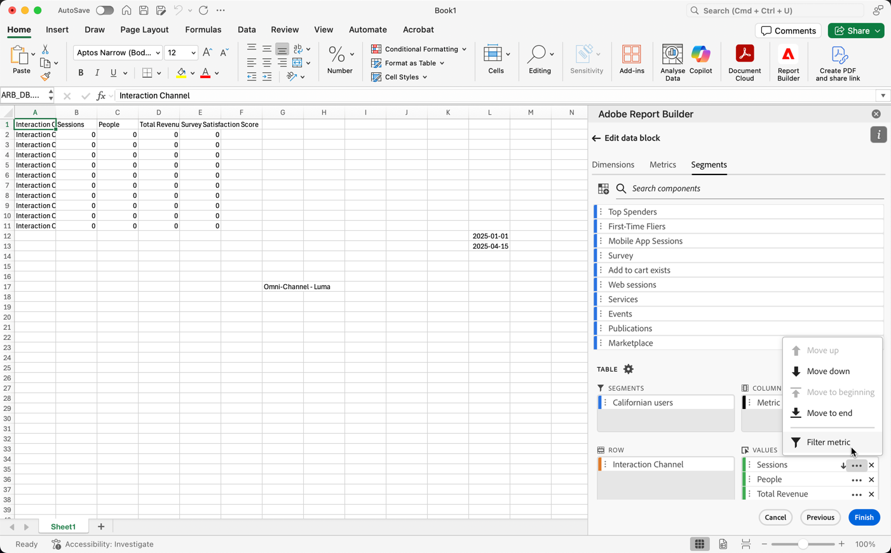

# 세그먼트를 사용한 작업

새 데이터 블록을 만들거나 **[!UICONTROL 명령]** 패널에서 **[!UICONTROL 데이터 블록 편집]**&#x200B;을 선택하면 세그먼트를 적용할 수 있습니다.

## 데이터 블록에 세그먼트 적용

세그먼트를 전체 데이터 블록에 적용하려면 세그먼트를 더블 선택하거나 구성 요소 목록에서 테이블의 세그먼트 섹션으로 세그먼트를 드래그 앤 드롭합니다.

## 개별 지표에 필터 적용

세그먼트를 사용하여 필터를 개별 지표에 적용하려면 다음을 수행합니다.

* **[!UICONTROL 세그먼트]**&#x200B;에서 테이블의 지표로 하나 이상의 세그먼트를 끌어다 놓습니다.

* 또는

   1.  창에서 특정 지표에 대해 **[!UICONTROL MoreSmall]**&#x200B;을 선택한 다음 **[!UICONTROL 지표 필터링]**&#x200B;을 선택합니다.

      지표를 표시하는 {zoomable="yes"}

   1. **[!UICONTROL 세그먼트]** 드롭다운 메뉴에서 하나 이상의 세그먼트를 선택하십시오. 세그먼트가 **[!UICONTROL 적용된 세그먼트]** 목록에 추가됩니다.

      
   1.  목록에서 세그먼트를 제거하려면 **[!UICONTROL CrossSize75]**&#x200B;을(를) 선택하십시오. 또는 **[!UICONTROL 모두 지우기]**&#x200B;를 선택하여 **[!UICONTROL 적용된 세그먼트]** 목록에서 모든 세그먼트를 제거합니다.
   1. **[!UICONTROL 적용]**&#x200B;을 선택합니다.

적용된 필터를 보려면 테이블 창에서 지표 위로 마우스를 이동하거나 선택합니다. 세그먼트가 적용된 지표에는 세그먼트 아이콘이 표시됩니다.

## 세그먼트 빠른 편집

**[!UICONTROL 빠른 편집]** 패널을 사용하여 기존 데이터 블록의 세그먼트를 추가, 제거 또는 바꿀 수 있습니다.

스프레드시트에서 셀 범위를 선택하면 **[!UICONTROL 빠른 편집]** 패널의 **[!UICONTROL 세그먼트]** 링크에 해당 선택 항목의 데이터 블록이 사용하는 세그먼트의 요약 목록이 표시됩니다.

**[!UICONTROL 빠른 편집]** 패널을 사용하여 세그먼트를 편집하려면:

1. 하나 이상의 데이터 블록에서 셀 범위를 선택합니다.

1. **[!UICONTROL 세그먼트]** 링크를 선택하여 **[!UICONTROL 빠른 편집]** **[!UICONTROL 세그먼트]** 패널을 시작합니다.

### 세그먼트 추가 또는 제거

추가/제거 옵션을 사용하여 세그먼트를 추가하거나 제거할 수 있습니다.

1. **[!UICONTROL 빠른 편집]** **[!UICONTROL 세그먼트]** 패널에서 **[!UICONTROL 추가/제거]** 탭을 선택합니다.

   1. **[!UICONTROL 세그먼트]** 드롭다운 메뉴에서 하나 이상의 세그먼트를 선택하십시오. 세그먼트가 **[!UICONTROL 적용된 세그먼트]** 목록에 추가됩니다.
   1.  목록에서 세그먼트를 제거하려면 **[!UICONTROL CrossSize75]**&#x200B;을(를) 선택하십시오.
   1. **[!UICONTROL 적용]**&#x200B;을 선택합니다.

Report Builder에 적용된 세그먼트 변경 사항을 확인하는 메시지가 표시됩니다.

### 세그먼트 바꾸기

기존 세그먼트를 다른 세그먼트로 대체하여 데이터 세그먼트 방식을 변경할 수 있습니다.

1. **[!UICONTROL 빠른 편집]** **[!UICONTROL 세그먼트]** 패널에서 **[!UICONTROL 바꾸기]** 탭을 선택합니다.

1. **검색 목록** 검색 필드를 사용하여 특정 세그먼트를 찾습니다.

1. 바꿀 세그먼트를 하나 이상 선택합니다.

1. 다음으로 바꾸기 드롭다운 메뉴에서 하나 이상의 세그먼트를 검색하여 **[!UICONTROL 다음으로 바꾸기]** 목록에 세그먼트를 추가하십시오.

1. **[!UICONTROL 적용]**&#x200B;을 선택합니다.

Report Builder은 세그먼트 목록을 업데이트하여 대체 항목을 반영합니다.

## 셀에서 데이터 블록 세그먼트 정의

데이터 블록은 셀의 세그먼트를 참조할 수 있습니다. 여러 데이터 블록이 세그먼트에 대해 동일한 셀을 참조할 수 있으므로 한 번에 여러 데이터 블록에 대해 세그먼트를 쉽게 전환할 수 있습니다.

셀에서 세그먼트를 적용하려면

1. [새 데이터 블록을 만들거나](create-a-data-block.md#create-a-data-block) 기존 데이터 블록을 편집합니다.
1. 세그먼트를 정의하려면 **[!UICONTROL 세그먼트]** 탭을 선택하십시오.
1. 를 선택합니다.

   {zoomable="yes"}

1. 데이터 블록이 세그먼트를 참조할 셀을 선택합니다.

1. 세그먼트를 셀에 추가하려면 더블 선택합니다. 또는 하나 이상의 세그먼트를 **[!UICONTROL 포함된 세그먼트]** 섹션으로 끌어다 놓습니다.

1. 참조 셀을 만들려면 **[!UICONTROL 적용]**&#x200B;을 선택하십시오.

1. **세그먼트** 탭에서 새로 만든 참조 셀 세그먼트를 데이터 블록에 추가합니다.

   {zoomable="yes"}

1. **[!UICONTROL 마침]**&#x200B;을 선택합니다.

참조 셀을 다른 데이터 블록에 세그먼트로 적용하려면 **[!UICONTROL 테이블]** 탭의 **[!UICONTROL 세그먼트]** 목록에 있는 세그먼트 중 하나로 셀 참조를 사용합니다.

### 참조 셀을 사용하여 데이터 블록 세그먼트 변경

1. 스프레드시트에서 참조 셀을 선택합니다.

1. **[!UICONTROL 빠른 편집]** 메뉴의 **[!UICONTROL 셀의 세그먼트]**&#x200B;에서 링크를 선택하십시오.

   {zoomable="yes"}

1. 드롭다운 메뉴에서 세그먼트를 선택합니다.

1. **[!UICONTROL 적용]**&#x200B;을 선택합니다.
