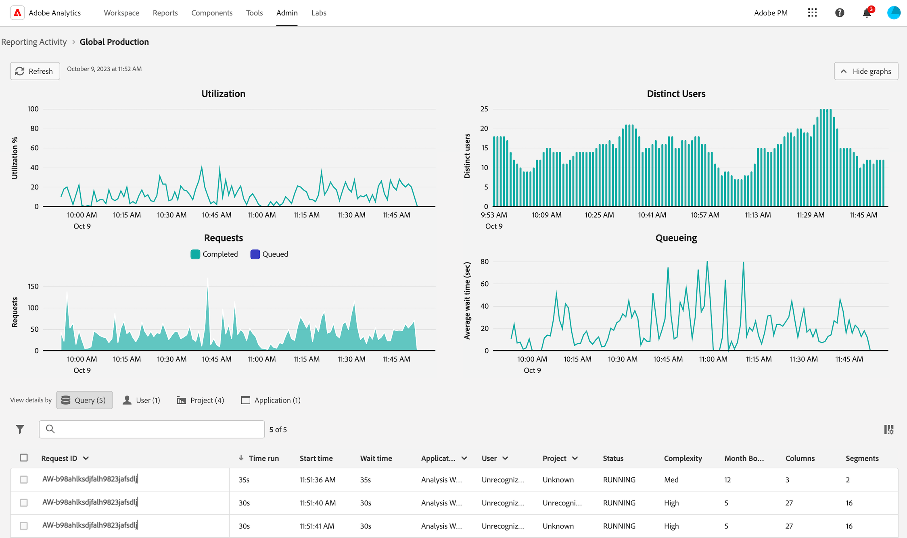

# 보고 활동 관리자에서 보고 활동 보기

{{release-limited-testing}}

다음 [!UICONTROL 활동 관리자 보고] 최대 보고 시간 동안 보고 용량 문제를 신속하게 진단하고 해결할 수 있습니다.

주요 이점 및 권한 요구 사항을 포함하여 보고 활동 관리자에 대한 자세한 내용은 다음을 참조하십시오. [보고 활동 관리자 개요](/help/reporting-activity-manager/reporting-activity-overview.md).

## 모든 연결에 대한 보고 활동 보기 {#view-all-report-suites}

1. Customer Journey Analytics에서 **[!UICONTROL 도구]** > **[!UICONTROL 활동 관리자 보고]**.

   활성화된 기본 연결 목록이 표시됩니다.

   

1. (선택 사항) 연결 목록을 검색하거나 필터링할 수 있습니다.

   * 검색 필드를 사용하여 특정 연결을 검색합니다. 입력할 때 연결 이름 또는 ID와 연결 업데이트 목록을 입력하십시오.

   * 다음 항목 선택 [!UICONTROL **필터**] 아이콘  필터 옵션 목록을 확장합니다. 다음을 기준으로 필터링할 수 있습니다. [!UICONTROL **즐겨찾기**] 또는 [!UICONTROL **상태**].

     연결을 즐겨찾기로 표시하려면 연결 이름 왼쪽에 있는 별 아이콘을 선택합니다.

     <!-- (does this option still exist?) 1. (Optional) Select **[!UICONTROL Refresh]** at the top-right to refresh the data. -->

1. 각 연결에 대한 사용률 정보를 봅니다. 열 머리글을 선택하여 해당 열을 기준으로 테이블을 정렬할 수 있습니다.

   다음 열을 사용할 수 있습니다.

   | UI 요소 | 설명 |
   | --- | --- |
   | **[!UICONTROL 연결]** | 모니터링 중인 보고 활동의 연결입니다. |
   | **[!UICONTROL 데이터 보기]** | 연결을 사용하는 모든 데이터 보기를 표시합니다. 데이터 보기 구성은 보고 요청에 복잡성을 가중시킬 수 있습니다. |
   | **[!UICONTROL 용량 활용성]** | 실시간으로 사용 중인 연결의 보고 용량 백분율입니다. 
**참고** 사용 용량이 100%라고 해서 보고 요청 취소를 바로 시작해야 하는 것은 아닙니다. 평균 대기 시간이 적절하다면 100% 사용 용량은 적절할 수 있습니다. 반면에 100% 사용 용량은 큐에 있는 요청 수가 증가하는 경우에도 문제를 시사할 수 있습니다.
 |
   | **[!UICONTROL 대기 중인 요청]** | 처리 대기 중인 요청 수입니다. <!-- ??? --> |
   | **[!UICONTROL 대기열 대기 시간]** | 요청 처리를 시작하기 전 평균 대기 시간입니다. <!-- ???? --> |
   | **[!UICONTROL 상태]** | 가능한 상태는 다음과 같습니다. <ul><li>[!UICONTROL **활성**] (파란색): 연결에서 보고서가 실행되었으며 활동이 모니터링되고 있습니다.</li><li>[!UICONTROL **비활성**] (회색): 연결에서 보고서가 실행된 적이 없습니다. 이 상태는 연결을 처음 만들 때만 표시됩니다.</li></ul> |

   {style="table-layout:auto"}

## 단일 연결에 대한 보고 활동 보기

1. Customer Journey Analytics에서 [!UICONTROL **도구**] > [!UICONTROL **활동 관리자 보고**].

1. 세부 정보를 보려는 연결의 연결된 제목을 선택합니다.

   선택한 연결에 대한 보고 활동 데이터가 표시됩니다.

1. (선택 사항) 연결이 보고 활동 관리자에 처음 로드될 때 표시되는 데이터는 현재 활용성 지표를 나타냅니다. 초기 로드 후 업데이트된 지표를 보려면 [!UICONTROL **새로 고침**] 단추를 클릭하여 페이지를 수동으로 새로 고칩니다.

   <!-- Need to update this screenshot:  -->

1. 사용 가능한 그래프 및 표를 사용하여 연결의 보고 활동을 이해합니다.

   * [그래프 보기](#view-graphs)

   * [테이블 보기](#view-table)

### 그래프 보기

다음 그래프는 연결에서 발생하는 활동을 더 잘 이해하는 데 도움이 됩니다.

그래프가 표시되지 않으면 [!UICONTROL **그래프 표시**] 단추를 클릭합니다.

#### 활용률 그래프 {#utilization}

사용률 그래프는 지난 2시간 동안 선택한 연결에 대한 보고 사용률을 보여 줍니다.

차트 위로 마우스를 가져가면 해당 분 동안 사용 용량 비율이 가장 높았던 시점을 확인할 수 있습니다.

* **X축**: 지난 2시간 동안의 보고 사용 용량입니다.
* **Y축**: 분 단위 보고 사용 용량 백분율.

  

#### 고유 사용자 그래프

고유 사용자 그래프는 지난 2시간 동안 선택한 연결에 대한 보고 활동을 보여줍니다.

차트 위로 마우스를 가져가면 해당 분 동안 최대 사용자 수가 가장 많았던 시점을 볼 수 있습니다.

* **X축**: 지난 2시간 동안의 보고 활동입니다.
* **Y축**: 보고 요청을 한 사용자의 분당 수입니다.

  

#### 요청 그래프

요청 그래프는 지난 2시간 동안 선택한 연결에 대해 처리 및 대기 중인 요청 수를 보여 줍니다.

차트 위로 마우스를 가져가면 해당 분 동안 최대 요청 수가 가장 많았던 시점을 볼 수 있습니다.

* **X축**: 지난 2시간 동안 처리 및 큐에 있는 요청 수입니다.
* **Y축**: 처리된 요청(녹색) 및 큐에 있는 요청(자주색)의 분별 수입니다.

  

#### 큐 그래프

큐 그래프는 지난 2시간 동안 선택한 연결에 대한 요청 보고에 대한 평균 큐 대기 시간(초)을 보여 줍니다.

차트 위로 마우스를 가져가면 해당 분에 대한 최대 평균 대기 시간이 가장 긴 시점을 볼 수 있습니다.

* **X축**: 지난 2시간 동안의 보고 요청에 대한 평균 큐 대기 시간입니다.
* **Y축**: 평균 대기 시간(초)입니다.

  

### 테이블 보기 {#view-table}

표를 볼 때는 다음 사항을 고려하십시오.

* 데이터 테이블 상단에서 다음 탭 중 하나를 선택하여 데이터를 보도록 선택할 수 있습니다. [!UICONTROL **요청**], [!UICONTROL **사용자**], [!UICONTROL **프로젝트**], 또는 [!UICONTROL **애플리케이션**].

* 연결 목록을 검색하거나 필터링할 수 있습니다.

   * 검색 필드를 사용하여 특정 연결을 검색합니다. 입력할 때 연결 이름 또는 ID와 연결 업데이트 목록을 입력하십시오.

   * 다음 항목 선택 [!UICONTROL **필터**] 아이콘  필터 옵션 목록을 확장합니다. 다음을 기준으로 필터링할 수 있습니다. [!UICONTROL **상태**], [!UICONTROL **복잡성**], [!UICONTROL **애플리케이션**], [!UICONTROL **사용자**], 또는 [!UICONTROL **프로젝트**].

   * 다음을 선택할 수 있습니다. [!UICONTROL **그래프 숨기기**] 테이블만 표시합니다.

#### 요청별 데이터 보기

다음을 선택하면 [!UICONTROL **요청**] 탭에서 테이블에서 사용할 수 있는 열은 다음과 같습니다.

| 열 | 설명 |
| --- | --- |
| [!UICONTROL **요청 ID**] | 문제 해결 용도로 사용할 수 있는 고유 ID입니다. ID를 복사하려면 요청을 선택한 다음 옵션을 선택합니다. [!UICONTROL **요청 ID 복사**]. |
| [!UICONTROL **타임런**] | 요청이 실행된 시간입니다. |
| [!UICONTROL **시작 시간**] | 요청의 처리가 시작된 시기(관리자의 현지 시간 기준). |
| [!UICONTROL **대기 시간**] | 요청이 처리되기 전에 대기한 시간입니다. 이 값은 일반적으로 용량이 충분할 때 &quot;0&quot;입니다. |
| [!UICONTROL **애플리케이션**] | [!UICONTROL 보고 활동 관리자]에서 지원하는 애플리케이션은 다음과 같습니다. <ul><li>Analysis Workspace UI</li><li>Workspace 예약된 프로젝트</li><li>Report Builder</li><li>빌더 UI: 세그먼트, 계산된 지표, 주석, 대상자 등</li><li>2.0 API의 API 호출</li><li>지능형 경고<li>전체 테이블 내보내기</li><li>모든 사람과 공유 링크</li><li>안내식 분석</li><li>Analytics 보고 엔진을 쿼리하는 다른 모든 애플리케이션</li></li></ul>
**참고:** 이 열의 값이 [!UICONTROL **알 수 없음**]&#x200B;즉, 사용자에게 요청 메타데이터를 사용할 수 없습니다.
 |
| [!UICONTROL **사용자**] | 요청을 시작한 사용자입니다. 
**참고:** 이 열의 값이 [!UICONTROL **알 수 없음**]&#x200B;즉, 사용자에게 요청 메타데이터를 사용할 수 없습니다.
 |
| [!UICONTROL **프로젝트**] | 저장된 Workspace 프로젝트 이름, API 보고서 ID 등입니다. (메타데이터는 다양한 애플리케이션에 따라 다를 수 있습니다.)
**참고:** 이 열의 값이 [!UICONTROL **알 수 없음**]&#x200B;즉, 프로젝트가 저장되지 않았거나 사용자에게 요청 메타데이터를 사용할 수 없음을 의미합니다.
 |
| [!UICONTROL **상태**] | 상태 표시기: <ul><li>**실행 중**: 현재 요청을 처리 중입니다.</li><li>**보류 중**: 요청이 처리되기를 대기하고 있습니다.</li></ul> |
| [!UICONTROL **복잡성**] | 모든 요청을 처리하는 데 동일한 시간이 필요한 것은 아닙니다. 요청 복잡성은 요청을 처리하는 데 필요한 시간에 대한 일반적인 아이디어를 제공하는 데 도움이 될 수 있습니다. 
가능한 값은 다음과 같습니다.
 <ul><li>[!UICONTROL **낮음**]</li><li>[!UICONTROL **보통**]</li><li>[!UICONTROL **높음**]</li></ul>이 값은 다음 열의 값에 영향을 받습니다.<ul><li>[!UICONTROL **월 경계**]</li><li>[!UICONTROL **열**]</li><li>[!UICONTROL **세그먼트**]</li></ul> |
| [!UICONTROL **월 경계**] | 요청에 포함된 개월 수입니다. 월 경계가 많으면 요청의 복잡성이 증가합니다. |
| [!UICONTROL **열**] | 요청의 지표 및 분류 수입니다. 열이 많으면 요청의 복잡성이 증가합니다. |
| [!UICONTROL **세그먼트**] | 요청에 적용된 세그먼트 수입니다. 세그먼트가 많으면 요청의 복잡성이 증가합니다. |

{style="table-layout:auto"}

#### 사용자별 데이터 보기

다음을 선택하면 [!UICONTROL **사용자**] 탭에서 테이블에서 사용할 수 있는 열은 다음과 같습니다.

| 열 | 설명 |
| --- | --- |
| [!UICONTROL **사용자**] | 요청을 시작한 사용자입니다. 이 열의 값이 [!UICONTROL **인식되지 않음**]&#x200B;즉, 사용자가 관리 권한이 없는 로그인 회사에 있습니다. |
| [!UICONTROL **요청 수**] | 사용자가 시작한 요청 수입니다. |
| [!UICONTROL **프로젝트 수**] | 사용자와 연결된 프로젝트 수입니다. <!-- ??? --> |
| [!UICONTROL **애플리케이션**] | [!UICONTROL 보고 활동 관리자]에서 지원하는 애플리케이션은 다음과 같습니다. <ul><li>Analysis Workspace UI</li><li>Workspace 예약된 프로젝트</li><li>Report Builder</li><li>빌더 UI: 세그먼트, 계산된 지표, 주석, 대상자 등</li><li>2.0 API의 API 호출</li><li>지능형 경고<li>전체 테이블 내보내기</li><li>모든 사람과 공유 링크</li><li>안내식 분석</li><li>Analytics 보고 엔진을 쿼리하는 다른 모든 애플리케이션</li></li></ul> |
| [!UICONTROL **평균 복잡성**] | 사용자가 시작한 요청의 평균 복잡성입니다. 
모든 요청을 처리하는 데 동일한 시간이 필요한 것은 아닙니다. 요청 복잡성은 요청을 처리하는 데 필요한 시간에 대한 일반적인 아이디어를 제공하는 데 도움이 될 수 있습니다.

이 열의 값은 다음 열의 값에 의해 결정되는 점수를 기반으로 합니다.
<ul><li>[!UICONTROL **평균 월 경계**]</li><li>[!UICONTROL **평균 열**]</li><li>[!UICONTROL **평균 세그먼트**]</li></ul> |
| [!UICONTROL **평균 월 경계**] | 요청에 포함된 평균 개월 수입니다. 월 경계가 많으면 요청의 복잡성이 증가합니다. |
| [!UICONTROL **평균 열**] | 포함된 요청의 평균 지표 및 분류 수입니다. 열이 많으면 요청의 복잡성이 증가합니다. |
| [!UICONTROL **평균 세그먼트**] | 포함된 요청에 적용된 평균 세그먼트 수입니다. 세그먼트가 많으면 요청의 복잡성이 증가합니다. |

{style="table-layout:auto"}

#### 프로젝트별 데이터 보기

다음을 선택하면 [!UICONTROL **프로젝트**] 탭에서 테이블에서 사용할 수 있는 열은 다음과 같습니다.

| 열 | 설명 |
| --- | --- |
| [!UICONTROL **프로젝트**] | 요청이 시작된 프로젝트입니다. |
| [!UICONTROL **요청 수**] | 프로젝트와 연계된 요청 수입니다. |
| [!UICONTROL **사용자 수**] | 프로젝트와 연계된 사용자 수입니다. <!-- ??? --> |
| [!UICONTROL **애플리케이션**] | [!UICONTROL 보고 활동 관리자]에서 지원하는 애플리케이션은 다음과 같습니다. <ul><li>Analysis Workspace UI</li><li>Workspace 예약된 프로젝트</li><li>Report Builder</li><li>빌더 UI: 세그먼트, 계산된 지표, 주석, 대상자 등</li><li>2.0 API의 API 호출</li><li>지능형 경고<li>전체 테이블 내보내기</li><li>모든 사람과 공유 링크</li><li>안내식 분석</li><li>Analytics 보고 엔진을 쿼리하는 다른 모든 애플리케이션</li></li></ul> |
| [!UICONTROL **평균 복잡성**] | 프로젝트에 포함된 요청의 평균 복잡성입니다. 
모든 요청을 처리하는 데 동일한 시간이 필요한 것은 아닙니다. 요청 복잡성은 요청을 처리하는 데 필요한 시간에 대한 일반적인 아이디어를 제공하는 데 도움이 될 수 있습니다.

이 열의 값은 다음 열의 값에 의해 결정되는 점수를 기반으로 합니다.
<ul><li>[!UICONTROL **평균 월 경계**]</li><li>[!UICONTROL **평균 열**]</li><li>[!UICONTROL **평균 세그먼트**]</li></ul> |
| [!UICONTROL **평균 월 경계**] | 요청에 포함된 평균 개월 수입니다. 월 경계가 많으면 요청의 복잡성이 증가합니다. |
| [!UICONTROL **평균 열**] | 포함된 요청의 평균 지표 및 분류 수입니다. 열이 많으면 요청의 복잡성이 증가합니다. |
| [!UICONTROL **평균 세그먼트**] | 포함된 요청에 적용된 평균 세그먼트 수입니다. 세그먼트가 많으면 요청의 복잡성이 증가합니다. |

{style="table-layout:auto"}

#### 애플리케이션별 데이터 보기

다음을 선택하면 [!UICONTROL **애플리케이션**] 탭에서 테이블에서 사용할 수 있는 열은 다음과 같습니다.

| 열 | 설명 |
| --- | --- |
| [!UICONTROL **애플리케이션**] | 요청이 시작된 애플리케이션. |
| [!UICONTROL **요청 수**] | 응용 프로그램과 연결된 요청 수입니다. |
| [!UICONTROL **사용자 수**] | 응용 프로그램과 연결된 사용자 수입니다. <!--???--> |
| [!UICONTROL **프로젝트 수**] | 응용 프로그램과 연결된 프로젝트 수입니다. <!--???--> |
| [!UICONTROL **평균 복잡성**] | 애플리케이션과 연결된 요청의 평균 복잡성입니다. 
모든 요청을 처리하는 데 동일한 시간이 필요한 것은 아닙니다. 요청 복잡성은 요청을 처리하는 데 필요한 시간에 대한 일반적인 아이디어를 제공하는 데 도움이 될 수 있습니다.

이 열의 값은 다음 열의 값에 의해 결정되는 점수를 기반으로 합니다.
이 열의 값은 다음 열의 값에 의해 결정되는 점수를 기반으로 합니다.<ul><li>[!UICONTROL **평균 월 경계**]</li><li>[!UICONTROL **평균 열**]</li><li>[!UICONTROL **평균 세그먼트**]</li></ul> |
| [!UICONTROL **평균 월 경계**] | 요청에 포함된 평균 개월 수입니다. 월 경계가 많으면 요청의 복잡성이 증가합니다. |
| [!UICONTROL **평균 열**] | 포함된 요청의 평균 지표 및 분류 수입니다. 열이 많으면 요청의 복잡성이 증가합니다. |
| [!UICONTROL **평균 세그먼트**] | 포함된 요청에 적용된 평균 세그먼트 수입니다. 세그먼트가 많으면 요청의 복잡성이 증가합니다. |

{style="table-layout:auto"}

<!-- 

## Frequently asked questions {#faq}

| Question | Answer |
| --- | --- |
| | |

{style="table-layout:auto"}

-->
