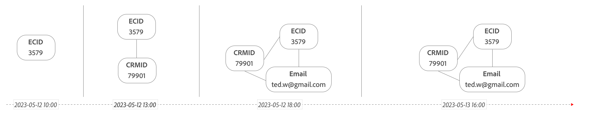

# 결합

>[!NOTE]
>
>이 섹션에 설명된 기능을 사용하려면 **Select** 패키지 이상(필드 기반 결합용) 또는 **Prime** 패키지 이상(그래프 기반 결합용)이 있어야 합니다. 보유 중인 Customer Journey Analytics 패키지가 무엇인지 확실하지 않은 경우에는 귀사의 관리자에게 문의하십시오.

ID 결합 (또는 간단히 결합)은 크로스 채널 분석에 대한 이벤트 데이터 세트의 적합성을 높이는 강력한 기능입니다. 크로스 채널 분석은 Customer Journey Analytics이 처리할 수 있는 주요 사용 사례이며, 이를 통해 공통 식별자(개인 ID)를 기반으로 다양한 채널의 여러 데이터 세트에서 보고서를 원활하게 결합하고 실행할 수 있습니다.

유사한 개인 ID를 사용하여 데이터 세트를 결합하면 속성이 디바이스 및 채널 간에 전달됩니다. 예를 들어 사용자가 먼저 데스크탑 컴퓨터의 광고를 통해 사이트를 방문합니다. 해당 사용자가 주문 시 문제가 발생하면 고객 서비스 팀에 문의하여 문제를 해결할 수 있습니다. 크로스 채널 분석을 사용하면 콜 센터 이벤트를 원래 클릭한 광고에 연결할 수 있습니다.

안타깝게도, Customer Journey Analytics에서 연결에 포함된 모든 이벤트 기반 데이터 세트에 이 속성을 즉시 지원할 수 있는 데이터가 충분히 채워지지는 않습니다. 특히 웹 기반 또는 모바일 기반 경험 데이터 세트에는 모든 이벤트에서 사용할 수 있는 실제 개인 ID 정보가 없는 경우가 많습니다.

결합을 사용하면 한 데이터 세트의 행 내에서 ID를 재입력할 수 있으므로 각 이벤트에서 개인 ID(결합된 ID)를 사용할 수 있는지 확인할 수 있습니다. 결합은 인증된 세션과 인증되지 않은 세션의 사용자 데이터를 확인하여 결합된 ID로 사용할 수 있는 일반적인 임시 ID(개인 ID) 값을 결정합니다. 이러한 재입력을 통해 디바이스나 쿠키 수준이 아닌 개인 수준에서 분석을 위해 서로 다른 레코드를 단일 결합 ID로 확인할 수 있습니다.

Customer Journey Analytics은 필드 기반 결합과 그래프 기반 결합의 두 가지 결합 유형을 지원합니다.

## 사전 요구 사항

>[!IMPORTANT]
>
>모든 전제 조건을 충족하지 못하면 크로스 채널 분석을 제대로 수행할 수 없습니다.

결합을 사용하기 전에 조직에서 다음 사항을 준비했는지 확인하십시오.

- 결합에는 인증된 사용자 데이터와 인증되지 않은 사용자 데이터의 병합이 포함됩니다. 이벤트 데이터 세트에 대한 결합을 활성화하기 전에 필요한 최종 사용자 권한을 얻는 등 관련 법률 및 규정을 준수하는지 확인하십시오. 자세한 내용은 [UI에서 ID 필드 정의](https://experienceleague.adobe.com/ko/docs/experience-platform/xdm/ui/fields/identity)를 참조하십시오.

- 원하는 데이터를 Adobe Experience Platform에 가져옵니다.

   - Adobe Analytics 데이터에 대해서는 [Customer Journey Analytics에서 Adobe Analytics 보고서 세트 데이터 활용](/help/getting-started/aa-vs-cja/aa-data-in-cja.md)을 참조하십시오.
   - 다른 유형의 데이터는 Adobe Experience Platform 문서에서 [스키마 만들기](https://experienceleague.adobe.com/en/docs/experience-platform/xdm/tutorials/create-schema-ui) 및 [데이터 수집](https://experienceleague.adobe.com/en/docs/experience-platform/ingestion/home)을 참조하십시오.

Customer Journey Analytics 연결을 정의하는 과정에서 결합된 데이터 세트 중 하나 이상을 콜 센터 데이터와 같은 다른 데이터 세트와 결합하는 경우 크로스 채널 분석의 이점을 누릴 수 있습니다. 이 연결 구성은 이러한 다른 데이터 세트에는 결합된 ID와 유사한 개인 ID가 모든 행에 이미 포함되어 있다고 가정합니다.

## 제한 사항

>[!IMPORTANT]
>
>- `identityMap`을(를) 영구 ID로 사용할 수 없습니다. 데이터 집합에 특정 식별자(예: `ECID`)를 영구 ID로 정의해야 합니다.
>
>- 소스 이벤트 데이터 세트 스키마에 대한 변경 사항을 결합된 새 데이터 세트 스키마에도 적용합니다. 그렇지 않으면 결합된 데이터 세트가 손상됩니다.
>
>- 소스 데이터 세트를 제거하면 연결된 데이터 세트가 처리를 중지하고 시스템에서 제거됩니다.
>
>- 데이터 사용 레이블은 결합된 데이터 세트 스키마에 자동으로 전파되지 않습니다. 소스 데이터 세트 스키마에 데이터 사용 레이블이 적용된 경우 이러한 데이터 사용 레이블을 결합된 데이터 세트 스키마에 수동으로 적용해야 합니다. 자세한 내용은 [Experience Platform에서 데이터 사용 레이블 관리](https://experienceleague.adobe.com/en/docs/experience-platform/data-governance/labels/overview)를 참조하십시오.

결합은 획기적이고 강력한 기능이지만 사용 방법에 대한 제한이 있습니다.

- 이벤트 데이터 세트만 지원됩니다. 조회 데이터 세트와 같은 다른 데이터 세트는 지원되지 않습니다.
- 결합은 어떤 방식으로도 결합에 사용된 필드를 변형하지 않습니다. 결합은 데이터 레이크 내의 결합되지 않은 데이터 세트에 존재하는 것처럼 지정된 필드의 값을 사용합니다.
- 결합 프로세스는 대소문자를 구분합니다. 예를 들어 때때로 &quot;Bob&quot;이라는 단어가 필드에 나타나고, 때로는 &quot;BOB&quot;이라는 단어가 나타나는 경우 이러한 ID는 두 명의 개별적인 사람으로 처리됩니다.

결합을 다음과 혼동하지 않도록 하십시오.

- 두 개 이상의 데이터 세트 병합. 결합은 하나의 데이터 세트에만 적용됩니다. 데이터 세트 병합은 Customer Journey Analytics 연결을 설정하고 연결에서 선택한 데이터 세트에서 동일한 개인 ID를 선택한 결과로서 발생합니다.

- 두 데이터 세트의 결합. Customer Journey Analytics에서 조인은 종종 Analysis Workspace에서 조회 또는 분류에 사용됩니다. 결합은 결합 기능을 사용하지만 프로세스 자체에는 조인보다 더 많은 것이 포함됩니다.

## 필드 기반 결합

해당 데이터 세트에 대한 영구 ID(쿠키)와 임시 ID(개인 ID)뿐만 아니라 이벤트 데이터 세트를 지정합니다. 필드 기반 결합은 결합된 새 데이터 세트에 새 결합된 ID 열을 만들고 특정 영구 ID에 대한 임시 ID가 있는 행을 기반으로 이 결합된 ID 열을 업데이트합니다.  Customer Journey Analytics을 독립 실행형 솔루션으로 사용할 때 필드 기반 결합을 사용할 수 있습니다(Experience Platform ID 서비스 및 관련 ID 그래프에 대한 액세스 권한이 없음). 또는 사용 가능한 ID 그래프를 사용하지 않으려는 경우입니다.

### 필드 기반 결합 작동 방식

결합은 주어진 데이터 세트의 데이터에 대해 최소 2개의 전달을 만듭니다.

- **라이브 결합**: 히트가 들어올 때 각 히트(이벤트)를 결합하려고 합니다. 데이터 세트에 &quot;신규&quot;(인증되지 않음)인 디바이스의 히트는 일반적으로 이 수준에서 결합되지 않습니다. 이미 인식된 디바이스의 히트는 즉시 결합됩니다.

- **재생 결합**: 학습한 고유 식별자(임시 ID)를 기반으로 데이터를 &quot;재생&quot;합니다. 이 단계에서 이전에 알 수 없었던 장치(영구 ID)의 히트가 임시 ID에 결합됩니다. Adobe은 다음과 같은 재생 간격을 제공합니다.
   - **매일**: 데이터는 매일 24시간 전환 확인 기간으로 재생됩니다. 이 옵션은 재생이 훨씬 빈번한 이점이 있지만 인증되지 않은 방문자는 사이트를 방문하는 당일 인증해야 합니다.
   - **주별**: 전환 확인 기간을 사용하여 일주일에 한 번 데이터를 재생합니다([옵션](#options) 참조). 이 옵션은 인증되지 않은 세션을 인증하는 데 보다 관대한 시간을 주는 이점이 있습니다. 그러나 1주일 미만의 연결되지 않은 데이터는 다음 주간 재생까지 재처리되지 않습니다.
   - **격주**: 전환 확인 기간을 사용하여 2주마다 한 번씩 데이터가 재생됩니다([옵션](#options) 참조). 이 옵션은 인증되지 않은 세션을 인증하는 데 보다 관대한 시간을 주는 이점이 있습니다. 그러나 2주 미만의 연결되지 않은 데이터는 다음 격주 재생 전까지 재처리되지 않습니다.
   - **월별**: 전환 확인 기간을 사용하여 한 달에 한 번 데이터가 재생됩니다([옵션](#options) 참조). 이 옵션은 인증되지 않은 세션을 인증하는 데 보다 관대한 시간을 주는 이점이 있습니다. 단, 1개월 미만의 연결되지 않은 데이터는 다음 달 재생 전까지 재처리되지 않습니다.

- **개인 정보 보호**: 개인 정보 보호 관련 요청이 수신되면 요청된 ID를 제거하는 것 외에도 인증되지 않은 이벤트에서 해당 ID의 모든 결합을 실행 취소해야 합니다.

조회 창을 벗어난 데이터는 재생되지 않습니다. 방문자는 인증되지 않은 방문과 인증된 방문을 함께 식별하기 위해 주어진 전환 확인 기간 내에서 인증해야 합니다. 디바이스가 인식되면 해당 시점부터 라이브로 결합됩니다.

#### 1단계: 라이브 결합

라이브 결합은 수집 시 각 이벤트를 알려진 디바이스와 채널에 결합하려고 합니다.

+++ 세부 사항

Bob이 다른 이벤트를 이벤트 데이터 세트의 일부로 기록하는 다음 예를 생각해봅시다.

*수집된 날짜에 표시된 데이터:*

| 이벤트 | 타임스탬프 | 영구 ID (쿠키 ID) | 임시 ID (로그인 ID) | 결합된 ID(라이브 결합 후) |
|---|---|---|---|---|
| 1 | 2023-05-12 12:01 | `246`  | - | **`246`** |
| 2 | 2023-05-12 12:02 | `246` | `Bob`  | `Bob` |
| 3 | 2023-05-12 12:03 | `246` | `Bob`  | `Bob`  |
| 4 | 2023-05-12 12:04 | `246` | - | **`Bob`** |
| 5 | 2023-05-12 12:05 | `246` | `Bob`  | `Bob`  |
| 6 | 2023-05-12 12:06 | `246` | - | **`Bob`** |
| 7 | 2023-05-12 12:07 | `246` | `Bob`  | `Bob` |
| 8 | 2023-05-12 12:03 | `3579`  | - | **`3579`** |
| 9 | 2023-05-12 12:09 | `3579`  | - | **`3579`** |
| 10 | 2023-05-12 12:02 | `81911`  | - | **`81911`** |
| 11 | 2023-05-12 12:05 | `81911` | `Bob`  | `Bob`  |
| 12 | 2023-05-12 12:12 | `81911` | - | **`Bob`** |
| | | **장치 3개** | | **4명**: `246`, `Bob`, `3579`, `81911` |

새 디바이스에서 인증되지 않은 이벤트와 인증된 이벤트는 모두 별도의 사람(일시적으로)으로 계산됩니다. 인식된 디바이스의 인증되지 않은 이벤트는 라이브 결합됩니다.

속성은 식별 사용자 지정 변수가 디바이스에 연결되어 있을 때 작동합니다. 위의 예에서 이벤트 1, 8, 9 및 10을 제외한 모든 이벤트는 라이브로 결합됩니다(모두 `Bob` 식별자를 사용). 라이브 결합은 이벤트 4, 6 및 12에 대해 결합된 ID를 &quot;확인&quot;합니다.

지연된 데이터(타임스탬프가 24시간 이상 된 데이터)는 가장 높은 품질을 위해 현재 데이터 결합의 우선 순위를 지정하면서 &#39;최상&#39;으로 처리됩니다.

+++

#### 2단계: 재생 결합

정기적으로(선택한 전환 확인 기간에 따라 주 1회 또는 매일 한 번) 재생 결합은 현재 인식되는 디바이스를 기반으로 내역 데이터를 다시 계산합니다. 디바이스가 인증되지 않은 상태에서 처음에 데이터를 보낸 다음 로그인하는 경우 재생 결합은 인증되지 않은 이벤트를 올바른 사용자에게 연결합니다.

+++ 세부 사항

다음 테이블은 위와 동일한 데이터를 나타내지만 데이터 재생에 따라 다른 숫자를 표시합니다.

*재생 후 동일한 데이터:*

| 이벤트 | 타임스탬프 | 영구 ID (쿠키 ID) | 임시 ID (로그인 ID) | 결합된 ID(라이브 결합 후) | 결합된 ID(재생 후) |
|---|---|---|---|---|---|
| 1 | 2023-05-12 12:01 | `246` | - | `246` | **`Bob`** |
| 2 | 2023-05-12 12:02 | `246` | `Bob`  | `Bob` | `Bob`  |
| 3 | 2023-05-12 12:03 | `246` | `Bob`  | `Bob`  | `Bob` |
| 4 | 2023-05-12 12:04 | `246` | - | **`Bob`** | `Bob` |
| 5 | 2023-05-12 12:05 | `246` | `Bob`  | `Bob`  | `Bob` |
| 6 | 2023-05-12 12:06 | `246` | - | **`Bob`** | `Bob` |
| 7 | 2023-05-12 12:07 | `246` | `Bob`  | `Bob` | `Bob` |
| 8 | 2023-05-12 12:03 | `3579`  | - | **`3579`** | **`3579`** |
| 9 | 2023-05-12 12:09 | `3579`  | - | **`3579`** | **`3579`** |
| 10 | 2023-05-12 12:02 | `81911` | - | `81911` | **`Bob`** |
| 11 | 2023-05-12 12:05 | `81911` | `Bob`  | `Bob`  | `Bob`  |
| 12 | 2023-05-12 12:12 | `81911` | - | **`Bob`** | `Bob` |
| | | **장치 3개** | | **4명**: `246`, `Bob`, `3579`, `81911` | **2명**: `Bob`, `3579` |

{style="table-layout:auto"}

속성은 식별 사용자 지정 변수가 디바이스에 연결되어 있을 때 작동합니다. 위의 예에서, 이벤트 1과 10은 재생의 결과로서 결합되며, 이벤트 8과 9만 결합되지 않는다. 사람 지표(누적)를 2로 줄입니다.

+++

#### 3단계: 개인 정보 보호 요청

개인 정보 보호 요청을 받으면 결합된 ID가 개인 정보 보호 요청의 사용자 주제에 대한 모든 레코드에서 삭제됩니다.

+++ 세부 사항

다음 테이블은 위와 동일한 데이터를 나타내지만, Bob에 대한 개인 정보 보호 요청이 처리 후 데이터에 미치는 영향을 보여 줍니다. Bob이 인증된 행은 Bob을 다른 행의 임시 ID로 제거하면서(2, 3, 5, 7 및 11) 제거됩니다.

*Bob에 대한 개인 정보 보호 요청 후의 동일한 데이터:*

| 이벤트 | 타임스탬프 | 영구 ID (쿠키 ID) | 임시 ID (로그인 ID) | 결합된 ID(라이브 결합 후) | 결합된 ID(재생 후) | 임시 ID (로그인 ID) | 결합된 ID(개인 정보 보호 요청 후) |
|---|---|---|---|---|---|---|---|
| 1 | 2023-05-12 12:01 | `246` | - | `246` | **`Bob`** | - | `246` |
| 2 | 2023-05-12 12:02 | `246` | Bob  | `Bob` | `Bob`  |  | `246` |
| 3 | 2023-05-12 12:03 | `246` | Bob  | `Bob`  | `Bob` |  | `246` |
| 4 | 2023-05-12 12:04 | `246` | - | **`Bob`** | `Bob` | - | `246` |
| 5 | 2023-05-12 12:05 | `246` | Bob  | `Bob`  | `Bob` |  | `246` |
| 6 | 2023-05-12 12:06 | `246` | - | **`Bob`** | `Bob` | - | `246` |
| 7 | 2023-05-12 12:07 | `246` | `Bob`  | `Bob` | `Bob` |  | `246` |
| 8 | 2023-05-12 12:03 | `3579`  | - | **`3579`** | **`3579`** | - | `3579` |
| 9 | 2023-05-12 12:09 | `3579`  | - | **`3579`** | **`3579`** | - | `3579` |
| 10 | 2023-05-12 12:02 | `81911` | - | `81911` | **`Bob`** | - | `81911` |
| 11 | 2023-05-12 12:05 | `81911` | `Bob`  | `Bob`  | `Bob`  |  | `81911` |
| 12 | 2023-05-12 12:12 | `81911` | - | **`Bob`** | `Bob` | - | `81911` |
| | | **장치 3개** | | **4명**: 246, `Bob`, `3579`, `81911` | **2명**: Bob, `3579` |  | **3명**: `246`, `3579`, `81911` |

+++

### 사전 요구 사항

다음 사전 요구 사항은 필드 기반 결합에 특별히 적용됩니다.

- 결합을 적용할 Adobe Experience Platform의 이벤트 데이터 세트에는 방문자를 식별하는 데 도움이 되는 두 개의 열이 있어야 합니다.

   - 모든 행에서 사용할 수 있는 식별자인 **영구 ID**. 예를 들어 Adobe Analytics AppMeasurement 라이브러리에서 생성된 방문자 ID 또는 Adobe Experience Platform ID 서비스에서 생성된 ECID입니다.
   - 일부 행에서만 사용할 수 있는 식별자인 **임시 ID**. 예를 들어 방문자가 인증을 받은 후 해시된 사용자 이름 또는 이메일 주소입니다. 원하는 거의 모든 식별자를 사용할 수 있습니다. 결합에서는 이 필드를 실제 개인 ID 정보로 간주합니다. 최상의 결합 결과를 위해 임시 ID는 각 영구 ID에 대해 데이터 세트의 이벤트 내에서 적어도 한 번 전송되어야 합니다. 이 데이터 세트를 Customer Journey Analytics 연결 내에 포함하려는 경우 다른 데이터 세트에도 유사한 공통 식별자가 있는 것이 좋습니다.

- 두 열(영구 ID 및 임시 ID)은 연결하려는 데이터 세트의 스키마에 ID 네임스페이스가 있는 ID 필드로 정의해야 합니다. Real-time Customer Data Platform에서 ID 결합을 사용할 때 [`identityMap` 필드 그룹](https://experienceleague.adobe.com/en/docs/experience-platform/xdm/schema/composition#identity)을(를) 사용하면 ID 네임스페이스가 있는 ID 필드를 추가해야 합니다. Customer Journey Analytics 결합은 `identityMap` 필드 그룹을 지원하지 않으므로 ID 필드를 식별해야 합니다. 스키마에 ID 필드를 추가할 때 `identityMap` 필드 그룹도 사용하면 추가 ID 필드를 기본 ID로 설정하지 마십시오. 추가 ID 필드를 기본 ID로 설정하면 Real-time Customer Data Platform에 사용되는 `identityMap` 필드 그룹이 방해됩니다.

### 제한 사항

다음 제한 사항은 특히 필드 기반 결합에 적용됩니다.

- 현재 재입력 기능은 한 단계로 제한됩니다(영구 ID를 임시 ID로). 여러 단계의 키 재입력(예: 영구 ID를 임시 ID로, 그 다음 다른 임시 ID로 변경)은 지원되지 않습니다.
- 디바이스를 여러 사용자가 공유하고 사용자 간 총 전환 수가 50,000개를 초과하는 경우 Customer Journey Analytics은 해당 디바이스에 대한 데이터 결합을 중지합니다.
- 조직에서 사용한 사용자 정의 ID 맵은 지원되지 않습니다.
- 결합은 대소문자를 구분합니다. Analytics 소스 커넥터를 통해 생성된 데이터 세트의 경우 Adobe은 임시 ID 필드에 적용되는 VISTA 규칙 또는 처리 규칙을 검토할 것을 권장합니다. 이 검토를 통해 이러한 규칙 중 동일한 ID의 새로운 형식을 도입하는 규칙이 없는지 확인합니다. 예를 들어 VISTA 또는 처리 규칙이 이벤트의 일부에서만 임시 ID 필드에 소문자를 도입하지 않는지 확인해 보아야 합니다.
- 결합은 필드를 결합하거나 연결하지 않습니다.
- 임시 ID 필드는 단일 유형의 ID(단일 네임스페이스의 ID)를 포함해야 합니다. 예를 들어 임시 ID 필드는 로그인 ID와 이메일 ID의 조합을 포함해서는 안 됩니다.
- 동일한 영구 ID에 대해 동일한 타임스탬프를 가진 여러 이벤트가 발생하지만 임시 ID 필드의 값이 다른 경우, 결합은 알파벳 순서를 기반으로 ID를 선택합니다. 따라서 영구 ID A에 동일한 타임스탬프를 가진 두 개의 이벤트가 있고 이벤트 중 하나가 &quot;Bob&quot;을 지정하고 다른 하나는 &quot;Ann&quot;을 지정하는 경우 결합은 &quot;Ann&quot;을 선택합니다.
- 임시 ID에 자리 표시자 값이 포함된 시나리오(예: `Undefined`)에 주의하십시오. 자세한 내용은 [FAQ](faq.md)를 참조하십시오.

## 그래프 기반 스티칭

해당 데이터 세트에 대한 영구 ID(쿠키)와 임시 ID(개인 ID)의 네임스페이스와 이벤트 데이터 세트를 지정합니다. 그래프 기반 결합은 결합된 새 데이터 세트에 결합된 ID의 새 열을 만듭니다. 그런 다음 영구 ID를 사용하여 지정된 네임스페이스를 사용하여 Experience Platform ID 서비스에서 ID 그래프를 쿼리하여 결합된 ID를 업데이트합니다.

### 그래프 기반 결합 작동 방식

결합은 주어진 데이터 세트의 데이터에 대해 최소 2개의 전달을 만듭니다.

- **라이브 결합**: ID 그래프를 쿼리하여 선택한 네임스페이스에 대한 임시 ID를 조회하기 위해 영구 ID를 사용하여 각 히트(이벤트)를 들어오는 대로 결합하려고 합니다. 조회에서 임시 ID를 사용할 수 있는 경우 이 임시 ID가 즉시 결합됩니다.

- **재생 결합**: ID 그래프에서 업데이트된 ID를 기반으로 데이터를 &quot;재생&quot;합니다. 이 단계에서 ID 그래프가 네임스페이스에 대한 ID를 해결함으로써 이전에 알 수 없었던 디바이스(영구 ID)의 히트가 결합됩니다. Adobe은 다음과 같은 재생 간격을 제공합니다.
   - **매일**: 데이터는 매일 24시간 전환 확인 기간으로 재생됩니다. 이 옵션은 재생이 훨씬 빈번한 이점이 있지만 인증되지 않은 방문자는 사이트를 방문하는 당일 인증해야 합니다.
   - **주별**: 전환 확인 기간을 사용하여 일주일에 한 번 데이터를 재생합니다([옵션](#options) 참조). 이 옵션은 인증되지 않은 세션을 인증하는 데 보다 관대한 시간을 주는 이점이 있습니다. 그러나 1주일 미만의 연결되지 않은 데이터는 다음 주간 재생까지 재처리되지 않습니다.
   - **격주**: 전환 확인 기간을 사용하여 2주마다 한 번씩 데이터가 재생됩니다([옵션](#options) 참조). 이 옵션은 인증되지 않은 세션을 인증하는 데 보다 관대한 시간을 주는 이점이 있습니다. 그러나 2주 미만의 연결되지 않은 데이터는 다음 격주 재생 전까지 재처리되지 않습니다.
   - **월별**: 전환 확인 기간을 사용하여 한 달에 한 번 데이터가 재생됩니다([옵션](#options) 참조). 이 옵션은 인증되지 않은 세션을 인증하는 데 보다 관대한 시간을 주는 이점이 있습니다. 단, 1개월 미만의 연결되지 않은 데이터는 다음 달 재생 전까지 재처리되지 않습니다.

- **개인 정보**: 개인 정보 관련 요청이 수신되면 소스 데이터 집합에서 요청된 ID를 제거하는 것 외에도 인증되지 않은 이벤트에서 해당 ID의 모든 결합을 실행 취소해야 합니다. 또한 특정 ID에 대한 향후 그래프 기반 결합을 방지하려면 ID 그래프에서 ID를 제거해야 합니다.

조회 창을 벗어난 데이터는 재생되지 않습니다. 방문자는 인증되지 않은 방문과 인증된 방문을 함께 식별하기 위해 주어진 전환 확인 기간 내에서 인증해야 합니다. 디바이스가 인식되면 해당 시점부터 라이브로 결합됩니다.

영구 ID `246` 및 `3579`에 대한 다음 두 개의 ID 그래프, 이러한 ID 그래프가 시간이 지남에 따라 업데이트되는 방법, 이러한 업데이트가 그래프 기반 결합의 단계에 미치는 영향을 고려하십시오.

[ID 그래프 뷰어](https://experienceleague.adobe.com/en/docs/experience-platform/identity/features/identity-graph-viewer)를 사용하여 특정 프로필에 대한 시간에 따른 ID 그래프를 볼 수 있습니다. ID를 연결할 때 사용되는 논리를 더 잘 이해하려면 [ID 서비스 연결 논리](https://experienceleague.adobe.com/en/docs/experience-platform/identity/features/identity-linking-logic)도 참조하세요.

#### 1단계: 라이브 결합

라이브 결합은 수집 시 각 이벤트를 ID 그래프에서 해당 시점의 알려진 정보에 결합하려고 합니다.

+++ 세부 사항

| | 시간 | 영구 ID `ECID` | 네임스페이스 `Email`  | 결합된 ID(라이브 결합 후) |
|--:|---|---|---|---|
| 1 | 2023-05-12 11:00 | `246` | `246`  *정의되지 않음* | `246` |
| 2 | 2023-05-12 14:00 | `246` | `246`  `bob.a@gmail.com` | `bob.a@gmail.com` |
| 3 | 2023-05-12 15:00 | `246` | `246`  `bob.a@gmail.com` | `bob.a@gmail.com` |
| 4 | 2023-05-12 17:00 | `3579` | `3579`  *정의되지 않음* | `3579` |
| 5 | 2023-05-12 19:00 | `3579` | `3579`  `ted.w@gmail.com` | `ted.w@gmail.com` |
| 6 | 2023-05-13 15:00 | `246` | `246`  `bob.a@gmail.com` | `bob.a@gmail.com` |
| 7 | 2023-05-13 16:30 | `246` | `246`  `a.b@yahoo.co.uk` `246`  `bob.ab@gmail.com` | `a.b@yahoo.co.uk` |

{style="table-layout:auto"}

각 이벤트에 대해 결합된 ID가 어떻게 해결되는지 볼 수 있습니다. 시간, 영구 ID 및 지정된 네임스페이스에 대한 ID 그래프의 조회를 기반으로 합니다(동시에).
조회가 둘 이상의 결합된 ID로 확인되는 경우(예: 이벤트 7의 경우) ID 그래프에서 반환되는 사전 편집기 첫 번째 ID가 선택됩니다(이 예제의 경우 `a.b@yahoo.co.uk`).

+++

#### 2단계: 재생 결합

정기적으로(선택한 전환 확인 기간에 따라) 재생 결합은 간격 시 ID 그래프의 최신 버전을 기반으로 내역 데이터를 다시 계산합니다.

+++ 세부 사항

2023-05-13 16:30에 24시간 전환 확인 기간 구성이 적용되는 재생 결합이 발생하면 샘플의 일부 이벤트가 다시 결합됩니다((으)로 표시됨).

| | 시간 | 영구 ID `ECID` | 네임스페이스 `Email`  | 결합된 ID (live stitch 후) | 결합된 ID (재생 24시간 후) |
|---|---|---|---|---|---|
| 2 | 2023-05-12 14:00 | `246` | `246`  `bob.a@gmail.com` | `bob.a@gmail.com` | `bob.a@gmail.com` |
| 3 | 2023-05-12 15:00 | `246` | `246`  `bob.a@gmail.com` | `bob.a@gmail.com` | `bob.a@gmail.com` |
|  4 | 2023-05-12 17:00 | `3579` | `3579`  `ted.w@gmail.com` | `3579` | `ted.w@gmail.com` |
|  5 | 2023-05-12 19:00 | `3579` | `3579`  `ted.w@gmail.com` | `ted.w@gmail.com` | `ted.w@gmail.com` |
|  6 | 2023-05-13 15:00 | `246` | `246`  `a.b@yahoo.co.uk` | `bob.a@gmail.com` | `a.b@yahoo.co.uk` |
|  7 | 2023-05-13 16:30 | `246` | `246`  `a.b@yahoo.co.uk` `246`  `bob.ab@gmail.com` | `a.b@yahoo.co.uk` | `a.b@yahoo.co.uk` |

{style="table-layout:auto"}

2023-05-13 16:30에 재생 결합이 발생하고 7일 전환 확인 기간이 구성되면 샘플의 모든 이벤트가 다시 결합됩니다.

| | 시간 | 영구 ID `ECID` | 네임스페이스 `Email`  | 결합된 ID (live stitch 후) | 결합된 ID (재생 7일 후) |
|---|---|---|---|---|---|
|  1 | 2023-05-12 11:00 | `246` | `246`  *정의되지 않음* | `246` | `a.b@yahoo.co.uk` |
|  2 | 2023-05-12 14:00 | `246` | `246`  `bob.a@gmail.com` | `bob.a@gmail.com` | `a.b@yahoo.co.uk` |
|  3 | 2023-05-12 15:00 | `246` | `246`  `bob.a@gmail.com` | `bob.a@gmail.com` | `a.b@yahoo.co.uk` |
|  4 | 2023-05-12 17:00 | `3579` | `3579`  `ted.w@gmail.com` | `3579` | `ted.w@gmail.com` |
|  5 | 2023-05-12 19:00 | `3579` | `3579`  `ted.w@gmail.com` | `ted.w@gmail.com` | `ted.w@gmail.com` |
|  6 | 2023-05-13 15:00 | `246` | `246`  `a.b@yahoo.co.uk` | `bob.a@gmail.com` | `a.b@yahoo.co.uk` |
|  7 | 2023-05-13 16:30 | `246` | `246`  `a.b@yahoo.co.uk` `246`  `bob.ab@gmail.com` | `a.b@yahoo.co.uk` | `a.b@yahoo.co.uk` |

{style="table-layout:auto"}

+++

#### 3단계: 개인 정보 보호 요청

개인 정보 보호 요청을 받으면 결합된 ID가 개인 정보 보호 요청의 사용자 주제에 대한 모든 레코드에서 삭제됩니다.

+++ 세부 사항

다음 테이블은 위와 동일한 데이터를 나타내지만 개인 정보 보호 요청(예: 2023-05-13 18:00)이 샘플 이벤트에 미치는 영향을 보여 줍니다.

| | 시간 | 영구 ID `ECID` | 네임스페이스 `Email`  | 결합된 ID(개인 정보 보호 요청 후) |
|--:|---|---|---|---|
|  1 | 2023-05-12 11:00 | `246` | `246`  `a.b@yahoo.co.uk` | `246` |
|  2 | 2023-05-12 14:00 | `246` | `246`  `a.b@yahoo.co.uk` | `246` |
|  3 | 2023-05-12 15:00 | `246` | `246`  `a.b@yahoo.co.uk` | `246` |
|  4 | 2023-05-12 17:00 | `3579` | `3579`  `ted.w@gmail.com` | `3579` |
|  5 | 2023-05-12 19:00 | `3579` | `3579`  `ted.w@gmail.com` | `3579` |
|  6 | 2023-05-13 15:00 | `246` | `246`  `a.b@yahoo.co.uk` | `246` |
|  7 | 2023-05-13 16:30 | `246` | `246`  `a.b@yahoo.co.uk` `246`  `bob.ab@gmail.com` | `246` |

{style="table-layout:auto"}

+++

### 사전 요구 사항

다음 사전 요구 사항은 그래프 기반 결합에 특히 적용됩니다.

- 결합을 적용할 Adobe Experience Platform의 이벤트 데이터 세트에는 모든 행에서 방문자를 식별하는 하나의 열(**영구 ID**)이 있어야 합니다. 예를 들어 Adobe Analytics AppMeasurement 라이브러리에서 생성된 방문자 ID 또는 Experience Platform ID 서비스에서 생성된 ECID입니다.
- 영구 ID는 스키마에서 [ID로 정의](https://experienceleague.adobe.com/ko/docs/experience-platform/xdm/ui/fields/identity)되어야 합니다.
- Experience Platform ID 서비스의 ID 그래프에는 **임시 ID**&#x200B;을(를) 확인하기 위해 결합하는 동안 사용할 네임스페이스(예: `Email` 또는 `Phone`)가 있어야 합니다. 자세한 내용은 [Experience Platform ID 서비스](https://experienceleague.adobe.com/ko/docs/experience-platform/identity/home)를 참조하십시오.

>[!NOTE]
>
>그래프 기반 결합을 위해 **not**&#x200B;은(는) Real-time Customer Data Platform 라이선스가 필요합니다. Customer Journey Analytics의 **Prime** 패키지 이상에 필요한 Experience Platform ID 서비스 권한이 포함되어 있습니다.

### 제한 사항

다음 제한 사항은 특히 그래프 기반 결합에 적용됩니다.

- 지정된 네임스페이스를 사용하여 임시 ID를 쿼리할 때 타임스탬프는 고려되지 않습니다. 따라서 영구 ID가 타임스탬프가 더 이른 레코드의 임시 ID와 결합될 수 있습니다.
- 공유 장치를 지원하지 않습니다. 여러 ID가 반환되면 네임스페이스를 사용하여 ID 그래프를 쿼리하여 첫 번째 사전 그래픽 ID를 사용합니다.
- ID를 ID 그래프에 다시 채우는 데에는 3개월이라는 엄격한 제한이 있습니다. ID 그래프를 채우기 위해 Real-time Customer Data Platform과 같은 Experience Platform 애플리케이션을 사용하지 않는 경우 ID 다시 채우기를 사용합니다.
- [ID 서비스 보호](https://experienceleague.adobe.com/en/docs/experience-platform/identity/guardrails)가 적용됩니다. 예를 들어, 다음 [정적 제한](https://experienceleague.adobe.com/en/docs/experience-platform/identity/guardrails#static-limits)을(를) 참조하십시오.
   - 그래프의 최대 ID 수: 50.
   - 단일 배치 수집을 위한 ID에 대한 최대 링크 수는 50개입니다.
   - 그래프 수집을 위한 XDM 레코드의 최대 ID 수: 20.
   - 그래프 수집을 위한 XDM 레코드의 최소 ID 수: 2개.

## 결합 사용

조직이 모든 [필수 구성 요소](#prerequisites)를 충족하고 일반적인 [제한 사항](#limitations) 및 연결 방법별 제한 사항([필드 기반](#limitations-1) 및 [그래프 기반](#limitations-2))을 이해하면 다음 단계에 따라 Customer Journey Analytics에서 연결을 시작할 수 있습니다.

### 옵션 선택

권한이 부여된 Customer Journey Analytics 패키지는 사용 가능한 결합 방법, 초기 채우기 기간, 전환 확인 기간, 재생 빈도 및 결합에 허용된 최대 데이터 세트 수에 대한 옵션을 결정합니다. 자세한 내용은 [Customer Journey Analytics 제품 설명](https://helpx.adobe.com/kr/legal/product-descriptions/customer-journey-analytics.html)을 참조하세요. 지원을 요청하기 전에 사용 가능한 옵션을 결정하십시오.

| | Customer Journey Analytics 선택 | Customer Journey Analytics Prime | Customer Journey Analytics Ultimate |
|---|---|---|---|
| 사용 가능한 결합 방법 | <li>필드 기반 결합</li> | <li>필드 기반 결합</li><li>그래프 기반 스티칭</li> | <li>필드 기반 결합</li><li>그래프 기반 스티칭</li> |
| 1회 스티칭 채우기 기간 | 13개월 | 13개월 | 25개월 |
| 전환 확인 기간 및 재생 빈도 | <li>1일, 매일</li><li>최대 7일, 매주</li> | <li>1일, 매일</li><li>최대 14일, 매주</li> | <li>1일, 매일</li><li>최대 30일, 매주</li> |
| 결합에 허용되는 최대 데이터 세트 수 | 5 | 10 | 50 |

### 지원 요청

1. 다음과 관련된 질문이 있는 경우 Adobe 고객 지원 센터에 문의하십시오.

   - 결합 활성화 요청.
   - 다시 입력할 데이터 세트에 대한 데이터 세트 ID입니다.
   - 원하는 데이터 세트(모든 행에 표시되는 식별자)에 대한 영구 ID의 열 이름(ID 경로 및 네임스페이스)입니다.
   - 필드 기반 결합의 경우, 원하는 데이터 세트에 대한 임시 ID의 열 이름 (연결 컨텍스트에서 데이터 세트 간 링크 역할도 하는 개인 식별자). 그래프 기반 결합의 경우 ID 그래프 쿼리에 사용할 ID 네임스페이스입니다.
   - 전환 확인 기간 및 재생 빈도에 대한 사용자 기본 설정입니다. 사용 가능한 [옵션](#options)에 대한 Customer Journey Analytics 패키지를 참조하세요.
   - 샌드박스 이름

2. Adobe 고객 지원 팀은 Adobe 엔지니어링과 함께 작동하여 요청을 접수할 때 결합을 활성화합니다. 활성화되면 결합된 새 ID 열이 포함된 재입력된 새 데이터 세트가 Adobe Experience Platform에 나타납니다. Adobe 고객 지원 센터에서 새 데이터 세트의 ID를 제공할 수 있습니다.

3. 처음 켜면 Adobe에서 결합된 데이터의 채우기를 제공합니다. 사용 가능한 [옵션](#options)에 대한 Customer Journey Analytics 패키지를 참조하세요.

4. 크로스 채널 분석에서 결합된 새 데이터 세트를 사용하려면 결합된 새 데이터 세트를 Customer Journey Analytics의 [연결](../connections/overview.md)에 추가해야 합니다. 그런 다음 크로스 채널 분석에 필요한 다른 데이터 세트를 추가하고 각 데이터 세트에 대한 올바른 개인 ID를 선택합니다.

5. 연결을 기반으로 [데이터 보기를 만듭니다](/help/data-views/create-dataview.md).

<!-- To do: Paragraph on backfill once product and marketing determine the best way forward. -->

데이터 보기가 설정되면 채널 및 디바이스 간에 Customer Journey Analytics 보고 분석을 실행할 수 있습니다.

<!-- Uncomment once stitching UI is available (for limited testing)..

### Do It Yourself

|Positive|[!BADGE New Feature]{type=Positive before-title="false"}|

{{release-limited-testing-section}}

Alternatively, you can set up and use stitching through the Customer Journey Analytics user interface:

1. Go to the [Create and manage stitched datasets](stitching-ui.md) and follow steps to rekey your dataset.

2. [Create a connection](/help/connections/create-connection.md) in Customer Journey Analytics using the newly generated dataset and any other datasets that you want to include. Choose the correct person ID for each dataset.

3. [Create a connection](/help/connections/create-connection.md) in Customer Journey Analytics using the newly generated dataset and any other datasets that you want to include. Choose the correct person ID for each dataset.
   
4. [Create a data view](/help/data-views/create-dataview.md) based on the connection.

Once the data view is set up, the cross-channel analysis in Customer Journey Analytics is just like any other analysis in Customer Journey Analytics, except now the data operates across channels and devices.

-->

