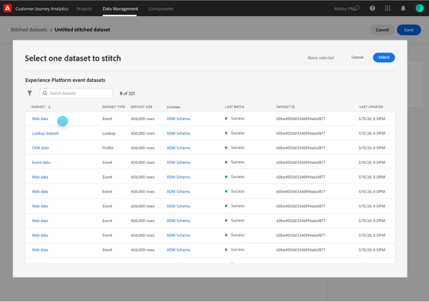

# 결합된 데이터 세트 만들기 및 관리

{{select-package}}

결합을 통해 관리자는 Customer Journey Analytics에서 사용할 수 있는 데이터 세트에 ID를 결합할 수 있습니다. 데이터 세트를 결합하면 프로필 표현의 정확도가 향상되어 궁극적으로 분석 및 보고가 향상됩니다.

결합 프로세스를 통해 기존 을 정의할 수 있습니다 **영구 ID** 을 참조하십시오. 그런 다음 지정된 재생 창(일별, 주별)에 대한 영구 식별자를 가장 정확하게 결합합니다 **임시 ID** (개인 또는 인증된 식별자) 해당 데이터 세트에 사용할 수 있습니다. 임시 식별자의 예로는 그래프에 저장된 이메일, 전화번호, CRM ID 또는 기타 ID가 있습니다. 다음을 참조하십시오 [개요](overview.md) 를 참조하십시오.

## 만들기

결합을 시작하려면 하나 이상의 결합된 데이터 세트를 만듭니다. 결합된 데이터 세트를 만들려면 다음 작업을 수행하십시오.

1. 선택 **[!UICONTROL **&#x200B;결합&#x200B;**]** 출처: **[!UICONTROL **&#x200B;데이터 관리&#x200B;**]** 맨 위 막대에서.

2. 다음에서 [!UICONTROL 결합된 데이터 세트] 화면, 선택 **[!UICONTROL **&#x200B;결합된 데이터 세트 만들기&#x200B;**]**.

   책임을 설명하는 대화 상자가 표시됩니다.

3. 선택 **[!UICONTROL **&#x200B;계속&#x200B;**]** 만약 당신이 이러한 책임을 받아들인다면.

   >[!NOTE]
   >
   >    다음을 선택하는 경우 **[!UICONTROL **&#x200B;취소&#x200B;**]**&#x200B;에서는 결합된 데이터 세트를 만들 수 없습니다.

4. 다음에서 [!UICONTROL 결합된 데이터 세트 > 제목 없는 결합된 데이터 세트] 화면:

   1. 정의 **[!UICONTROL **&#x200B;데이터 세트 이름&#x200B;**]** 및 (선택 사항) **[!UICONTROL **&#x200B;설명&#x200B;**]**,

   2. 에서 샌드박스 선택 **[!UICONTROL **&#x200B;샌드박스&#x200B;**]** 이벤트 데이터 세트가 저장되는 목록입니다.

      

   3. 다음 항목 선택 **[!UICONTROL **&#x200B;소스 데이터 세트 선택&#x200B;**]** 단추를 클릭합니다.

      다음에서 [!UICONTROL 연결할 데이터 세트 하나 선택] 팝업 창:

      

      - 데이터 세트를 선택하고 **[!UICONTROL **&#x200B;선택&#x200B;**]** 계속합니다.

   4. 에서 영구 식별자를 선택합니다. **[!UICONTROL **&#x200B;영구 ID **]** 목록을 표시합니다.

   5. 다음에서 임시 식별자를 선택합니다. **[!UICONTROL **&#x200B;임시 ID **]** 목록을 표시합니다.

      지난 7일 동안의 채도 비율(이벤트 수에 대해 지정된 각 식별자에 대한 값이 있는 횟수)을 계산하는 미리보기 패널이 표시되는 것을 볼 수 있습니다. 계산을 마치면 패널은 결합에 대한 최소 조건이 충족되었는지(녹색) 또는 충족되지 않았는지(빨간색) 색상으로 시각화합니다.

      

      최소 조건은 다음과 같습니다.

      - 영구 식별자 포화: 속도 >= 95%

      - 임시 식별자 포화: 비율 >= 5%

        최소 조건이 충족되면 샘플 값으로 실험할 수 있습니다.

      - 선택 **[!UICONTROL **&#x200B;데모 결합 ID 만들기&#x200B;**]**.

        다음에서 [!UICONTROL 샘플 값으로 실험] 대화 상자에는에 대한 샘플 값이 있는 테이블이 표시됩니다. [!UICONTROL timestamp], [!UICONTROL 영구 ID], [!UICONTROL 임시 ID], [!UICONTROL 결합된 ID(라이브)], [!UICONTROL 결합된 ID(1일 재생)], 및 [!UICONTROL 결합된 ID(7일 재생)].

            
            
            1.  ** 값 입력[!UICONTROL **영구 ID**]**.
            
            2.  ** 선택[!UICONTROL **결합된 ID 새로 고침**]**의 데이터에 대한 결합 프로세스의 효과를 확인하려면 여기를 클릭하십시오.
            
            3.  ** 선택[!UICONTROL **닫기**]샘플 값 실험을 마치면 **.
        

        뒤로 이동 [!UICONTROL 결합된 데이터 세트 > _데이터 세트 이름_] 화면:

   6. 에서 내역 데이터를 복원하는 빈도와 기간에 대한 옵션을 선택합니다. **[!UICONTROL **&#x200B;재생 창&#x200B;**]** 목록을 표시합니다.

      기본값 중에서 선택할 수 있습니다 **[!UICONTROL **&#x200B;전날, 매일&#x200B;**]** 또는 **[!UICONTROL **&#x200B;이전 7일, 매주&#x200B;**]**.

   7. 다음에서 값 선택 **[!UICONTROL **&#x200B;일일 평균 이벤트 수&#x200B;**]** 목록을 표시합니다.

   8. 값 입력(다음 사이) `0` 및 `12`) **[!UICONTROL **&#x200B;채울 개월 수&#x200B;**]**.

   9. 선택 **[!UICONTROL **&#x200B;저장&#x200B;**]** 를 클릭하여 결합된 데이터 세트를 저장하고 결합을 시작합니다.

## 상태 보기

에서 결합 상태를 볼 수 있습니다. [!UICONTROL 결합된 데이터 세트] 목록을 표시합니다.

- 선택 **[!UICONTROL **&#x200B;결합&#x200B;**]** 출처: **[!UICONTROL **&#x200B;데이터 관리&#x200B;**]** 맨 위 막대에서.

  각각 과 식별되는 결합된 데이터 세트 목록이 표시됩니다. [!UICONTROL 샌드박스], [!UICONTROL 소스 데이터 세트], [!UICONTROL 상태], [!UICONTROL 채우기 상태], [!UICONTROL 소유자], 및 [!UICONTROL 만든 날짜].

  

  가능한 값 [!UICONTROL 상태] 은(는)

  | 값 | 설명 |
  |-----|-----|
  | **[!UICONTROL **&#x200B;대기열에 추가됨&#x200B;**]** | 요청이 접수되고 곧 처리됩니다. |
  | **[!UICONTROL **&#x200B;생성 진행 중&#x200B;**]** | 리소스 및 새로 결합된 데이터 세트가 생성 중입니다. |
  | **[!UICONTROL **&#x200B;결합 진행 중&#x200B;**]** | 리소스 및 결합된 데이터 세트가 존재하며 결합이 진행 중입니다 |
  | **[!UICONTROL **&#x200B;오류&#x200B;**]** | 연결하는 데 문제가 있습니다. 소스 데이터 세트와 결합된 데이터 세트 간에 스키마가 변경되었을 수 있습니다. 일별 볼륨이 너무 크거나,_**추가 정보 필요...**_) |

  >[!INFO]
  >
  >    상태가 변경될 때마다 메시지와 함께 알림이 전송됩니다 **[!UICONTROL **&#x200B;결합된 데이터 세트 _데이터 세트 이름_ 이(가) 상태로 변경되었습니다. _상태 이름&#x200B;_**]**.

  다음 [!UICONTROL 채우기 상태] 은 0%, 25%, 50%, 75% 또는 100%의 값을 가질 수 있습니다.

  정보 아이콘을 선택하여 선택한 결합된 데이터 세트에 대한 자세한 내용이 포함된 팝업을 표시할 수 있습니다.

## 삭제

>[!NOTE]
>
>상태가 인 데이터 세트만 삭제할 수 있습니다. [!UICONTROL 결합 진행 중], [!UICONTROL 오류], 또는 [!UICONTROL 대기열에 추가됨].

결합된 단일 데이터 세트를 삭제하려면

- 선택 **[!UICONTROL **...**]** 결합된 데이터 세트에 대해 다음을 선택합니다. **[!UICONTROL **&#x200B;삭제&#x200B;**]** 메뉴에서 삭제할 수 있습니다.

  

결합된 여러 데이터를 삭제하려면 다음을 수행합니다.

- 나열된 각 데이터 세트의 시작 시 확인란을 사용하여 결합된 여러 데이터 세트를 선택합니다.

- 선택 **[!UICONTROL **...**]** 선택한 결합된 데이터 세트 중 하나에서 을(를) 선택하고 **[!UICONTROL **&#x200B;삭제&#x200B;**]** 메뉴에서 삭제할 수 있습니다.
