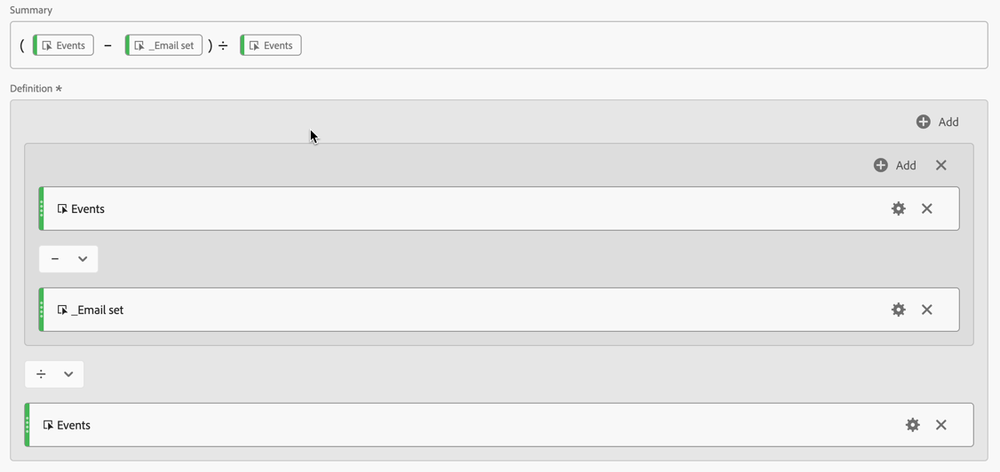
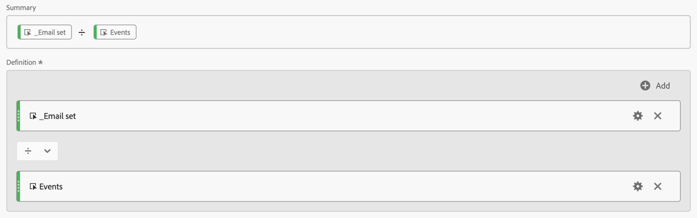

# 결합 검증

[ID 결합](/help/stitching/overview.md)(또는 간단히 결합)의 목표는 크로스 채널 분석을 위한 이벤트 데이터 세트의 적합성을 높이는 것입니다. 데이터 집합에 있는 모든 데이터 행에 사용 가능한 가장 높은 수준의 ID가 포함되어 있을 때 이 수준을 올릴 수 있습니다. 이 권한 상승으로 다음과 같은 작업을 수행할 수 있습니다.

* 익명 사용자를 제외하지 않고 사용자 중심 보고서를 만듭니다.
* 여러 장치를 한 사람에게 연결합니다.
* 여러 채널에서 사용자를 연결합니다.

이 문서에서는 새로 생성된 하나 이상의 결합된 데이터 세트의 상승을 측정하고 결합이 이러한 이점을 제공한다는 자신감을 제공하기 위한 분석 방법에 대해 간략하게 설명합니다.

분석 방법에는 일반적으로 관리자가 액세스할 수 있는 [데이터 보기 구성 요소 설정](/help/data-views/component-settings/overview.md)이 포함됩니다. 또한 이 메서드를 사용하려면 Analysis Workspace 프로젝트에서 작업하는 분석가가 계산된 지표와 시각화를 생성해야 합니다.

이러한 분석 방법은 필드 기반 결합 및 그래프 기반 결합 모두에 사용할 수 있지만 특히 그래프 기반 결합 시나리오에서 일부 요소는 데이터 세트에 없을 수 있습니다. 이러한 누락된 요소로 인해 Analysis Workspace에서 직접 상승도를 계산하기가 어려울 수 있습니다.

>[!NOTE]
>
>하나 이상의 데이터 세트를 (유효성 검사) 결합하는 것은 궁극적으로 더 나은 분석과 통찰력에 기여합니다. 그러나 이 문서에서는 Experience Platform의 모든 데이터 세트가 동일한 ID 네임스페이스에 정렬되는 Customer Journey Analytics 구성의 전체 값에 대해서는 다루지 않습니다. 또한 이러한 모든 데이터 세트가 서로 잘 결합되어 전체 고객 여정에서 분석을 수행합니다.

>[!BEGINSHADEBOX]

데모 비디오는  [연결 사용 및 유효성 검사](https://video.tv.adobe.com/v/3478127?captions=kor&quality=12&learn=on){target="_blank"}를 참조하십시오.

>[!ENDSHADEBOX]

## 연결 유효성 검사에서 결합

이 섹션에서는 연결 인터페이스에서 활성화한 결합의 유효성을 검사하는 방법에 대해 자세히 설명합니다.

### 연결 권장 사항

연결 인터페이스에서 활성화한 연결의 유효성을 검사하려면 **[!UICONTROL 데이터 집합 채우기]**&#x200B;에 대한 짧고 대표적인 기간을 선택하십시오. 예를 들어 1주일.

아래 예제에서는 이벤트 데이터 세트를 결합합니다. 이벤트 데이터 세트를 추가하는 테스트 연결을 설정했습니다. 해당 데이터 세트의 경우 **[!UICONTROL ECID]** **[!UICONTROL 네임스페이스]**&#x200B;을(를) **[!UICONTROL 영구 ID]**(으)로 정의하고 **[!UICONTROL 방문자 해시된 이메일 주소(directMarketing.hashedEmail)]**&#x200B;을(를) **[!UICONTROL 개인 ID]**(으)로 정의합니다. 이 결합의 유효성을 검사하려면 짧은 기간(2026년 1월 24일 - 2026년 2월 10일)에 대해 **[!UICONTROL 데이터 집합 채우기]**&#x200B;를 정의하세요. 이 작은 창을 사용하여 연결이 의도한 대로 작동하는지 확인합니다.

### 데이터 보기 사전 요구 사항

결합 유효성 검사의 경우 데이터 보기에 결합된 데이터 세트의 모든 필수 차원 및 지표가 정의되어 있는지 확인해야 합니다. 이전에 정의한 연결을 기반으로 데이터 보기를 만듭니다. 데이터 보기 구성의 **[!UICONTROL 구성 요소]** 단계에서 다음을 수행해야 합니다.

* **[!UICONTROL 지표 및 차원]**&#x200B;의 **[!UICONTROL ID 네임스페이스]**&#x200B;를 차원으로 **[!UICONTROL 차원]** 목록에 추가합니다.

  

* **[!UICONTROL 스키마 필드]**&#x200B;에서 이벤트의 개인 ID로 정의한 **[!UICONTROL 방문자 해시된 이메일 주소 식별자]**&#x200B;를 선택합니다. 필드를 **[!UICONTROL 차원]** 목록에 차원으로 추가하고 **[!UICONTROL 지표]** 목록에 지표로 추가합니다. 지표에 대한 **[!UICONTROL 구성 요소 이름]**&#x200B;을(를) `Email set`(으)로 수정합니다.

  

데이터 보기를 저장해야 합니다.

### 작업 영역

Workspace에서 새 프로젝트를 만들고 자유 형식 테이블을 사용하여 연결 구성을 테스트하기 위해 정의한 날짜 범위에 대한 **[!UICONTROL 전자 메일 집합]** 지표를 표시합니다. 이 자유 형식 테이블은 결합하기 전에 이메일 주소가 있는 이벤트를 보여줍니다.

결합 프로세스 후에 전자 메일 주소가 설정된 이벤트를 보려면 계산된 지표 `Email stitched namespace`을(를) 정의하십시오. 해당 계산된 지표는 해시된 이메일 네임스페이스 **[!UICONTROL email_lc_sha256]**&#x200B;과(와) 동일한 **[!UICONTROL ID 네임스페이스]**&#x200B;이(가) 있는 **[!UICONTROL 이벤트]**&#x200B;을(를) 봅니다.

새 계산된 지표 **[!UICONTROL 전자 메일 결합된 네임스페이스]**&#x200B;를 자유 형식 테이블에 추가하면 결합 프로세스 후 전자 메일 주소가 있는 이벤트 수가 증가합니다.

두 개의 추가 계산된 지표를 정의할 때 추가 통찰력을 얻을 수 있습니다.

* **[!UICONTROL 전자 메일 인증 속도]**. 이 계산된 지표는 결합 프로세스 전의 인증 속도를 결정합니다.

  

* **[!UICONTROL 결합된 인증 속도]**. 이 계산된 지표는 결합 프로세스 후의 인증 속도를 결정합니다.

  

이러한 두 개의 계산된 지표를 자유 형식 테이블에 추가하면 결합된 이벤트의 증가를 볼 수 있습니다.

더 많은 통찰력을 위해 2개의 계산된 지표(**[!UICONTROL 증가율]** 및 **[!UICONTROL 상승도]**)를 자유 형식 테이블에 추가하여 결합 구성의 영향을 확인할 수 있습니다.

이 문서에서 핵심은 이러한 유형의 결합 유효성 검사 및 분석이 다음과 같은 작업을 수행하는 데 도움이 된다는 것입니다.

* 현재 속도와 결합 속도를 비교하여 인증 효과에 대한 포괄적인 사용자 정의 보기를 제공합니다.
* 백분율 증가 및 상승도 지표를 통해 개선 사항을 명확하게 측정할 수 있습니다.
* 결합 구현이 사용자 인증에 미치는 진정한 영향을 식별하는 데 도움이 됩니다.
* 팀 간에 인증 성능을 전달하는 표준화된 방법을 만듭니다.
* 인증 전략 및 최적화에 대한 데이터 중심의 의사 결정을 허용합니다.

이러한 지표를 통해 이해 당사자는 Customer Journey Analytics 결합이 인증 성공률 및 전체 개인 식별 성능에 어떤 영향을 미치는지 완전히 파악할 수 있습니다.

## 요청 결합 유효성 검사

이 섹션에서는 Adobe에서 요청한 결합을 확인하는 방법에 대해 자세히 설명합니다. 이 메서드는 더 이상 사용되지 않지만 이 메서드를 사용하여 결합된 데이터 세트가 있을 수 있습니다.

### 데이터 보기 사전 요구 사항

결합 유효성 검사 측정 계획의 경우 데이터 보기에 결합된 데이터 세트의 모든 필수 차원 및 지표가 정의되어 있는지 확인해야 합니다. `stitchedID.id` 및 `stitchedID.namespace.code` 필드가 모두 차원으로 추가되었는지 확인하십시오. 결합된 데이터 세트는 원래 데이터 세트의 정확한 사본이지만 결합 프로세스는 이 두 개의 새 열을 데이터 세트에 추가합니다.

* `stitchedID.namespace.code`을(를) 사용하여 **[!UICONTROL 결합된 네임스페이스]** 차원을 정의합니다. 이 차원에는 행이 `Email` 또는 `Phone`(으)로 승격된 ID의 네임스페이스가 포함되어 있습니다. 또는 결합 프로세스가 속한 네임스페이스입니다(예: `ECID`).
  

* `stitchedID.id`을(를) 사용하여 **[!UICONTROL 결합된 ID 값]** 차원을 정의합니다. 이 차원은 ID의 원시 값을 포함합니다. 해시된 이메일, 해시된 휴대폰, ECID 등을 예로 들 수 있습니다. 이 값은 **[!UICONTROL 결합된 네임스페이스]**&#x200B;에 사용됩니다.
  

또한 차원에 값이 있는지 여부를 기반으로 하는 두 개의 결합 지표를 추가해야 합니다.

1. 결합된 데이터 세트의 개인 ID가 포함된 필드를 사용하여 개인 ID가 설정되었는지 여부를 정의하는 지표를 구성합니다. 개인 ID가 기준선을 설정하는 데 도움이 되므로 그래프 기반 결합을 사용하는 경우에도 이 개인 ID를 추가하십시오. 개인 ID가 데이터 세트에 포함되지 않은 경우 기준선은 0%입니다.

   아래 예에서 `personalEmail.address`은(는) ID 역할을 하며 **[!UICONTROL _Email 집합]** 지표를 만드는 데 사용됩니다.
   

1. `stitchedID.namespace.code` 필드를 사용하여 **[!UICONTROL 전자 메일로 결합된 네임스페이스]** 지표를 만듭니다. [구성 요소 설정에 제외 값 포함](/help/data-views/component-settings/include-exclude-values.md)을 지정했는지 확인하세요. 따라서 데이터 행을 높이려는 네임스페이스의 값만 고려합니다.
   1. **[!UICONTROL 포함/제외 값 설정]**&#x200B;을 선택합니다.
   1. **[!UICONTROL 일치]**(으)로 **[!UICONTROL 모든 기준이 충족되는 경우]**&#x200B;를 선택합니다.
   1. 전자 메일 네임스페이스로 승격된 이벤트를 선택하려면 **[!UICONTROL 같음]** `email`을(를) **[!UICONTROL 기준]**(으)로 지정하십시오.

   

### 결합된 차원

이 두 차원이 모두 데이터 보기에 추가된 상태에서 Analysis Workspace의 [자유 형식 테이블](/help/analysis-workspace/visualizations/freeform-table/freeform-table.md)을 사용하여 각 차원에 있는 데이터를 확인하십시오.

**[!UICONTROL 결합된 네임스페이스]** 차원 테이블에서 일반적으로 각 데이터 세트에 대해 두 개의 행이 표시됩니다. 한 행은 결합 프로세스에서 대체 메서드(ECID)를 사용해야 하는 시점을 나타냅니다. 다른 행은 원하는 ID 네임스페이스(이메일)와 관련된 이벤트를 보여줍니다.

**[!UICONTROL 결합된 ID 값]** 차원 테이블의 경우 이벤트에서 가져온 원시 값이 표시됩니다. 이 표에서 값은 영구 ID와 원하는 개인 ID 사이에서 진동합니다.

### 디바이스 중심 또는 사용자 중심 보고

연결을 만들 때 개인 ID에 사용할 필드 또는 ID를 정의해야 합니다. 예를 들어 웹 데이터 세트에서 장치 ID를 개인 ID로 선택하면 장치 중심 보고서가 만들어지고 이 데이터를 다른 오프라인 채널과 결합할 수 있는 기능이 없어집니다. 이메일과 같은 크로스 채널 필드 또는 ID를 선택하면 인증되지 않은 이벤트가 손실됩니다. 이러한 영향을 이해하려면 인증되지 않은 트래픽의 양과 인증된 트래픽의 양을 파악해야 합니다.

1. 총 **[!UICONTROL 에 대해 계산된 지표]**&#x200B;인증되지 않은 이벤트를 만듭니다. 아래와 같이 규칙 빌더에서 규칙을 정의합니다.
   총 

1. 이전에 정의한 **[!UICONTROL _전자 메일 집합]** 지표를 기반으로 계산된 지표 **[!UICONTROL 전자 메일 인증 비율]**&#x200B;을 만듭니다. 아래와 같이 규칙 빌더에서 규칙을 정의합니다.
   

1. **[!UICONTROL 전자 메일 인증 비율]** 계산된 지표와 함께 **[!UICONTROL 총]**&#x200B;에 대해 인증되지 않은 이벤트를 사용하여 [도넛](/help/analysis-workspace/visualizations/donut.md) 시각화를 만드십시오. 시각화는 데이터 세트에서 인증되지 않고 인증된 이벤트의 수를 보여 줍니다.

   

### 식별 비율 결합

결합 전후의 식별 성능을 측정하려는 경우 이렇게 하려면 3개의 추가 계산된 지표를 만듭니다.

1. 총 이벤트 수에 대해 결합된 네임스페이스가 원하는 ID로 설정된 이벤트 수를 계산하는 **[!UICONTROL 결합된 인증 비율]** 계산된 지표입니다. 데이터 보기를 설정할 때 이벤트에 전자 메일로 설정된 네임스페이스가 있는 경우에만 계산되는 필터를 포함하는 **[!UICONTROL 전자 메일로 결합된 네임스페이스]** 지표를 만들었습니다. 계산된 지표는 이 **[!UICONTROL 전자 메일로 결합된 네임스페이스]** 지표를 사용하여 원하는 ID가 있는 데이터의 비율을 나타냅니다.
   

1. 현재 식별 속도와 결합된 지표 사이의 원시 백분율 변경을 계산하는 **[!UICONTROL 백분율 증가]** 계산된 지표입니다.
   계산된 지표를 

1. 현재 식별 속도와 결합된 식별 속도 간의 상승도를 계산하는 **[!UICONTROL 상승도]** 계산된 지표입니다.
   

### 결론

Analysis Workspace 자유 형식 테이블의 모든 데이터를 결합하는 경우 다음을 포함하여 스티칭이 제공하는 영향과 가치를 확인할 수 있습니다.

* 현재 인증 비율: 총 이벤트 수에 대해 올바른 개인 ID가 이미 있는 이벤트 수의 기준선입니다.
* 결합된 인증 비율: 총 이벤트 수에 대해 올바른 개인 ID가 있는 새 이벤트 수입니다.
* 증가율: 결합된 인증률에서 기준 현재 인증률을 뺀 원시 증가율입니다.
* 상승도: 기준 현재 인증 비율에 대한 퍼센트 변경입니다.

이 문서에서 핵심은 이러한 유형의 결합 유효성 검사 및 분석이 다음과 같은 작업에 도움이 된다는 것입니다.

* 현재 속도와 결합 속도를 비교하여 인증 효과에 대한 포괄적인 사용자 정의 보기를 제공합니다.
* 백분율 증가 및 상승도 지표를 통해 개선 사항을 명확하게 측정할 수 있습니다.
* 결합 구현이 사용자 인증에 미치는 진정한 영향을 식별하는 데 도움이 됩니다.
* 팀 간에 인증 성능을 전달하는 표준화된 방법을 만듭니다.
* 인증 전략 및 최적화에 대한 데이터 중심의 의사 결정을 허용합니다.

이러한 지표를 통해 이해 당사자는 Customer Journey Analytics 결합이 인증 성공률 및 전체 개인 식별 성능에 어떤 영향을 미치는지 완전히 파악할 수 있습니다.
