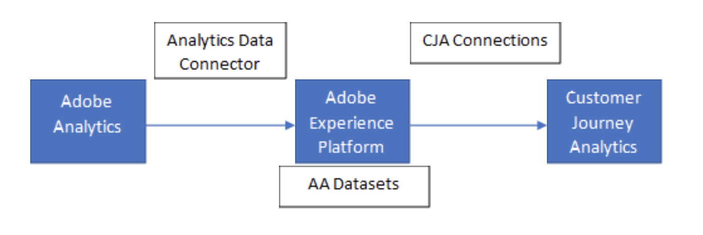

# Analytics 소스 커넥터 데이터와 Adobe Analytics 비교

조직에서 Customer Journey Analytics를 채택함에 따라 Adobe Analytics와 Customer Journey Analytics 간의 데이터 차이가 있을 수 있습니다. 이러한 차이는 정상이며 여러 가지 이유로 발생할 수 있습니다. Customer Journey Analytics는 Adobe Analytics에서의 데이터에 대한 몇 가지 제한 사항을 개선할 수 있도록 설계되었습니다. 이러한 유연성으로 인해 Customer Journey Analytics이 데이터를 해석하는 방식에 약간의 차이가 발생할 수 있습니다. 이 문서를 사용하여 Customer Journey Analytics 및 Adobe Analytics가 데이터를 처리하는 방식의 잠재적 차이점을 이해합니다.

이 페이지에서는 [Analytics 소스 커넥터](https://experienceleague.adobe.com/docs/experience-platform/sources/ui-tutorials/create/adobe-applications/analytics.html)를 사용하여 Adobe Analytics 데이터를 Adobe Experience Platform에 수집한 다음 Customer Journey Analytics에서 [연결](/help/connections/overview.md) 및 [데이터 보기](/help/data-views/data-views.md)를 생성한다고 가정합니다.



보고 플랫폼마다 데이터가 다를 수 있는 이유는 다음과 같습니다.

* **다양한 데이터 세트 또는 보고서 세트**: Adobe Analytics의 보고서 세트와 소스 커넥터가 데이터를 가져오는 보고서 세트가 동일한지 확인합니다.
* **캘린더 설정**: Adobe Analytics의 보고서 세트에는 시간대 및 기타 캘린더 설정을 구성할 수 있습니다. 마찬가지로, Customer Journey Analytics의 데이터 보기에는 제어할 수 있는 별도의 설정이 있습니다. 패리티를 원하는 경우 이러한 설정이 제품 간에 일치하는지 확인하십시오.
* **추가 데이터 세트**: Customer Journey Analytics는 단일 연결 내에 여러 데이터 세트를 포함할 수 있는 기능을 제공합니다. 이러한 차이점에는 추가 이벤트 데이터 세트, 프로필 데이터 세트 또는 조회 데이터 세트가 포함됩니다. 이 기능은 Adobe Analytics와 Customer Journey Analytics의 핵심 차별화 요소로, 교차 채널 데이터에 대한 인사이트를 제공합니다.
* **결합된 데이터 세트**: Adobe는 두 데이터 세트 간의 개인 ID를 분석할 수 있는 기능을 제공하여 결합된 ID가 포함된 새로운 데이터 세트를 생성합니다. 이러한 [결합된 데이터 세트](/help/stitching/overview.md)에는 Adobe Analytics 보고서 세트에서 제공하는 것 이상의 추가 데이터가 포함되어 있습니다.
* **데이터 소스**: Customer Journey Analytics에는 요약 데이터 원본 또는 트랜잭션 ID 데이터 원본을 포함하여 Adobe Analytics 보고서 세트에 업로드된 모든 유형의 [데이터 소스](https://experienceleague.adobe.com/ko/docs/analytics/import/data-sources/overview)가 포함되지 않습니다.
* **차원 및 지표 설정**: 데이터 보기 내 모든 차원과 지표는 조직에서 변경할 수 있는 자체 설정을 포함합니다. 이러한 변경 사항은 보고서가 실행될 때 적용되므로 소급 적용됩니다. Adobe Analytics의 차원 및 지표 설정은 데이터 수집 방법을 변경하여 해당 시점부터 이러한 변경 사항이 적용됩니다. 두 제품 중 하나에서 구성 요소 설정을 변경하면 보고 차이를 만들 수 있습니다. 특정 차원에 집중하는 경우 Adobe Analytics와 Customer Journey Analytics 간의 속성 및 지속성 설정이 일치하는지 확인합니다.

  >[!TIP]
  >
  >Adobe는 Adobe Analytics의 차원에서 “[!UICONTROL 가장 최근(마지막)]”의 할당을 사용할 것을 강력히 권장합니다. 이 할당 설정을 사용하면 Customer Journey Analytics에서 보다 많은 속성 유연성을 사용할 수 있습니다.

* **방문 정의**: 개별 차원 및 지표 설정 외에도 데이터 보기 자체에는 방문자 데이터 해석 방식을 근본적으로 변경하는 설정이 포함되어 있습니다. 예를 들어, 세그먼트를 전체 데이터 보기에 적용할 수 있습니다(Adobe Analytics의 [가상 보고서 세트](https://experienceleague.adobe.com/ko/docs/analytics/components/virtual-report-suites/vrs-about)와 유사). 방문 기간의 정의를 변경하거나 원하는 이벤트에 자동으로 새 방문을 시작할 수도 있습니다. 이러한 설정은 Customer Journey Analytics와 Adobe Analytics 간의 보고 차이를 보고하는 데 중요한 영향을 미칠 수 있습니다.

## 제품 간 레코드 수 확인

위의 모든 설정이 유사하게 표시되고 제품 간 레코드 수를 최소한 검증하려는 경우 다음 단계를 사용할 수 있습니다.

1. Adobe Experience Platform [쿼리 서비스](https://experienceleague.adobe.com/ko/docs/experience-platform/query/home)에서 다음 타임스탬프별 총 레코드 쿼리를 실행합니다.

   ```sql
   SELECT
     Substring(from_utc_timestamp(timestamp,'{timeZone}'), 1, 10) AS Day,
     Count(_id) AS Records
   FROM  {dataset}
   WHERE   timestamp >= from_utc_timestamp('{fromDate}','UTC')
     AND timestamp < from_utc_timestamp('{toDate}','UTC')
     AND timestamp IS NOT NULL
     AND enduserids._experience.aaid.id IS NOT NULL
   GROUP BY Day
   ORDER BY Day;
   ```

1. Adobe Analytics [데이터 피드](https://experienceleague.adobe.com/ko/docs/analytics/export/analytics-data-feed/data-feed-overview)에서 원하는 날짜 범위에 대한 피드 파일을 생성합니다. 각 파일 내의 행 수를 계산하여 다음 행을 식별하고 제외합니다.

   * `exclude_hit`는 `0`이 아닙니다(두 제품의 Analysis Workspace에서 제외된 데이터).
   * `hit_source`는 `0`, `3`, `5`, `7`, `8`, `9` 또는 `10`입니다(데이터 소스 및 기타 히트가 아닌 데이터).
   * `page_event`는 `53` 또는 `63`입니다(스트리밍 미디어 keep-alive 히트).

   위의 기준 중 하나와 일치하는 행은 Analytics 소스 커넥터 수집 워크플로에서 제외되므로 데이터 피드 행을 계산할 때도 제외해야 합니다.

1. 쿼리 서비스의 총 레코드는 동일한 기간 동안 데이터 피드의 행 수와 일치해야 합니다.
