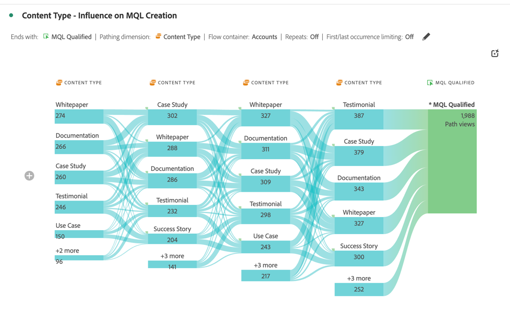

# 계정 마케팅 최적화

{{draft-b2b}}

효과적인 계정 기반 마케팅을 위해서는 계정 수준에서 구매 여정에 대한 깊은 이해가 필요합니다. 따라서 거래를 성사시키는 데 가장 영향력 있는 마케팅 활동을 결정할 수 있습니다.

이를 위해 다음을 분석하고 살펴볼 수 있습니다.

* 마케팅 효과:

   * 캠페인, 채널 및 컨텐츠 전체.
   * 계정 내 구매 그룹의 경우,

* 판매 파이프라인 진행.
* 업셀 및 크로스셀 기회.
* 고객 계정 상태.

Customer Journey Analytics B2B edition은 계정 마케팅의 최적화를 지원할 수 있습니다. 예제는 다음 섹션을 참조하십시오.

## 계정 기반 마케팅 참여

온라인과 오프라인을 막론하고 닫힌 기회를 추진하는 데 가장 영향을 미치는 경험을 식별하려고 합니다.

[여정 캔버스](/help/analysis-workspace/visualizations/journey-canvas/journey-canvas.md) 시각화를 사용하여 계정, 기회, 구매 그룹, 캠페인 및 채널 간의 모든 상호 작용을 매핑하여 계정 마케팅에서 작동하는 내용과 개선할 수 있는 지점을 파악합니다.

여정 캔버스 시각화는 다음 작업을 수행하는 데 도움이 됩니다.

* 전체 스토리를 확인하십시오. 예를 들어 알려진 모든 온라인 및 오프라인 상호 작용을 포함하는 *특정* 고가치 계정 또는 구매 그룹의 세부 경로를 표시할 수 있습니다.
* 중요한 이정표에 도달하거나 이를 따르는 주요 순간을 컨텍스트화합니다(예: 마케팅 적격 리드 트리거 또는 기회 생성).
* 특정 계정에 대한 시각화의 상호 작용 기록을 통해 영업 직원을 지원합니다. 이러한 시각화는 관련 대화를 가능하게 한다.

### 예

리드 양식에서 마감된 원화로 여정을 시각화하려는 경우

1. [여정 캔버스 만들기 및 구성](/help/analysis-workspace/visualizations/journey-canvas/configure-journey-canvas.md) 시각화.
1. **[!UICONTROL 계정]**&#x200B;을(를) **[!UICONTROL 기본 지표]**(으)로 구성합니다.
1. **[!UICONTROL 계정]**&#x200B;을(를) **[!UICONTROL 여정 캔버스 컨테이너]**(으)로 선택하십시오.

   

1. **[!UICONTROL 빌드]**&#x200B;를 선택합니다.
1. 캔버스에 노드를 드래그 앤 드롭한 다음 노드를 연결하여 계정 여정을 나타냅니다. 예: **[!UICONTROL 리드 양식: 단계 1]** 양식에서 **[!UICONTROL Opp까지.]**&#x200B;을(를) 만들었습니다.

   

## 집단 세분화

구매자의 주요 그룹을 식별하여 유료 미디어, 이메일, 소셜과 같은 다른 채널에 대해 이러한 구매자 그룹을 활성화하고자 합니다.

[집단 테이블](/help/analysis-workspace/visualizations/cohort-table/cohort-analysis.md) 시각화를 사용하여 공유된 시작점(예: MQL(시장 자격) 리드 날짜)을 기준으로 B2B 엔터티(계정, 기회, 구매 그룹)를 그룹화합니다. 그리고 후속 단계나 이정표에서 시간에 따른 이러한 각 엔티티의 진행 상황을 추적합니다.

집단 테이블 시각화는 다음을 수행하는 데 도움이 됩니다.

* 고객 또는 기회 집단이 몇 주 또는 몇 개월에 걸쳐 주요 이정표에 얼마나 빨리 도달하는지(예: 마케팅 자격을 갖춘 잠재 고객에서 판매 자격을 갖춘 잠재 고객으로) 분석합니다.
* 특정 집단(세그먼트, 캠페인 소스, 구매 그룹 유형별)이 다른 집단에 비해 판매 주기를 더 빠르게 이동하는지 여부를 식별합니다.
* 전략 이니셔티브(예: 마케팅 캠페인)가 후속 집단에 대해 더 짧은 진행 타임라인과 상관관계가 있는지 평가합니다.

### 예

마감된 기회의 월별 집단을 조회하려는 경우

1. [집단 테이블 만들기 및 구성](/help/analysis-workspace/visualizations/cohort-table/t-cohort.md) 시각화.
1. **[!UICONTROL 만들어진 기회]**&#x200B;를 **[!UICONTROL 포함 기준]** 지표로 사용합니다. **[!UICONTROL >=]**&#x200B;을(를) 연산자로 선택하고 값 `1`을(를) 입력하십시오.
1. **[!UICONTROL Closed-Won]**&#x200B;을(를) **[!UICONTROL 반환 기준]** 지표로 사용합니다. **[!UICONTROL >=]**&#x200B;을(를) 연산자로 선택하고 값 `1`을(를) 입력하십시오.
1. **[!UICONTROL 기회]**&#x200B;를 컨테이너로 선택합니다.

   

1. **[!UICONTROL 빌드]**&#x200B;를 선택합니다. 집단 테이블의 예는 아래를 참조하십시오.

   

## 대면 이벤트

여러 개인 이벤트에서 참여 계정 및 활동 보기에 대해 보고하려 합니다. 따라서 직접 이벤트 참석의 영향을 분석하고 최적화할 수 있습니다.

[흐름](/help/analysis-workspace/visualizations/c-flow/flow.md) 시각화를 통해 사용자가 아닌 계정 또는 구매 그룹에서도 시간이 지남에 따라 상호 작용이나 단계 사이를 이동하는 경로를 시각화할 수 있습니다.

플로우 시각화는 다음과 같은 작업을 수행하는 데 도움이 됩니다.

* B2B 엔터티에서 트래버스하는 가장 빈번한 터치포인트 시퀀스를 식별합니다(예: *사이트 방문*&#x200B;에서 *백서 다운로드*&#x200B;에서 *데모 요청*).
* 계정 또는 구매 그룹이 비선형적으로 이동하는 방법을 시각화합니다(예: 뒤로 루프백, 단계 건너뛰기 또는 예기치 않은 경로 지정).
* 중요한 상호 작용 전 또는 후의 흐름에 집중(예: 데모 요청)하여 어떤 요소가 기여하는지 또는 상호 작용 후 작업이 수행되는지 파악합니다.

### 예

MQL(마케팅 적격 리드) 생성에 대한 영향을 시각화하려고 합니다.

1. [플로우 만들기 및 구성](/help/analysis-workspace/visualizations/c-flow/create-flow.md) 시각화.
1. **[!UICONTROL 다음으로 끝남]**&#x200B;에 대해 **[!UICONTROL MQL 적격]**&#x200B;을(를) 선택하십시오.
1. **[!UICONTROL 경로 지정 차원]**&#x200B;에 대해 **[!UICONTROL 콘텐츠 형식]**&#x200B;을(를) 선택하십시오.
1. **[!UICONTROL 고급 설정 표시]**&#x200B;를 선택합니다.
1. **[!UICONTROL 열 개수]**&#x200B;에 `5`을(를) 입력하십시오.
1. **[!UICONTROL 흐름 컨테이너]**&#x200B;의 **[!UICONTROL 계정]**&#x200B;을(를) 선택하십시오.

   

1. **[!UICONTROL 빌드]**&#x200B;를 선택합니다.

   
