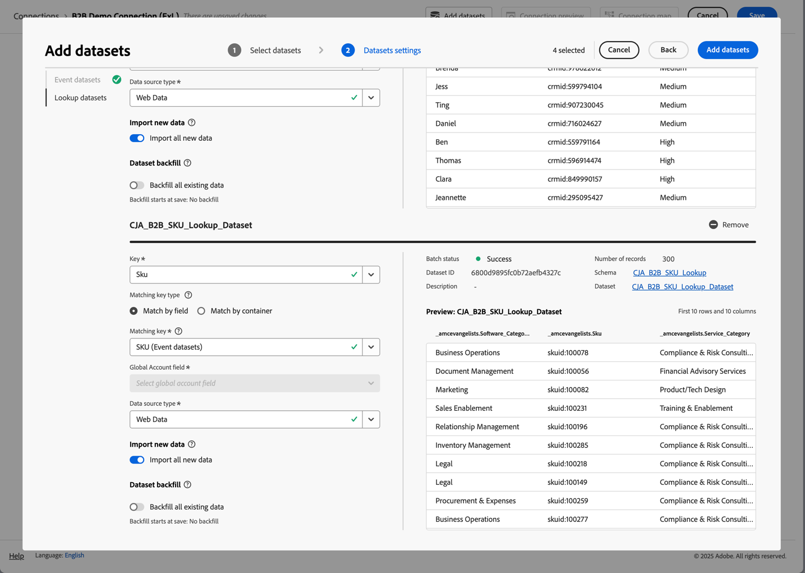
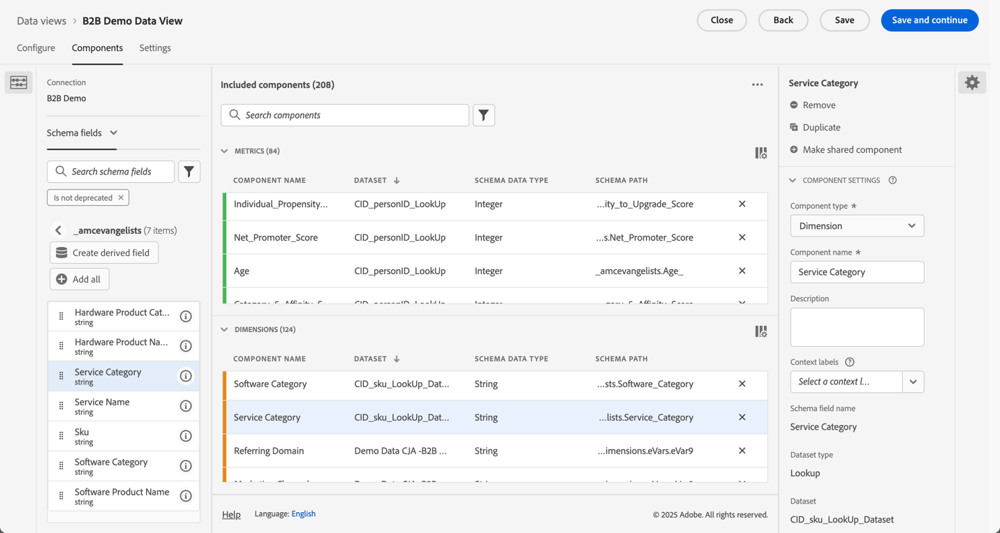

# B2B edition 사용 사례 설정

이 문서에서는 다음 사용 사례를 지원하기 위한 Customer Journey Analytics B2B edition의 일반적인 설정을 다룹니다.

* [계정 마케팅 최적화](optimize-account-marketing.md)
* [주요 계정 확장](grow-key-accounts.md)
* [제품 가치 빌드](build-product-value.md)

>[!NOTE]
>
>이러한 사용 사례에서 사용되는 데모 데이터 및 스크린샷은 일러스트레이션 목적으로만 사용되며 실제 데이터를 반영하지 않습니다.

## 솔루션 디자인 참조

Customer Journey Analytics B2B edition을 설정하기 전에 수집하는 각 필드를 문서화하는 적절한 솔루션 디자인 참조가 있는지 확인하십시오.

예제 솔루션 디자인 참조는 다음과 같습니다.

+++ 이벤트 차원

| Dimension 이름 |
|---|
| 계정 ID |
| 계정 이름 |
| 구매 그룹 ID |
| 콜센터 |
| 콜 센터 담당자 ID |
| 호출 ID |
| 캠페인 추적 코드 |
| 콘텐츠 ID |
| 콘텐츠 유형 |
| 데이터 소스 |
| 디바이스 유형 |
| 이벤트 세부 사항 |
| 이벤트 이름 |
| 단계 |
| 인터랙션 채널 |
| 잠재 고객 ID |
| 마케팅 채널 |
| 마케팅 이벤트 ID |
| 마케팅 이벤트 유형 |
| 기회 ID |
| 페이지 |
| 페이지 상세정보 |
| 참조 도메인 |
| 영업 담당자 ID |
| 영업 단계 이름 |
| 판매 단계 번호 |
| 사이트 섹션 |
| SKU |
| 보조 계정 ID |
| 설문 조사 ID |
| 설문 조사 만족도 점수 |
| 설문 조사 유형 |
| 사용자 ID |

+++

+++ 이벤트 지표

| 지표 이름 | 이벤트 유형 |
|---|---|
| 계정 만들기: 완료 | 카운터 |
| 계정 만들기: 시작 | 카운터 |
| 호출 비용 | 통화 |
| 통화 길이 | 카운터 |
| 통화 만족도 점수 | 숫자 |
| 전화 설문 조사 완료됨 | 카운터 |
| 통화 | 카운터 |
| 닫힘 손실 | 카운터 |
| 청산 | 카운터 |
| 컨텐츠 보기 | 카운터 |
| 거래 크기 통화 표시 클릭스루 | 카운터 |
| 노출 횟수 표시 | 카운터 |
| 반송된 이메일 | 카운터 |
| 이메일 클릭됨 | 카운터 |
| 이메일 전달됨 | 카운터 |
| 이메일 열림 | 카운터 |
| 이메일 전송됨 | 카운터 |
| 이벤트 참석 | 카운터 |
| 이벤트 등록: 완료 | 카운터 |
| 이벤트 등록: 1단계 | 카운터 |
| 이벤트 등록: 2단계 | 카운터 |
| 이벤트 등록: 3단계 | 카운터 |
| 글로벌 만족도 점수 숫자 인바운드 호출 | 카운터 |
| 리드 양식: 완료 | 카운터 |
| 리드 양식: 1단계 | 카운터 |
| 리드 양식: 2단계 | 카운터 |
| 생성된 리드 | 카운터 |
| 잠재 고객 선별 | 카운터 |
| 모임 | 카운터 |
| MQL 실격됨 | 카운터 |
| MQL 적격 | 카운터 |
| 요구 평가 | 카운터 |
| 협상 | 카운터 |
| 고객 이의 대처 | 카운터 |
| 기회 | 카운터 |
| 영업 기회 생성 | 카운터 |
| 주문 | 카운터 |
| 아웃바운드 호출 | 카운터 |
| 판매 후 후속 작업 | 카운터 |
| 제안 제출 | 카운터 |
| 매출 마감-손실 | 통화 |
| 매출 마감-원 | 통화 |
| 판매 담당자 호출 | 카운터 |
| 판매 단계 시작됨 | 카운터 |
| SMS 클릭스루 | 카운터 |
| SMS 전송됨 | 카운터 |
| 소셜 클릭스루 | 카운터 |
| 소셜 노출 횟수 | 카운터 |
| 솔루션 프레젠테이션 | 카운터 |
| SQL 부적격 | 카운터 |
| SQL 적격 | 카운터 |
| 단위(표시하지 않음) | 카운터 |
| VoC 설문 조사 만족도 점수 | 숫자 |
| VoC 설문 조사 완료됨 | 카운터 |

+++

+++ 개인 레코드

| 데이터 보기 필드 이름 | 필드 유형 |
|---|---|
| 연령 | 지표 |
| 연령 그룹 | 차원 |
| 범주 1 친화성 수준 | 차원 |
| 카테고리 1 친화성 점수 | 지표 |
| 범주 2 친화성 수준 | 차원 |
| 카테고리 2 친화성 점수 | 지표 |
| 범주 3 친화성 수준 | 차원 |
| 카테고리 3 친화성 점수 | 지표 |
| 범주 4 친화성 수준 | 차원 |
| 카테고리 4 친화성 점수 | 지표 |
| 범주 5 친화성 수준 | 차원 |
| 카테고리 5 친화성 점수 | 지표 |
| 동의 Advertising | 차원 |
| 모든 커뮤니케이션 동의 | 차원 |
| 동의 DM | 차원 |
| 동의 이메일 | 차원 |
| 동의 휴대폰 | 차원 |
| 동의 Personalization | 차원 |
| 동의 공유 데이터 | 차원 |
| 동의 SMS | 차원 |
| 이메일 | 차원 |
| 이름 | 차원 |
| 성별 | 차원 |
| 개별 도시 | 차원 |
| 개별 CLTV 수준 | 차원 |
| 개별 CLTV 점수 | 지표 |
| 개별 국가 | 차원 |
| 개인 전화 | 차원 |
| 개별 우편 번호 | 차원 |
| 개인 구매 성향 수준 | 차원 |
| 개인 구매 성향 점수 | 지표 |
| 개인의 이탈 성향 | 차원 |
| 개인의 이탈 성향 점수 | 지표 |
| 개별 업그레이드 성향 | 차원 |
| 개인 업그레이드 성향 점수 | 지표 |
| 개별 상태 | 차원 |
| 개별 상세 주소 | 차원 |
| 직함 | 차원 |
| 성 | 차원 |
| Net Promoter 점수 | 지표 |
| 네트 프로모터 상태 | 차원 |
| 역할 유형 | 차원 |

+++

+++ 계정 레코드

| 데이터 보기 필드 이름 | 필드 유형 |
|---|---|
| 연간 수익 | 지표 |
| 회사 도시 | 차원 |
| 회사 CLTV 수준 | 차원 |
| 회사 CLTV 스코어 | 지표 |
| 회사 국가 | 차원 |
| 회사 이름 | 차원 |
| 회사 전화 | 차원 |
| 회사 우편 번호 | 차원 |
| 회사의 구매 성향 수준 | 차원 |
| 회사 구매 성향 점수 | 지표 |
| 회사 성향 이탈 수준 | 차원 |
| 회사 이탈 성향 점수 | 지표 |
| 업그레이드 수준에 대한 회사 성향 | 차원 |
| 회사 업그레이드 성향 점수 | 지표 |
| 회사 규모 | 차원 |
| 회사 주 | 차원 |
| 회사 주소 | 차원 |
| 업종 | 차원 |
| 직원 수 | 지표 |
| 파트너 대상 - 하드웨어 구매자 | 차원 |
| 파트너 대상 - 급속한 성장 | 차원 |
| 파트너 대상 - 필요한 서비스 | 차원 |
| 파트너 대상 - 소프트웨어 구매자 | 차원 |
| 매출 범위 | 차원 |
| 웹사이트 | 차원 |

+++

+++ SKU 레코드

| 데이터 보기 필드 이름 | 필드 유형 |
|---|---|
| 하드웨어 제품 범주 | 차원 |
| 하드웨어 제품 이름 | 차원 |
| 서비스 범주 | 차원 |
| 서비스 이름 | 차원 |
| 소프트웨어 제품 범주 | 차원 |
| 소프트웨어 제품 이름 | 차원 |

+++

## 스키마 및 데이터 세트

솔루션 디자인 참조를 지원하는 데이터는 다음 스키마 및 데이터 세트를 사용하여 구성됩니다.

### 이벤트 데이터

이벤트 차원 및 지표는 시계열(이벤트) 기반 스키마 및 이벤트 데이터가 포함된 하나 이상의 데이터 세트를 통해 지원됩니다.

<!--For example: the Account ID field is mapped to **[!UICONTROL Account ID]**. See below for a preview of the data typically available in such a dataset.

-->

### 개인 데이터

개인 레코드는 레코드(프로필) 기반 스키마 및 개인 데이터가 포함된 하나 이상의 데이터 세트를 통해 지원됩니다. 이러한 데이터 세트에서 일반적으로 사용할 수 있는 개인 데이터의 예제(예제 솔루션 디자인 참조 기반)는 아래를 참조하십시오.

### 계정 데이터

계정 레코드는 레코드(조회) 기반 스키마 및 계정 데이터가 포함된 하나 이상의 데이터 세트를 통해 지원됩니다. 이러한 데이터 세트에서 일반적으로 사용할 수 있는 계정 데이터의 예(예제 솔루션 디자인 참조에 기반)는 아래를 참조하십시오.

### SKU 데이터

SKU 레코드는 레코드(조회) 기반 스키마 및 SKU 데이터가 포함된 하나 이상의 데이터 세트를 통해 지원됩니다. 이러한 데이터 세트에서 일반적으로 사용할 수 있는 SKU 데이터의 예(예제 솔루션 디자인 참조 기반)는 아래를 참조하십시오.

## 연결

Customer Journey Analytics에서 계정 기반 연결을 정의하여 이벤트, 계정, 사용자 및 SKU 데이터 세트에서 레코드를 수집하고 연결합니다.

1. Customer Journey Analytics에서 [새 연결을 만듭니다](/help/connections/create-connection.md).
1. 연결을 설명하는 이름과 설명을 입력합니다.
1.  **[!UICONTROL 계정]**&#x200B;을(를) **[!UICONTROL 기본 ID]**(으)로 선택합니다.
1. **[!UICONTROL 선택적 컨테이너]**&#x200B;를 모두 선택하십시오.
1. 선호하는 샌드박스를 선택하고 일일 평균 이벤트 수를 예측합니다.

   

1. **[!UICONTROL 데이터 세트 추가]**&#x200B;를 선택하고 이벤트, 계정, 사용자 및 SKU의 데이터가 포함된 B2B 데이터 세트를 추가합니다.

   

1. **[!UICONTROL 다음]**&#x200B;을(를) 선택하여 선택한 각 데이터 세트에 대한 설정을 구성합니다.
1. 이벤트 데이터 세트의 경우 **[!UICONTROL 계정 ID]**, **[!UICONTROL 글로벌 계정 ID]**, **[!UICONTROL 기회 ID]**, **[!UICONTROL 구매 그룹 ID]** 및 **[!UICONTROL 개인 ID]**&#x200B;의 ID에 해당하는 적절한 필드를 선택하십시오.

   

1. 아래로 스크롤하여 계정 레코드 데이터 세트를 구성합니다. **[!UICONTROL 전역 계정]** 컨테이너에서 계정과 일치하는 올바른 식별자(**[!UICONTROL Account_ID]**)를 선택하십시오. 올바른 식별자(**[!UICONTROL Account_ID]**)를 **[!UICONTROL 전역 계정 필드]**(으)로 선택하십시오.

   

1. 아래로 스크롤하여 개인 레코드 데이터 세트를 구성합니다. **[!UICONTROL Person]** 컨테이너에서 해당 사용자와 일치하는 올바른 키(**[!UICONTROL Person_ID]**)를 선택하십시오. **[!UICONTROL 전역 계정]** 필드와 일치시킬 적절한 ID(**[!UICONTROL Profile_Account_ID_Individual]**)를 선택하십시오.

   

1. 아래로 스크롤하여 SKU 레코드 데이터 세트를 구성합니다. 올바른 키(**[!UICONTROL Sku]**)를 선택했는지 확인하십시오. 이 데이터에 대해 구성된 컨테이너가 없거나 사용할 수 없으므로 **[!UICONTROL 필드별 일치]**&#x200B;를 선택하십시오. 이벤트 데이터 세트(**[!UICONTROL SKU(이벤트 데이터 세트)]**)의 SKU 필드를 일치 키로 선택합니다.

   

1. 데이터 세트와 구성된 설정을 저장하려면 **[!UICONTROL 데이터 세트 추가]**&#x200B;를 선택하십시오.

1. 연결을 저장하려면 **[!UICONTROL 저장]**&#x200B;을(를) 선택하십시오.

## 데이터 보기

Customer Journey Analytics에서 데이터를 수집하면 솔루션 디자인 참조에서 정의한 모든 구성 요소를 포함하는 데이터 보기를 만들 수 있습니다.

### 구성

1. Customer Journey Analytics에서 [새 데이터 보기를 만듭니다](/help/data-views/data-views.md).
1. 이전에 만든 연결을 선택하십시오(예: **[!UICONTROL B2B 데모 연결(ExL)]**).
1. 데이터 보기의 이름을 입력합니다. 예: `B2B Demo Data view (ExL)` 및 선택적으로 설명.
1. 선택적으로 컨테이너의 이름을 변경합니다. 또는 기본 컨테이너 이름을 사용합니다.

   
1. **[!UICONTROL 저장 후 계속]**&#x200B;을 선택합니다.

### 구성 요소

기본적으로 모든 [표준 구성 요소](/help/data-views/component-reference.md)는 데이터 보기에 이미 포함되어 있습니다. 이러한 표준 구성 요소에는 계정, 구매 그룹, 글로벌 계정 및 기회에 대한 B2B 특정 지표가 포함됩니다.

1. [솔루션 디자인 참조](#solution-design-reference)에서 정의한 모든 이벤트 차원을 데이터 보기의 차원 구성 요소에 추가합니다. 예를 들어 **[!UICONTROL 이벤트 이름]** 차원을 나타내는 **[!UICONTROL 이벤트 이름]** 필드입니다. 사용 가능한 [구성 요소 설정](/help/data-views/component-settings/overview.md)을 통해 차원 구성 요소를 구성하십시오.

   

1. [솔루션 디자인 참조](#solution-design-reference)에서 정의한 모든 이벤트 지표를 데이터 보기의 지표 구성 요소에 추가하십시오. 예를 들어 **[!UICONTROL SQL 정규화]** 지표를 나타내는 **[!UICONTROL SQL 정규화]** 필드가 있습니다. 사용 가능한 [구성 요소 설정](/help/data-views/component-settings/overview.md)을 통해 차원 구성 요소를 구성하십시오.

   

1. [솔루션 디자인 참조](#solution-design-reference)에서 정의한 모든 계정 차원을 데이터 보기의 차원 구성 요소에 추가하십시오. 예를 들어 **[!UICONTROL 산업]** 차원을 나타내는 **[!UICONTROL 산업]** 필드입니다. 사용 가능한 [구성 요소 설정](/help/data-views/component-settings/overview.md)을 통해 차원 구성 요소를 구성하십시오.

   

1. [솔루션 디자인 참조](#solution-design-reference)에서 정의한 모든 계정 지표를 데이터 보기의 지표 구성 요소에 추가하십시오. 예를 들어 **[!UICONTROL Number_of_Employees]** 지표를 나타내는 **[!UICONTROL Number_of_Employees]** 필드입니다. 사용 가능한 [구성 요소 설정](/help/data-views/component-settings/overview.md)을 통해 차원 구성 요소를 구성하십시오.

   

1. [솔루션 디자인 참조](#solution-design-reference)에서 정의한 모든 개인 차원을 데이터 보기의 차원 구성 요소에 추가합니다. 예를 들어 **[!UICONTROL Category_1_Affinity_Level]** 차원을 나타내는 **[!UICONTROL Category_1_Affinity_Level]** 필드입니다. 사용 가능한 [구성 요소 설정](/help/data-views/component-settings/overview.md)을 통해 차원 구성 요소를 구성하십시오.

   

1. [솔루션 디자인 참조](#solution-design-reference)에서 정의한 모든 사용자 지표를 데이터 보기의 지표 구성 요소에 추가하십시오. 예를 들어 **[!UICONTROL Category_1_Affinity_Score]** 지표를 나타내는 **[!UICONTROL Category_1_Affinity_Score]** 필드입니다. 사용 가능한 [구성 요소 설정](/help/data-views/component-settings/overview.md)을 통해 차원 구성 요소를 구성하십시오.

   

1. [솔루션 디자인 참조](#solution-design-reference)에서 정의한 모든 SKU 차원을 데이터 보기의 차원 구성 요소에 추가합니다. 예를 들어 **[!UICONTROL 서비스 범주]** 차원을 나타내는 **[!UICONTROL 서비스 범주]** 필드가 있습니다. 사용 가능한 [구성 요소 설정](/help/data-views/component-settings/overview.md)을 통해 차원 구성 요소를 구성하십시오.

   

1. **[!UICONTROL 저장 후 계속]**&#x200B;을 선택하세요.

### 설정

1. 선택적으로 데이터 보기에 대해 특정 [설정](/help/data-views/create-dataview.md#settings-1)을 정의할 수 있습니다.

   * 데이터 보기에 세그먼트를 추가합니다.
   * (계산된) 지표를 사용하여 세션 설정을 정의합니다.

1. **[!UICONTROL 저장 후 계속]**&#x200B;을 선택합니다.

## 세그먼트

Workspace 프로젝트에서 사용할 수 있는 하나 이상의 B2B 관련 컨테이너 기반 세그먼트를 준비할 수 있습니다.

예:

* 이벤트 등록 세그먼트가 있는 계정.

  

* 구매 그룹과 5단계 영업 기회 세그먼트를 가진 미국 고객.

  

## 기타

필요에 따라 [계산된 지표](/help/components/calc-metrics/calc-metr-overview.md), [날짜 범위](/help/components/date-ranges/overview.md) 또는 [경고](/help/components/c-intelligent-alerts/intelligent-alerts.md)와 같은 다른 구성 요소를 사용 사례에 맞게 정의할 수 있습니다.
