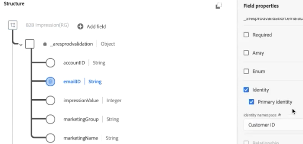

# 계정 데이터를 조회 데이터 세트로 추가

이 B2B 사용 사례는 계정 데이터를 개인 수준 및 이벤트 수준 분석에 추가하는 방법을 보여 줍니다. 계정 데이터를 추가할 때 다음과 같은 질문에 답변할 수 있습니다.

* 이 계정과 일치하는 회사 이름은 무엇입니까?
* 이 계정에는 어떤 역할이 표시됩니까?
* 한 계정에서 특정 역할(예: IT 관리자)이 다른 계정에서 동일한 역할과 다르게 동작합니까?

계정 데이터 정보를 추가하려면 이 정보가 포함된 [조회](/help/technotes/glossary.md) 데이터 집합을 추가하고 사용합니다.

관련 단계는 다음과 같습니다.

1. Experience Platform에서 [조회 스키마를 만듭니다](#create-lookup-schema).
1. CSV 기반 계정 데이터를 수집할 수 있는 Experience Platform에서 [조회 데이터 세트를 만듭니다](#create-lookup-dataset).
1. 생성한 조회를 포함하여 Customer Journey Analytics에서 [데이터 세트를 연결에 결합](#combine-datasets-in-a-connection)합니다.
1. Customer Journey Analytics에서 [데이터 보기를 만듭니다](#create-a-data-view-from-this-connection).
1. Customer Journey Analytics의 Workspace에서 [이 데이터를 분석](#analyze-the-data-in-workspace)합니다.

>[!NOTE]
>
>조회 테이블 크기는 최대 1GB입니다.
>

## 조회 스키마 만들기

[조회](/help/technotes/glossary.md) 테이블에 대한 자체 스키마를 만들 때 해당 스키마는 사용된 데이터 세트를 올바른 설정(레코드 유형)을 사용하여 Customer Journey Analytics에서 사용할 수 있도록 합니다. 가장 좋은 방법은 [모든 조회 테이블에 다시 사용할 수 있는 사용자 지정 스키마 클래스를 만드는 것입니다](https://experienceleague.adobe.com/en/docs/experience-platform/xdm/tutorials/create-schema-ui).

## 조회 데이터 세트 만들기

스키마가 만들어지면 Experience Platform에서 해당 스키마를 기반으로 조회 데이터 세트를 만들어야 합니다. 이 조회 데이터 세트에는 계정 정보가 포함되어 있습니다. 예를 들어 회사 이름, 총 직원 수, 도메인 이름, 회사가 속한 산업, 연간 매출 등이 있습니다. 데이터에 이벤트 데이터에 사용된 개인 식별자와 일치시킬 수 있는 개인 식별자가 포함되어 있는지 확인합니다.

1. Experience Platform에서 **[!UICONTROL 데이터 관리 > 데이터 세트]**(으)로 이동합니다.
1. **[!UICONTROL + 데이터 세트 만들기]**&#x200B;를 클릭합니다.
1. **[!UICONTROL 스키마에서 데이터 세트 만들기]**&#x200B;를 클릭합니다.
1. 생성한 조회 스키마 클래스를 선택합니다.
1. **[!UICONTROL 다음]**&#x200B;을 클릭합니다.
1. 데이터 집합 이름(예: `B2B Info`)을 지정하고 설명을 제공합니다.
1. **[!UICONTROL 마침]**&#x200B;을 클릭합니다.

## 데이터 수집

[XDM 스키마에 CSV 파일 매핑](https://experienceleague.adobe.com/en/docs/experience-platform/ingestion/tutorials/map-csv/existing-schema) 방법에 대한 지침은 CSV 파일을 사용하는 경우 도움이 됩니다.

[기타 방법](https://experienceleague.adobe.com/en/docs/experience-platform/ingestion/home)도 제공되고 있습니다.

데이터를 온보딩하고 조회를 설정하는 데 조회 테이블의 크기에 따라 약 2~4시간이 소요됩니다.

## 데이터 세트를 하나의 연결로 결합

이 예에서는 3개의 데이터 세트를 하나의 Customer Journey Analytics 연결로 결합합니다.

| 데이터 세트 이름 | 설명 | Adobe Experience Platform 스키마 클래스 | 데이터 세트 세부 정보 |
| --- | --- | --- | --- |
| B2B 노출 | 계정 수준에서 클릭스트림, 이벤트 수준 데이터를 포함합니다. 예를 들어 마케팅 광고를 실행하기 위한 이메일 ID 및 해당 계정 ID와 마케팅 이름이 포함되어 있습니다. 또한 사용자당 해당 광고에 대한 노출 횟수도 포함됩니다. | XDM ExperienceEvent 스키마 클래스 기반 | `emailID`는 기본 ID로 사용되고 `Customer ID` 네임스페이스가 할당됩니다. 그 결과 Customer Journey Analytics에서 기본 **[!UICONTROL 개인 ID]**(으)로 표시됩니다.  |
| B2B 프로필 | 이 프로필 데이터 세트는 자신의 직책, 해당 계정이 속한 계정, LinkedIn 프로필 등과 같은 계정의 사용자에 대해 자세히 알려 줍니다. | XDM 개별 프로필 스키마 클래스 기반 | `emailID`을(를) 이 스키마의 기본 ID로 선택합니다. |
| B2B 정보 | 위의 &quot;조회 데이터 세트 만들기&quot;를 참조하십시오. | B2B 계정(사용자 지정 조회 스키마 클래스) | `accountID`과(와) B2B 노출 데이터 세트 간의 관계는 아래 단계에 설명된 대로 B2B 정보 데이터 세트와 Customer Journey Analytics의 B2B 노출 데이터 세트를 연결할 때 자동으로 만들어집니다.  |

데이터 세트를 결합하는 방법은 다음과 같습니다.

1. Customer Journey Analytics에서 **[!UICONTROL 연결]** 탭을 선택합니다.
1. 결합할 데이터 세트를 선택합니다.
1. B2B 정보 데이터 세트에 대해 조회 테이블에서 사용되는 키를 선택합니다(예: `personKey.sourceKey`). 그런 다음 일치 키(해당 차원)와 이벤트 데이터 세트(예: p`ersonKey.sourceKey`)에서도 선택하십시오.
1. **[!UICONTROL 다음]**&#x200B;을 클릭합니다.
1. 연결의 이름을 지정하고 연결에 대해 설명하고 [이러한 지침](/help/connections/create-connection.md)에 따라 구성합니다.
1. **[!UICONTROL 저장]**&#x200B;을 클릭합니다.

## 이 연결에서 데이터 보기 만들기

[데이터 보기 만들기](/help/data-views/create-dataview.md)에 대한 지침을 따르십시오.

* 데이터 세트에서 필요한 모든 구성 요소(차원 및 지표)를 추가합니다. 초과 계산을 위해 중복 제거가 필요한 지표의 경우 해당 지표를 적절하게 구성합니다([지표 중복 제거 구성 요소 설정](/help/data-views/component-settings/metric-deduplication.md) 참조). 이러한 지표의 예로는 직원 수 또는 매출이 있습니다.

## Workspace에서 데이터 분석

이제 3개 데이터 세트의 데이터를 기반으로 작업 영역 프로젝트를 만들 수 있습니다.

예를 들어 소개에 제시된 질문에 대한 답변을 찾을 수 있습니다.

* emailID를 accountID로 분류하여 이메일 ID가 속한 회사를 파악합니다.
* 몇 명의 직원이 특정 계정 ID에 매핑됩니까?
* 계정 ID는 어떤 업계에 속합니까?

>[!MORELIKETHIS]
>
>자세한 내용은 [B2B 프로젝트 예제](example.md)를 참조하십시오.

