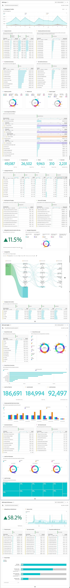

# 예제 B2B 프로젝트

이 문서에서는 Customer Journey Analytics의 B2B 데이터를 설정, 구성 및 보고하는 방법을 예를 통해 설명합니다.

## 연결

Experience Platform의 모든 관련 B2B 데이터 세트를 포함하도록 연결을 정의합니다. 여기에는 Experience Platform 내의 일반적인 B2B 설정에서 필요한 중요한 조회 데이터 세트가 포함됩니다. 다음을 참조하십시오 [계정 수준 데이터를 조회 데이터 세트로 추가](b2b.md) 추가 정보.

연결에 추가할 수 있는 데이터 세트:

| 데이터 세트 | 스키마 | 스키마 유형 | 기본 클래스 | 설명 |
|---|---|---|---|---|
| B2B 활동 데이터 세트 | B2B 활동 스키마 | 이벤트 | XDM ExperienceEvent | ExperienceEvent는 시점 및 관련된 개인의 ID를 포함하여 발생한 일에 대한 팩트 레코드입니다. ExperienceEvents는 명시적(직접 관찰 가능한 인간 동작) 또는 암시적(직접 인간 동작 없이 발생)일 수 있으며 집계나 해석 없이 기록됩니다. 지정된 시간 내에 발생하는 변경 사항을 관찰 및 분석하고, 트렌드를 추적하기 위해 여러 시간 창을 비교할 수 있으므로 시간 도메인 분석에 중요합니다. |
| B2B 개인 데이터 세트 | B2B 개인 스키마 | 프로필 | XDM 개별 프로필 | XDM 개인 프로필은 식별된 개인과 부분적으로 식별된 개인 모두의 속성 및 관심사의 단일 표현을 형성한다. 식별이 불가능한 프로필에는 브라우저 쿠키와 같은 익명 동작 신호만 포함될 수 있으며 식별이 잘되는 프로필에는 이름, 생년월일, 위치 및 이메일 주소와 같은 자세한 개인 정보가 포함될 수 있습니다. 프로필이 성장하면 개인의 개인 정보, 식별 정보, 연락처 세부 정보 및 커뮤니케이션 환경 설정을 저장하는 강력한 저장소가 됩니다. |
| B2B 캠페인 멤버 데이터 세트 | B2B 캠페인 멤버 스키마 | 조회 | XDM 비즈니스 캠페인 멤버 | XDM 비즈니스 캠페인 멤버는 비즈니스 캠페인과 연결된 연락처 또는 잠재 고객을 설명하는 표준 경험 데이터 모델(XDM) 클래스입니다. |
| B2B 계정 데이터 세트 | B2B 계정 스키마 | 조회 | XDM 비즈니스 계정 | XDM 비즈니스 계정은 비즈니스 계정의 최소 필요 속성을 캡처하는 표준 경험 데이터 모델(XDM) 클래스입니다. |
| B2B 계정 사용자 관계 데이터 세트 | B2B 계정 사용자 관계 스키마 | 조회 | XDM 비즈니스 계정 사용자 관계 | XDM 비즈니스 계정 사용자 관계는 비즈니스 계정과 연결된 사용자의 최소 필요 속성을 캡처하는 표준 경험 데이터 모델(XDM) 클래스입니다. |
| B2B 영업 기회 데이터 세트 | B2B 영업 기회 스키마 | 조회 | XDM 비즈니스 영업 기회 | XDM 비즈니스 영업 기회는 비즈니스 영업 기회의 최소 필요 속성을 캡처하는 표준 경험 데이터 모델(XDM) 클래스입니다. |
| B2B 영업 기회 사용자 관계 데이터 세트 | B2B 영업 기회 사용자 관계 스키마 | 조회 | XDM 비즈니스 영업 기회 사용자 관계 | XDM 비즈니스 영업 기회 사용자 관계는 비즈니스 영업 기회와 연계된 사용자의 최소 필요 속성을 캡처하는 표준 경험 데이터 모델(XDM) 클래스입니다. |
| B2B 캠페인 데이터 세트 | B2B 캠페인 스키마 | 조회 | XDM 비즈니스 캠페인 | XDM 비즈니스 캠페인은 비즈니스 캠페인의 최소 필요 속성을 캡처하는 표준 경험 데이터 모델(XDM) 클래스입니다. |
| B2B 마케팅 목록 데이터 세트 | B2B 마케팅 목록 스키마 | 조회 | XDM 마케팅 목록 | XDM 비즈니스 마케팅 목록은 마케팅 목록의 최소 필요 속성을 캡처하는 표준 경험 데이터 모델(XDM) 클래스입니다. 마케팅 목록을 사용하면 제품을 구매할 가능성이 가장 높은 잠재 고객을 우선 지정할 수 있습니다. |
| B2B 마케팅 목록 구성원 데이터 세트 | B2B 마케팅 목록 구성원 스키마 | 조회 | XDM 마케팅 목록 멤버 | XDM 비즈니스 마케팅 목록 멤버는 마케팅 목록과 연계된 멤버, 사용자 또는 연락처를 설명하는 표준 경험 데이터 모델(XDM) 클래스입니다. |

조회 스키마, 프로필 스키마 및 이벤트 스키마 간의 관계는 Experience Platform 내의 B2B 설정에서 정의됩니다. 에서 스키마 보기 [Real-time Customer Data Platform 에디션](https://experienceleague.adobe.com/docs/experience-platform/rtcdp/schemas/b2b.html) 및 [Real-time Customer Data Platform B2B 에디션에서 두 스키마 간의 다대일 관계 정의](https://experienceleague.adobe.com/docs/experience-platform/xdm/tutorials/relationship-b2b.html) 을 참조하십시오.

연결에 추가하는 각 조회 데이터 세트에 대해 데이터 세트 편집 대화 상자에서 키 및 일치 키를 사용하여 이벤트 데이터 세트에 대한 관계를 명시적으로 정의해야 합니다. 예:

아래 표는 의 예제 개요를 제공합니다. [!UICONTROL 개인 ID], [!UICONTROL 키], 및 [!UICONTROL 일치하는 키] 각 데이터 세트에 대한 값입니다.

| 데이터 세트 | 개인 ID | 키 | 일치하는 키(이벤트 데이터 세트 내) |
|---|---|---|---|
| B2B 활동 데이터 세트 | `personKey.sourceKey` | | |
| B2B 개인 데이터 세트 | `b2b.personKey.sourceKey` | | |
| B2B 계정 데이터 세트 | | `accountKey.sourceKey` | *_organizationID*`.interactions.accountKey.sourceKey` |
| B2B 영업 기회 데이터 세트 | | `accountKey.sourceKey` | *_organizationID*`.interactions.accountKey.sourceKey` |
| B2B 캠페인 데이터 세트 | | `campaignKey.sourceKey` | *_organizationID*`.interactions.campaignKey.sourceKey` |
| B2B 마케팅 목록 데이터 세트 | | `listKey.sourceKey` | `listOperations.listKey.sourceKey` |

{style="table-layout:auto"}

테이블에서 *_organizationID*`.interaction.*`&#x200B;는 B2B 계정 및 B2B 영업 기회 스키마와의 관계를 정의하기 위해 B2B 활동 스키마에 추가한 사용자 정의 필드 그룹을 나타냅니다. 다음 `listOperations.listKey.sourceKey` 는 특정 목록에 개인이 추가되었을 때 추적할 B2B 활동 스키마에 추가된 목록 추가 필드 그룹을 나타냅니다.

다음을 참조하십시오 [데이터 세트 추가 및 구성](../../connections/create-connection.md) 데이터 세트에 대한 설정을 구성하는 방법에 대한 자세한 내용을 참조하십시오.

## 데이터 보기

Workspace 프로젝트를 작성할 때 관련 B2B 차원 및 지표에 액세스하려면 그에 따라 데이터 보기를 정의해야 합니다.

이 섹션에서는 을(를) 정의할 때 포함할 차원 및 지표에 대한 권장 사항과 제안 사항을 제공합니다. [구성 요소](../../data-views/create-dataview.md#components) 데이터 보기의 B2B 데이터 세트용.

각 구성 요소에 대해 이름, 스키마 유형, 스키마 경로 및 (해당되는 경우) 구성에 대한 세부 정보가 제공됩니다.

+++ B2B 활동 데이터 세트

### 지표

| 구성 요소 이름 | 스키마 데이터 유형 | 스키마 경로 | 구성 |
|---|---|---|---|
| Campaign에 추가 | 문자열 | `eventType` | **[!UICONTROL 포함/제외 값 설정]** **[!UICONTROL 대소문자 구분]** 일치:**[!UICONTROL &#x200B;모든 기준이 충족되는 경우]** 기준: **[!UICONTROL 다음과 같음]** `leadOperation.addToCampaign` |
| 영업 기회에 추가 | 문자열 | `eventType` | **[!UICONTROL 포함/제외 값 설정]** **[!UICONTROL 대소문자 구분]** 일치:**[!UICONTROL &#x200B;모든 기준이 충족되는 경우]** 기준: **[!UICONTROL 다음과 같음]** `opportunityEvent.addToOpportunity` |
| 애플리케이션 종료됨 | 문자열 | `eventType` | **[!UICONTROL 포함/제외 값 설정]** **[!UICONTROL 대소문자 구분]** 일치:**[!UICONTROL &#x200B;모든 기준이 충족되는 경우]** 기준: **[!UICONTROL 다음과 같음]** `application.close` |
| 애플리케이션 실행 | 문자열 | `eventType` | **[!UICONTROL 포함/제외 값 설정]** **[!UICONTROL 대소문자 구분]** 일치:**[!UICONTROL &#x200B;모든 기준이 충족되는 경우]** 기준: **[!UICONTROL 다음과 같음]** `application.launch` |
| 캠페인 스트림 | 문자열 | `eventType` | **[!UICONTROL 포함/제외 값 설정]** **[!UICONTROL 대소문자 구분]** 일치:**[!UICONTROL &#x200B;모든 기준이 충족되는 경우]** 기준: **[!UICONTROL 다음과 같음]** ` leadOperation.changeCampaignStream` |
| 체크아웃 | 문자열 | `eventType` | **[!UICONTROL 포함/제외 값 설정]** **[!UICONTROL 대소문자 구분]** 일치:**[!UICONTROL &#x200B;모든 기준이 충족되는 경우]** 기준: **[!UICONTROL 다음과 같음]** `commerce.checkouts` |
| 잠재 고객 전환 | 문자열 | `eventType` | **[!UICONTROL 포함/제외 값 설정]** **[!UICONTROL 대소문자 구분]** 일치:**[!UICONTROL &#x200B;모든 기준이 충족되는 경우]** 기준: **[!UICONTROL 다음과 같음]** `leadOperation.convertLead` |
| 이메일 클릭됨 | 문자열 | `eventType` | **[!UICONTROL 포함/제외 값 설정]** **[!UICONTROL 대소문자 구분]** 일치:**[!UICONTROL &#x200B;모든 기준이 충족되는 경우]** 기준: **[!UICONTROL 다음과 같음]** `directMarketing.emailClicked` |
| 이메일 전달됨 | 문자열 | `eventType` | **[!UICONTROL 포함/제외 값 설정]** **[!UICONTROL 대소문자 구분]** 일치:**[!UICONTROL &#x200B;모든 기준이 충족되는 경우]** 기준: **[!UICONTROL 다음과 같음]** `directMarketing.emailDelivered` |
| 이메일 열림 | 문자열 | `eventType` | **[!UICONTROL 포함/제외 값 설정]** **[!UICONTROL 대소문자 구분]** 일치:**[!UICONTROL &#x200B;모든 기준이 충족되는 경우]** 기준: **[!UICONTROL 다음과 같음]** `directMarketing.emailOpened` |
| 이메일 전송됨 | 문자열 | eventType | **[!UICONTROL 포함/제외 값 설정]** **[!UICONTROL 대소문자 구분]** 일치:**[!UICONTROL &#x200B;모든 기준이 충족되는 경우]** 기준: **[!UICONTROL 다음과 같음]** `directMarketing.emailSent` |
| 이메일 구독 취소됨 | 문자열 | `eventType` | **[!UICONTROL 포함/제외 값 설정]** **[!UICONTROL 대소문자 구분]** 일치:**[!UICONTROL &#x200B;모든 기준이 충족되는 경우]** 기준: **[!UICONTROL 다음과 같음]** `directMarketing.emailUnsubscribed` |
| 작성된 양식 | 문자열 | `eventType` | **[!UICONTROL 포함/제외 값 설정]** **[!UICONTROL 대소문자 구분]** 일치:**[!UICONTROL &#x200B;모든 기준이 충족되는 경우]** 기준: **[!UICONTROL 다음과 같음]** `web.formFilledOut` |
| 양식 시작됨 | 문자열 | `web.fillOutForm.webFormName` | |
| 리드 | 문자열 | eventType | **[!UICONTROL 포함/제외 값 설정]** **[!UICONTROL 대소문자 구분]** 일치:**[!UICONTROL &#x200B;모든 기준이 충족되는 경우]** 기준: **[!UICONTROL 다음과 같음]** `leadOperation.newLead` |
| 영업 기회 업데이트됨 | 문자열 | `eventType` | **[!UICONTROL 포함/제외 값 설정]** **[!UICONTROL 대소문자 구분]** 일치:**[!UICONTROL &#x200B;모든 기준이 충족되는 경우]** 기준: **[!UICONTROL 다음과 같음]** `opportunityEvent.opportunityUpdated` |
| 가격 | 이중 | *_organizationID*`.interactions.products.price` |  |
| 우선 순위 | 정수 | `leadOperation.changeScore.priority` |  |
| 프로덕션 목록 추가 | 문자열 | `eventType` | **[!UICONTROL 포함/제외 값 설정]** **[!UICONTROL 대소문자 구분]** 일치:**[!UICONTROL &#x200B;모든 기준이 충족되는 경우]** 기준: **[!UICONTROL 다음과 같음]** `commerce.productListAdds.value` |
| 프로덕션 목록 열기 | 문자열 | `eventType` | **[!UICONTROL 포함/제외 값 설정]** **[!UICONTROL 대소문자 구분]** 일치:**[!UICONTROL &#x200B;모든 기준이 충족되는 경우]** 기준: **[!UICONTROL 다음과 같음]** `commerce.productListOpens.value` |
| Prod 뷰 | 문자열 | `eventType` | **[!UICONTROL 포함/제외 값 설정]** **[!UICONTROL 대소문자 구분]** 일치:**[!UICONTROL &#x200B;모든 기준이 충족되는 경우]** 기준: **[!UICONTROL 다음과 같음]** `commerce.productViews.value` |
| 구매 | 문자열 | `eventType` | **[!UICONTROL 포함/제외 값 설정]** **[!UICONTROL 대소문자 구분]** 일치:**[!UICONTROL &#x200B;모든 기준이 충족되는 경우]** 기준: **[!UICONTROL 다음과 같음]** `commerce.purchases.value` |
| 영업 기회에서 제거 | 문자열 | `eventType` | **[!UICONTROL 포함/제외 값 설정]** **[!UICONTROL 대소문자 구분]** 일치:**[!UICONTROL &#x200B;모든 기준이 충족되는 경우]** 기준: **[!UICONTROL 다음과 같음]** `opportunityEvent.removeFromOpportunity` |
| 나중을 위해 저장 | 문자열 | eventType | **[!UICONTROL 포함/제외 값 설정]** **[!UICONTROL 대소문자 구분]** 일치:**[!UICONTROL &#x200B;모든 기준이 충족되는 경우]** 기준: **[!UICONTROL 다음과 같음]** `commerce.productViews.value` |

{style="table-layout:auto"}

### 차원

| 구성 요소 이름 | 스키마 데이터 유형 | 스키마 경로 | 구성 |
|---|---|---|---|
| 계정 키(소스 키) | 문자열 | *_organizationID*`.Interactions.accountKey.sourceKey` | |
| 전환된 상태 | 문자열 | `leadOperation.convertLead.convertedStatus` | |
| 이벤트 유형 | 문자열 | `eventType` | |
| 양식 이름 | 문자열 | `leadOperation.newLead.formName` | |
| 식별자 | 문자열 | `_id` | |
| 알림이 전송됨 | 부울 | `leadOperation.convertLead.isSentNotificationEmail` | |
| 키워드 | 문자열 | `search.keywords` | |
| 목록 ID | 문자열 | `listOperations.listID` | |
| 목록 이름 | 문자열 | `leadOperation.newLead.listName` | |
| 페이지 이름 | 문자열 | `web.webPageDetails.name` | |
| 개인 키(소스 키) | 문자열 | `personKey.sourceKey` | |
| 제작자 | 문자열 | 제작자 | |
| 제품 이름 | 문자열 | *_organizationID*`.Interactions.products.name` | |
| 역할 | 문자열 | `opportunityEvent.role` | |
| 타임스탬프 | 날짜-시간 | `timestamp` | 날짜-시간 형식: **[!UICONTROL 일]** |
| URL | 문자열 | `web.webPageDetails.URL` | |
| 웹 양식 이름 | 문자열 | `web.fillOutForm.webFormName` | |
| 제품 URL | 문자열 | *_organizationID*`.Interactions.products.url` | |

{style="table-layout:auto"}

+++

+++ B2B 개인 데이터 세트

### 지표

이 데이터 세트의 일부로 정의된 지표 구성 요소가 없습니다.

### 차원

| 구성 요소 이름 | 스키마 데이터 유형 | 스키마 경로 | 구성 |
|---|---|---|---|
| 마지막 활동 날짜 | 날짜-시간 | `extSourceSystemAudit.lastActivityDate` | 날짜-시간 형식: **[!UICONTROL 일]** |
| 개인 ID | 문자열 | `personID` | |

{style="table-layout:auto"}

+++

+++  B2B 영업 기회 데이터 세트

### 지표

| 구성 요소 이름 | 스키마 데이터 유형 | 스키마 경로 | 구성 |
|---|---|---|---|
| 예상 수익 | 이중 | `expectedRevenue.amount` | 동작: **[!UICONTROL 값 계산]** |
| 영업 기회 금액 | 이중 | `opportunityAmount.amount` | 동작: **[!UICONTROL 값 계산]** |
| 영업 기회 단계 - 마감된 장부 | 문자열 | `opportunityStage` | **[!UICONTROL 포함/제외 값 설정]** **[!UICONTROL 대소문자 구분]** 일치:**[!UICONTROL &#x200B;모든 기준이 충족되는 경우]** 기준: **[!UICONTROL 다음과 같음]** `Closed - Booked` |
| 영업 기회 단계 - 잠재 고객 | 문자열 | `opportunityStage` | **[!UICONTROL 포함/제외 값 설정]** **[!UICONTROL 대소문자 구분]** 일치:**[!UICONTROL &#x200B;모든 기준이 충족되는 경우]** 기준: **[!UICONTROL 다음과 같음]** `Prospect` |
| 영업 기회 단계 - 검증 | 문자열 | `opportunityStage` | **[!UICONTROL 포함/제외 값 설정]** **[!UICONTROL 대소문자 구분]** 일치:**[!UICONTROL &#x200B;모든 기준이 충족되는 경우]** 기준: **[!UICONTROL 다음과 같음]** `Opportunity Qualification` |
| 영업 기회 단계 - 솔루션 정의 | 문자열 | `opportunityStage` | **[!UICONTROL 포함/제외 값 설정]** **[!UICONTROL 대소문자 구분]** 일치:**[!UICONTROL &#x200B;모든 기준이 충족되는 경우]** 기준: **[!UICONTROL 다음과 같음]** `Solution Definition and Validation` |

{style="table-layout:auto"}

### 차원

| 구성 요소 이름 | 스키마 데이터 유형 | 스키마 경로 | 구성 |
|---|---|---|---|
| 마감 플래그 | 부울 | `isClosed` | |
| 회사 ID | 문자열 | `opportunityID` | |
| 예측 범주 | 문자열 | `forecastCategoryName` | |
| 마지막 활동 날짜 | 날짜-시간 | `lastActivityDate` | 날짜-시간 형식: **[!UICONTROL 일]** |
| 잠재 고객 소스 | 문자열 | `leadSource` | |
| 영업 기회 이름 | 문자열 | `opportunityName` | |
| 영업 기회 상태 | 문자열 | `opportunityStage` | |
| 성공한 플래그 | 부울 | `isWon` | |

{style="table-layout:auto"}

+++

+++ B2B 캠페인 데이터 세트

### 지표

| 구성 요소 이름 | 스키마 데이터 유형 | 스키마 경로 | 구성 |
|---|---|---|---|
| 캠페인 비용 | 이중 | `actualCost.amount` | |

{style="table-layout:auto"}

### 차원

| 구성 요소 이름 | 스키마 데이터 유형 | 스키마 경로 | 구성 |
|---|---|---|---|
| 캠페인 ID | 문자열 | `campaignID` | |
| 캠페인 이름 | 문자열 | `campaignName` | |
| 캠페인 시작 날짜 | 날짜-시간 | `campaignStartDate` | 날짜-시간 형식: **[!UICONTROL 일]** |
| 채널 이름 | 문자열 | `channelName` | |
| 상위 캠페인 ID | 문자열 | `parentCampaignID` | |

{style="table-layout:auto"}

+++

+++ B2B 계정 데이터 세트

### 지표

| 구성 요소 이름 | 스키마 데이터 유형 | 스키마 경로 | 구성 |
|---|---|---|---|
| 연간 수익 | 이중 | `accountOrganization.annualRevenue.amount` | |
| 직원 수 | 정수 | `accountOrganization.numberOfEmployees` | |

{style="table-layout:auto"}

### 차원

| 구성 요소 이름 | 스키마 데이터 유형 | 스키마 경로 | 구성 |
|---|---|---|---|
| 계정 식별자 | 문자열 | `accountID` | |
| 계정 유형 | 문자열 | `accountType` | |
| 구/군/시 | 문자열 | `accountBillingAddress.city` | |
| 국가 | 문자열 | `accountBillingAddress.country` | |
| 업종 | 문자열 | `accountOrganization.industry` | |
| 지역 | 문자열 | `accountBillingAddress.region` | |
| 소스 ID | 문자열 | `accountKey.sourceID` | |
| 소스 인스턴스 ID | 문자열 | `accountKey.sourceInstanceID` | |
| 소스 키 | 문자열 | `accountKey.sourceKey` | |
| 소스 유형 | 문자열 | `accountKey.sourceType` | |

{style="table-layout:auto"}

+++

+++ B2B 캠페인 멤버 데이터 세트

### 지표

| 구성 요소 이름 | 스키마 데이터 유형 | 스키마 경로 | 구성 |
|---|---|---|---|
| 바운스됨 | 긺 | *_organizationID*`.campaignBounced` | 동작: **[!UICONTROL 값 계산]** |
| 클릭됨 | 긺 | *_organizationID*`.campaignClicked` | 동작: **[!UICONTROL 값 계산]** |
| 열림 | 긺 | *_organizationID*`.CampaignOpened` | 동작: **[!UICONTROL 값 계산]** |
| 보냄 | 긺 | *_organizationID*`.campaignSent` | 동작: **[!UICONTROL 값 계산]** |
| 구독 등록됨 | 긺 | *_organizationID*`.campaignSubscribed` | 동작: **[!UICONTROL 값 계산]** |
| 웨비나 등록 | 긺 | *_organizationID*`.Registrations` | 동작: **[!UICONTROL 값 계산]** |

{style="table-layout:auto"}

### 차원

| 구성 요소 이름 | 스키마 데이터 유형 | 스키마 경로 | 구성 |
|---|---|---|---|
| 캠페인 ID | 문자열 | `campaignID` | |
| 캠페인 멤버 ID | 문자열 | `campaignMemberID` | |
| 캠페인 멤버 상태 | 문자열 | `memberStatus` | |
| 캠페인 멤버 상태 사유 | 문자열 | `memberStatusReason` | |
| 만든 날짜 | 날짜-시간 | `extSourceSystemAudit.createdDate` | 날짜-시간 형식: **[!UICONTROL 일]** |
| 첫 번째 응답일 | 문자열 | `firstRespondedDate` | 날짜-시간 형식: **[!UICONTROL 일]** |
| 성공 지표에 도달 | 부울 | `hasReachedSuccess` | |
| 이(가) 응답함 | 부울 | `hasResponded` | |
| 마지막 상태 | 문자열 | `lastStatus` | |
| 마지막으로 업데이트한 날짜 | 날짜-시간 | `extSourceSystemAudit.lastUpdatedDate` | 날짜-시간 형식: **[!UICONTROL 일]** |
| 멤버십 등록 날짜 | 날짜-시간 | `membershipDate` | 날짜-시간 형식: **[!UICONTROL 일]** |
| 케이던스 육성 | 문자열 | `nurtureCadence` | |
| 육성 추적 이름 | 문자열 | `nurtureTrackName` | |
| 개인 ID | 문자열 | `personID` | |
| 성공 일자 도달 | 날짜-시간 | `reachedSuccessDate` | 날짜-시간 형식: **[!UICONTROL 일]** |
| 웨비나 등록 ID | 문자열 | `webinarRegistrationID` | |
| 웨비나 등록 URL | 문자열 | `webinarConfirmationUrl` | |
| isExhausted | 부울 | isExhausted | |

{style="table-layout:auto"}

+++

<!--
### B2B Marketing List Member dataset

The B2B Marketing List Member dataset contains member of marketing lists.

-->

## 작업 영역

구성 요소가 올바르게 정의되면 이제 작업 공간 프로젝트에서 특정 B2B 시각화를 작성할 수 있습니다.

다음은 위에서 설명한 연결 및 데이터 보기에 의존하는 예제 프로젝트입니다. 자세한 내용은 각 시각화에 대한 설명 을 참조하십시오.

+++ 예제 프로젝트

+++
