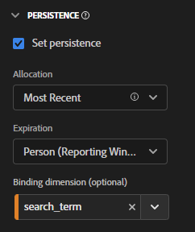

# CJA에서 결합 차원 및 지표 사용

Customer Journey Analytics는 설정된 히트 이후에 차원 값이 유지하는 몇 가지 방법을 제공합니다. Adobe가 제공하는 지속성 방법 중 하나는 바인딩이라고 합니다. 이전 버전의 Adobe Analytics에서는 이 개념을 머천다이징이라고 했습니다.

최상위 이벤트 데이터로 바인딩 차원을 사용할 수 있지만 이 개념은 [개체 배열](object-arrays.md)로 작업할 때 가장 적합합니다. 해당 이벤트의 모든 속성에 차원을 적용하지 않고 개체 배열의 한 부분에 차원을 지정할 수 있습니다. 예를 들어 검색어를 전체 이벤트에 바인딩하지 않고 장바구니 개체 배열의 한 제품에 검색어를 지정할 수 있습니다.

## 예제 1: 바인딩 차원을 사용하여 추가 제품 속성을 구매와 연결

개체 배열 내의 차원 항목을 다른 차원에 바인딩할 수 있습니다. 바인딩된 차원 항목이 표시되면 CJA는 바인딩된 차원을 호출하여 이벤트에 포함합니다. 다음 고객 여정을 고려하십시오.

1. 방문자가 세탁기의 제품 페이지를 봅니다.

   ```json
   {
       "PersonID": "1",
       "product": [
           {
               "name": "Washing Machine 2000",
               "color": "white",
               "type": "front loader",
           },
       ],
       "timestamp": 1534219229
   }
   ```

1. 그런 다음 방문자는 건조기의 제품 페이지를 봅니다.

   ```json
   {
       "PersonID": "1",
       "product": [
           {
               "name": "Dryer 2000",
               "color": "neon orange",
           },
       ],
       "timestamp": 1534219502
   }
   ```

1. 궁극적으로 방문자는 구매를 합니다. 각 제품의 색상은 구매 이벤트에 포함되지 않았습니다.

   ```json
   {
       "PersonID": "1",
       "orders": 1,
       "product": [
           {
               "name": "Washing Machine 2000",
               "price": 1600,
           },
           {
               "name": "Dryer 2000",
               "price": 499
           }
       ],
       "timestamp": 1534219768
   }
   ```

바인딩 차원 없이 색상별로 매출을 확인하려는 경우 차원 `product.color`가 지속되며 건조기 색상에 대한 크레딧이 잘못 부여됩니다.

| product.color | 매출 |
| --- | --- |
| 네온 오렌지 | 2099 |

데이터 보기 관리자로 이동하여 제품 색상을 제품 이름에 바인딩할 수 있습니다.


이 지속성 모델을 설정하면 CJA에서는 제품 색상이 설정될 때마다 제품 이름을 기억합니다. 이 방문자의 후속 이벤트에서 동일한 제품 이름을 인식하면 제품 색상도 가져옵니다. 제품 색상을 제품 이름에 바인딩할 때 동일한 데이터는 다음과 유사하게 표시됩니다.

| product.color | 매출 |
| --- | --- |
| 흰색 | 1600 |
| 네온 오렌지 | 499 |

## 예제 2: 바인딩 지표를 사용하여 검색어를 제품 구매와 연결

Adobe Analytics에서 가장 일반적인 머천다이징 방법 중 하나는 검색어를 제품에 바인딩하여 각 검색어가 해당 제품에 대한 크레딧을 얻도록 하는 것입니다. 다음 고객 여정을 고려하십시오.

1. 방문자가 사이트에 와서 “복싱 글러브”를 검색합니다. 검색 지표는 1씩 증가하며 상위 3개의 검색 결과가 표시됩니다.

   ```json
   {
       "PersonID": "1",
       "page_name": "Search results",
       "search": "1",
       "search_term": "boxing gloves",
       "product": [
           {
               "name": "Beginner gloves",
           },
           {
               "name": "Tier 3 gloves",
           },
           {
               "name": "Professional gloves",
           }
       ]
   }
   ```

2. 마음에 드는 글러브를 찾아 장바구니에 추가합니다.

   ```json
   {
       "PersonID": "1",
       "page_name": "Shopping cart",
       "cart_add": "1",
       "product": [
           {
               "name": "Tier 3 gloves",
           }
       ]
   }
   ```

3. 그런 다음 방문자는 “테니스 라켓”을 검색합니다. 검색 지표는 1씩 증가하며 상위 3개의 검색 결과가 표시됩니다.

   ```json
   {
       "PersonID": "1",
       "page_name": "Search results",
       "search": "1",
       "search_term": "tennis racket",
       "product": [
           {
               "name": "Shock absorb racket",
           },
           {
               "name": "Women's open racket",
           },
           {
               "name": "Extreme racket",
           }
       ]
   }
   ```

4. 마음에 드는 라켓을 찾아 장바구니에 담습니다.

   ```json
   {
       "PersonID": "1",
       "page_name": "Shopping cart",
       "cart_add": "1",
       "product": [
           {
               "name": "Tier 3 gloves",
           },
           {
               "name": "Shock absorb racket",
           }
       ]
   }
   ```

5. 방문자는 세 번째로 “신발”을 검색합니다. 검색 지표는 1씩 증가하며 상위 3개의 검색 결과가 표시됩니다.

   ```json
   {
       "PersonID": "1",
       "page_name": "Search results",
       "search": "1",
       "search_term": "shoes",
       "product": [
           {
               "name": "Men's walking shoes",
           },
           {
               "name": "Tennis shoes",
           },
           {
               "name": "Skate shoes",
           }
       ]
   }
   ```

6. 마음에 드는 신발을 찾아 장바구니에 추가합니다.

   ```json
   {
       "PersonID": "1",
       "page_name": "Shopping cart",
       "cart_add": "1",
       "product": [
           {
               "name": "Tier 3 gloves",
           },
           {
               "name": "Shock absorb racket",
           },
           {
               "name": "Skate shoes",
           }
       ]
   }
   ```

7. 방문자는 체크아웃 프로세스를 거쳐 이 세 가지 물건을 구매합니다.

   ```json
   {
       "PersonID": "1",
       "page_name": "Thank you for your purchase",
       "purchase": "1",
       "product": [
           {
               "name": "Tier 3 gloves",
               "price": "89.99"
           },
           {
               "name": "Shock absorb racket",
               "price": "34.99"
           },
           {
               "name": "Skate shoes",
               "price": "79.99"
           }
       ]
   }
   ```

검색어와 함께 결합 차원을 포함하지 않는 할당 모델을 사용하는 경우 세 제품 모두 매출액을 단일 검색어에만 기여합니다. 예를 들어 검색어 차원과 함께 원래 할당을 사용한 경우:

| search_term | 매출 |
| --- | --- |
| 복싱 글러브 | $204.97 |

검색어 차원과 함께 가장 최근 할당을 사용한 경우 세 제품 모두 매출을 단일 검색어에 기여합니다.

| search_term | 매출 |
| --- | --- |
| 신발 | US$204.97 |

이 사례에는 한 명의 방문자만 포함되어 있지만 다른 항목을 검색하는 많은 방문자는 검색어를 다른 제품에 잘못 지정할 수 있으므로 실제로 최상의 검색 결과가 무엇인지 판단하기 어렵습니다.

검색 용어가 매출에 올바로 기여하도록 검색 지표가 있을 때마다 제품 이름에 검색어를 바인딩할 수 있습니다.


Analysis Workspace에서 결과 보고서는 다음과 유사합니다.

| search_term | 매출 |
| --- | --- |
| 복싱 글러브 | $89.99 |
| 테니스 라켓 | $34.99 |
| 신발 | $79.99 |

CJA에서는 선택한 차원과 결합 차원 간의 관계를 자동으로 감지합니다. 선택한 차원이 더 높은 수준에 있는 동안 바인딩 차원이 개체 배열에 있는 경우 바인딩 지표가 필요합니다. 바인딩 지표는 바인딩 차원의 트리거 역할을 하므로 바인딩 지표가 있는 이벤트에만 바인딩됩니다. 위의 예에서 검색 결과 페이지에는 항상 검색어 차원과 검색 지표가 포함되어 있습니다.

검색어 차원을 이 지속성 모델로 설정하면 다음 논리가 실행됩니다.

* 검색어 차원이 설정되면 제품 이름이 있는지 확인합니다.
* 제품 이름이 없으면 아무 것도 하지 마십시오.
* 제품 이름이 있으면 검색 지표가 있는지 확인합니다.
* 검색 지표가 없으면 아무 것도 하지 마십시오.
* 검색 지표가 있는 경우 해당 이벤트의 모든 제품 이름에 검색어를 바인딩합니다. 또한 해당 이벤트에 대한 제품 이름과 동일한 수준으로 자체 복사됩니다. 이 예제에서는 product.search_term으로 처리됩니다.
* 후속 이벤트에서 동일한 제품 이름이 표시되면 해당 이벤트에도 바인딩된 검색어가 전달됩니다.

## 예제 3: 사용자 프로필에 비디오 검색어 바인딩

프로필 간의 지속성을 완전히 분리하기 위해 사용자 프로필에 검색어를 바인딩할 수 있습니다. 예를 들어 조직은 중요한 계정에 여러 프로필이 있을 수 있는 스트리밍 서비스를 실행합니다. 방문자에게 하위 프로필과 성인 프로필이 있습니다.

1. 계정은 하위 프로필 아래에 로그인하고 어린이 TV 프로그램을 검색합니다. 다음 사항에 유의하십시오. `"ProfileID"` is `2` 하위 프로파일을 나타냅니다.

   ```json
   {
       "PersonID": "7078",
       "ProfileID": "2",
       "Searches": "1",
       "search_term": "kids show"
   }
   ```

1. 그들은 &quot;오렌지&quot; 쇼를 찾아 아이들이 볼 수 있도록 그것을 재생합니다.

   ```json
   {
       "PersonID": "7078",
       "ProfileID": "2",
       "ShowName": "Orangey",
       "VideoStarts": "1"
   }
   ```

1. 그날 밤 늦게, 부모는 프로필로 전환하고 볼 성인 콘텐츠를 검색합니다. 다음 사항에 유의하십시오. `"ProfileID"` is `1` 성인 프로필을 나타냅니다. 두 프로필 모두 동일한 계정에 속하며, 동일하게 표시됩니다 `"PersonID"`.

   ```json
   {
       "PersonID": "7078",
       "ProfileID": "1",
       "Searches": "1",
       "search_term": "grownup movie"
   }
   ```

1. &quot;Analytics After Hours&quot; 프로그램을 찾아 저녁 시간에 시청하세요.

   ```json
   {
       "PersonID": "7078",
       "ProfileID": "1",
       "ShowName": "Analytics After Hours",
       "VideoStarts": "1"
   }
   ```

1. 다음날, 그들은 그들의 아이를 위해 &quot;오렌지&quot; 쇼를 계속해요. 이미 알고 있기 때문에 굳이 검색할 필요는 없다.

   ```json
   {
       "PersonID": "7078",
       "ProfileID": "2",
       "ShowName": "Orangey",
       "VideoStarts": "1"
   }
   ```

개인 만료와 함께 가장 최근 할당을 사용하는 경우, `"grownup movie"` 검색어는 어린이 쇼의 마지막 보기에 속합니다.

| 검색어 | 비디오 시작 |
| --- | --- |
| 영화 보기 | 2 |
| 어린이 쇼 | 1 |

하지만, 만약 `search_term` to `ProfileID`로 설정하는 경우, 각 프로필의 검색은 고유한 프로필로 구분되며, 올바른 표시에 의해 검색됩니다.



Analysis Workspace은 Orangey의 두 번째 에피소드를 검색어에 올바르게 표시할 수 있습니다 `"kids show"` 다른 프로필에서 검색을 고려하지 않습니다.

| 검색어 | 비디오 시작 |
| --- | --- |
| 어린이 쇼 | 2개 |
| 영화 보기 | 1 |

## 예제 4: 소매 설정에서 찾아보기 및 검색 동작 평가

이전 이벤트에 설정된 차원에 값을 바인딩할 수 있습니다. 바인딩 차원으로 변수를 설정하면 CJA에서 지속되는 값을 고려합니다. 이 동작을 사용하지 않는 경우 바인딩 차원의 지속성 설정을 조정할 수 있습니다. 다음 예를 생각해 보십시오. `product_finding_method` 가 이벤트에 설정되어 있으면 다음 이벤트에 대한 장바구니 추가 지표에 바인딩됩니다.

1. 방문자는에서 검색을 수행합니다 `"camera"`. 이 페이지에는 설정된 제품이 없습니다.

   ```json
   {
       "search_term": "camera",
       "product_finding_method": "search"
   }
   ```

1. 좋아하는 카메라를 클릭하고 카트에 추가합니다.

   ```json
   {
       "Product": [
           {
               "name": "DSLR Camera"
           }
       ],
       "CartAdd": "1"
   }
   ```

1. 그런 다음 방문자는 검색을 수행하지 않고 남성용 벨트 카테고리로 이동합니다. 이 페이지에는 설정된 제품이 없습니다.

   ```json
   {
       "category": "Men's belts",
       "product_finding_method": "browse"
   }
   ```

1. 그들은 좋아하는 벨트를 클릭하고 그것을 장바구니에 추가합니다.

   ```json
   {
       "Product": [
           {
               "name": "Ratchet belt"
           }
       ],
       "CartAdd": "1"
   }
   ```

1. 이 두 항목은 체크아웃 프로세스를 거쳐 구매합니다.

   ```json
   {
       "Product": [
           {
               "name": "DSLR Camera",
               "price": "399.99"
           },
           {
               "name": "Ratchet belt",
               "price": "19.99"
           }
       ],
       "Purchase": "1"
   }
   ```

지속성이 바인딩 차원 없이 가장 최근 할당으로 설정된 경우 매출액의 모든 $419.98가 `browse` 검색 방법.

| 제품 검색 방법 | 수입 |
| --- | --- |
| 찾아보기 | 419.98 |

바인딩 차원 없이 원래 할당을 사용하여 지속성을 설정하면 수입의 모든 $419.98이 `search` 검색 방법.

| 제품 검색 방법 | 수입 |
| --- | --- |
| 검색 | 419.98 |

그러나 `product_finding_method` 장바구니에 추가 지표에 따라 결과 보고서는 각 제품을 올바른 검색 방법에 기여합니다.

| 제품 검색 방법 | 수입 |
| --- | --- |
| 검색 | 399.99 |
| 찾아보기 | 19.99 |
