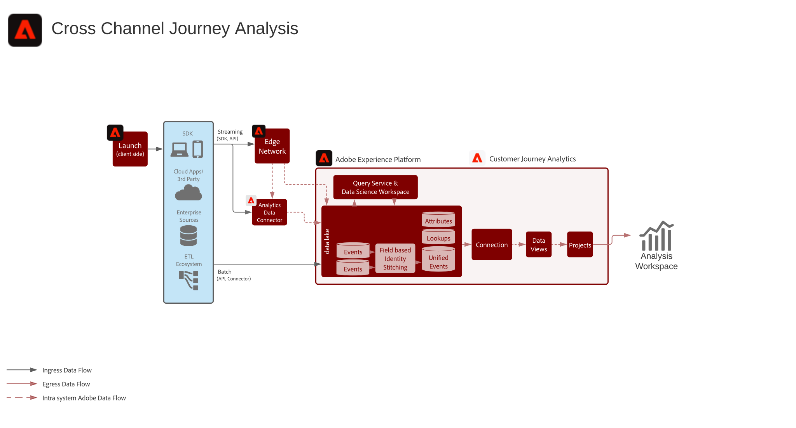

# 크로스채널 Journey Analysis

여러 웹, 모바일 및 오프라인 속성에서 데이터를 통합하여 다양한 채널에 고객 행동에 대한 통합된 단일 뷰를 제공합니다. 예를 들어 이 통합된 뷰를 사용하여 데스크탑 및 모바일에서 고객 상호 작용을 분석하고, 고객 행동을 이해하고 통찰력을 추출하여 디지털 고객 경험을 최적화할 수 있습니다. 또한 지원 상호 작용 및 매장 구매 등 디지털 및 오프라인 채널을 포함하여 다양한 채널에서 고객 상호 작용을 분석하여 고객 여정을 효율적으로 이해하고 최적화할 수 있습니다.

## 아키텍처

## 구현 절차

1. 데이터 수집을 위한 [스키마 만들기](https://experienceleague.adobe.com/docs/experience-platform/xdm/tutorials/create-schema-ui.html).
1. 데이터 수집을 위한 [데이터 세트 만들기](https://experienceleague.adobe.com/docs/platform-learn/tutorials/data-ingestion/create-datasets-and-ingest-data.html).
1. [Experience Platform에 데이터 수집](https://experienceleague.adobe.com/docs/platform-learn/tutorials/data-ingestion/understanding-data-ingestion.html).
1. 일반 네임스페이스 ID를 사용하거나 [크로스 채널 분석](/help/cca/overview.md)을 사용하여 개인을 서로 연결합니다. Customer Journey Analytics에서 현재 Experience Platform Profile 또는 결합용 ID 서비스를 사용하지 않습니다.
1. 사용자 지정 데이터 준비를 수행하여 시계열 데이터 세트에서 Customer Journey Analytics에 수집할 공통 키를 확보할 수 있습니다.
1. 조회 데이터에는 이벤트 데이트의 필드에 연결할 수 있는 기본 ID를 제공합니다. 라이선스 할당 시 행으로 간주됩니다.
1. 프로필 데이터에 대한 동일한 기본 ID를 이벤트 데이터의 기본 ID로 설정합니다.
1. 데이터 연결을 구성하여 Experience Platform의 데이터를 Customer Journey Analytics로 수집할 수 있습니다.
1. 연결을 기반으로 [데이터 보기를 만들어](/help/data-views/create-dataview.md) 보기에 포함되는 특정 차원 및 지표를 선택할 수 있습니다. 데이터 보기에 속성 및 할당 설정을 구성하기도 합니다. 보고서 시간에 이러한 설정을 계산합니다.
1. 프로젝트를 만들어 Analysis Workspace 내에 대시보드 및 보고서를 구성합니다.

## 고려 사항

이 워크플로를 설정하는 경우 다음 사항을 고려하십시오.

* 채널 간 데이터를 분석하려면 모든 레코드에 동일한 ID 네임스페이스가 필요합니다.
* 개별 데이터 세트를 통합하는 결합 프로세스에는 데이터 세트 간 공통의 기본 개인/엔티티 키가 필요합니다.
* 보조 키 기반의 결합은 현재 지원되지 않습니다.
* 필드 기반의 ID 결합 프로세스를 통해 인증 ID와 같은 후속 임시 ID 레코드 기반의 행으로 ID를 재입력할 수 있습니다. 그러면 디바이스나 쿠키 수준이 아니라 개인 수준에서 단일 ID에 대한 개별 레코드 문제를 해결하고 분석할 수 있습니다.
* Customer Journey Analytics에서 동일한 XDM 필드의 오브젝트 및 속성을 한 개의 차원으로 병합합니다. 다양한 데이터 세트의 여러 속성을 동일한 Customer Journey Analytics 차원으로 병합하려면 데이터 세트는 동일한 XDM 필드 또는 스키마를 참조해야 합니다.
