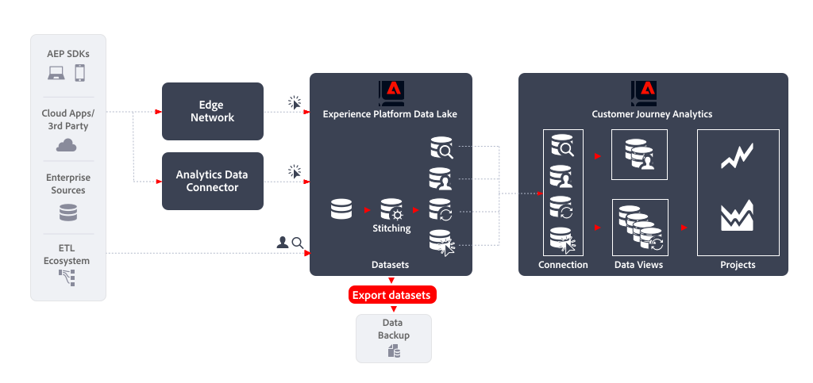

# 데이터 세트 내보내기

이 문서에서는 [!DNL Customer Journey Analytics Export datasets]을(를) 사용하여 다음 [데이터 내보내기 사용 사례](overview.md)를 구현하는 방법에 대해 간략히 설명합니다.

- 데이터 백업

## 소개

[!DNL Experience Platform Export datasets]을(를) 사용하여 데이터를 내보내면 Customer Journey Analytics 데이터 보기의 데이터를 모든 클라우드 저장소 대상으로 내보낼 수 있습니다.

## 추가 정보

Experience Platform의 데이터 레이크에서 클라우드 스토리지 대상으로 원시 데이터 세트를 내보낼 수 있습니다. 이 내보내기는 데이터 세트 내보내기 대상이라고 하는 Experience Platform 대상 용어에 있습니다. 개요는 [클라우드 저장소 대상으로 데이터 세트 내보내기](https://experienceleague.adobe.com/en/docs/experience-platform/destinations/ui/activate/export-datasets)를 참조하십시오.

지원되는 클라우드 스토리지 대상은 다음과 같습니다.

- [Azure Data Lake Storage Gen2](https://experienceleague.adobe.com/en/docs/experience-platform/destinations/catalog/cloud-storage/adls-gen2)
- [데이터 랜딩 영역](https://experienceleague.adobe.com/en/docs/experience-platform/destinations/catalog/cloud-storage/data-landing-zone)
- [Google 클라우드 저장소](https://experienceleague.adobe.com/en/docs/experience-platform/destinations/catalog/cloud-storage/google-cloud-storage)
- [Amazon S3](https://experienceleague.adobe.com/en/docs/experience-platform/destinations/catalog/cloud-storage/amazon-s3#changelog)
- [Azure Blob](https://experienceleague.adobe.com/en/docs/experience-platform/destinations/catalog/cloud-storage/azure-blob#changelog)
- [SFTP](https://experienceleague.adobe.com/en/docs/experience-platform/destinations/catalog/cloud-storage/sftp#changelog)

### EXPERIENCE PLATFORM UI

Experience Platform UI를 통해 데이터 세트를 내보내고 내보내기를 예약할 수 있습니다. 이 섹션에서는 관련 단계에 대해 설명합니다.

#### 대상 선택

데이터 집합을 내보낼 클라우드 저장소 대상을 결정했으면 [대상을 선택](https://experienceleague.adobe.com/en/docs/experience-platform/destinations/ui/activate/export-datasets#select-destination)합니다. 기본 클라우드 저장소에 대한 대상을 아직 구성하지 않은 경우 [새 대상 연결을 만들어야](https://experienceleague.adobe.com/en/docs/experience-platform/destinations/ui/connect-destination) 합니다.

대상 구성의 일부로 다음을 정의할 수 있습니다.

- 파일 유형(JSON 또는 Parquet)
- 결과 파일의 압축 여부 및
- 매니페스트 파일을 포함해야 하는지 여부를 나타냅니다.

#### 데이터세트 선택

대상을 선택한 경우 다음 **[!UICONTROL 데이터 세트 선택]** 단계에서는 데이터 세트 목록에서 데이터 세트를 선택해야 합니다. 예약된 쿼리를 여러 개 만들었고 데이터 세트를 동일한 클라우드 스토리지 대상으로 보내려면 해당 데이터 세트를 선택할 수 있습니다. 자세한 내용은 [데이터 세트 선택](https://experienceleague.adobe.com/en/docs/experience-platform/destinations/ui/activate/export-datasets#select-datasets)을 참조하십시오.

#### 데이터 세트 내보내기 예약

마지막으로, **[!UICONTROL 예약]** 단계의 일부로 데이터 세트 내보내기를 예약하려고 합니다. 이 단계에서는 일정 및 데이터 세트 내보내기가 증분적이어야 하는지 여부를 정의할 수 있습니다. 자세한 내용은 [데이터 세트 내보내기 예약](https://experienceleague.adobe.com/en/docs/experience-platform/destinations/ui/activate/export-datasets#scheduling)을 참조하십시오.

#### 최종 단계

선택 항목을 [검토](https://experienceleague.adobe.com/en/docs/experience-platform/destinations/ui/activate/export-datasets#review)하고, 올바른 경우 클라우드 저장소 대상으로 데이터 세트 내보내기를 시작합니다.

먼저 데이터를 성공적으로 내보내려면 [확인](https://experienceleague.adobe.com/en/docs/experience-platform/destinations/ui/activate/export-datasets#verify)해야 합니다. 데이터 세트를 내보낼 때 Experience Platform은 대상에 정의된 저장소 위치에 하나 이상의 `.json` 또는 `.parquet` 파일을 만듭니다. 설정한 내보내기 일정에 따라 새 파일이 저장소 위치에 저장됩니다. Experience Platform은 선택한 대상의 일부로 지정한 저장소 위치에 내보낸 파일을 저장하는 폴더 구조를 만듭니다. 내보낼 때마다 `folder-name-you-provided/datasetID/exportTime=YYYYMMDDHHMM` 패턴을 따라 새 폴더가 만들어집니다. 기본 파일 이름은 임의로 생성되며 내보낸 파일 이름이 고유한지 확인합니다.

### 플로우 서비스 API

또는 API를 사용하여 데이터 세트를 내보내고 내보내기를 예약할 수 있습니다. 관련된 단계는 [흐름 서비스 API를 사용하여 데이터 세트 내보내기](https://experienceleague.adobe.com/en/docs/experience-platform/destinations/api/export-datasets)에 설명되어 있습니다.

#### 시작

데이터 세트를 내보내려면 [필요한 권한](https://experienceleague.adobe.com/en/docs/experience-platform/destinations/api/export-datasets#permissions)이 있는지 확인하십시오. 또한 데이터 세트를 보낼 대상 이 데이터 세트 내보내기를 지원하는지 확인합니다. 그런 다음 API 호출에서 사용하는 필수 및 선택적 헤더에 대한 값을 [수집](https://experienceleague.adobe.com/en/docs/experience-platform/destinations/api/export-datasets#gather-values-headers)해야 합니다. 데이터 세트를 내보내려는 [대상의 연결 사양 및 흐름 사양 ID를 식별](https://experienceleague.adobe.com/en/docs/experience-platform/destinations/api/export-datasets#gather-connection-spec-flow-spec)해야 합니다.

#### 적격 데이터 세트 검색

내보내기를 위해 [적격한 데이터 세트 목록을 검색](https://experienceleague.adobe.com/en/docs/experience-platform/destinations/api/export-datasets#retrieve-list-of-available-datasets)하고 [`GET /connectionSpecs/{id}/configs`](https://developer.adobe.com/experience-platform-apis/references/destinations/#tag/Configurations/operation/getDatasets) API를 사용하여 데이터 세트가 해당 목록에 속하는지 확인할 수 있습니다.

#### 소스 연결 만들기

다음으로, 고유한 ID를 사용하여 클라우드 저장소 대상으로 내보낼 데이터 집합에 대해 [소스 연결을 만들어야](https://experienceleague.adobe.com/en/docs/experience-platform/destinations/api/export-datasets#create-source-connection) 합니다. [`POST /sourceConnections`](https://developer.adobe.com/experience-platform-apis/references/destinations/#tag/Source-connections/operation/postSourceConnection) API를 사용합니다.

#### 대상에 인증(기본 연결 만들기)

이제 [`POST /targetConection`](https://developer.adobe.com/experience-platform-apis/references/destinations/#tag/Target-connections/operation/postTargetConnection) API를 사용하여 자격 증명을 인증하고 클라우드 저장소 대상에 안전하게 저장하려면 [기본 연결을 만들어야](https://experienceleague.adobe.com/en/docs/experience-platform/destinations/api/export-datasets#create-base-connection) 합니다.

#### 내보내기 매개 변수 제공

그런 다음 [`POST /targetConection`](https://developer.adobe.com/experience-platform-apis/references/destinations/#tag/Target-connections/operation/postTargetConnection) API를 사용하여 데이터 집합에 대한 내보내기 매개 변수를 저장하는 추가 대상 연결을 [만들어야](https://experienceleague.adobe.com/en/docs/experience-platform/destinations/api/export-datasets#create-target-connection) 합니다. 이러한 내보내기 매개 변수에는 위치, 파일 형식, 압축 등이 포함됩니다.

#### 데이터 흐름 설정

마지막으로 [데이터 흐름을 설정](https://experienceleague.adobe.com/en/docs/experience-platform/destinations/api/export-datasets#create-dataflow)하여 [`POST /flows`](https://developer.adobe.com/experience-platform-apis/references/destinations/#tag/Dataflows/operation/postFlow) API를 사용하여 데이터 집합을 클라우드 저장소 대상으로 내보냅니다. 이 단계에서는 `scheduleParams` 매개 변수를 사용하여 내보내기 일정을 정의할 수 있습니다.

#### 데이터 흐름 유효성 검사

[데이터 흐름의 성공적인 실행을 확인](https://experienceleague.adobe.com/en/docs/experience-platform/destinations/api/export-datasets#get-dataflow-runs)하려면 [`GET /runs`](https://developer.adobe.com/experience-platform-apis/references/destinations/#tag/Dataflow-runs/operation/getFlowRuns) API를 사용하여 데이터 흐름 ID를 쿼리 매개 변수로 지정하십시오. 이 데이터 흐름 ID는 데이터 흐름을 설정할 때 반환되는 식별자입니다.

[데이터를 성공적으로 내보냈습니다.](https://experienceleague.adobe.com/en/docs/experience-platform/destinations/ui/activate/export-datasets#verify) 데이터 세트를 내보낼 때 Experience Platform은 대상에 정의된 저장소 위치에 하나 이상의 `.json` 또는 `.parquet` 파일을 만듭니다. 설정한 내보내기 일정에 따라 새 파일이 저장소 위치에 저장됩니다. Experience Platform은 선택한 대상의 일부로 지정한 저장소 위치에 내보낸 파일을 저장하는 폴더 구조를 만듭니다. 내보낼 때마다 `folder-name-you-provided/datasetID/exportTime=YYYYMMDDHHMM` 패턴을 따라 새 폴더가 만들어집니다. 기본 파일 이름은 임의로 생성되며 내보낸 파일 이름이 고유한지 확인합니다.
