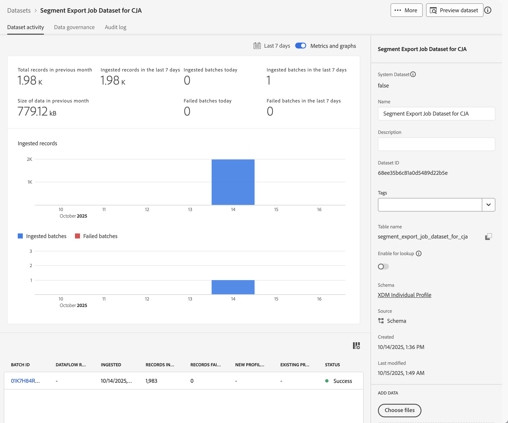

# Experience Platform 대상자 수집 및 활용

이 사용 사례에서는 Experience Platform 대상을 Customer Journey Analytics으로 수집하는 임시 솔루션을 탐색합니다. 이러한 대상은 Experience Platform 세그먼트 빌더, Adobe Audience Manager 또는 기타 도구에서 생성되었을 수 있으며 실시간 고객 프로필에 저장됩니다. 대상은 적용 가능한 속성, 이벤트 등과 함께 프로필 ID 세트로 구성됩니다. 추가 분석을 위해 해당 대상 데이터를 Customer Journey Analytics으로 가져오려고 합니다.

## 사전 요구 사항

* [Experience Platform](https://experienceleague.adobe.com/ko/docs/experience-platform/access-control/home)&#x200B;(특히 실시간 고객 프로필)에 액세스합니다.
* Experience Platform [스키마](https://experienceleague.adobe.com/ko/docs/experience-platform/xdm/home) 및 [데이터 세트](https://experienceleague.adobe.com/en/docs/experience-platform/catalog/datasets/overview)를 만들고 관리할 수 있는 액세스 권한.
* [Experience Platform 쿼리 서비스](https://experienceleague.adobe.com/ko/docs/experience-platform/query/home)에 대한 액세스 권한(및 SQL 작성 기능).
* 데이터의 일부 변환을 수행할 수 있는 도구에 대한 액세스 권한.
* Customer Journey Analytics에 액세스 Customer Journey Analytics 연결 및 데이터 보기를 만들고 수정하려면 [Customer Journey Analytics 제품 관리자](/help/technotes/access-control.md)여야 합니다.
* [Experience Platform API(카탈로그 서비스 API 및 세분화 서비스 API) 인증 및 액세스](https://experienceleague.adobe.com/ko/docs/experience-platform/landing/platform-apis/api-authentication). 조직 및 샌드박스의 Developer Console에서 프로젝트를 만들고 API 호출을 성공적으로 제출하는 데 필요한 정보가 있는지 확인해야 합니다.

## 단계

임시 해결 방법에는 다음 단계가 포함됩니다.

1. [대상 선택(Experience Platform UI)](#select-audiences).
1. [프로필 사용 데이터 세트(Experience Platform API)를 만듭니다](#create-a-profile-enabled-dataset).
1. [대상자 내보내기(Experience Platform API)](#export-audiences).
1. [출력을 변환합니다(Experience Platform UI 등)](#transform-the-output).
1. [스키마 및 데이터 세트 만들기(Experience Platform UI)](#create-a-schema-and-dataset).
1. [연결 추가 또는 편집(Customer Journey Analytics UI)](#add-or-edit-a-connection).
1. [데이터 보기 구성(Customer Journey Analytics UI)](#configure-a-data-view).
1. [보고 및 분석(Customer Journey Analytics UI)](#report-and-analyze).


### 대상자 선택

솔루션은 Customer Journey Analytics에서 수집하려는 대상을 식별하는 것부터 시작합니다.

+++ 대상자 식별

Experience Platform UI에서 다음 작업을 수행합니다.

1. **[!UICONTROL 고객]** >  **[!UICONTROL 대상]**&#x200B;을 선택합니다.
1. **[!UICONTROL 찾아보기]**&#x200B;를 선택하고 Customer Journey Analytics에서 수집 및 사용할 대상을 검색합니다. 나중에 사용할 수 있도록 각 대상에 대해 **[!UICONTROL 대상 ID]**&#x200B;를 참고하십시오.

   

+++

### 프로필 활성화 데이터 세트 만들기

코어 기반 **[!UICONTROL XDM 개별 프로필]** 스키마를 기반으로 데이터 세트를 만들어야 합니다. Experience Platform UI에서 데이터 세트를 만들 때 해당 코어 기반 XDM 개인 프로필을 스키마로 선택할 수 없습니다. 대신 [카탈로그 서비스 API를 사용하여 ](https://experienceleague.adobe.com/en/docs/experience-platform/catalog/datasets/create#create-a-dataset) 스키마를 기반으로 데이터 집합`_xdm.context.profile__union`을(를) 만듭니다.

+++ 데이터 세트 요청 만들기

#### 요청

```shell
curl -X POST \
  'https://platform.adobe.io/data/foundation/catalog/dataSets?requestDataSource=true' \
  -H 'Authorization: Bearer {ACCESS_TOKEN}' \
  -H 'Content-Type: application/json' \
  -H 'x-api-key: {API_KEY}' \
  -H 'x-gw-ims-org-id: {ORG_ID}' \
  -H 'x-sandbox-name: {SANDBOX_NAME}' \
  -d '{
   "name": "{DATASET_NAME}",
   "schemaRef": {
      "id": "_xdm.context.profile__union",
      "contentType": "application/vnd.adobe.xed+json;version=1"
   },
   "fileDescription": {
      "persistet": true,
      "containerFormat": "parquet",
      "format": "parquet"
   }
}'
```

위치:

* `DATASET_NAME`은(는) 데이터 집합에 대한 알기 쉬운 이름입니다. (예: `Segment Export Job Dataset for CJA`)

#### 응답

```json
["@/dataSets/{DATASET_ID}"]
```

위치:

* `DATASET_ID`은(는) 생성된 데이터 세트에 대한 데이터 세트 식별자입니다.

+++

### 대상자 내보내기

선택한 대상을 방금 만든 데이터 세트로 내보냅니다. 대상자를 데이터 세트로 보내는 내보내기 작업을 만들려면 [세그먼테이션 서비스 API를 사용하십시오](https://experienceleague.adobe.com/en/docs/experience-platform/segmentation/api/export-jobs#create).

+++ 내보내기 작업 요청

```shell
curl -X POST https://platform.adobe.io/data/core/ups/export/jobs \
 -H 'Authorization: Bearer {ACCESS_TOKEN}' \
 -H 'Content-Type: application/json' \
 -H 'x-gw-ims-org-id: {ORG_ID}' \
 -H 'x-api-key: {API_KEY}' \
 -H 'x-sandbox-name: {SANDBOX_NAME}' \
 -d '{
    "fields": "{COMMA_SEPARATED_LIST_OF_FULLY_QUALIFIED_FIELD_NAMES}",
    "filter": {
        "segments": [
            {
                "segmentId": "{AUDIENCE_ID_1}",
                "segmentNs": "ups",
                "status": [
                    "realized"
                ],
                "segmentId": "{AUDIENCE_ID_2}",
                "segmentNs": "ups",
                "status": [
                    "realized"
                ],
                "segmentId": "{AUDIENCE_ID_3}",
                "segmentNs": "ups",
                "status": [
                    "realized"
                ]             
             }
        ]
    },
    "destination":{
        "datasetId": "{DATASET_ID}",
        "segmentPerBatch": false
    },
    "schema":{
        "name": "_xdm.context.profile"
    }
}'
```

수행

* `COMMA_SEPARATED_LIST_OF_FULLY_QUALIFIED_FIELD_NAMES`은(는) `_demoemea.identification.core.ecid, _demoemea.identification.core.email, _demoemea.identification.core.phoneNumber, person.gender, person.name.firstName, person.name.lastName`과(와) 같은 것일 수 있습니다. 고객 여정 분석에 사용할 최소 관련 필드(예: personID(이메일))를 포함해야 합니다.
* `AUDIENCE_ID_x`은(는) 내보내려는 대상의 대상 식별자입니다.
* `DATASET_ID`은(는) 사용자가 만든 데이터 세트입니다.


### 응답

```json
{
  "..."
  "id": "{EXPORT_JOB_ID}",
  "..."
}
```

수행

* `EXPORT_JOB_ID`은(는) 내보내기 작업의 식별자입니다.


+++

[세그먼테이션 서비스 API를 사용하여 내보내기 작업의 상태를 확인](https://experienceleague.adobe.com/en/docs/experience-platform/segmentation/api/export-jobs#get)하세요.

+++ 특정 내보내기 작업 요청 검색

#### 요청

```shell
curl -X GET https://platform.adobe.io/data/core/ups/export/jobs/{EXPORT_JOB_ID} \
 -H 'Authorization: Bearer {ACCESS_TOKEN}' \
 -H 'x-gw-ims-org-id: {ORG_ID}' \
 -H 'x-api-key: {API_KEY}' \
 -H 'x-sandbox-name: {SANDBOX_NAME}'
```

#### 응답

```json
{
  "..."
  "id": "{EXPORT_JOB_ID}",
  "..."
  "status": "SUCCEEDED",
  "..."
}
```

+++

내보내기 작업이 성공하면 데이터 세트에 성공적으로 수집된 일괄 처리가 포함되어 있는지 확인합니다.

+++ 수집 상태 확인

Experience Platform UI에서 다음 작업을 수행합니다.

1. **[!UICONTROL 데이터 관리]** >  **[!UICONTROL 데이터 세트]**&#x200B;를 선택합니다.
1. 만든 데이터 세트를 선택합니다(예: **[!UICONTROL CJA에 대한 세그먼트 내보내기 작업 데이터 세트]**).

   

1. 수집된 일괄 처리를 확인합니다. 데이터 집합에 실패한 일괄 처리가 포함되어 있는 경우 **[!UICONTROL 데이터 관리]** >  **[!UICONTROL 모니터링]**&#x200B;을 사용하여 이유를 확인하세요. 예를 들어 스키마에 존재하지 않는 필드 이름을 사용했습니다.
1. 데이터 집합의 **[!UICONTROL 테이블 이름]**&#x200B;을(를) 복사합니다. 예: **[!UICONTROL segment_export_job_dataset_for_cja]**.  다음 단계에서 해당 이름을 사용합니다.

+++


### 출력 변환

데이터 세트의 데이터가 Customer Journey Analytics에 대해 올바른 형식이 아닙니다. 데이터를 변환하려면 Experience Platform 쿼리 서비스를 사용하여 데이터를 가져옵니다.

+++ 내보낸 대상 데이터를 가져오기 위한 SQL

Experience Platform 쿼리 서비스에 연결하는 PSQL 클라이언트를 사용합니다.

Experience Platform UI에서 다음 작업을 수행합니다.

1. **[!UICONTROL 데이터 관리]** >  **[!UICONTROL 쿼리]**&#x200B;를 선택합니다.
1.  **[!UICONTROL 자격 증명]**&#x200B;을 선택합니다.

자격 증명을 사용하여 Customer Journey Analytics 쿼리 서비스에 연결하도록 PSQL 클라이언트를 구성합니다.

#### 쿼리

```sql
SELECT ROW_NUMBER() OVER (ORDER BY key)::text as _id, personID, key as audienceMembershipId
FROM (
   SELECT {IDENTITY_TO_USE_AS_PERSON_ID} AS personID, explode(segmentMembership.ups)
   FROM {DATASET_TABLE_NAME}
)
WHERE value.status = 'realized' AND (key = '{AUDIENCE_ID_1}' OR key = 'AUDIENCE_ID_2' OR key = 'AUDIENCE_ID_3')
```

위치:

* `IDENTITY_TO_USE_AS_PERSON_ID`은(는) 내보내기 작업의 일부로 정의한 필드 중 하나입니다. 예: `_demoemea.identification.core.email`.
* `AUDIENCE_ID_x`은(는) 내보내기 작업의 일부로 정의한 대상입니다. 내보내기 작업의 사양이 행 수준 필터이므로 이러한 대상을 한 번 더 지정해야 합니다. 해당 행 수준 필터는 각 프로필에 대한 모든 세그먼트 멤버십이 있는 지정된 세그먼트에 대한 프로필을 반환합니다.


#### 결과

쿼리 결과는 JSON 형식으로 다음과 같아야 합니다.

```json
[
   {
      "_id": "1",
      "personID": "{PERSON_ID_x}",
      "audienceMembershipId": "{AUDIENCE_ID_x}"
   },
   {
      "_id": "2",
      "personID": "PERSON_ID_y",
      "audienceMembershipId": "{AUDIENCE_ID_x}"
   }

]
```

위치:

* `PERSON_ID_x`은(는) 개인 ID로 사용할 식별자의 식별자 값입니다. 예를 들어 전자 메일을 사용하는 경우 `john.doe@gmail.com`입니다.
* `AUDIENCE_ID_x`은(는) 대상 식별자입니다.

+++

이 JSON 데이터를 변형하여 환경의 테넌트 이름을 추가하고 대상자에게 보다 사용자 친화적인 이름을 제공해야 합니다.

+++ JSON 변환

최종 JSON은 다음과 같아야 합니다.

```json
[
   {
      "_id": "1",
      "personID": "{PERSON_ID_x}",
      "{TENANT_NAME}": {
         "audienceMembershipId": "{AUDIENCE_ID_x}",
         "audienceMembershipName": "{AUDIENCE_FRIENDLY_NAME_x}"
      }
  },
  {
      "_id": "2",
      "personID": "{PERSON_ID_y}",
      "{TENANT_NAME}": {
         "audienceMembershipId": "{AUDIENCE_ID_y}",
         "audienceMembershipName": "{AUDIENCE_FRIENDLY_NAME_y}"
      }
    }
  }

]
```

위치:

* `TENANT_NAME`은(는) 테넌트의 이름입니다. 예: `_demoemea`.
* `PERSON_ID_x`은(는) 개인 ID로 사용할 식별자의 식별자 값입니다. 예를 들어 전자 메일을 사용하는 경우 `john.doe@gmail.com`입니다.
* `AUDIENCE_ID_x`은(는) 대상 식별자입니다.
* `AUDIENCE_FRIENDLY_NAME_x`은(는) 대상 ID에 친숙한 대상 이름입니다. 예: `Luma - Blue+ Members`.

즐겨 사용하는 도구를 사용하여 원본 JSON을 이 형식으로 변환합니다.

+++


### 스키마 및 데이터 세트 만들기

변환된 JSON을 Customer Journey Analytics에서 내보낸 대상 데이터로 사용하려면 전용 스키마를 만들어야 합니다.

+++ 스키마 만들기

스키마를 생성하려면:

Experience Platform UI에서 다음 작업을 수행합니다.

1. **[!UICONTROL 데이터 관리]** >  **[!UICONTROL 스키마]**&#x200B;를 선택합니다.
1.  **[!UICONTROL 스키마 만들기]**&#x200B;를 선택합니다. 드롭다운 메뉴에서 **[!UICONTROL 표준]**&#x200B;을(를) 선택합니다.
1. **[!UICONTROL 스키마 만들기]** 대화 상자에서 **[!UICONTROL 수동]**&#x200B;을 선택하고 **[!UICONTROL 선택]**&#x200B;을 사용하여 계속하십시오.
1. **[!UICONTROL 스키마 만들기]** 마법사의 **[!UICONTROL 클래스 선택]** 단계:
   1. **[!UICONTROL 개별 프로필]**&#x200B;을 선택하세요.
   1. **[!UICONTROL 다음]**&#x200B;을 선택합니다.
1. **[!UICONTROL 스키마 만들기]** 마법사의 **[!UICONTROL 이름 및 검토]** 단계:
   1. **[!UICONTROL 스키마 표시 이름]**&#x200B;을 입력하십시오. 예: `Audience Export for CJA Schema`.
   1. (선택 사항) **[!UICONTROL 설명]**&#x200B;을 입력합니다.
   1. **[!UICONTROL 마침]**&#x200B;을 선택합니다.
1. **[!UICONTROL audienceMembershipId]** 및 **[!UICONTROL audienceMembershipName]**(이)라는 두 개의 필드를 포함하는 사용자 지정 필드 그룹(예: **[!UICONTROL Audience Membership]**)을 포함하도록 스키마를 설정하십시오.
1. **[!UICONTROL personID]** 필드가 **[!UICONTROL ID]**, **[!UICONTROL 기본 ID]**&#x200B;이고 I****[!UICONTROL ID 네임스페이스]**&#x200B;로서 [!UICONTROL 이메일]이 있는지 **.

   

1. 모든 변경 내용을 **[!UICONTROL 적용]**&#x200B;합니다. **[!UICONTROL 저장]**&#x200B;을 선택하여 스키마를 저장합니다.

+++

데이터 세트를 만들고 해당 데이터 세트를 사용하여 변환된 JSON 데이터를 수집합니다.

+++ 데이터 세트 만들기 및 데이터 수집

Experience Platform UI에서 다음 작업을 수행합니다.

1. **[!UICONTROL 데이터 관리]** >  **[!UICONTROL 데이터 세트]**&#x200B;를 선택합니다.
1.  **[!UICONTROL 데이터 집합 만들기]**&#x200B;를 선택합니다.
1. **[!UICONTROL 스키마에서 데이터 세트 만들기]**&#x200B;를 선택합니다.
1. **[!UICONTROL 스키마에서 데이터 집합 만들기]** 마법사의 **[!UICONTROL 스키마 선택]** 단계:
   1. 방금 생성한 스키마를 선택합니다. 예: **[!UICONTROL CJA 스키마에 대한 대상 내보내기]**.
   1. **[!UICONTROL 다음]**&#x200B;을 선택합니다.
1. **[!UICONTROL 스키마에서 데이터 집합 만들기]** 마법사의 **[!UICONTROL 데이터 집합 구성]** 단계에서 다음을 수행합니다.
   1. 데이터 집합에 대한 **[!UICONTROL 이름]**&#x200B;을(를) 입력하십시오.
   1. (선택 사항) 데이터 집합에 대한 **[!UICONTROL 설명]**&#x200B;을 입력합니다.
   1. **[!UICONTROL 마침]**&#x200B;을 선택합니다.
1. **[!UICONTROL 데이터 세트]** > **[!UICONTROL _데이터 세트 이름_]**&#x200B;에서 변환된 JSON 데이터 파일을 끌어다 **[!UICONTROL 파일 끌어다 놓기]**&#x200B;로 놓습니다. 이 작업은 내보낸 JSON 데이터를 데이터 세트로 수집을 시작합니다.
1. 수집된 일괄 처리를 확인합니다. 데이터 집합에 실패한 일괄 처리가 포함되어 있는 경우 **[!UICONTROL 데이터 관리]** >  **[!UICONTROL 모니터링]**&#x200B;을 사용하여 이유를 확인하세요. 예를 들어 스키마에 존재하지 않는 JSON의 필드 이름을 정의했습니다.


+++

### 연결 추가 또는 편집

Experience Platform의 대상 데이터를 포함하는 변환된 JSON 데이터가 성공적으로 수집되면 Customer Journey Analytics의 새 연결 또는 기존 연결에 데이터 세트를 추가할 수 있습니다.

+++ 연결에 데이터 세트 추가

Customer Journey Analytics UI에서:

1. **[!UICONTROL 데이터 관리]** > **[!UICONTROL 연결]**&#x200B;을 선택합니다.
1. 새 연결을 만들고 **[!UICONTROL 연결 설정]** 및 **[!UICONTROL 데이터 설정]**&#x200B;을 정의합니다. 또는 기존 연결을 선택하고  **[!UICONTROL 연결 편집]**&#x200B;을 사용하여 연결을 편집하세요.
1.  **[!UICONTROL 데이터 세트 추가]**&#x200B;를 선택합니다.
1. 생성한 데이터 세트와 변환된 JSON 데이터를 수집한 데이터 세트를 선택합니다.
1. 데이터 세트를 구성합니다. 예:

   

1. 연결을 **[!UICONTROL 저장]**&#x200B;합니다.

+++

### 데이터 보기 구성하기

방금 만들었거나 편집한 연결에 대한 데이터 보기를 구성합니다.

+++ 대상 구성 요소 정의

1. **[!UICONTROL 데이터 관리]** > **[!UICONTROL 데이터 보기]**&#x200B;를 선택합니다.
1. 기존 데이터 보기를 편집하거나 새 데이터 보기를 만듭니다.
1. 데이터 보기의 **[!UICONTROL 구성 요소]** 탭에서 **[!UICONTROL 대상 멤버십 ID]** 및 **[!UICONTROL 대상 멤버십 이름]**&#x200B;이 차원 구성 요소로 추가되었는지 확인하십시오.

   

1. 데이터 보기를 저장하려면 **[!UICONTROL 저장 및 계속]**&#x200B;을 선택하십시오.

+++

### 보고 및 분석.

마지막으로, Analysis Workspace을 사용하여 대상 멤버십 구성 요소와 함께 데이터 보기를 사용하는 하나 이상의 패널에서 Experience Platform 대상 데이터에 대해 보고합니다.


<!--

## Step 1: Select audiences in Real-time Customer Profile {#audience}

Experience Platform [Real-time Customer Profile](https://experienceleague.adobe.com/docs/experience-platform/profile/home.html) lets you see a holistic view of each individual customer by combining data from multiple channels, including online, offline, CRM, and third party. 

You likely already have audiences in RTCP that may have come from various sources. Select one or more audiences to ingest into Customer Journey Analytics. For example, WKND Fly Platinum and Gold Fly Club Members.


## Step 2: Create a Profile Union dataset for the export

In order to export the audience to a dataset that you can ingest in Customer Journey Analytics as profiles, create a dataset whose schema is a Profile [Union schema](https://experienceleague.adobe.com/docs/experience-platform/profile/union-schemas/union-schema.html#understanding-union-schemas).

Union schemas are composed of multiple schemas that share the same class and have been enabled for Profile. The union schema enables you to see an amalgamation of all of the fields contained within schemas sharing the same class. Real-time Customer Profile uses the union schema to create a holistic view of each individual customer.

## Step 3: Export an audience to the Profile Union dataset via API call {#export}

Before you can bring an audience into Customer Journey Analytics, you need to export it to an Adobe Experience Platform dataset. This can only be done using the Segmentation API, and specifically the [Export Jobs API Endpoint](https://experienceleague.adobe.com/docs/experience-platform/segmentation/api/export-jobs.html). 

You can create an export job using the audience ID of your choice, and put the results in the Profile Union Adobe Experience Platform dataset you created in Step 2. Although you can export various attributes/events for the audience, you only need to export the specific profile ID field that matches the person ID field used in the Customer Journey Analytics connection you will be leveraging (see below in Step 5).

## Step 4: Edit the export output 

The results of the export job need to be transformed into a separate Profile dataset in order to be ingested into Customer Journey Analytics.  This transformation can be done with [Adobe Experience Platform Query Service](https://experienceleague.adobe.com/docs/experience-platform/query/home.html), or another transformation tool of your choice. We only need the Profile ID (that will match the Person ID in Customer Journey Analytics) and one or more audience ID(s) to do the reporting in Customer Journey Analytics.

The standard export job, however, contains more data and so we need to edit this output to remove extraneous data, as well as move some things around.  Also, you need to create a schema/dataset first before you add the transformed data to it.

Here is an example of the export output in the Profile union dataset, **before** any editing:


Note the following:

* The audience ID is contained under `segmentmembership.ups.xxxxxxxx-xxxx-xxxx-xxxx-xxxxxxxxxxxx.status`.
* The status has to be "realized", or "entered", but not "exited".

This is the format of the Profile dataset that you can send into Customer Journey Analytics.


Here are the data elements that need to be present:

* `_aresprodvalidation` string field: Refers to your Organization ID. Yours will be different.
* `personID` string field: This is the standard XDM schema field on Profile datasets to identity the person. Use the Profile ID from the export.
* `audienceMembershipId` string field: The audience ID from the export.  NOTE: This field can be named whatever you want (from your own schema).
* Add a friendly name for the audience (`audienceMembershipIdName`), such as

   
   
* Add other audience metadata if you desire.

## Step 5: Add this Profile dataset to an existing connection in Customer Journey Analytics

You could [create a new connection](/help/connections/create-connection.md), but most customers will want to add the Profile dataset to an existing connection. The audience IDs "enrich" the existing data in Customer Journey Analytics.

## Step 6: Modify existing (or create new) Customer Journey Analytics data view

Add `audienceMembershipId`, `audienceMembershipIdName` and `personID` to the data view.

## Step 7: Report in Workspace

You can now report on `audienceMembershipId`, `audienceMembershipIdName` and `personID` in Workspace.

## Additional notes

* You should  perform this process on a regular cadence, so that audience data is constantly refreshed within Customer Journey Analytics.
* You can import multiple audiences within a single Customer Journey Analytics connection. This adds additional complexity to the process, but it is possible. For this to work, you need to make a few modifications to the above process:
   1. Perform this process for each desired audience in your audience collection within RTCP.
   1. Customer Journey Analytics supports arrays/object arrays in profile datasets. Using an [array of objects](https://experienceleague.adobe.com/docs/analytics-platform/using/cja-usecases/complex-data/object-arrays.html) for the audienceMembershipId or audienceMembershipIdName is the best option. 
   1. In your data view, create a new dimension using the Substring transformation on the `audienceMembershipId` field to convert the comma-separated values string to an array. NOTE: there is currently a limit of 10 values in the array.
   1. You can now report on this new dimension `audienceMembershipIds` within Customer Journey Analytics Workspace.

-->