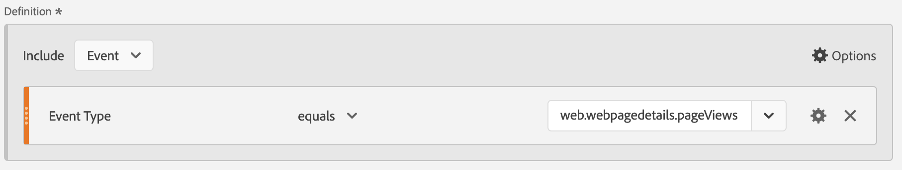
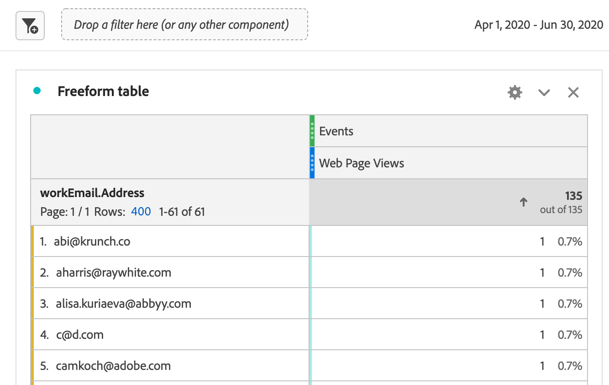

# Marketo Engage 데이터에 대한 보고서

Experience Platform의 사용 가능한 Marketo Engage 데이터 세트를 활용하여 B2B 마케터에게 중요한 분석 및 보고 솔루션을 제공할 수 있습니다. 그런 다음 Customer Journey Analytics에서 이러한 데이터 세트에 대해 보고합니다.

다음 사항에 주의하십시오.

* Marketo Engage 보고는 Marketo에서 직접 마케팅 프로그램을 측정하고 최적화하는 데 가장 적합하며, 빠르고 처방적이며 마케터에게 친숙합니다.
* Customer Channel Analytics는 Marketo 데이터를 포함하여(그러나 이에 제한되지 않음) 여러 채널, 제품 및 비즈니스 단위에 걸쳐 있는 고객 여정을 위해 훨씬 광범위한 사용자 정의 가능한 분석 솔루션을 제공합니다.

자세한 내용은 [보고 비교](#reporting-comparison)를 참조하십시오.

>[!NOTE]
>
>Marketo Engage 데이터에서 더 많은 가치를 얻기 위해 [Customer Journey Analytics B2B edition](/help/getting-started/cja-b2b-edition.md)을(를) 고려할 수 있습니다. Marketo Engage 데이터 세트를 계정 및 조회 데이터 세트와 결합할 수 있습니다. Customer Journey Analytics B2B edition의 계정 및 기회 수준에 대해 보고합니다.
>

Customer Journey Analytics에서 Marketo Engage 데이터에 대해 보고하려면 다음 단계를 따르십시오.

+++ID 전략 선택

Marketo 활동 데이터를 Customer Journey Analytics으로 수집하려면 적절한 ID 전략을 선택하여 Marketo 데이터가 Customer Journey Analytics 데이터에 연결될 수 있도록 해야 합니다.

Marketo 데이터에는 기본적으로 ECID가 포함되어 있지 않지만 ECID 필드는 `munchkin.js` 라이브러리와 함께 수집되는 사용자 지정 필드로 추가할 수 있습니다. 이렇게 하면 Marketo과 기존 고객 여정 분석 웹 데이터 간에 공유 식별자가 만들어집니다.

Marketo 및 Customer Journey Analytics 데이터를 연결하려면 관련 데이터 세트에서 [그래프 기반 결합](/help/stitching/gbs.md)을 사용하십시오. 구현에 따라 사용 가능한 여러 ID를 사용할 수 있습니다.

* Experience Platform ID 서비스에서 제공하는 ECID
* 이메일
* Munchkin ID, Marketo Engage 제공
* 리셀러 ID
* 던 앤 브래드스트리트 던스\#
* Demandbase ID
* (잠재적으로 다른 항목)

그래프 기반 결합은 다음과 같은 방법으로 도움이 됩니다.

* 웹 이벤트에 영구 ID를 유지합니다.
* 가능한 경우 ID 그래프를 사용하여 알려진 ID(예: 이메일)를 확인합니다.
* 결정론적 일치가 존재하지 않는 경우, 그래프 기반 결합은 이벤트를 삭제하는 대신 영구 ID로 대체됩니다.

그래프 기반 결합은 다음과 같은 이유로 Marketo 및 Customer Journey Analytics 데이터를 연결하는 실행 가능한 솔루션입니다.

* 웹 이벤트 데이터는 모든 행에 영구 ID를 갖습니다(예: ECID).
* Marketo 데이터에는 Munckin ID, ECID 및 이메일이 있는 데이터의 안정적인 ID가 있습니다.
* 그래프 기반 결합은 ECID를 Munchkin ID, 이메일 또는 Marketo 데이터에서 사용할 수 있는 다른 ID에 결정적으로 브리지합니다.
* 그래프 기반 결합은 명시적으로 구성된 ID 그래프 연결 규칙 및 네임스페이스를 사용합니다.

이 ID 전략을 확인하려면 제어된 그래프 기반 스티칭 파일럿을 실행해야 합니다.

1. ECID를 Marketo의 사용자 지정 필드로 추가하고 사용자 지정 필드를 Marketo Engage 데이터 수집을 위한 munckin.js 클라이언트측 JavaScript 코드에 추가합니다.
1. 최소 Marketo 데이터 세트와 웹 이벤트 데이터 세트를 모두 포함하는 임시 고객 여정 연결을 설정하십시오.
1. 제한적이지만 표현할 수 있는 양의 데이터를 가져올 수 있는 좁은 데이터 범위를 정의합니다.
1. Workspace에서 데이터 보기 및 보고서 설정을 통해 결합을 확인합니다. 자세한 내용은 아래 단계를 참조하십시오.

+++

+++Marketo 소스 데이터 필드를 XDM 대상에 매핑

[사용자](https://experienceleague.adobe.com/en/docs/experience-platform/sources/connectors/adobe-applications/mapping/marketo) 및 [활동](https://experienceleague.adobe.com/en/docs/experience-platform/sources/connectors/adobe-applications/mapping/marketo) 오브젝트를 해당 XDM 스키마 대상 필드에 매핑합니다.

+++

+++Marketo 데이터를 Adobe Experience Platform에 수집

[Marketo Engage 커넥터](https://experienceleague.adobe.com/en/docs/experience-platform/sources/connectors/adobe-applications/marketo/marketo)를 사용하여 Marketo에서 Experience Platform으로 데이터를 가져오고 Experience Platform 응용 프로그램을 사용하여 이 데이터를 최신 상태로 유지하십시오.

+++

+++ Customer Journey Analytics에서 이 데이터 세트에 대한 연결 설정

Experience Platform 데이터 세트에 대해 보고하려면 먼저 Experience Platform과 Customer Journey Analytics의 데이터 세트 간에 연결을 설정해야 합니다. [연결 만들기 또는 편집](https://experienceleague.adobe.com/ko/docs/analytics-platform/using/cja-connections/create-connection)을 참조하세요.

+++

+++하나 이상의 데이터 보기 만들기

[데이터 보기](/help/data-views/data-views.md)는 Customer Journey Analytics와 관련된 컨테이너입니다. 이를 통해 연결에서 데이터를 해석하는 방법을 결정할 수 있습니다. Analysis Workspace에서 사용할 가능한 모든 차원과 지표(이 경우 Marketo와 관련된 지표 및 차원)를 지정합니다. 또한 해당 차원과 지표가 데이터를 얻을 수 있는 열을 지정합니다. 데이터 보기는 Analysis Workspace의 데이터에 대한 보고 준비에 따라 정의됩니다.

+++ 

+++Analysis Workspace의 보고서

탐색할 수 있는 한 가지 사용 사례는 다음과 같습니다. 2020년 4월~6월에 리드별 웹 페이지 방문 횟수는?

1. [Analytics Workspace](/help/analysis-workspace/home.md)을(를) 열고 새 프로젝트를 만듭니다.
B2B/B2P CDP를 보유한 고객은 Customer Journey Analytics에서 B2C 스타일의 분석을 수행할 수 있습니다. B2B 오브젝트는 아직 사용할 수 없습니다.

1. 다음과 같이 웹 페이지 조회수에 대한 [세그먼트](/help/components/segments/seg-create.md)를 만듭니다. 이벤트 유형 = web.webpagedetails.pageViews :

   

1. 만든 세그먼트를 자유 형식 테이블 - 웹 페이지 보기 수로 가져온 다음 월 날짜 범위를 가져옵니다. 이 작업은 매월 리드별 웹 페이지 방문 횟수를 제공합니다.

   

1. 또는 개인 키 또는 직장 이메일 주소 차원을 가져옵니다. 이 작업을 수행하면 각 리드의 웹 페이지 방문 횟수를 확인할 수 있습니다.

   

Customer Journey Analytics의 Marketo Engage 데이터는 Marketo Engage에 있는 보고서에 표시되는 내용과 다를 수 있습니다.

+++

## 보고 비교

Customer Journey Analytics과 Marketo Engage의 보고를 비교한 다음 내용에서는 분석 기능, 유연성, 진실의 소스 및 사용 사례에서 몇 가지 중요한 차이점을 자세히 설명합니다.

### Customer Journey Analytics

Customer Journey Analytics은 Adobe Experience Platform에 구축된 고급 크로스 채널 분석 도구입니다. Customer Journey Analytics은 디지털 및 오프라인 데이터 소스 전반에 걸쳐 강력하고 유연하며 사용자 정의 가능한 보고를 필요로 하는 기업 팀을 위해 설계되었습니다.

#### 주요 기능

* **데이터 소스**: 여러 데이터 세트(웹, CRM, 이메일, 콜 센터, 오프라인, Marketo 등)를 결합할 수 있습니다. 360° 고객 여정 보고용
* **셀프 서비스 분석**: 대화형의 사용자 지정 가능한 대시보드 및 시각화가 포함된 작업 영역을 끌어서 놓습니다.
* **고급 속성**: 마케팅 프로그램뿐만 아니라 연결된 모든 데이터에 대해 복잡한 멀티 터치 및 사용자 지정 속성 모델을 지원합니다.
* **대상 및 경로 지정 분석**: 구매자 여정 전반에 걸친 세분화, 집단 및 경로 지정 분석.
* **실행 가능한 인사이트**: 데이터 기반 오케스트레이션을 사용합니다(예: 인사이트를 다시 마케팅 또는 개인화 엔진으로 전송).
* **엔터프라이즈 규모**: 엔터프라이즈 거버넌스, 여러 브랜드 및 높은 데이터 볼륨이 필요한 조직에 적합합니다.

#### 일반적인 Customer Journey Analytics 사용 사례

* 여러 채널 및 터치포인트에서 고급 고객 여정 매핑.
* 온라인 및 오프라인 데이터의 복잡한 세그먼테이션 및 혼합.
* 경영진 수준 및 운영 보고를 위한 맞춤형 KPI 대시보드.
* 전체론적 속성 모델링(단순히 디지털이나 이메일을 넘어).

### Marketo Engage

Marketo Engage은 마케팅 자동화 KPI, 프로그램 및 캠페인 측정 및 마케팅 영향 분석에 초점을 맞춘 인앱 보고를 제공합니다. 이 모든 보고는 Marketo 내의 활동과 직접 연결됩니다.

#### 주요 기능

* **기본 마케팅 분석**: 이메일, 랜딩 페이지, 캠페인, 리드, 기회, 파이프라인 및 매출 기여도(첫 번째, 마지막, 멀티 터치)에 대한 표준 보고서입니다.
* **고급 BI Analytics(추가 기능)**: 끌어다 놓고, 프로그램/계정/리드 데이터를 분석하기 위해 사용자 지정 Report Builder를 마우스로 가리키고 클릭합니다(최신 고급 BI Analytics 개요 참조).
* **미리 빌드된 대시보드**: 캠페인 성과, 채널 효율성, 파이프라인/매출 기여도.
* **프로그램 및 여정 분석**: Marketo 관리 채널별 속성 및 ROI.
* **마케팅 중심**: 이메일 통계, 양식, 스마트 캠페인, 매출에 미치는 영향 등 마케팅 funnel에 대한 투명성이 필요한 사용자에게 초점을 맞춥니다.

#### 일반적인 Marketo Engage 사용 사례

* 이메일, 프로그램 및 캠페인 성과를 추적하고 최적화합니다.
* 리드 및 파이프라인을 마케팅 전술로 연결합니다.
* 참여 트렌드 및 점수 잠재 고객 모니터링
* 데이터 엔지니어링 리소스 없이 영업/마케팅 팀과 인사이트를 공유할 수 있습니다.
* 바로 사용이 가능하고 마케터에게 친숙한 보고서에 액세스합니다.

Marketo Engage과 Customer Journey Analytics 간의 보고 기능에 대한 빠른 비교 표는 아래를 참조하십시오.

| 기능 | Marketo Engage | Customer Journey Analytics |
|---|---|---|
| **기본 포커스** | 마케팅 프로그램 및 캠페인 중심 보고. | 전체적인 옴니채널 여정 및 행동 분석 및 보고. |
| **데이터 원본** | Marketo Engage을 통해 및 내에서 생성된 데이터. | Marketo, 웹 사이트, 모바일 앱, 오프라인 채널 등을 포함하여 Experience Platform에서 사용할 수 있는 모든 데이터의 데이터를 결합합니다. |
| **속성** | Marketo 데이터에 대한 단일 및 다중 터치 속성. | 솔루션 내에서 사용할 수 있는 모든 데이터에 대한 사용자 지정 크로스 채널 속성. |
| **사용자 지정 보고 및 유연성** | 프로그램 및 계정 딥 다이빙용 고급 BI(추가 기능). | 사용 가능한 모든 데이터를 사용하여 사용자 지정 작업 공간, 대시보드 또는 보고서를 작성하는 방식의 유연성이 뛰어납니다. |
| **대상 분석** | 프로그램 목록, 참여 및 스마트 목록을 필터링하고 세그먼트화합니다. | 풍부한 성향 및 여정 시각화, 대상 경로 지정 및 세그먼트 중복 분석. |
| **의도한 사용자** | 마케터, 마케팅 운영자, 수요 창출 작업자, 수익 담당자. | 분석가, 데이터 과학자, 마케팅 전략가, 고객 경험 전문가. |
| **지표 중복 제거** | 이메일 성과 보고서의 경우 지표는 잠재 고객 ID, 캠페인 ID 및 이메일 자산 ID별로 자동으로 중복 제거됩니다. 동일한 이메일 에셋에서 여러 이메일을 만든 경우 동일한 프로그램에서 동일한 리드로 전송되면 이러한 이메일은 하나만 계산됩니다. | 추가 필터 및 지표를 적용하지 않으면 [지표 중복 제거](/help/data-views/component-settings/metric-deduplication.md) 없이 이메일 보고 데이터가 총 이메일 성능 횟수로 보고됩니다. |

{style="table-layout:fixed"}
