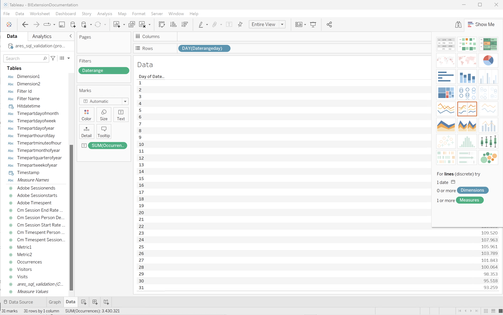

# BI 확장 사용 사례

이 문서에서는 다양한 BI 도구에서 BI 확장 기능을 사용하는 방법을 보여 주는 여러 사용 사례를 제공합니다.

다음 사용 사례가 문서화되어 있습니다.

1. [데이터 보기 연결 및 나열](#connect-and-list-data-views).
1. [일별 트렌드](#daily-trend).
1. [시간별 트렌드](#hourly-trend).
1. [월별 트렌드](#monthly-trend).
1. [순위가 매겨진 단일 차원](#single-dimension-ranked).
1. [여러 차원 등급](#multiple-dimension-ranked).
1. [고유 차원 값 계산](#count-distinct-dimension-values).
1. [날짜 범위 이름을 사용하여 필터링](#use-date-range-names-to-filter).
1. [필터 이름을 사용하여 필터링](#use-filter-names-to-filter).
1. [차원 값을 사용하여 필터링](#use-dimension-values-to-filter).
1. [정렬](#sort).
1. [제한](#limits).
1. [병합하거나 병합하지 않습니다](#to-flatten-or-not).
1. [Dimension 및 지표 변형](#dimension-and-metric-transformations).
1. [시각화 및 상호 작용](#visualizations-and-interactions).

각 사용 사례의 경우 **세부 정보** 섹션 내에서 다음 BI 도구에 대한 지침을 사용할 수 있습니다.

* Power BI 데스크탑(버전 2.136.1478.0 64비트(2024년 9월))
* Tableau Desktop(버전 2024.1.5(20241.24.0705.0334) 64비트)

지침은 이름이 **[!UICONTROL public.cc_data_view]**&#x200B;인 예제 데이터 보기, 두 개의 예제 차원(**[!UICONTROL 제품 이름]** 및 **[!UICONTROL 제품 범주]**) 및 두 개의 예제 지표(**[!UICONTROL 구매]** 및 **[!UICONTROL 구매 매출]**)를 참조합니다. 지침을 진행할 때, 해당되는 경우 특정 환경에 맞게 이러한 예제 객체를 수정합니다.

## 데이터 보기 연결 및 나열

이 사용 사례에서는 BI 도구에서 Customer Journey Analytics에 대한 연결을 설정하고 연결을 성공적으로 테스트하기 위해 사용 가능한 데이터 보기를 나열합니다.

+++ 세부 사항

>[!BEGINTABS]

>[!TAB Power BI 데스크톱]

1. Experience Platform 쿼리 서비스 UI에서 필요한 자격 증명 및 매개 변수에 액세스합니다.

   1. Experience Platform 샌드박스로 이동합니다.
   1. 왼쪽 레일에서  **[!UICONTROL 쿼리]**&#x200B;를 선택합니다.
   1. **[!UICONTROL 쿼리]** 인터페이스에서 **[!UICONTROL 자격 증명]** 탭을 선택하십시오.
   1. **[!UICONTROL 데이터베이스]** 드롭다운 메뉴에서 `prod:cja`을(를) 선택합니다.

      

1. Power BI 데스크톱을 엽니다.
1. 주 인터페이스에서 **[!UICONTROL 다른 원본에서 데이터 가져오기]**&#x200B;를 선택합니다.
1. **[!UICONTROL 데이터 가져오기]** 대화 상자에서:
   
   1. **[!UICONTROL PostgreSQL 데이터베이스]**&#x200B;를 검색하여 선택하십시오.
   1. **[!UICONTROL 연결]**&#x200B;을 선택합니다.
1. **[!UICONTROL PostgreSQL 데이터베이스]** 대화 상자에서:
   
   1. 을(를) 사용하여 Experience Platform **[!UICONTROL Query]** **[!UICONTROL 만료 자격 증명]**&#x200B;에서 **[!UICONTROL Host]** 및 **[!UICONTROL Port]** 값을 복사하여 **[!UICONTROL Server]**&#x200B;의 값으로 `:`(으)로 구분하여 붙여넣습니다. 예: `examplecompany.platform-query.adobe.io:80`.
   1. 를 사용하여 Experience Platform **[!UICONTROL 쿼리]** **[!UICONTROL 만료 자격 증명]**&#x200B;에서 **[!UICONTROL 데이터베이스]** 값을 복사하여 붙여 넣으십시오. 붙여넣은 값에 `?FLATTEN`을(를) 추가합니다. (예: `prod:cja?FLATTEN`)
   1. **[!UICONTROL DirectQuery]**&#x200B;을(를) [!UICONTROL 데이터 연결 모드](으)로 선택합니다.
   1. **[!UICONTROL 확인]**&#x200B;을 선택합니다.
1. **[!UICONTROL PostgreSQL 데이터베이스]** - **[!UICONTROL 데이터베이스]** 대화 상자에서:
   
   1. 를 사용하여 **[!UICONTROL 사용자 이름]** 및 **[!UICONTROL 암호]** 필드의 Experience Platform **[!UICONTROL 쿼리]** **[!UICONTROL 만료 자격 증명]** 패널에서 **[!UICONTROL 사용자 이름]** 및 **[!UICONTROL 암호]** 값을 복사합니다. [만료되지 않는 자격 증명](https://experienceleague.adobe.com/en/docs/experience-platform/query/ui/credentials?lang=en#use-credential-to-connect)을 사용하는 경우 만료되지 않는 자격 증명의 암호를 사용하십시오.
   1. **[!UICONTROL 이러한 설정을 적용할 수준을 선택]**&#x200B;의 드롭다운 메뉴가 이전에 정의한 **[!UICONTROL 서버]**(으)로 설정되어 있는지 확인하십시오.
   1. **[!UICONTROL 연결]**&#x200B;을 선택합니다.
1. **[!UICONTROL 탐색기]** 대화 상자에서 데이터 보기를 검색합니다. 이 검색은 시간이 걸릴 수 있습니다. 검색 후:
   
   1. 왼쪽 패널의 목록에서 **[!UICONTROL public.cc_data_view]**&#x200B;을(를) 선택합니다.
   1. **[!UICONTROL 로드]**&#x200B;를 선택합니다.
1. 잠시 후 사용 가능한 지표와 차원이 **[!UICONTROL 데이터]** 창에 표시됩니다.
   

>[!TAB 타블로 데스크톱]

1. Experience Platform 쿼리 서비스 UI에서 필요한 자격 증명 및 매개 변수에 액세스합니다.

   1. Experience Platform 샌드박스로 이동합니다.
   1. 왼쪽 레일에서  **[!UICONTROL 쿼리]**&#x200B;를 선택합니다.
   1. **[!UICONTROL 쿼리]** 인터페이스에서 **[!UICONTROL 자격 증명]** 탭을 선택하십시오.
   1. **[!UICONTROL 데이터베이스]** 드롭다운 메뉴에서 `prod:cja`을(를) 선택합니다.

      

1. 타블로를 엽니다.
1. **[!UICONTROL 서버로]** 아래의 왼쪽 레일에서 **[!UICONTROL PostgreSQL]**&#x200B;을(를) 선택하십시오. 사용할 수 없는 경우 **[!UICONTROL 자세히...]**&#x200B;를 선택하고 **[!UICONTROL 설치된 커넥터]**&#x200B;에서 **[!UICONTROL PostgreSQL]**을(를) 선택합니다.
   
1. **[!UICONTROL PostgreSQL]** 대화 상자의 **[!UICONTROL 일반]** 탭에서:
   
   1. 를 사용하여 **[!UICONTROL 호스트]**&#x200B;를 Experience Platform **[!UICONTROL 쿼리]** **[!UICONTROL 만료 자격 증명]**&#x200B;에서 **[!UICONTROL 서버]**(으)로 복사하여 붙여넣으십시오.
   1. 를 사용하여 **[!UICONTROL 포트]**&#x200B;를 Experience Platform **[!UICONTROL 쿼리]** **[!UICONTROL 만료 자격 증명]**&#x200B;에서 **[!UICONTROL 포트]**(으)로 복사하여 붙여넣으십시오.
   1. 를 사용하여 **[!UICONTROL 데이터베이스]**&#x200B;을(를) Experience Platform **[!UICONTROL 쿼리]** **[!UICONTROL 만료 자격 증명]**&#x200B;에서 **[!UICONTROL 데이터베이스]**&#x200B;로 복사하여 붙여넣으십시오. 붙여넣은 값에 `%3FFLATTEN`을(를) 추가합니다. 예: `prod:cja%3FFLATTEN`.
   1. **[!UICONTROL 인증]** 드롭다운 메뉴에서 **[!UICONTROL 사용자 이름 및 암호]**&#x200B;를 선택합니다.
   1. 를 사용하여 **[!UICONTROL 사용자 이름]**&#x200B;을(를) Experience Platform **[!UICONTROL 쿼리]** **[!UICONTROL 만료 자격 증명]**&#x200B;에서 **[!UICONTROL 사용자 이름]**(으)로 복사하여 붙여넣으십시오.
   1. 를 사용하여 Experience Platform **[!UICONTROL 쿼리]** **[!UICONTROL 만료 자격 증명]**&#x200B;에서 **[!UICONTROL 암호]**&#x200B;을(를) 복사하여 **[!UICONTROL 암호]**&#x200B;에 붙여넣으십시오. [만료되지 않는 자격 증명](https://experienceleague.adobe.com/en/docs/experience-platform/query/ui/credentials?lang=en#use-credential-to-connect)을 사용하는 경우 만료되지 않는 자격 증명의 암호를 사용하십시오.
   1. **[!UICONTROL SSL 필요]**&#x200B;가 선택되어 있는지 확인하십시오.
   1. **[!UICONTROL 로그인]**&#x200B;을 선택합니다.

   Tableau Desktop이 연결을 확인하는 동안 **[!UICONTROL 진행 중인 요청]** 대화 상자가 표시됩니다.
1. 기본 창의 왼쪽 창에 데이터 Source 보기가 표시됩니다.
   * **[!UICONTROL 연결]** 아래의 연결 이름입니다.
   * **[!UICONTROL 데이터베이스]** 아래의 데이터베이스 이름입니다.
   * **[!UICONTROL 테이블]** 아래의 테이블 목록입니다.
     
   1. **[!UICONTROL cc_data_view]** 항목을 끌어서 **[!UICONTROL 테이블을 여기로 드래그]**&#x200B;하는 기본 보기에 놓으십시오.
1. 이제 기본 창에 **[!UICONTROL cc_data_view]** 데이터 보기에 대한 세부 정보가 표시됩니다.
   

>[!ENDTABS]

+++

## 일별 트렌드

이 사용 사례에서는 2023년 1월 1일부터 2023년 1월 31일까지 발생한 일일 트렌드를 보여 주는 테이블 및 간단한 선 시각화를 표시할 수 있습니다.

+++ 세부 사항

>[!PREREQUISITES]
>
>[성공적인 연결을 확인했는지 확인하고 이 사용 사례를 시도하려는 BI 도구에 대한 데이터 보기를 나열](#connect-and-list-data-views)할 수 있습니다.
>

>[!BEGINTABS]

>[!TAB Power BI 데스크톱]

1. **[!UICONTROL 데이터]** 창:
   1. **[!UICONTROL daterangeday]** 차원을 선택하십시오.
   1. **[!UICONTROL 발생 횟수]** 지표를 선택합니다.

   현재 월의 발생 횟수를 표시하는 테이블이 표시됩니다. 더 나은 가시성을 위해 테이블 시각화를 확대하십시오.

1. **[!UICONTROL 필터]** 창:

   1. 이 시각적 개체의 **[!UICONTROL 필터]**&#x200B;에서 **[!UICONTROL 날짜 범위는 (모두)]**&#x200B;입니다.
   1. **[!UICONTROL 고급 필터링]**&#x200B;을(를) **[!UICONTROL 필터 형식]**(으)로 선택합니다.
   1. **[!UICONTROL 값이]** **[!UICONTROL 이거나]** `1/1/2023` **[!UICONTROL 이거나]** **[!UICONTROL 이거나]** `1/2/2023.` 이전인 경우 항목 표시로 필터를 정의합니다. 달력 아이콘을 사용하여 날짜를 선택하고 선택할 수 있습니다.
   1. **[!UICONTROL 필터 적용]**&#x200B;을 선택하십시오.

   적용된 **[!UICONTROL daterangeday]** 필터로 업데이트된 표가 표시됩니다.

1. **[!UICONTROL 시각화]** 창에서:

   1. **[!UICONTROL 선 차트]** 시각화를 선택하십시오.

   라인 차트 시각화는 테이블과 동일한 데이터를 사용하면서 테이블을 대체합니다.

   

1. 선 차트 시각화에서:

   1. 를 선택하세요.
   1. 컨텍스트 메뉴에서 **[!UICONTROL 표로 표시]**&#x200B;를 선택합니다.

   기본 보기가 라인 시각화와 테이블을 모두 표시하도록 업데이트되었습니다.

   

>[!TAB 타블로 데스크톱]

1. 하단의 **[!UICONTROL 시트 1]** 탭을 선택하여 **[!UICONTROL 데이터 원본]**&#x200B;에서 전환하세요. **[!UICONTROL 시트 1]** 보기에서:
   1. **[!UICONTROL 데이터]** 창의 **[!UICONTROL 테이블]** 목록에서 **[!UICONTROL Daterange]** 항목을 드래그하여 **[!UICONTROL 필터]** 선반에 놓습니다.
   1. **[!UICONTROL 필터 필드 \[Daterange\]]** 대화 상자에서 **[!UICONTROL 날짜 범위]**&#x200B;를 선택하고 **[!UICONTROL 다음 >]**&#x200B;을(를) 선택합니다.
   1. **[!UICONTROL 필터 \[날짜 범위]]** 대화 상자에서 **[!UICONTROL 날짜 범위]**&#x200B;를 선택하고 `01/01/2023` - `01/02/2023` 기간을 지정하십시오.

      

   1. **[!UICONTROL 데이터]** 창의 **[!UICONTROL 테이블]** 목록에서 **[!UICONTROL Daterangeday]**&#x200B;을(를) 끌어서 놓고 **[!UICONTROL 열]** 옆에 있는 필드에 항목을 놓습니다.
      * 값이 **[!UICONTROL DAY(Daterangeday)]**(으)로 업데이트되도록 **[!UICONTROL Daterangeday]** 드롭다운 메뉴에서 **[!UICONTROL Day]**&#x200B;을(를) 선택합니다.
   1. **[!UICONTROL 데이터]** 창의 **[!UICONTROL 테이블(*측정값 이름*)]** 목록에서 **[!UICONTROL Occurrences]**&#x200B;을(를) 끌어다 놓고 **[!UICONTROL 행]** 옆의 필드에 항목을 놓습니다.
      * 값이 **[!UICONTROL SUM(발생 횟수)]**(으)로 자동 변환됩니다.
   1. 도구 모음의 드롭다운 메뉴에서 **[!UICONTROL 표준]**&#x200B;을(를) **[!UICONTROL 전체 보기]**(으)로 수정합니다.

      시트 1 보기는 다음과 같아야 합니다.

      

1. **[!UICONTROL 시트 1]** 탭 컨텍스트 메뉴에서 **[!UICONTROL 복제]**&#x200B;를 선택하여 두 번째 시트를 만듭니다.
1. **[!UICONTROL 시트 1]** 탭 컨텍스트 메뉴에서 **[!UICONTROL 이름 바꾸기]**&#x200B;를 선택하여 시트의 이름을 `Graph`(으)로 변경합니다.
1. **[!UICONTROL 시트 1(2)]** 탭 컨텍스트 메뉴에서 **[!UICONTROL 이름 바꾸기]**&#x200B;를 선택하여 시트의 이름을 `Data`(으)로 변경합니다.
1. **[!UICONTROL 데이터]** 시트가 선택되어 있는지 확인하십시오. 데이터 보기에서:
   1. 오른쪽 상단에서 **[!UICONTROL 표시]**&#x200B;를 선택하고 **[!UICONTROL 텍스트 테이블]**(왼쪽 상단 시각화)을 선택하여 데이터 보기의 콘텐츠를 테이블로 수정합니다.
   1. **[!UICONTROL DAY(Daterangeday)]**&#x200B;를 **[!UICONTROL 열]**&#x200B;에서 **[!UICONTROL 행]**(으)로 드래그합니다.
   1. 도구 모음의 드롭다운 메뉴에서 **[!UICONTROL 표준]**&#x200B;을(를) **[!UICONTROL 전체 보기]**(으)로 수정합니다.

      **[!UICONTROL 데이터]** 보기는 다음과 같습니다.

      

1. **[!UICONTROL 새 대시보드]** 탭 단추(맨 아래)를 선택하여 새 **[!UICONTROL 대시보드 1]** 보기를 만듭니다. **[!UICONTROL 대시보드 1]** 보기에서:
   1. **[!UICONTROL Graph]** 시트를 **[!UICONTROL 시트]** 셸프에서 *여기에 시트 놓기*&#x200B;를 읽는 **[!UICONTROL 대시보드 1]** 보기로 끌어다 놓습니다.
   1. **[!UICONTROL 그래프]** 시트 아래의 **[!UICONTROL 시트]** 셸프에서 **[!UICONTROL 데이터]** 시트를 **[!UICONTROL 대시보드 1]** 보기로 끌어다 놓습니다.
   1. 보기에서 **[!UICONTROL 데이터]** 시트를 선택하고 **[!UICONTROL 전체 보기]**&#x200B;를 **[!UICONTROL 너비 수정]**(으)로 수정합니다.

      **[!UICONTROL 대시보드 1]** 보기는 다음과 같습니다.

      

>[!ENDTABS]

+++

## 시간별 트렌드

이 사용 사례에서는 2023년 1월 1일에 대한 시간별 발생 트렌드를 보여 주는 테이블 및 간단한 선 시각화를 표시할 수 있습니다.

+++ 세부 사항

>[!PREREQUISITES]
>
>[성공적인 연결을 확인했는지 확인하고 이 사용 사례를 시도하려는 BI 도구에 대한 데이터 보기를 나열](#connect-and-list-data-views)할 수 있습니다.
>

>[!BEGINTABS]

>[!TAB Power BI 데스크톱]

 Power BI이 날짜-시간 열을 처리하는 방법을 이해하지 못하므로 **[!UICONTROL daterangehour]** 및 **[!UICONTROL daterangeminute]** 같은 차원은 지원되지 않습니다. **not**.

>[!TAB 타블로 데스크톱]

1. 하단의 **[!UICONTROL 시트 1]** 탭을 선택하여 **[!UICONTROL 데이터 원본]**&#x200B;에서 전환하세요. **[!UICONTROL 시트 1]** 보기에서:
   1. **[!UICONTROL 데이터]** 창의 **[!UICONTROL 테이블]** 목록에서 **[!UICONTROL Daterange]** 항목을 드래그하여 **[!UICONTROL 필터]** 선반에 놓습니다.
   1. **[!UICONTROL 필터 필드 \[Daterange\]]** 대화 상자에서 **[!UICONTROL 날짜 범위]**&#x200B;를 선택하고 **[!UICONTROL 다음 >]**&#x200B;을(를) 선택합니다.
   1. **[!UICONTROL 필터 \[날짜 범위]]** 대화 상자에서 **[!UICONTROL 날짜 범위]**&#x200B;를 선택하고 `01/01/2023` - `02/01/2023` 기간을 지정하십시오.

      

   1. **[!UICONTROL 데이터]** 창의 **[!UICONTROL 테이블]** 목록에서 **[!UICONTROL Daterangehour]**&#x200B;을(를) 끌어서 놓고 **[!UICONTROL 열]** 옆에 있는 필드에 항목을 놓습니다.
      * 값이 **[!UICONTROL HOUR(Daterangeday)]**(으)로 업데이트되도록 **[!UICONTROL Daterangeday]** 드롭다운 메뉴에서 **[!UICONTROL 자세히]** > **[!UICONTROL 시간]**&#x200B;을(를) 선택합니다.
   1. **[!UICONTROL 데이터]** 창의 **[!UICONTROL 테이블(*측정값 이름*)]** 목록에서 **[!UICONTROL Occurrences]**&#x200B;을(를) 끌어다 놓고 **[!UICONTROL 행]** 옆의 필드에 항목을 놓습니다.
      * 값이 **[!UICONTROL SUM(발생 횟수)]**(으)로 자동 변환됩니다.
   1. 도구 모음의 드롭다운 메뉴에서 **[!UICONTROL 표준]**&#x200B;을(를) **[!UICONTROL 전체 보기]**(으)로 수정합니다.

      시트 1 보기는 다음과 같아야 합니다.

      

1. **[!UICONTROL 시트 1]** 탭 컨텍스트 메뉴에서 **[!UICONTROL 복제]**&#x200B;를 선택하여 두 번째 시트를 만듭니다.
1. **[!UICONTROL 시트 1]** 탭 컨텍스트 메뉴에서 **[!UICONTROL 이름 바꾸기]**&#x200B;를 선택하여 시트의 이름을 `Graph`(으)로 변경합니다.
1. **[!UICONTROL 시트 1(2)]** 탭 컨텍스트 메뉴에서 **[!UICONTROL 이름 바꾸기]**&#x200B;를 선택하여 시트의 이름을 `Data`(으)로 변경합니다.
1. **[!UICONTROL 데이터]** 시트가 선택되어 있는지 확인하십시오. 데이터 보기에서:
   1. 오른쪽 상단에서 **[!UICONTROL 표시]**&#x200B;를 선택하고 **[!UICONTROL 텍스트 테이블]**(왼쪽 상단 시각화)을 선택하여 데이터 보기의 콘텐츠를 테이블로 수정합니다.
   1. **[!UICONTROL HOUR(Daterangeday)]**&#x200B;을(를) **[!UICONTROL 열]**&#x200B;에서 **[!UICONTROL 행]**(으)로 드래그합니다.
   1. 도구 모음의 드롭다운 메뉴에서 **[!UICONTROL 표준]**&#x200B;을(를) **[!UICONTROL 전체 보기]**(으)로 수정합니다.

      **[!UICONTROL 데이터]** 보기는 다음과 같습니다.

      

1. **[!UICONTROL 새 대시보드]** 탭 단추(맨 아래)를 선택하여 새 **[!UICONTROL 대시보드 1]** 보기를 만듭니다. **[!UICONTROL 대시보드 1]** 보기에서:
   1. **[!UICONTROL Graph]** 시트를 **[!UICONTROL 시트]** 셸프에서 *여기에 시트 놓기*&#x200B;를 읽는 **[!UICONTROL 대시보드 1]** 보기로 끌어다 놓습니다.
   1. **[!UICONTROL 그래프]** 시트 아래의 **[!UICONTROL 시트]** 셸프에서 **[!UICONTROL 데이터]** 시트를 **[!UICONTROL 대시보드 1]** 보기로 끌어다 놓습니다.
   1. 보기에서 **[!UICONTROL 데이터]** 시트를 선택하고 **[!UICONTROL 전체 보기]**&#x200B;를 **[!UICONTROL 너비 수정]**(으)로 수정합니다.

      **[!UICONTROL 대시보드 1]** 보기는 다음과 같습니다.

      

>[!ENDTABS]

+++

## 월별 트렌드

이 사용 사례에서는 2023년 1월 1일 - 2024년 1월 1일 동안 월별 발생 트렌드를 보여주는 테이블 및 단순 선 시각화를 표시할 수 있습니다.

+++ 세부 사항

>[!PREREQUISITES]
>
>[성공적인 연결을 확인했는지 확인하고 이 사용 사례를 시도하려는 BI 도구에 대한 데이터 보기를 나열](#connect-and-list-data-views)할 수 있습니다.
>

>[!BEGINTABS]

>[!TAB Power BI 데스크톱]

1. **[!UICONTROL 데이터]** 창:
   1. **[!UICONTROL daterangemonth]** 차원을 선택합니다.
   1. **[!UICONTROL 발생 횟수]** 지표를 선택합니다.

   현재 월의 발생 횟수를 표시하는 테이블이 표시됩니다. 더 나은 가시성을 위해 테이블 시각화를 확대하십시오.

1. **[!UICONTROL 필터]** 창:

   1. 이 시각적 개체의 **[!UICONTROL 필터]**&#x200B;에서 **[!UICONTROL daterangemonth is (All)]**&#x200B;을(를) 선택하십시오.
   1. **[!UICONTROL 고급 필터링]**&#x200B;을(를) **[!UICONTROL 필터 형식]**(으)로 선택합니다.
   1. **[!UICONTROL 값이]** **[!UICONTROL 이거나]** `1/1/2023` **[!UICONTROL 이거나]** **[!UICONTROL 이거나]** `1/1/2024.` 이전인 경우 항목 표시로 필터를 정의합니다. 달력 아이콘을 사용하여 날짜를 선택하고 선택할 수 있습니다.
   1. **[!UICONTROL 필터 적용]**&#x200B;을 선택하십시오.

   적용된 **[!UICONTROL daterangeday]** 필터로 업데이트된 표가 표시됩니다.

1. **[!UICONTROL 시각화]** 창에서:

   1. **[!UICONTROL 선 차트]** 시각화를 선택하십시오.

   라인 차트 시각화는 테이블과 동일한 데이터를 사용하면서 테이블을 대체합니다.

   

1. 선 차트 시각화에서:

   1. 를 선택하세요.
   1. 컨텍스트 메뉴에서 **[!UICONTROL 표로 표시]**&#x200B;를 선택합니다.

   기본 보기가 라인 시각화와 테이블을 모두 표시하도록 업데이트되었습니다.

   

>[!TAB 타블로 데스크톱]

1. 하단의 **[!UICONTROL 시트 1]** 탭을 선택하여 **[!UICONTROL 데이터 원본]**&#x200B;에서 전환하세요. **[!UICONTROL 시트 1]** 보기에서:
   1. **[!UICONTROL 데이터]** 창의 **[!UICONTROL 테이블]** 목록에서 **[!UICONTROL Daterange]** 항목을 드래그하여 **[!UICONTROL 필터]** 선반에 놓습니다.
   1. **[!UICONTROL 필터 필드 \[Daterange\]]** 대화 상자에서 **[!UICONTROL 날짜 범위]**&#x200B;를 선택하고 **[!UICONTROL 다음 >]**&#x200B;을(를) 선택합니다.
   1. **[!UICONTROL 필터 \[날짜 범위]]** 대화 상자에서 **[!UICONTROL 날짜 범위]**&#x200B;를 선택하고 `01/01/2023` - `01/01/2024` 기간을 지정하십시오.

      

   1. **[!UICONTROL 데이터]** 창의 **[!UICONTROL 테이블]** 목록에서 **[!UICONTROL Daterangeday]**&#x200B;을(를) 끌어서 놓고 **[!UICONTROL 열]** 옆에 있는 필드에 항목을 놓습니다.
      * 값이 **[!UICONTROL MONTH(Daterangeday)]**(으)로 업데이트되도록 **[!UICONTROL Daterangeday]** 드롭다운 메뉴에서 **[!UICONTROL MONTH]**&#x200B;을(를) 선택합니다.
   1. **[!UICONTROL 데이터]** 창의 **[!UICONTROL 테이블(*측정값 이름*)]** 목록에서 **[!UICONTROL Occurrences]**&#x200B;을(를) 끌어다 놓고 **[!UICONTROL 행]** 옆의 필드에 항목을 놓습니다.
      * 값이 **[!UICONTROL SUM(발생 횟수)]**(으)로 자동 변환됩니다.
   1. 도구 모음의 드롭다운 메뉴에서 **[!UICONTROL 표준]**&#x200B;을(를) **[!UICONTROL 전체 보기]**(으)로 수정합니다.

      시트 1 보기는 다음과 같아야 합니다.

      

1. **[!UICONTROL 시트 1]** 탭 컨텍스트 메뉴에서 **[!UICONTROL 복제]**&#x200B;를 선택하여 두 번째 시트를 만듭니다.
1. **[!UICONTROL 시트 1]** 탭 컨텍스트 메뉴에서 **[!UICONTROL 이름 바꾸기]**&#x200B;를 선택하여 시트의 이름을 `Graph`(으)로 변경합니다.
1. **[!UICONTROL 시트 1(2)]** 탭 컨텍스트 메뉴에서 **[!UICONTROL 이름 바꾸기]**&#x200B;를 선택하여 시트의 이름을 `Data`(으)로 변경합니다.
1. **[!UICONTROL 데이터]** 시트가 선택되어 있는지 확인하십시오. 데이터 보기에서:
   1. 오른쪽 상단에서 **[!UICONTROL 표시]**&#x200B;를 선택하고 **[!UICONTROL 텍스트 테이블]**(왼쪽 상단 시각화)을 선택하여 데이터 보기의 콘텐츠를 테이블로 수정합니다.
   1. **[!UICONTROL MONTH(Daterangeday)]**&#x200B;을(를) **[!UICONTROL 열]**&#x200B;에서 **[!UICONTROL 행]**(으)로 드래그합니다.
   1. 도구 모음의 드롭다운 메뉴에서 **[!UICONTROL 표준]**&#x200B;을(를) **[!UICONTROL 전체 보기]**(으)로 수정합니다.

      **[!UICONTROL 데이터]** 보기는 다음과 같습니다.

      

1. **[!UICONTROL 새 대시보드]** 탭 단추(맨 아래)를 선택하여 새 **[!UICONTROL 대시보드 1]** 보기를 만듭니다. **[!UICONTROL 대시보드 1]** 보기에서:
   1. **[!UICONTROL Graph]** 시트를 **[!UICONTROL 시트]** 셸프에서 *여기에 시트 놓기*&#x200B;를 읽는 **[!UICONTROL 대시보드 1]** 보기로 끌어다 놓습니다.
   1. **[!UICONTROL 그래프]** 시트 아래의 **[!UICONTROL 시트]** 셸프에서 **[!UICONTROL 데이터]** 시트를 **[!UICONTROL 대시보드 1]** 보기로 끌어다 놓습니다.
   1. 보기에서 **[!UICONTROL 데이터]** 시트를 선택하고 **[!UICONTROL 전체 보기]**&#x200B;를 **[!UICONTROL 너비 수정]**(으)로 수정합니다.

      **[!UICONTROL 대시보드 1]** 보기는 다음과 같습니다.

      

>[!ENDTABS]

+++

## 단일 차원 등급

사용 사례 시놉시스

+++ 세부 사항

>[!PREREQUISITES]
>
>[성공적인 연결을 확인했는지 확인하고 이 사용 사례를 시도하려는 BI 도구에 대한 데이터 보기를 나열](#connect-and-list-data-views)할 수 있습니다.
>

>[!BEGINTABS]

>[!TAB Power BI 데스크톱]

단계

>[!TAB 타블로 데스크톱]

단계

>[!ENDTABS]

+++

## 여러 차원 등급

사용 사례 시놉시스

+++ 세부 사항

>[!BEGINTABS]

>[!TAB Power BI 데스크톱]

단계

>[!TAB 타블로 데스크톱]

단계

>[!ENDTABS]

+++

## 고유 차원 값 계산

사용 사례 시놉시스

+++ 세부 사항

>[!BEGINTABS]

>[!TAB Power BI 데스크톱]

단계

>[!TAB 타블로 데스크톱]

단계

>[!ENDTABS]

+++

## 날짜 범위 이름을 사용하여 필터링

사용 사례 시놉시스

+++ 세부 사항

>[!BEGINTABS]

>[!TAB Power BI 데스크톱]

단계

>[!TAB 타블로 데스크톱]

단계

>[!ENDTABS]

+++

## 필터 이름을 사용하여 필터링

사용 사례 시놉시스

+++ 세부 사항

>[!BEGINTABS]

>[!TAB Power BI 데스크톱]

단계

>[!TAB 타블로 데스크톱]

단계

>[!ENDTABS]

+++

## 차원 값을 사용하여 필터링

사용 사례 시놉시스

+++ 세부 사항

>[!BEGINTABS]

>[!TAB Power BI 데스크톱]

단계

>[!TAB 타블로 데스크톱]

단계

>[!ENDTABS]

+++

## 정렬

사용 사례 시놉시스

+++ 세부 사항

>[!BEGINTABS]

>[!TAB Power BI 데스크톱]

단계

>[!TAB 타블로 데스크톱]

단계

>[!ENDTABS]

+++

## 제한

사용 사례 시놉시스

+++ 세부 사항

>[!BEGINTABS]

>[!TAB Power BI 데스크톱]

단계

>[!TAB 타블로 데스크톱]

단계

>[!ENDTABS]

+++

## 평면화할지 말지

사용 사례 시놉시스

+++ 세부 사항

>[!BEGINTABS]

>[!TAB Power BI 데스크톱]

단계

>[!TAB 타블로 데스크톱]

단계

>[!ENDTABS]

+++

## Dimension 및 지표 변형

사용 사례 시놉시스

+++ 세부 사항

>[!BEGINTABS]

>[!TAB Power BI 데스크톱]

단계

>[!TAB 타블로 데스크톱]

단계

>[!ENDTABS]

+++

## 시각화 및 상호 작용

사용 사례 시놉시스

+++ 세부 사항

>[!BEGINTABS]

>[!TAB Power BI 데스크톱]

단계

>[!TAB 타블로 데스크톱]

단계

>[!ENDTABS]

+++

