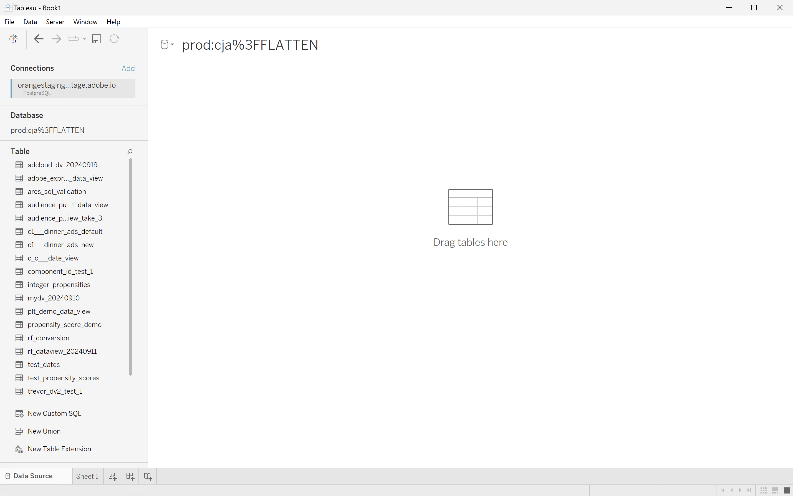
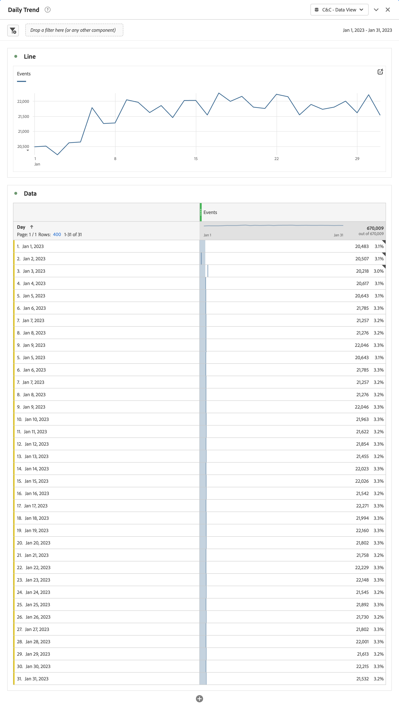
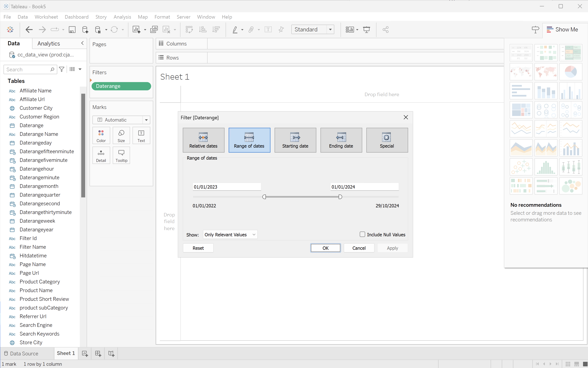
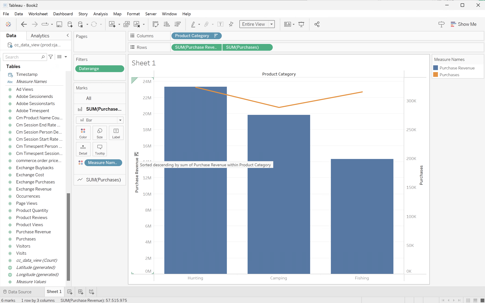

# BI 확장 기능 사용 사례

이 문서에서는 Customer Journey Analytics BI 확장을 사용하여 다양한 사용 사례를 완수하는 방법을 설명합니다. 각 사용 사례에서는 Customer Journey Analytics 기능에 대해 설명하고 지원되는 각 BI 도구에 대한 세부 정보를 제공합니다.

* **Power BI 데스크톱**. 사용된 버전은 2.137.1102.0 64비트(2024년 10월)입니다.
* **타블로 데스크톱**. 사용된 버전은 2024.1.5(20241.24.0705.0334) 64비트입니다.
* **조회자**. 온라인 버전 25.0.23([looker.com](https://looker.com){target="_blank"}을 통해 사용 가능)
* **Jupyter 전자 필기장**. 사용된 버전은 7.3.2입니다.
* **자습서**. 사용된 버전은 2024.12.0, 빌드 467입니다.

다음 사용 사례가 문서화되어 있습니다.

* **연결**
   * [데이터 보기 연결 및 나열](#connect-and-validate)

* **보고 및 분석**
   * [일별 트렌드](#daily-trend)
   * [시간별 트렌드](#hourly-trend)
   * [월별 트렌드](#monthly-trend)
   * [단일 차원 등급](#single-dimension-ranked)
   * [여러 차원 등급](#multiple-dimension-ranked)
   * [고유 차원 값 계산](#count-distinct-dimension-values)
   * [날짜 범위 이름을 사용하여 필터링](#use-date-range-names-to-filter)
   * [필터 이름을 사용하여 필터링](#use-filter-names-to-filter)
   * [차원 값을 사용하여 필터링](#use-dimension-values-to-filter)
   * [정렬](#sort)
   * [제한](#limits)

* **이해**

   * [변형](#transformations)
   * [시각화](#visualizations)
   * [주의 사항](#caveats)

**연결** 사용 사례는 Customer Journey Analytics BI 확장을 사용하여 BI 도구를 연결하는 방법에 중점을 둡니다.

**보고서 및 분석** 사용 사례에서는 현재 지원되는 BI 도구에서 유사한 Customer Journey Analytics 시각화를 수행하는 방법을 지시합니다.

**이해** 사용 사례에서 자세한 내용을 확인할 수 있습니다.

* BI 도구를 사용하여 보고하고 분석할 때 발생하는 변형입니다.
* Customer Journey Analytics 도구와 BI 도구 간의 시각화 유사성 및 차이점.
* 알고 있어야 하는 각 BI 도구에 대한 주의 사항.


## 연결 및 유효성 검사

이 사용 사례에서는 BI 도구에서 Customer Journey Analytics으로의 연결을 설정하고 사용 가능한 데이터 보기를 나열하며 사용할 데이터 보기를 선택합니다.

+++ Customer Journey Analytics

지침은 다음 개체가 있는 예제 환경을 참조합니다.

* 데이터 보기: **[!UICONTROL C&amp;C - 데이터 보기]** ??.
* 차원: **[!UICONTROL 제품 이름]** ?? 및 **[!UICONTROL 제품 범주]** ??.
* 지표: **[!UICONTROL 구매 매출]** ?? 및 **[!UICONTROL 구매]** ??.
* 필터: **[!UICONTROL 낚시 제품]** ??.

{zoomable="yes"}

사용 사례를 살펴볼 때 이러한 예제 객체를 특정 환경에 적합한 객체로 바꾸십시오.

+++

+++ BI 도구

>[!BEGINTABS]

>[!TAB Power BI 데스크톱]

1. Experience Platform 쿼리 서비스 UI에서 필요한 자격 증명 및 매개 변수에 액세스합니다.

   1. Experience Platform 샌드박스로 이동합니다.
   1. 왼쪽 레일에서  **[!UICONTROL 쿼리]**&#x200B;를 선택합니다.
   1. **[!UICONTROL 쿼리]** 인터페이스에서 **[!UICONTROL 자격 증명]** 탭을 선택하십시오.
   1. **[!UICONTROL 데이터베이스]** 드롭다운 메뉴에서 `prod:cja`을(를) 선택합니다.

      {zoomable="yes"}

1. Power BI Desktop을 시작합니다.
   1. 주 인터페이스에서 **[!UICONTROL 다른 원본에서 데이터 가져오기]**&#x200B;를 선택합니다.
   1. **[!UICONTROL 데이터 가져오기]** 대화 상자에서:
      {zoomable="yes"}
      1. **[!UICONTROL PostgreSQL 데이터베이스]**&#x200B;를 검색하여 선택하십시오.
      1. **[!UICONTROL 연결]**&#x200B;을 선택합니다.
   1. **[!UICONTROL PostgreSQL 데이터베이스]** 대화 상자에서:
      {zoomable="yes"}
      1. 를 사용하여 **[!UICONTROL Server]**&#x200B;의 값으로 `:`(으)로 구분된 Experience Platform **[!UICONTROL 쿼리]** **[!UICONTROL 만료 자격 증명]** 패널의 **[!UICONTROL 호스트]** 및 **[!UICONTROL 포트]** 값을 복사하여 붙여넣으십시오. 예: `examplecompany.platform-query.adobe.io:80`.
      1. 를 사용하여 Experience Platform **[!UICONTROL 쿼리]** **[!UICONTROL 만료 자격 증명]** 패널에서 **[!UICONTROL 데이터베이스]** 값을 복사하여 붙여 넣으십시오. 붙여넣은 값에 `?FLATTEN`을(를) 추가합니다. (예: `prod:cja?FLATTEN`)
      1. **[!UICONTROL DirectQuery]**&#x200B;을(를) **[!UICONTROL 데이터 연결 모드]**(으)로 선택합니다.
      1. **[!UICONTROL 확인]**&#x200B;을 선택합니다.
   1. **[!UICONTROL PostgreSQL 데이터베이스]** - **[!UICONTROL 데이터베이스]** 대화 상자에서:
      {zoomable="yes"}
      1. 를 사용하여 **[!UICONTROL 사용자 이름]** 및 **[!UICONTROL 암호]** 필드의 Experience Platform **[!UICONTROL 쿼리]** **[!UICONTROL 만료 자격 증명]** 패널에서 **[!UICONTROL 사용자 이름]** 및 **[!UICONTROL 암호]** 값을 복사합니다. [만료되지 않는 자격 증명](https://experienceleague.adobe.com/en/docs/experience-platform/query/ui/credentials?lang=en#use-credential-to-connect)을 사용하는 경우 만료되지 않는 자격 증명의 암호를 사용하십시오.
      1. **[!UICONTROL 이러한 설정을 적용할 수준을 선택]**&#x200B;의 드롭다운 메뉴가 이전에 정의한 **[!UICONTROL 서버]**(으)로 설정되어 있는지 확인하십시오.
      1. **[!UICONTROL 연결]**&#x200B;을 선택합니다.
   1. **[!UICONTROL 탐색기]** 대화 상자에서 데이터 보기를 검색합니다. 이 검색은 시간이 걸릴 수 있습니다. 검색하면 Power BI Desktop에 다음 내용이 표시됩니다.
      {zoomable="yes"}
      1. 왼쪽 패널의 목록에서 **[!UICONTROL public.cc_data_view]**&#x200B;을(를) 선택합니다.
      1. 두 가지 옵션이 있습니다.
         1. **[!UICONTROL 로드]**&#x200B;를 선택하여 설치를 계속하고 완료합니다.
         1. **[!UICONTROL 데이터 변환]**을 선택합니다. 구성의 일부로 변환을 선택적으로 적용할 수 있는 대화 상자가 표시됩니다.
            {zoomable="yes"}
            * **[!UICONTROL 닫기 및 적용]**&#x200B;을 선택합니다.
   1. 잠시 후 **[!UICONTROL public.cc_data_view]**&#x200B;이(가) **[!UICONTROL 데이터]** 창에 표시됩니다. 차원 및 지표를 표시하려면 를 선택하십시오.
      {zoomable="yes"}


### 평면화할지 말지

Power BI Desktop은 `FLATTEN` 매개 변수에 대해 다음 시나리오를 지원합니다. 자세한 내용은 [중첩된 데이터 정리](https://experienceleague.adobe.com/en/docs/experience-platform/query/key-concepts/flatten-nested-data)를 참조하십시오.

| 평면화 매개 변수 | 예 | 지원됨 | 비고 |
|---|---|:---:|---|
| 없음 | `prod:cja` |  | |
| `?FLATTEN` | `prod:cja?FLATTEN` |  | **사용할 권장 옵션!** |
| `%3FFLATTEN` | `prod:cja%3FFLATTEN` |  | Power BI Desktop에 오류가 표시됩니다. **[!UICONTROL 제공된 자격 증명으로 인증할 수 없습니다. 다시 시도하십시오.]** |

### 추가 정보

* [사전 요구 사항](/help/data-views/bi-extension.md#prerequisites)
* [자격 증명 가이드](https://experienceleague.adobe.com/en/docs/experience-platform/query/ui/credentials)
* [쿼리 서비스에 Power BI 연결](https://experienceleague.adobe.com/en/docs/experience-platform/query/clients/power-bi).


>[!TAB 타블로 데스크톱]

1. Experience Platform 쿼리 서비스 UI에서 필요한 자격 증명 및 매개 변수에 액세스합니다.

   1. Experience Platform 샌드박스로 이동합니다.
   1. 왼쪽 레일에서  **[!UICONTROL 쿼리]**&#x200B;를 선택합니다.
   1. **[!UICONTROL 쿼리]** 인터페이스에서 **[!UICONTROL 자격 증명]** 탭을 선택하십시오.
   1. **[!UICONTROL 데이터베이스]** 드롭다운 메뉴에서 `prod:cja`을(를) 선택합니다.

      {zoomable="yes"}

1. 타블로를 시작합니다.
   1. **[!UICONTROL 서버로]** 아래의 왼쪽 레일에서 **[!UICONTROL PostgreSQL]**&#x200B;을(를) 선택하십시오. 사용할 수 없는 경우 **[!UICONTROL 자세히...]**&#x200B;를 선택하고 **[!UICONTROL 설치된 커넥터]**&#x200B;에서 **[!UICONTROL PostgreSQL]**을(를) 선택합니다.
      {zoomable="yes"}
   1. **[!UICONTROL PostgreSQL]** 대화 상자의 **[!UICONTROL 일반]** 탭에서:
      {zoomable="yes"}
      1. 를 사용하여 **[!UICONTROL 호스트]**&#x200B;를 Experience Platform **[!UICONTROL 쿼리]** **[!UICONTROL 만료 자격 증명]** 패널에서 **[!UICONTROL 서버]**&#x200B;로 복사하여 붙여넣으십시오.
      1. 를 사용하여 **[!UICONTROL 포트]**&#x200B;를 Experience Platform **[!UICONTROL 쿼리]** **[!UICONTROL 만료 자격 증명]** 패널에서 **[!UICONTROL 포트]**(으)로 복사하여 붙여넣으십시오.
      1. 를 사용하여 **[!UICONTROL 데이터베이스]**&#x200B;을(를) Experience Platform **[!UICONTROL 쿼리]** **[!UICONTROL 만료 자격 증명]** 패널에서 **[!UICONTROL 데이터베이스]**(으)로 복사하여 붙여넣으십시오. 붙여넣은 값에 `%3FFLATTEN`을(를) 추가합니다. 예: `prod:cja%3FFLATTEN`.
      1. **[!UICONTROL 인증]** 드롭다운 메뉴에서 **[!UICONTROL 사용자 이름 및 암호]**&#x200B;를 선택합니다.
      1. 를 사용하여 **[!UICONTROL 사용자 이름]**&#x200B;을(를) Experience Platform **[!UICONTROL 쿼리]** **[!UICONTROL 만료 자격 증명]** 패널에서 **[!UICONTROL 사용자 이름]**(으)로 복사하여 붙여넣으십시오.
      1. 를 사용하여 Experience Platform **[!UICONTROL 쿼리]** **[!UICONTROL 만료 자격 증명]** 패널에서 **[!UICONTROL 암호]**&#x200B;를 복사하여 **[!UICONTROL 암호]**&#x200B;에 붙여넣으십시오. [만료되지 않는 자격 증명](https://experienceleague.adobe.com/en/docs/experience-platform/query/ui/credentials?lang=en#use-credential-to-connect)을 사용하는 경우 만료되지 않는 자격 증명의 암호를 사용하십시오.
      1. **[!UICONTROL SSL 필요]**&#x200B;가 선택되어 있는지 확인하십시오.
      1. **[!UICONTROL 로그인]**&#x200B;을 선택합니다.

      Tableau Desktop이 연결을 확인하는 동안 **[!UICONTROL 진행 중인 요청]** 대화 상자가 표시됩니다.
   1. 기본 창의 왼쪽 창에 **[!UICONTROL 데이터 Source]** 페이지가 표시됩니다.
      * **[!UICONTROL 연결]** 아래의 연결 이름입니다.
      * **[!UICONTROL 데이터베이스]** 아래의 데이터베이스 이름입니다.
      * **[!UICONTROL 테이블]** 아래의 테이블 목록입니다.
        {zoomable="yes"}
      1. **[!UICONTROL cc_data_view]** 항목을 끌어서 **[!UICONTROL 테이블을 여기로 드래그]**&#x200B;하는 기본 보기에 놓으십시오.
   1. 기본 창에 **[!UICONTROL cc_data_view]** 데이터 보기의 세부 정보가 표시됩니다.
      {zoomable="yes"}

### 평면화할지 말지

Tableau Desktop은 `FLATTEN` 매개 변수에 대해 다음 시나리오를 지원합니다. 자세한 내용은 [중첩된 데이터 정리](https://experienceleague.adobe.com/en/docs/experience-platform/query/key-concepts/flatten-nested-data)를 참조하십시오.

| 평면화 매개 변수 | 예 | 지원됨 | 비고 |
|---|---|:---:|---|
| 없음 | `prod:cja` |  | |
| `?FLATTEN` | `prod:cja?FLATTEN` |  | |
| `%3FFLATTEN` | `prod:cja%3FFLATTEN` |  | **사용할 권장 옵션**. `%3FFLATTEN`은(는) `?FLATTEN`의 URL 인코딩 버전입니다. |

### 추가 정보

* [사전 요구 사항](/help/data-views/bi-extension.md#prerequisites)
* [자격 증명 가이드](https://experienceleague.adobe.com/en/docs/experience-platform/query/ui/credentials)
* [쿼리 서비스에 타블로 데스크톱 연결](https://experienceleague.adobe.com/en/docs/experience-platform/query/clients/tableau).


>[!TAB 조회자]

1. Experience Platform 쿼리 서비스 UI에서 필요한 자격 증명 및 매개 변수에 액세스합니다.

   1. Experience Platform 샌드박스로 이동합니다.
   1. 왼쪽 레일에서  **[!UICONTROL 쿼리]**&#x200B;를 선택합니다.
   1. **[!UICONTROL 쿼리]** 인터페이스에서 **[!UICONTROL 자격 증명]** 탭을 선택하십시오.
   1. **[!UICONTROL 데이터베이스]** 드롭다운 메뉴에서 `prod:cja`을(를) 선택합니다.

      {zoomable="yes"}

1. Looker에 로그인

   1. 왼쪽 레일에서 **[!UICONTROL 관리자]**&#x200B;를 선택합니다.
   1. **[!UICONTROL 연결]**&#x200B;을 선택하세요.
   1. **[!UICONTROL 연결 추가]**&#x200B;를 선택합니다.
   1. **[!UICONTROL Looker 화면에 데이터베이스를 연결]**&#x200B;합니다.

      {zoomable="yes"}

      1. 연결에 대한 **[!UICONTROL 이름]**(예: `Example Looker Connection`)을 입력하십시오.
      1. **[!UICONTROL 모든 프로젝트]**&#x200B;가 **[!UICONTROL 연결 범위]**(으)로 선택되었는지 확인하십시오.
      1. 방언으로 **[!UICONTROL PostgreSQL 9.5+]**&#x200B;을(를) 선택합니다.
      1. 을(를) 사용하여 Experience Platform **[!UICONTROL Query]** **[!UICONTROL 만료되는 자격 증명]** 패널에서 **[!UICONTROL Host]** 값을 **[!UICONTROL Host]** 값으로 복사하여 붙여넣으십시오. 예: `examplecompany.platform-query.adobe.io`.
      1. 을(를) 사용하여 Experience Platform **[!UICONTROL Query]** **[!UICONTROL 만료되는 자격 증명]** 패널의 **[!UICONTROL Port]** 값을 **[!UICONTROL Port]** 값으로 복사하여 붙여넣으십시오. 예: `80`.
      1. 를 사용하여 Experience Platform **[!UICONTROL 쿼리]** **[!UICONTROL 만료 자격 증명]** 패널에서 **[!UICONTROL 데이터베이스]** 값을 **[!UICONTROL 데이터베이스]**&#x200B;의 값으로 복사하여 붙여넣으십시오. 붙여넣은 값에 `%3FFLATTEN`을(를) 추가합니다. (예: `prod:cja%3FFLATTEN`)
      1. 를 사용하여 Experience Platform **[!UICONTROL 쿼리]** **[!UICONTROL 만료 자격 증명]** 패널에서 **[!UICONTROL 사용자 이름]** 값을 **[!UICONTROL 사용자 이름]** 값으로 복사하여 붙여넣으십시오.
      1. 를 사용하여 Experience Platform **[!UICONTROL 쿼리]** **[!UICONTROL 만료 자격 증명]** 패널에서 **[!UICONTROL 암호]** 값을 **[!UICONTROL 암호]** 값으로 복사하여 붙여넣으십시오.
      1. **[!UICONTROL 선택적 설정]**&#x200B;에서 **[!UICONTROL 모두 확장]**&#x200B;을 선택합니다.
      1. 노드당 **[!UICONTROL 최대 연결]**&#x200B;을(를) `5`(으)로 설정합니다.
      1. **[!UICONTROL SSL]**&#x200B;이 사용하도록 설정되어 있는지 확인하십시오.
      1. 연결을 테스트하려면 **[!UICONTROL 테스트]**&#x200B;를 선택하십시오. 화면 맨 위에 **[!UICONTROL 성공, JDBC ....]**&#x200B;에 연결할 수 있음 등의 메시지가 표시된 배너가 표시됩니다.
      1. **[!UICONTROL 연결]**&#x200B;을 선택하여 연결을 설정하고 저장합니다.
   1. **[!UICONTROL 연결]** 인터페이스에 새 연결이 표시됩니다.
   1. 왼쪽 레일에서 기본 탐색으로 이동하려면 **[!UICONTROL 관리자]**&#x200B;에서 **←**&#x200B;을(를) 선택하십시오.
   1. **[!UICONTROL 개발]**&#x200B;을 선택합니다.
   1. **[!UICONTROL 프로젝트]**&#x200B;을(를) 선택하십시오.
   1. LookML 프로젝트에서 **[!UICONTROL 새 모델]**&#x200B;을(를) 선택하십시오.
   1. 다른 사용자에게 영향을 주지 않도록 합니다. 메시지가 표시되면 개발 모드 시작 을 선택합니다.
   1. **[!UICONTROL 모델 만들기]** 경험에서:
      1. **[!UICONTROL ➊에서 데이터베이스 연결 선택]**:
         1. **[!UICONTROL 데이터베이스 연결 선택]**&#x200B;에서 데이터베이스 연결을 선택하십시오. 예: **[!UICONTROL example_looker_connection]**.
         1. **[!UICONTROL 이 모델에 대한 새 LookML 프로젝트 만들기]**&#x200B;에서 프로젝트 이름을 지정하십시오. `example: example_looker_project`용.
         1. **[!UICONTROL 다음]**&#x200B;을 선택합니다.
      1. **[!UICONTROL ➋에서 테이블 선택]**:
         1. **[!UICONTROL 공개]**&#x200B;를 선택한 다음 Customer Journey Analytics 데이터 보기를 선택하십시오. 예:  **[!UICONTROL cc_data_view]**.
         1. **[!UICONTROL 다음]**&#x200B;을 선택합니다.
      1. **[!UICONTROL ➌에서 기본 키 선택]**:
         1. **[!UICONTROL 다음]**&#x200B;을 선택합니다.
      1. **[!UICONTROL 에서 ➍ 만들 탐색기를 선택]**:
         1. 보기를 선택해야 합니다. 예: **[!UICONTROL cc_data_view.view]**.
         1. **[!UICONTROL 다음]**&#x200B;을 선택합니다.
      1. **[!UICONTROL ➎에 모델 이름을 입력하십시오]**:
         1. 모델 이름을 지정합니다. 예: `example_looker_model`.
      1. **[!UICONTROL 완료 및 데이터 탐색]**&#x200B;을 선택합니다.

   Looker의 **[!UICONTROL Explore]** 인터페이스로 리디렉션되어 데이터를 탐색할 수 있습니다.


### 평면화할지 말지

Looker는 `FLATTEN` 매개 변수에 대해 다음 시나리오를 지원합니다. 자세한 내용은 [중첩된 데이터 정리](https://experienceleague.adobe.com/en/docs/experience-platform/query/key-concepts/flatten-nested-data)를 참조하십시오.

| 평면화 매개 변수 | 예 | 지원됨 | 비고 |
|---|---|:---:|---|
| 없음 | `prod:cja` |  | |
| `?FLATTEN` | `prod:cja?FLATTEN` |  | |
| `%3FFLATTEN` | `prod:cja%3FFLATTEN` |  | **사용할 권장 옵션**. `%3FFLATTEN`은(는) `?FLATTEN`의 URL 인코딩 버전입니다. |

### 추가 정보

* [사전 요구 사항](/help/data-views/bi-extension.md#prerequisites)
* [자격 증명 가이드](https://experienceleague.adobe.com/en/docs/experience-platform/query/ui/credentials)


>[!TAB Jupyter 전자 필기장]

1. Experience Platform 쿼리 서비스 UI에서 필요한 자격 증명 및 매개 변수에 액세스합니다.

   1. Experience Platform 샌드박스로 이동합니다.
   1. 왼쪽 레일에서  **[!UICONTROL 쿼리]**&#x200B;를 선택합니다.
   1. **[!UICONTROL 쿼리]** 인터페이스에서 **[!UICONTROL 자격 증명]** 탭을 선택하십시오.
   1. **[!UICONTROL 데이터베이스]** 드롭다운 메뉴에서 `prod:cja`을(를) 선택합니다.

      {zoomable="yes"}

1. Jupyter Notebook 환경을 실행하기 위한 전용 Python 가상 환경을 설정했는지 확인하십시오.
1. 가상 환경에 필요한 라이브러리를 설치했는지 확인합니다.
   * ipython-sql: `pip install ipython-sql`.
   * psycopg2-binary: `pip install psycopg-binary`.
   * sqlalchemy: pip `install sqlalchemy`.

1. 가상 환경 `jupyter notebook`에서 Jupyter Notebook을 시작합니다.
1. 새 전자 필기장을 만들거나 [이 샘플 전자 필기장](assets/BI-Extension.ipynb.zip)을 다운로드하세요.
1. 첫 번째 셀에 다음을 입력하고 실행합니다.

   ```
   %config SqlMagic.style = '_DEPRECATED_DEFAULT'
   ```

1. 새 셀에 연결에 대한 구성 매개 변수를 입력합니다. 를 사용하여 Experience Platform **[!UICONTROL 쿼리]** **[!UICONTROL 만료 자격 증명]** 패널의 값을 구성 매개 변수에 필요한 값으로 복사하고 붙여 넣습니다. 예:

   ```
   import ipywidgets as widgets
   from IPython.display import display
   
   config_host = widgets.Text(description='Host:', value='example.platform-query-stage.adobe.io',
                           layout=widgets.Layout(width="600px"))
   display(config_host)
   config_port = widgets.IntText(description='Port:', value=80,
                              layout=widgets.Layout(width="200px"))
   display(config_port)
   config_db = widgets.Text(description='Database:', value='prod:cja',
                         layout=widgets.Layout(width="300px"))
   display(config_db)
   config_username = widgets.Text(description='Username:', value='EC582F955C8A79F70A49420E@AdobeOrg',
                               layout=widgets.Layout(width="600px"))
   display(config_username)
   config_password = widgets.Password(description='Password:', value='***',
                                   layout=widgets.Layout(width="600px"))
   display(config_password)
   ```

1. 셀을 실행합니다.
1. 를 사용하여 Experience Platform **[!UICONTROL 쿼리]** **[!UICONTROL 만료 자격 증명]** 패널에서 Jupyter Notebook의 **[!UICONTROL 암호]** 필드로 암호를 복사하여 붙여넣으십시오.

   

1. 새 셀에서 SQL 확장, 필수 라이브러리를 로드하고 Customer Journey Analytics과 연결할 명령문을 입력합니다.

   ```python
   %load_ext sql
   from sqlalchemy import create_engine
   %sql postgresql://{config_username.value}:{config_password.value}@{config_host.value}:{config_port.value}/{config_db.value}?sslmode=require
   ```

   셸을 실행합니다. 출력은 표시되지 않지만 셀은 경고 없이 실행됩니다.

   

1. 새 호출에서 문을 입력하여 연결에 따라 사용 가능한 데이터 보기 목록을 가져옵니다.

   ```python
   %%sql
   SELECT n.nspname as "Schema",
      c.relname as "Name",
      CASE c.relkind WHEN 'r' THEN 'table' WHEN 'v' THEN 'view' WHEN 'm' THEN 'materialized view' WHEN 'i' THEN 'index' WHEN 'S' THEN 'sequence' WHEN 's' THEN 'special' WHEN 't' THEN 'TOAST table' WHEN 'f' THEN 'foreign table' WHEN 'p' THEN 'partitioned table' WHEN 'I' THEN 'partitioned index' END as "Type",
      pg_catalog.pg_get_userbyid(c.relowner) as "Owner"
   FROM pg_catalog.pg_class c
   LEFT JOIN pg_catalog.pg_namespace n ON n.oid = c.relnamespace
   WHERE c.relkind IN ('v','')
      AND n.nspname <> 'pg_catalog'
      AND n.nspname !~ '^pg_toast'
      AND n.nspname <> 'information_schema'
      AND pg_catalog.pg_table_is_visible(c.oid)
      AND c.relname NOT LIKE '%test%'
      AND c.relname NOT LIKE '%ajo%'
   ORDER BY 1,2;
   ```

   셸을 실행합니다. 아래 스크린샷과 유사한 출력이 표시됩니다.

   

   데이터 보기 목록에 **[!UICONTROL cc_data_view]**&#x200B;이(가) 표시됩니다.

### 평면화할지 말지

Jupyter Notebook은 `FLATTEN` 매개 변수에 대해 다음 시나리오를 지원합니다. 자세한 내용은 [중첩된 데이터 정리](https://experienceleague.adobe.com/en/docs/experience-platform/query/key-concepts/flatten-nested-data)를 참조하십시오.

| 평면화 매개 변수 | 예 | 지원됨 | 비고 |
|---|---|:---:|---|
| 없음 | `prod:cja` |  | |
| `?FLATTEN` | `prod:cja?FLATTEN` |  | |
| `%3FFLATTEN` | `prod:cja%3FFLATTEN` |  | **사용할 권장 옵션**. `%3FFLATTEN`은(는) `?FLATTEN`의 URL 인코딩 버전입니다. |

### 추가 정보

* [사전 요구 사항](/help/data-views/bi-extension.md#prerequisites)
* [자격 증명 가이드](https://experienceleague.adobe.com/en/docs/experience-platform/query/ui/credentials)

>[!TAB 자습서]

1. Experience Platform 쿼리 서비스 UI에서 필요한 자격 증명 및 매개 변수에 액세스합니다.

   1. Experience Platform 샌드박스로 이동합니다.
   1. 왼쪽 레일에서  **[!UICONTROL 쿼리]**&#x200B;를 선택합니다.
   1. **[!UICONTROL 쿼리]** 인터페이스에서 **[!UICONTROL 자격 증명]** 탭을 선택하십시오.
   1. **[!UICONTROL 데이터베이스]** 드롭다운 메뉴에서 `prod:cja`을(를) 선택합니다.

      {zoomable="yes"}

1. RStudio를 시작합니다.
1. 새 R Markdown 파일을 만들거나 [이 예제 R Markdown 파일](assets/BI-Extension.Rmd.zip)을 다운로드합니다.
1. 첫 번째 청크에 ` ```{r} `과(와) ` ``` ` 사이의 다음 문을 입력하십시오. 를 사용하여 Experience Platform **[!UICONTROL 쿼리]** **[!UICONTROL 만료 자격 증명]** 패널의 값을 `host`, `dbname`, `user` 등의 다양한 매개 변수에 필요한 값으로 복사하고 붙여넣으십시오. 예:

   ```R
   library(rstudioapi)
   library(DBI)
   library(dplyr)
   library(tidyr)
   library(RPostgres)
   library(ggplot2)
   
   host <- rstudioapi::showPrompt(title = "Host", message = "Host", default = "orangestagingco.platform-query-stage.adobe.io")
   dbname <- rstudioapi::showPrompt(title = "Database", message = "Database", default = "prod:cja?FLATTEN")
   user <- rstudioapi::showPrompt(title = "Username", message = "Username", default = "EC582F955C8A79F70A49420E@AdobeOrg")
   password <- rstudioapi::askForPassword(prompt = "Password")
   ```

1. 청크를 실행합니다. **[!UICONTROL 호스트]**, **[!UICONTROL 데이터베이스]** 및 **[!UICONTROL 사용자]**&#x200B;를 묻는 메시지가 표시됩니다. 이전 단계의 일부로 제공한 값을 수락하면 됩니다.
1. 를 사용하여 Experience Platform **[!UICONTROL 쿼리]** **[!UICONTROL 만료 자격 증명]** 패널에서 RStudio의 **[!UICONTROL 암호]** 대화 상자 프롬프트로 암호를 복사하고 붙여넣으십시오.

   

1. 새 청크를 만들고 ` ``` {r} `에서 ` ``` ` 사이의 다음 문을 입력하십시오.

   ```R
   con <- dbConnect(
      RPostgres::Postgres(),
      host = host,
      port = 80,
      dbname = dbname,
      user = user,
      password = password,
      sslmode = 'require'
   )
   ```

1. 청크를 실행합니다. 연결에 성공하면 출력이 표시되지 않습니다.


1. 새 청크를 만들고 ` ``` {r} `에서 ` ``` ` 사이의 다음 문을 입력하십시오.

   ```R
   views <- dbListTables(con)
   print(views)
   ```

1. 청크를 실행합니다. `character(0)`이(가) 유일한 출력으로 표시됩니다.


1. 새 청크를 만들고 ` ``` {r} `에서 ` ``` ` 사이의 다음 문을 입력하십시오.

   ```R
   glimpse(dv)
   ```

1. 청크를 실행합니다. 아래 스크린샷과 유사한 출력이 표시됩니다.

   

### 평면화할지 말지

RStudio는 `FLATTEN` 매개 변수에 대해 다음 시나리오를 지원합니다. 자세한 내용은 [중첩된 데이터 정리](https://experienceleague.adobe.com/en/docs/experience-platform/query/key-concepts/flatten-nested-data)를 참조하십시오.

| 평면화 매개 변수 | 예 | 지원됨 | 비고 |
|---|---|:---:|---|
| 없음 | `prod:cja` |  | |
| `?FLATTEN` | `prod:cja?FLATTEN` |  | **사용할 권장 옵션**. |
| `%3FFLATTEN` | `prod:cja%3FFLATTEN` |  | |

### 추가 정보

* [사전 요구 사항](/help/data-views/bi-extension.md#prerequisites)
* [자격 증명 가이드](https://experienceleague.adobe.com/en/docs/experience-platform/query/ui/credentials)

>[!ENDTABS]

+++


## 일별 트렌드

이 사용 사례에서는 2023년 1월 1일부터 2023년 1월 31일까지 발생 횟수(이벤트)의 일별 트렌드를 보여 주는 테이블 및 간단한 선 시각화를 표시할 수 있습니다.

+++ Customer Journey Analytics

사용 사례에 대한 **[!UICONTROL 일별 트렌드]** 패널 예:

{zoomable="yes"}

+++

+++ BI 도구

>[!PREREQUISITES]
>
>[성공적인 연결의 유효성을 검사했는지 확인하고 이 사용 사례를 시도하려는 BI 도구에 대해 데이터 보기를 나열하고 사용](#connect-and-validate)할 수 있습니다.
>

>[!BEGINTABS]

>[!TAB Power BI 데스크톱]

1. **[!UICONTROL 데이터]** 창:
   1. **[!UICONTROL daterangeday]**&#x200B;을(를) 선택하십시오.
   1. **[!UICONTROL ∑회 발생]**&#x200B;을 선택하세요.

   현재 월의 발생 횟수를 표시하는 테이블이 표시됩니다. 가시성을 높이려면 시각화를 확대하십시오.

1. **[!UICONTROL 필터]** 창:

   1. 이 시각적 개체의 **[!UICONTROL 필터]**&#x200B;에서 **[!UICONTROL 날짜 범위는 (모두)]**&#x200B;입니다.
   1. **[!UICONTROL 고급 필터링]**&#x200B;을(를) **[!UICONTROL 필터 형식]**(으)로 선택합니다.
   1. **[!UICONTROL 값이]** **[!UICONTROL 이거나]** `1/1/2023` **[!UICONTROL 이거나]** **[!UICONTROL 이거나]** `2/1/2023.` 이전인 경우 항목 표시로 필터를 정의합니다. 달력 아이콘을 사용하여 날짜를 선택하고 선택할 수 있습니다.
   1. **[!UICONTROL 필터 적용]**&#x200B;을 선택하십시오.

   적용된 **[!UICONTROL daterangeday]** 필터로 업데이트된 표가 표시됩니다.

1. **[!UICONTROL 시각화]** 창에서 **[!UICONTROL 선 차트]** 시각화를 선택합니다.

   라인 차트 시각화는 테이블과 동일한 데이터를 사용하면서 테이블을 대체합니다. Power BI 데스크톱은 다음과 같아야 합니다.

   {zoomable="yes"}

1. 선 차트 시각화에서:

   1. 를 선택하세요.
   1. 컨텍스트 메뉴에서 **[!UICONTROL 표로 표시]**&#x200B;를 선택합니다.

   기본 보기가 라인 시각화와 테이블을 모두 표시하도록 업데이트되었습니다. Power BI 데스크톱은 다음과 같아야 합니다.

   {zoomable="yes"}

>[!TAB 타블로 데스크톱]

1. 하단의 **[!UICONTROL 시트 1]** 탭을 선택하여 **[!UICONTROL 데이터 원본]** 보기에서 전환하십시오. **[!UICONTROL 시트 1]** 보기에서:
   1. **[!UICONTROL 데이터]** 창의 **[!UICONTROL 테이블]** 목록에서 **[!UICONTROL Daterange]** 항목을 드래그하여 **[!UICONTROL 필터]** 선반에 놓습니다.
   1. **[!UICONTROL 필터 필드 \[Daterange\]]** 대화 상자에서 **[!UICONTROL 날짜 범위]**&#x200B;를 선택하고 **[!UICONTROL 다음 >]**&#x200B;을(를) 선택합니다.
   1. **[!UICONTROL 필터 \[날짜 범위]]** 대화 상자에서 **[!UICONTROL 날짜 범위]**&#x200B;를 선택하고 `01/01/2023` - `01/02/2023` 기간을 지정하십시오.

      {zoomable="yes"}

   1. **[!UICONTROL 데이터]** 창의 **[!UICONTROL 테이블]** 목록에서 **[!UICONTROL Daterangeday]**&#x200B;을(를) 끌어서 놓고 **[!UICONTROL 열]** 옆에 있는 필드에 항목을 놓습니다.
      * 값이 **[!UICONTROL DAY(Daterangeday)]**(으)로 업데이트되도록 **[!UICONTROL Daterangeday]** 드롭다운 메뉴에서 **[!UICONTROL Day]**&#x200B;을(를) 선택합니다.
   1. **[!UICONTROL 데이터]** 창의 **[!UICONTROL 테이블(*측정값 이름*)]** 목록에서 **[!UICONTROL Occurrences]**&#x200B;을(를) 끌어다 놓고 **[!UICONTROL 행]** 옆의 필드에 항목을 놓습니다. 값이 **[!UICONTROL SUM(발생 횟수)]**(으)로 자동 변환됩니다.
   1. 도구 모음의 **[!UICONTROL 맞춤]** 드롭다운 메뉴에서 **[!UICONTROL 표준]**&#x200B;을(를) **[!UICONTROL 전체 보기]**(으)로 수정합니다.

      Tableau Desktop은 다음과 같습니다.

      {zoomable="yes"}

1. **[!UICONTROL 시트 1]** 탭 컨텍스트 메뉴에서 **[!UICONTROL 복제]**&#x200B;를 선택하여 두 번째 시트를 만듭니다.
1. **[!UICONTROL 시트 1]** 탭 컨텍스트 메뉴에서 **[!UICONTROL 이름 바꾸기]**&#x200B;를 선택하여 시트의 이름을 `Graph`(으)로 변경합니다.
1. **[!UICONTROL 시트 1(2)]** 탭 컨텍스트 메뉴에서 **[!UICONTROL 이름 바꾸기]**&#x200B;를 선택하여 시트의 이름을 `Data`(으)로 변경합니다.
1. **[!UICONTROL 데이터]** 시트가 선택되어 있는지 확인하십시오. **[!UICONTROL 데이터]** 보기에서:
   1. 오른쪽 상단에서 **[!UICONTROL 표시]**&#x200B;를 선택하고 **[!UICONTROL 텍스트 테이블]**(왼쪽 상단 시각화)을 선택하여 데이터 보기의 콘텐츠를 테이블로 수정합니다.
   1. 도구 모음에서 **[!UICONTROL 행 및 열 바꾸기]**&#x200B;를 선택합니다.
   1. 도구 모음의 **[!UICONTROL 맞춤]** 드롭다운 메뉴에서 **[!UICONTROL 표준]**&#x200B;을(를) **[!UICONTROL 전체 보기]**(으)로 수정합니다.

      Tableau Desktop은 다음과 같습니다.

      {zoomable="yes"}

1. **[!UICONTROL 새 대시보드]** 탭 단추(맨 아래)를 선택하여 새 **[!UICONTROL 대시보드 1]** 보기를 만듭니다. **[!UICONTROL 대시보드 1]** 보기에서:
   1. **[!UICONTROL Graph]** 시트를 **[!UICONTROL 시트]** 셸프에서 *여기에 시트 놓기*&#x200B;를 읽는 **[!UICONTROL 대시보드 1]** 보기로 끌어다 놓습니다.
   1. **[!UICONTROL 그래프]** 시트 아래의 **[!UICONTROL 시트]** 셸프에서 **[!UICONTROL 데이터]** 시트를 **[!UICONTROL 대시보드 1]** 보기로 끌어다 놓습니다.
   1. 보기에서 **[!UICONTROL 데이터]** 시트를 선택하고 **[!UICONTROL 전체 보기]**&#x200B;를 **[!UICONTROL 너비 수정]**(으)로 수정합니다.

      Tableau Desktop은 다음과 같습니다.

      {zoomable="yes"}


>[!TAB 조회자]

1. Looker의 **[!UICONTROL Explore]** 인터페이스에서 제대로 설정했는지 확인하십시오. 그렇지 않으면  **[!UICONTROL 필드 및 필터 제거]**&#x200B;를 선택하십시오.
1. **[!UICONTROL 필터]** 아래의 **[!UICONTROL + 필터]**&#x200B;을(를) 선택하십시오.
1. **[!UICONTROL 필터 추가]** 대화 상자에서:
   1. **[!UICONTROL ‣Cc 데이터 보기 선택]**
   1. 필드 목록에서 **[!UICONTROL 날짜 범위 날짜]**‣을 선택한 다음 **[!UICONTROL 날짜 범위 날짜]**을 선택합니다.
      {zoomable="yes"}
1. **[!UICONTROL 이(가) 범위에 있으므로**[!UICONTROL  Cc 데이터 보기 날짜&#x200B;]**필터를 지정하십시오]** **[!UICONTROL 2023/01/01]** **[!UICONTROL 까지(이전)]** **[!UICONTROL 2023/02/01]**.
1. 왼쪽 레일의 **[!UICONTROL Cc 데이터 보기]** 섹션에서
   1. **[!UICONTROL ‣차원]** 목록에서 **[!UICONTROL 날짜 범위 날짜]**&#x200B;를 선택한 다음 **[!UICONTROL 날짜]**&#x200B;를 선택하십시오.
   1. 왼쪽 레일(맨 아래)에서 **[!UICONTROL MEASURES]** 아래의 **[!UICONTROL Count]**&#x200B;을(를) 선택하십시오.
1. **[!UICONTROL 실행]**&#x200B;을 선택합니다.
1. 선 시각화를 ‣ 표시하려면 **[!UICONTROL 시각화]**&#x200B;를 선택하십시오.

아래 표시된 것처럼 시각화 및 테이블이 표시됩니다.

{zoomable="yes"}


>[!TAB Jupyter 전자 필기장]

1. 새 셀에 다음 문을 입력합니다.

   ```python
   import seaborn as sns
   import matplotlib.pyplot as plt
   data = %sql SELECT daterangeday AS Date, COUNT(*) AS Events \
             FROM cc_data_view \
             WHERE daterange BETWEEN '2023-01-01' AND '2023-02-01' \
             GROUP BY 1 \
             ORDER BY Date ASC
   df = data.DataFrame()
   df = df.groupby('Date', as_index=False).sum()
   plt.figure(figsize=(15, 3))
   sns.lineplot(x='Date', y='Events', data=df)
   plt.show()
   display(data)
   ```

1. 셀을 실행합니다. 아래 스크린샷과 비슷한 출력이 표시됩니다.

   


>[!TAB 자습서]

1. 새 청크에 ` ```{r} `에서 ` ``` ` 사이의 다음 문을 입력하십시오.

   ```R
   ## Daily Events
   df <- dv %>%
      filter(daterange >= "2023-01-01" & daterange < "2023-02-01") %>%
      group_by(daterangeday) %>%
      count() %>%
      arrange(daterangeday, .by_group = FALSE)
   ggplot(df, aes(x = daterangeday, y = n)) +
      geom_line(color = "#69b3a2") +
      ylab("Events") +
      xlab("Date")
   print(df)
   ```

1. 청크를 실행합니다. 아래 스크린샷과 비슷한 출력이 표시됩니다.

   

>[!ENDTABS]

+++


## 시간별 트렌드

이 사용 사례에서는 2023년 1월 1일에 대한 발생 횟수(이벤트)의 시간별 트렌드를 보여 주는 테이블 및 간단한 선 시각화를 표시할 수 있습니다.

+++ Customer Journey Analytics

사용 사례에 대한 예제 **[!UICONTROL 시간별 트렌드]** 패널:

{zoomable="yes"}

+++

+++ BI 도구

>[!PREREQUISITES]
>
>[연결에 성공했는지 확인하고, 데이터 보기를 나열하고, 이 사용 사례를 시도하려는 BI 도구에 대해 데이터 보기를 사용](#connect-and-validate)할 수 있는지 확인하십시오.
>

>[!BEGINTABS]

>[!TAB Power BI 데스크톱]

 Power BI은 날짜-시간 필드를 처리하는 방법을 **not**&#x200B;합니다. 따라서 **[!UICONTROL daterangehour]** 및 **[!UICONTROL daterangeminute]**&#x200B;과(와) 같은 차원이 지원되지 않습니다.

>[!TAB 타블로 데스크톱]

1. 하단의 **[!UICONTROL 시트 1]** 탭을 선택하여 **[!UICONTROL 데이터 원본]**&#x200B;에서 전환하세요. **[!UICONTROL 시트 1]** 보기에서:
   1. **[!UICONTROL 데이터]** 창의 **[!UICONTROL 테이블]** 목록에서 **[!UICONTROL Daterange]** 항목을 드래그하여 **[!UICONTROL 필터]** 선반에 놓습니다.
   1. **[!UICONTROL 필터 필드 \[Daterange\]]** 대화 상자에서 **[!UICONTROL 날짜 범위]**&#x200B;를 선택하고 **[!UICONTROL 다음 >]**&#x200B;을(를) 선택합니다.
   1. **[!UICONTROL 필터 \[날짜 범위]]** 대화 상자에서 **[!UICONTROL 날짜 범위]**&#x200B;를 선택하고 `01/01/2023` - `02/01/2023` 기간을 지정하십시오.

      {zoomable="yes"}

   1. **[!UICONTROL 데이터]** 창의 **[!UICONTROL 테이블]** 목록에서 **[!UICONTROL Daterangehour]**&#x200B;을(를) 끌어서 놓고 **[!UICONTROL 열]** 옆에 있는 필드에 항목을 놓습니다.
      * 값이 **[!UICONTROL HOUR(Daterangeday)]**(으)로 업데이트되도록 **[!UICONTROL Daterangeday]** 드롭다운 메뉴에서 **[!UICONTROL 자세히]** > **[!UICONTROL 시간]**&#x200B;을(를) 선택합니다.
   1. **[!UICONTROL 데이터]** 창의 **[!UICONTROL 테이블(*측정값 이름*)]** 목록에서 **[!UICONTROL Occurrences]**&#x200B;을(를) 끌어다 놓고 **[!UICONTROL 행]** 옆의 필드에 항목을 놓습니다. 값이 **[!UICONTROL SUM(발생 횟수)]**(으)로 자동 변환됩니다.
   1. 도구 모음의 **[!UICONTROL 맞춤]** 드롭다운 메뉴에서 **[!UICONTROL 표준]**&#x200B;을(를) **[!UICONTROL 전체 보기]**(으)로 수정합니다.

      Tableau Desktop은 다음과 같습니다.

      {zoomable="yes"}

1. **[!UICONTROL 시트 1]** 탭 컨텍스트 메뉴에서 **[!UICONTROL 복제]**&#x200B;를 선택하여 두 번째 시트를 만듭니다.
1. **[!UICONTROL 시트 1]** 탭 컨텍스트 메뉴에서 **[!UICONTROL 이름 바꾸기]**&#x200B;를 선택하여 시트의 이름을 `Graph`(으)로 변경합니다.
1. **[!UICONTROL 시트 1(2)]** 탭 컨텍스트 메뉴에서 **[!UICONTROL 이름 바꾸기]**&#x200B;를 선택하여 시트의 이름을 `Data`(으)로 변경합니다.
1. **[!UICONTROL 데이터]** 시트가 선택되어 있는지 확인하십시오. **[!UICONTROL 데이터]** 보기에서:
   1. 오른쪽 상단에서 **[!UICONTROL 표시]**&#x200B;를 선택하고 **[!UICONTROL 텍스트 테이블]**(왼쪽 상단 시각화)을 선택하여 데이터 보기의 콘텐츠를 테이블로 수정합니다.
   1. **[!UICONTROL HOUR(Daterangeday)]**&#x200B;을(를) **[!UICONTROL 열]**&#x200B;에서 **[!UICONTROL 행]**(으)로 드래그합니다.
   1. 도구 모음의 **[!UICONTROL 맞춤]** 드롭다운 메뉴에서 **[!UICONTROL 표준]**&#x200B;을(를) **[!UICONTROL 전체 보기]**(으)로 수정합니다.

      Tableau Desktop은 다음과 같습니다.

      {zoomable="yes"}

1. **[!UICONTROL 새 대시보드]** 탭 단추(맨 아래)를 선택하여 새 **[!UICONTROL 대시보드 1]** 보기를 만듭니다. **[!UICONTROL 대시보드 1]** 보기에서:
   1. **[!UICONTROL Graph]** 시트를 **[!UICONTROL 시트]** 셸프에서 *여기에 시트 놓기*&#x200B;를 읽는 **[!UICONTROL 대시보드 1]** 보기로 끌어다 놓습니다.
   1. **[!UICONTROL 그래프]** 시트 아래의 **[!UICONTROL 시트]** 셸프에서 **[!UICONTROL 데이터]** 시트를 **[!UICONTROL 대시보드 1]** 보기로 끌어다 놓습니다.
   1. 보기에서 **[!UICONTROL 데이터]** 시트를 선택하고 **[!UICONTROL 전체 보기]**&#x200B;를 **[!UICONTROL 너비 수정]**(으)로 수정합니다.

      **[!UICONTROL 대시보드 1]** 보기는 다음과 같습니다.

      {zoomable="yes"}


>[!TAB 조회자]


1. Looker의 **[!UICONTROL Explore]** 인터페이스에서 제대로 설정했는지 확인하십시오. 그렇지 않으면  **[!UICONTROL 필드 및 필터 제거]**&#x200B;를 선택하십시오.
1. **[!UICONTROL 필터]** 아래의 **[!UICONTROL + 필터]**&#x200B;을(를) 선택하십시오.
1. **[!UICONTROL 필터 추가]** 대화 상자에서:
   1. **[!UICONTROL ‣Cc 데이터 보기 선택]**
   1. 필드 목록에서 **[!UICONTROL 날짜 범위 날짜]**‣을 선택한 다음 **[!UICONTROL 날짜 범위 날짜]**을 선택합니다.
      {zoomable="yes"}
1. **[!UICONTROL 이(가) 범위에 있으므로**[!UICONTROL  Cc 데이터 보기 날짜&#x200B;]**필터를 지정하십시오]** **[!UICONTROL 2023/01/01]** **[!UICONTROL 까지(이전)]** **[!UICONTROL 2023/01/02]**.
1. 왼쪽 레일의 **[!UICONTROL Cc 데이터 보기]** 섹션에서
   1. **[!UICONTROL ‣차원]** 목록에서 **[!UICONTROL Daterangehour 날짜]**&#x200B;을 선택한 다음 **[!UICONTROL 시간]**&#x200B;을 선택합니다.
   1. 왼쪽 레일(맨 아래)에서 **[!UICONTROL MEASURES]** 아래의 **[!UICONTROL Count]**&#x200B;을(를) 선택하십시오.
1. **[!UICONTROL 실행]**&#x200B;을 선택합니다.
1. 선 시각화를 ‣ 표시하려면 **[!UICONTROL 시각화]**&#x200B;를 선택하십시오.

아래 표시된 것처럼 시각화 및 테이블이 표시됩니다.

{zoomable="yes"}


>[!TAB Jupyter 전자 필기장]

1. 새 셀에 다음 문을 입력합니다.

   ```python
   import seaborn as sns
   import matplotlib.pyplot as plt
   data = %sql SELECT daterangehour AS Hour, COUNT(*) AS Events \
               FROM cc_data_view \
               WHERE daterange BETWEEN '2023-01-01' AND '2023-01-02' \
               GROUP BY 1 \
                ORDER BY Hour ASC
   df = data.DataFrame()
   df = df.groupby('Hour', as_index=False).sum()
   plt.figure(figsize=(15, 3))
   sns.lineplot(x='Hour', y='Events', data=df)
   plt.show()
   display(data)
   ```

1. 셀을 실행합니다. 아래 스크린샷과 비슷한 출력이 표시됩니다.

   


>[!TAB 자습서]

1. 새 청크에 ` ```{r} `에서 ` ``` ` 사이의 다음 문을 입력하십시오.

   ```R
   ## Hourly Events
   df <- dv %>%
      filter(daterange >= "2023-01-01" & daterange < "2023-01-02") %>%
      group_by(daterangehour) %>%
      count() %>%
      arrange(daterangehour, .by_group = FALSE)
   ggplot(df, aes(x = daterangehour, y = n)) +
      geom_line(color = "#69b3a2") +
      ylab("Events") +
      xlab("Hour")
   print(df)
   ```

1. 청크를 실행합니다. 아래 스크린샷과 비슷한 출력이 표시됩니다.

   

>[!ENDTABS]

+++


## 월별 트렌드

이 사용 사례에서는 2023년의 월별 발생 트렌드(이벤트)를 보여주는 표와 간단한 선 시각화를 표시할 수 있습니다.

+++ Customer Journey Analytics

사용 사례에 대한 예제 **[!UICONTROL 월별 트렌드]** 패널:

{zoomable="yes"}

+++

+++ BI 도구

>[!PREREQUISITES]
>
>[연결에 성공했는지 확인하고, 데이터 보기를 나열하고, 이 사용 사례를 시도하려는 BI 도구에 대해 데이터 보기를 사용](#connect-and-validate)할 수 있는지 확인하십시오.
>

>[!BEGINTABS]

>[!TAB Power BI 데스크톱]

1. **[!UICONTROL 데이터]** 창:
   1. **[!UICONTROL daterangemonth]**&#x200B;을(를) 선택하십시오.
   1. **[!UICONTROL ∑회 발생]**&#x200B;을 선택하세요.

   현재 월의 발생 횟수를 표시하는 테이블이 표시됩니다. 가시성을 높이려면 시각화를 확대하십시오.

1. **[!UICONTROL 필터]** 창:

   1. 이 시각적 개체의 **[!UICONTROL 필터]**&#x200B;에서 **[!UICONTROL daterangemonth is (All)]**&#x200B;을(를) 선택하십시오.
   1. **[!UICONTROL 고급 필터링]**&#x200B;을(를) **[!UICONTROL 필터 형식]**(으)로 선택합니다.
   1. **[!UICONTROL 값이]** **[!UICONTROL 이거나]** `1/1/2023` **[!UICONTROL 이거나]** **[!UICONTROL 이거나]** `1/1/2024.` 이전인 경우 항목 표시로 필터를 정의합니다. 달력 아이콘을 사용하여 날짜를 선택하고 선택할 수 있습니다.
   1. **[!UICONTROL 필터 적용]**&#x200B;을 선택하십시오.

   적용된 **[!UICONTROL daterangemonth]** 필터로 업데이트된 표가 표시됩니다.

1. **[!UICONTROL 시각화]** 창에서:

   1. **[!UICONTROL 선 차트]** 시각화를 선택하십시오.

   라인 차트 시각화는 테이블과 동일한 데이터를 사용하면서 테이블을 대체합니다. Power BI 데스크톱은 다음과 같아야 합니다.

   {zoomable="yes"}

1. 선 차트 시각화에서:

   1. 를 선택하세요.
   1. 컨텍스트 메뉴에서 **[!UICONTROL 표로 표시]**&#x200B;를 선택합니다.

   기본 보기가 라인 시각화와 테이블을 모두 표시하도록 업데이트되었습니다. Power BI 데스크톱은 다음과 같아야 합니다.

   {zoomable="yes"}

>[!TAB 타블로 데스크톱]

1. 하단의 **[!UICONTROL 시트 1]** 탭을 선택하여 **[!UICONTROL 데이터 원본]**&#x200B;에서 전환하세요. **[!UICONTROL 시트 1]** 보기에서:
   1. **[!UICONTROL 데이터]** 창의 **[!UICONTROL 테이블]** 목록에서 **[!UICONTROL Daterange]** 항목을 드래그하여 **[!UICONTROL 필터]** 선반에 놓습니다.
   1. **[!UICONTROL 필터 필드 \[Daterange\]]** 대화 상자에서 **[!UICONTROL 날짜 범위]**&#x200B;를 선택하고 **[!UICONTROL 다음 >]**&#x200B;을(를) 선택합니다.
   1. **[!UICONTROL 필터 \[날짜 범위]]** 대화 상자에서 **[!UICONTROL 날짜 범위]**&#x200B;를 선택하고 `01/01/2023` - `01/01/2024` 기간을 지정하십시오.

      {zoomable="yes"}

   1. **[!UICONTROL 데이터]** 창의 **[!UICONTROL 테이블]** 목록에서 **[!UICONTROL Daterangeday]**&#x200B;을(를) 끌어서 놓고 **[!UICONTROL 열]** 옆에 있는 필드에 항목을 놓습니다.
      * 값이 **[!UICONTROL MONTH(Daterangeday)]**(으)로 업데이트되도록 **[!UICONTROL Daterangeday]** 드롭다운 메뉴에서 **[!UICONTROL MONTH]**&#x200B;을(를) 선택합니다.
   1. **[!UICONTROL 데이터]** 창의 **[!UICONTROL 테이블(*측정값 이름*)]** 목록에서 **[!UICONTROL Occurrences]**&#x200B;을(를) 끌어다 놓고 **[!UICONTROL 행]** 옆의 필드에 항목을 놓습니다. 값이 **[!UICONTROL SUM(발생 횟수)]**(으)로 자동 변환됩니다.
   1. 도구 모음의 **[!UICONTROL 맞춤]** 드롭다운 메뉴에서 **[!UICONTROL 표준]**&#x200B;을(를) **[!UICONTROL 전체 보기]**(으)로 수정합니다.

      Tableau Desktop은 다음과 같습니다.

      {zoomable="yes"}

1. **[!UICONTROL 시트 1]** 탭 컨텍스트 메뉴에서 **[!UICONTROL 복제]**&#x200B;를 선택하여 두 번째 시트를 만듭니다.
1. **[!UICONTROL 시트 1]** 탭 컨텍스트 메뉴에서 **[!UICONTROL 이름 바꾸기]**&#x200B;를 선택하여 시트의 이름을 `Graph`(으)로 변경합니다.
1. **[!UICONTROL 시트 1(2)]** 탭 컨텍스트 메뉴에서 **[!UICONTROL 이름 바꾸기]**&#x200B;를 선택하여 시트의 이름을 `Data`(으)로 변경합니다.
1. **[!UICONTROL 데이터]** 시트가 선택되어 있는지 확인하십시오. 데이터 보기에서:
   1. 오른쪽 상단에서 **[!UICONTROL 표시]**&#x200B;를 선택하고 **[!UICONTROL 텍스트 테이블]**(왼쪽 상단 시각화)을 선택하여 데이터 보기의 콘텐츠를 테이블로 수정합니다.
   1. **[!UICONTROL MONTH(Daterangeday)]**&#x200B;을(를) **[!UICONTROL 열]**&#x200B;에서 **[!UICONTROL 행]**(으)로 드래그합니다.
   1. 도구 모음의 **[!UICONTROL 맞춤]** 드롭다운 메뉴에서 **[!UICONTROL 표준]**&#x200B;을(를) **[!UICONTROL 전체 보기]**(으)로 수정합니다.

      Tableau Desktop은 다음과 같습니다.

      {zoomable="yes"}

1. **[!UICONTROL 새 대시보드]** 탭 단추(맨 아래)를 선택하여 새 **[!UICONTROL 대시보드 1]** 보기를 만듭니다. **[!UICONTROL 대시보드 1]** 보기에서:
   1. **[!UICONTROL Graph]** 시트를 **[!UICONTROL 시트]** 셸프에서 *여기에 시트 놓기*&#x200B;를 읽는 **[!UICONTROL 대시보드 1]** 보기로 끌어다 놓습니다.
   1. **[!UICONTROL 그래프]** 시트 아래의 **[!UICONTROL 시트]** 셸프에서 **[!UICONTROL 데이터]** 시트를 **[!UICONTROL 대시보드 1]** 보기로 끌어다 놓습니다.
   1. 보기에서 **[!UICONTROL 데이터]** 시트를 선택하고 **[!UICONTROL 전체 보기]**&#x200B;를 **[!UICONTROL 너비 수정]**(으)로 수정합니다.

      Tableau Desktop은 다음과 같습니다.

      {zoomable="yes"}


>[!TAB 조회자]

1. Looker의 **[!UICONTROL Explore]** 인터페이스에서 제대로 설정했는지 확인하십시오. 그렇지 않으면  **[!UICONTROL 필드 및 필터 제거]**&#x200B;를 선택하십시오.
1. **[!UICONTROL 필터]** 아래의 **[!UICONTROL + 필터]**&#x200B;을(를) 선택하십시오.
1. **[!UICONTROL 필터 추가]** 대화 상자에서:
   1. **[!UICONTROL ‣Cc 데이터 보기 선택]**
   1. 필드 목록에서 **[!UICONTROL 날짜 범위 날짜]**‣을 선택한 다음 **[!UICONTROL 날짜 범위 날짜]**을 선택합니다.
      {zoomable="yes"}
1. **[!UICONTROL 이(가) 범위에 있으므로**[!UICONTROL  Cc 데이터 보기 날짜&#x200B;]**필터를 지정하십시오]** **[!UICONTROL 2023/01/01]** **[!UICONTROL 까지(이전)]** **[!UICONTROL 2024/01/01]**.
1. 왼쪽 **[!UICONTROL Cc 데이터 보기]** 레일에서,
   1. **[!UICONTROL ‣차원]** 목록에서 **[!UICONTROL Daterangemonth 날짜]**&#x200B;를 선택한 다음 **[!UICONTROL 월]**&#x200B;을 선택합니다.
   1. 왼쪽 레일(맨 아래)에서 **[!UICONTROL MEASURES]** 아래의 **[!UICONTROL Count]**&#x200B;을(를) 선택하십시오.
1. **[!UICONTROL 실행]**&#x200B;을 선택합니다.
1. 선 시각화를 ‣ 표시하려면 **[!UICONTROL 시각화]**&#x200B;를 선택하십시오.

아래 표시된 것처럼 시각화 및 테이블이 표시됩니다.

{zoomable="yes"}


>[!TAB Jupyter 전자 필기장]

1. 새 셀에 다음 문을 입력합니다.

   ```python
   import seaborn as sns
   import matplotlib.pyplot as plt
   data = %sql SELECT daterangemonth AS Month, COUNT(*) AS Events \
               FROM cc_data_view \
               WHERE daterange BETWEEN '2023-01-01' AND '2024-01-01' \
               GROUP BY 1 \
               ORDER BY Month ASC
   df = data.DataFrame()
   df = df.groupby('Month', as_index=False).sum()
   plt.figure(figsize=(15, 3))
   sns.lineplot(x='Month', y='Events', data=df)
   plt.show()
   display(data)
   ```

1. 셀을 실행합니다. 아래 스크린샷과 비슷한 출력이 표시됩니다.

   


>[!TAB 자습서]

1. 새 청크에 ` ```{r} `에서 ` ``` ` 사이의 다음 문을 입력하십시오.

   ```R
   ## Hourly Events
   df <- dv %>%
      filter(daterange >= "2023-01-01" & daterange < "2023-01-02") %>%
      group_by(daterangehour) %>%
      count() %>%
      arrange(daterangehour, .by_group = FALSE)
   ggplot(df, aes(x = daterangehour, y = n)) +
      geom_line(color = "#69b3a2") +
      ylab("Events") +
      xlab("Hour")
   print(df)
   ```

1. 청크를 실행합니다. 아래 스크린샷과 비슷한 출력이 표시됩니다.

   

>[!ENDTABS]

+++


## 단일 차원 등급

이 사용 사례에서는 2023년 이상의 제품 이름에 대한 구매 및 구매 매출을 보여주는 표와 간단한 막대 시각화를 표시할 수 있습니다.

+++ Customer Journey Analytics

사용 사례에 대한 **[!UICONTROL 단일 Dimension 등급]** 패널 예:

{zoomable="yes"}
+++

+++ BI 도구

>[!PREREQUISITES]
>
>[연결에 성공했는지 확인하고, 데이터 보기를 나열하고, 이 사용 사례를 시도하려는 BI 도구에 대해 데이터 보기를 사용](#connect-and-validate)할 수 있는지 확인하십시오.
>

>[!BEGINTABS]

>[!TAB Power BI 데스크톱]

1. **[!UICONTROL 데이터]** 창:
   1. **[!UICONTROL 날짜 범위]**&#x200B;를 선택합니다.
   1. **[!UICONTROL product_name]**&#x200B;을(를) 선택하십시오.
   1. **[!UICONTROL ∑ purchase_revenue]**&#x200B;을(를) 선택하십시오.
   1. **[!UICONTROL ∑ 구매]**&#x200B;를 선택하십시오.

   선택한 요소의 열 머리글만 표시하는 빈 테이블이 표시됩니다. 가시성을 높이려면 시각화를 확대하십시오.

1. **[!UICONTROL 필터]** 창:

   1. 이 시각적 개체의 **[!UICONTROL 필터]**&#x200B;에서 **[!UICONTROL 날짜 범위는 (모두)]**&#x200B;입니다.
   1. **[!UICONTROL 상대적 날짜]**&#x200B;을(를) **[!UICONTROL 필터 형식]**(으)로 선택합니다.
   1. **[!UICONTROL 값이 마지막]** `1` **[!UICONTROL 역년]**&#x200B;에 있을 때 ]****[!UICONTROL &#x200B;항목을 표시하도록 필터를 정의합니다.
   1. **[!UICONTROL 필터 적용]**&#x200B;을 선택하십시오.

   적용된 **[!UICONTROL daterange]** 필터로 업데이트된 표가 표시됩니다.

1. **[!UICONTROL 시각화]** 창에서:

   1. 을(를) 사용하여 **[!UICONTROL 열]**&#x200B;에서 **[!UICONTROL daterange]**&#x200B;을(를) 제거하십시오.
   1. **[!UICONTROL 열]**&#x200B;에서 **[!UICONTROL 구매 총액]**&#x200B;을 **[!UICONTROL 구매 총액]** 아래에 끌어다 놓습니다.

1. 테이블 시각화에서:

   1. **[!UICONTROL purchase_revenue의 합계]**&#x200B;를 선택하여 내림차순 구매 매출 순서로 제품 이름을 정렬합니다. Power BI 데스크톱은 다음과 같아야 합니다.

   {zoomable="yes"}

1. **[!UICONTROL 필터]** 창:

   1. **[!UICONTROL product_name은 (모두)]**&#x200B;을(를) 선택합니다.
   1. **[!UICONTROL 필터 형식]**&#x200B;을(를) **[!UICONTROL 상위 N]**(으)로 설정합니다.
   1. 필터를 **[!UICONTROL 항목 표시]** **[!UICONTROL 상위]** `10` **[!UICONTROL 값별]**(으)로 정의합니다.
   1. **[!UICONTROL purchase_revenue]**&#x200B;을(를) **[!UICONTROL 값별]** **[!UICONTROL 여기에 데이터 필드 추가]**(으)로 끌어다 놓습니다.
   1. **[!UICONTROL 필터 적용]**&#x200B;을 선택하십시오.

   Analysis Workspace의 자유 형식 테이블 시각화와 동기화된 구매 매출 값으로 업데이트된 테이블이 표시됩니다.

1. **[!UICONTROL 시각화]** 창에서:

   1. **[!UICONTROL 선 및 누적 세로 막대형 차트]** 시각화를 선택하십시오.

   선 및 누적 세로 막대형 차트 시각화는 테이블과 동일한 데이터를 사용하면서 테이블을 대체합니다.

1. **[!UICONTROL 구매]**&#x200B;를 **[!UICONTROL 시각화]** 창의 **[!UICONTROL 선 y축]**(으)로 끌어서 놓습니다.

   선 및 누적 세로 막대형 차트가 업데이트됩니다. Power BI 데스크톱은 다음과 같아야 합니다.

   {zoomable="yes"}

1. 선 및 누적 세로 막대형 차트 시각화에서:

   1. 를 선택하세요.
   1. 컨텍스트 메뉴에서 **[!UICONTROL 표로 표시]**&#x200B;를 선택합니다.

   기본 보기가 라인 시각화와 테이블을 모두 표시하도록 업데이트되었습니다.

   {zoomable="yes"}

>[!TAB 타블로 데스크톱]

1. 하단의 **[!UICONTROL 시트 1]** 탭을 선택하여 **[!UICONTROL 데이터 원본]**&#x200B;에서 전환하세요. **[!UICONTROL 시트 1]** 보기에서:
   1. **[!UICONTROL 데이터]** 창의 **[!UICONTROL 테이블]** 목록에서 **[!UICONTROL Daterange]** 항목을 드래그하여 **[!UICONTROL 필터]** 선반에 놓습니다.
   1. **[!UICONTROL 필터 필드 \[Daterange\]]** 대화 상자에서 **[!UICONTROL 날짜 범위]**&#x200B;를 선택하고 **[!UICONTROL 다음 >]**&#x200B;을(를) 선택합니다.
   1. **[!UICONTROL 필터 \[날짜 범위]]** 대화 상자에서 **[!UICONTROL 날짜 범위]**&#x200B;를 선택하고 `01/01/2023` - `31/12/2023` 기간을 지정하십시오. **[!UICONTROL 적용]** 및 **[!UICONTROL 확인]**&#x200B;을 선택합니다.

      {zoomable="yes"}

   1. **[!UICONTROL 데이터]** 창의 **[!UICONTROL 테이블]** 목록에서 **[!UICONTROL 제품 이름]**&#x200B;을(를) 끌어서 놓고 **[!UICONTROL 행]** 옆에 있는 필드에 항목을 놓습니다.
   1. **[!UICONTROL 데이터]** 창의 **[!UICONTROL 테이블(*측정값 이름*)]** 목록에서 **[!UICONTROL 구매]**&#x200B;를 끌어다 놓고 **[!UICONTROL 행]** 옆에 있는 필드에 항목을 놓습니다. 값이 **[!UICONTROL SUM(구매)]**(으)로 자동 변환됩니다.
   1. **[!UICONTROL 데이터]** 창의 **[!UICONTROL 테이블(*측정값 이름*)]** 목록에서 **[!UICONTROL 구매 매출]**&#x200B;을(를) 끌어다 놓고 **[!UICONTROL 열]** 옆의 필드에 항목을 끌어다 놓고 **[!UICONTROL SUM(구매)]**&#x200B;에서 왼쪽으로 놓습니다. 값이 **[!UICONTROL SUM(구매 매출)]**(으)로 자동 변환됩니다.
   1. 두 차트를 내림차순 구매 매출 순서로 정렬하려면 **[!UICONTROL 구매 매출]** 제목 위로 마우스를 가져간 후 정렬 아이콘을 선택하십시오.
   1. 차트의 항목 수를 제한하려면 **[!UICONTROL 행]**&#x200B;에서 **[!UICONTROL SUM(구매 매출)]**&#x200B;을(를) 선택하고 드롭다운 메뉴에서 **[!UICONTROL 필터]**&#x200B;를 선택합니다.
   1. **[!UICONTROL 필터 \[구매 매출\]]** 대화 상자에서 **[!UICONTROL 값 범위]**&#x200B;를 선택하고 적절한 값을 입력합니다. 예: `1,000,000` - `2,000,000`. **[!UICONTROL 적용]** 및 **[!UICONTROL 확인]**&#x200B;을 선택합니다.
   1. 두 막대 차트를 이중 결합 차트로 변환하려면 **[!UICONTROL 행]**&#x200B;에서 **[!UICONTROL SUM(구매)]**&#x200B;을(를) 선택하고 드롭다운 메뉴에서 **[!UICONTROL 이중 축]**&#x200B;을(를) 선택합니다. 막대 차트는 산포도로 변형됩니다.
   1. 분산형 플롯을 막대 차트로 수정하려면 다음을 수행합니다.
      1. **[!UICONTROL 표시]** 영역에서 **[!UICONTROL SUM(구매)]**&#x200B;을(를) 선택하고 드롭다운 메뉴에서 **[!UICONTROL 줄]**&#x200B;을(를) 선택합니다.
      1. **[!UICONTROL 표시]** 영역에서 **[!UICONTROL SUM(구매 매출)]**&#x200B;을(를) 선택하고 드롭다운 메뉴에서 **[!UICONTROL 막대]**&#x200B;를 선택합니다.

   Tableau Desktop은 다음과 같습니다.

   {zoomable="yes"}

1. **[!UICONTROL 시트 1]** 탭 컨텍스트 메뉴에서 **[!UICONTROL 복제]**&#x200B;를 선택하여 두 번째 시트를 만듭니다.
1. **[!UICONTROL 시트 1]** 탭 컨텍스트 메뉴에서 **[!UICONTROL 이름 바꾸기]**&#x200B;를 선택하여 시트의 이름을 `Data`(으)로 변경합니다.
1. **[!UICONTROL 시트 1(2)]** 탭 컨텍스트 메뉴에서 **[!UICONTROL 이름 바꾸기]**&#x200B;를 선택하여 시트의 이름을 `Graph`(으)로 변경합니다.
1. **[!UICONTROL 데이터]** 시트가 선택되어 있는지 확인하십시오.
   1. 오른쪽 상단에서 **[!UICONTROL 표시]**&#x200B;를 선택하고 **[!UICONTROL 텍스트 테이블]**(왼쪽 상단 시각화)을 선택하여 두 차트의 콘텐츠를 테이블로 수정합니다.
   1. 구매 매출을 내림차순으로 정렬하려면 테이블에서 **[!UICONTROL 구매 매출]** 위로 마우스를 가져간 후 을 선택하세요.
   1. **[!UICONTROL 전체 보기]** 드롭다운 메뉴에서 **[!UICONTROL 전체 보기]**&#x200B;를 선택합니다.

   Tableau Desktop은 다음과 같습니다.

   {zoomable="yes"}

1. **[!UICONTROL 새 대시보드]** 탭 단추(맨 아래)를 선택하여 새 **[!UICONTROL 대시보드 1]** 보기를 만듭니다. **[!UICONTROL 대시보드 1]** 보기에서:
   1. **[!UICONTROL Graph]** 시트를 **[!UICONTROL 시트]** 셸프에서 *여기에 시트 놓기*&#x200B;를 읽는 **[!UICONTROL 대시보드 1]** 보기로 끌어다 놓습니다.
   1. **[!UICONTROL 그래프]** 시트 아래의 **[!UICONTROL 시트]** 셸프에서 **[!UICONTROL 데이터]** 시트를 **[!UICONTROL 대시보드 1]** 보기로 끌어다 놓습니다.
   1. 보기에서 **[!UICONTROL 데이터]** 시트를 선택하고 **[!UICONTROL 전체 보기]**&#x200B;를 **[!UICONTROL 너비 수정]**(으)로 수정합니다.

   **[!UICONTROL 대시보드 1]** 보기는 다음과 같습니다.

   {zoomable="yes"}


>[!TAB 조회자]

1. Looker의 **[!UICONTROL Explore]** 인터페이스에서 제대로 설정했는지 확인하십시오. 그렇지 않으면  **[!UICONTROL 필드 및 필터 제거]**&#x200B;를 선택하십시오.
1. **[!UICONTROL 필터]** 아래의 **[!UICONTROL + 필터]**&#x200B;을(를) 선택하십시오.
1. **[!UICONTROL 필터 추가]** 대화 상자에서:
   1. **[!UICONTROL ‣Cc 데이터 보기 선택]**
   1. 필드 목록에서 **[!UICONTROL 날짜 범위 날짜]**‣을 선택한 다음 **[!UICONTROL 날짜 범위 날짜]**을 선택합니다.
      {zoomable="yes"}
1. **[!UICONTROL 이(가) 범위에 있으므로**[!UICONTROL  Cc 데이터 보기 날짜&#x200B;]**필터를 지정하십시오]** **[!UICONTROL 2023/01/01]** **[!UICONTROL 까지(이전)]** **[!UICONTROL 2024/01/01]**.
1. 왼쪽 레일의 **[!UICONTROL ‣Cc 데이터 보기]** 섹션에서 **[!UICONTROL 제품 이름]**&#x200B;을(를) 선택합니다.
1. 왼쪽 레일의 {0‣} 사용자 지정 필드&#x200B;]**섹션에서 다음을 수행합니다.**[!UICONTROL 
   1. **[!UICONTROL + 추가]** 드롭다운 메뉴에서 **[!UICONTROL 사용자 지정 측정값]**&#x200B;을(를) 선택합니다.
   1. **[!UICONTROL 사용자 지정 측정값 만들기]** 대화 상자에서 다음을 수행합니다.
      1. **[!UICONTROL 측정할 필드]** 드롭다운 메뉴에서 **[!UICONTROL 구매 매출]**&#x200B;을(를) 선택합니다.
      1. **[!UICONTROL 측정값 유형]** 드롭다운 메뉴에서 **[!UICONTROL 합계]**&#x200B;를 선택합니다.
      1. **[!UICONTROL 이름]**&#x200B;의 사용자 지정 필드 이름을 입력하십시오. 예: `Purchase Revenue`.
      1. **[!UICONTROL 필드 세부 정보]** 탭을 선택합니다.
      1. **[!UICONTROL 형식]** 드롭다운 메뉴에서 **[!UICONTROL 소수 자릿수]**&#x200B;을(를) 선택하고 `0`이(가) **[!UICONTROL 소수 자릿수]**에 입력되었는지 확인하십시오.
         {zoomable="yes"}
      1. **[!UICONTROL 저장]**&#x200B;을 선택합니다.
   1. **[!UICONTROL + 추가]** 드롭다운 메뉴에서 **[!UICONTROL 사용자 지정 측정값]**&#x200B;을(를) 한 번 더 선택합니다. **[!UICONTROL 사용자 지정 만들기]** 측정값 대화 상자에서 다음을 수행합니다.
      1. **[!UICONTROL 측정할 필드]** 드롭다운 메뉴에서 **[!UICONTROL 구매]**&#x200B;를 선택합니다.
      1. **[!UICONTROL 측정값 유형]** 드롭다운 메뉴에서 **[!UICONTROL 합계]**&#x200B;를 선택합니다.
      1. **[!UICONTROL 이름]**&#x200B;의 사용자 지정 필드 이름을 입력하십시오. 예: `Sum of Purchases`.
      1. **[!UICONTROL 필드 세부 정보]** 탭을 선택합니다.
      1. **[!UICONTROL 형식]** 드롭다운 메뉴에서 **[!UICONTROL 소수 자릿수]**&#x200B;을(를) 선택하고 `0`이(가) **[!UICONTROL 소수 자릿수]**&#x200B;에 입력되었는지 확인하십시오.
      1. **[!UICONTROL 저장]**&#x200B;을 선택합니다.
   1. 두 필드 모두 데이터 보기에 자동으로 추가됩니다.
1. 다른 **[!UICONTROL 필터]**&#x200B;을(를) 추가하고 데이터를 제한하려면 **[!UICONTROL + 필터]**&#x200B;을(를) 선택하십시오.
1. **[!UICONTROL 필터 추가]** 대화 상자에서 **[!UICONTROL ‣개의 사용자 지정 필드]**&#x200B;을 선택한 다음 **[!UICONTROL 구매 매출]**&#x200B;을 선택하십시오.
1. 필터를 적절하게 선택하고 제안된 값을 입력하면 **[!UICONTROL 이(가)]** `1000000` **[!UICONTROL 과(와)]** `2000000` 사이에 있습니다.
1. **[!UICONTROL 실행]**&#x200B;을 선택합니다.
1. 선 시각화를 ‣ 표시하려면 **[!UICONTROL 시각화]**&#x200B;를 선택하십시오.
1. 시각화를 업데이트하려면 **[!UICONTROL 시각화]**&#x200B;에서 **[!UICONTROL 편집]**&#x200B;을(를) 선택하십시오. 팝업 대화 상자에서:
   1. **[!UICONTROL 계열]** 탭을 선택합니다.
   1. 아래로 스크롤하여 **[!UICONTROL 구매]**&#x200B;를 확인하고 **[!UICONTROL Type]**&#x200B;을(를) **[!UICONTROL Line]**(으)로 변경합니다.
   1. **[!UICONTROL Y]** 탭을 선택합니다.
   1. **[!UICONTROL 왼쪽 1]** 컨테이너에서 **[!UICONTROL 구매]**&#x200B;를 **[!UICONTROL *새 왼쪽 축을 만들려면&#x200B;*]**시리즈를 여기로 드래그하세요. 이 작업은**[!UICONTROL &#x200B;왼쪽 2 ]**컨테이너를 만듭니다.
      {zoomable="yes"}
   1. 팝업 대화 상자를 숨기려면 **[!UICONTROL 편집]** 옆에 있는 을(를) 선택하십시오

아래 표시된 것처럼 시각화 및 테이블이 표시됩니다.

{zoomable="yes"}


>[!TAB Jupyter 전자 필기장]

1. 새 셀에 다음 문을 입력합니다.

   ```python
   import seaborn as sns
   import matplotlib.pyplot as plt
   data = %sql SELECT product_name AS `Product Name`, SUM(purchase_revenue) AS `Purchase Revenue`, SUM(purchases) AS `Purchases` \
               FROM cc_data_view \
               WHERE daterange BETWEEN '2023-01-01' AND '2024-01-01' \
               GROUP BY 1 \
               LIMIT 10;
   df = data.DataFrame()
   df = df.groupby('Product Name', as_index=False).sum()
   plt.figure(figsize=(15, 3))
   sns.barplot(x='Purchase Revenue', y='Product Name', data=df)
   plt.show()
   display(data)
   ```

1. 셀을 실행합니다. 아래 스크린샷과 비슷한 출력이 표시됩니다.

   


>[!TAB 자습서]

1. 새 청크에 ` ```{r} `에서 ` ``` ` 사이의 다음 문을 입력하십시오.

   ```R
   library(tidyr)
   
   ## Single dimension ranked
   df <- dv %>%
      filter(daterange >= "2023-01-01" & daterange < "2024-01-01") %>%
      group_by(product_name) %>%
      summarise(purchase_revenue = sum(purchase_revenue), purchases = sum(purchases)) %>%
      arrange(product_name, .by_group = FALSE)
   dfV <- df %>%
      head(5)
   ggplot(dfV, aes(x = purchase_revenue, y = product_name)) +
      geom_col(position = "dodge") +
      geom_text(aes(label = purchase_revenue), vjust = -0.5)
   print(df)
   ```

1. 청크를 실행합니다. 아래 스크린샷과 비슷한 출력이 표시됩니다.

   

>[!ENDTABS]

+++


## 여러 차원 등급

이 사용 사례에서는 2023년 이상의 제품 범주 내에서 제품 이름에 대한 구매 매출 및 구매를 분류한 표를 표시할 수 있습니다. 그 위에 몇 가지 시각화를 사용하여 각 제품 카테고리 내의 제품 카테고리 분포와 제품 이름 기여도를 모두 표시하려고 합니다.

+++ Customer Journey Analytics

사용 사례에 대한 **[!UICONTROL 여러 Dimension 등급]** 패널 예:

{zoomable="yes"}

+++

+++ BI 도구

>[!PREREQUISITES]
>
>[연결에 성공했는지 확인하고, 데이터 보기를 나열하고, 이 사용 사례를 시도하려는 BI 도구에 대해 데이터 보기를 사용](#connect-and-validate)할 수 있는지 확인하십시오.
>

>[!BEGINTABS]

>[!TAB Power BI 데스크톱]

1. 날짜 범위가 모든 시각화에 적용되도록 하려면 **[!UICONTROL daterangeday]**&#x200B;을(를) **[!UICONTROL 데이터]** 창에서 **[!UICONTROL 이 페이지의 필터]**(으)로 끌어서 놓습니다.
   1. **[!UICONTROL 이 페이지의 필터]**&#x200B;에서 **[!UICONTROL 날짜 범위는 (모두)]**&#x200B;입니다.
   1. **[!UICONTROL 상대적 날짜]**&#x200B;을(를) **[!UICONTROL 필터 형식]**(으)로 선택합니다.
   1. **[!UICONTROL 값이 마지막]** `1` **[!UICONTROL 역년]**&#x200B;에 있을 때 ]****[!UICONTROL &#x200B;항목을 표시하도록 필터를 정의합니다.
   1. **[!UICONTROL 필터 적용]**&#x200B;을 선택하십시오.

1. **[!UICONTROL 데이터]** 창:
   1. **[!UICONTROL datarangeday]**&#x200B;를 선택하십시오.
   1. **[!UICONTROL product_category]**&#x200B;을(를) 선택하십시오.
   1. **[!UICONTROL product_name]**&#x200B;을(를) 선택하십시오.
   1. **[!UICONTROL ∑ purchase_revenue]** 선택
   1. **[!UICONTROL ∑ 구매 선택]**

1. 세로 막대형 차트를 표로 수정하려면 표를 선택하고 **[!UICONTROL 시각화]** 창에서 **[!UICONTROL 매트릭스]**&#x200B;를 선택하십시오.
   * **[!UICONTROL 열]**&#x200B;에서 **[!UICONTROL product_name]**&#x200B;을(를) 끌어다 놓고 **[!UICONTROL 시각화]** 창의 **[!UICONTROL 행]**&#x200B;에서 **[!UICONTROL product_categor]**y 아래에 필드를 놓습니다.

1. 테이블에 표시되는 제품 수를 제한하려면 **[!UICONTROL 필터]** 창에서 **[!UICONTROL product_name is (All)]**&#x200B;을(를) 선택하십시오.

   1. **[!UICONTROL 고급 필터링]**&#x200B;을 선택합니다.
   1. **[!UICONTROL 필터 유형]** **[!UICONTROL 상위 N]** **[!UICONTROL 항목 표시]** **[!UICONTROL 상위]** `15` **[!UICONTROL 값별]**&#x200B;을(를) 선택합니다.
   1. **[!UICONTROL 데이터]** 창에서 **[!UICONTROL 여기에 데이터 필드 추가]**(으)로 **[!UICONTROL 구매]**&#x200B;를 끌어옵니다.
   1. **[!UICONTROL 필터 적용]**&#x200B;을 선택하십시오.

1. 가독성을 향상시키려면 상단 메뉴에서 **[!UICONTROL 보기]**&#x200B;를 선택하고 **[!UICONTROL 페이지 보기]** > **[!UICONTROL 실제 크기]**&#x200B;를 선택하고 테이블 시각화 크기를 조정합니다.

1. 테이블의 각 범주를 분류하려면 제품 범주 수준에서 **[!UICONTROL +]**&#x200B;을(를) 선택합니다. Power BI 데스크톱은 다음과 같아야 합니다.

   {zoomable="yes"}

1. 상단 메뉴에서 **[!UICONTROL 홈]**&#x200B;을 선택하고 **[!UICONTROL 새 비주얼]**&#x200B;을 선택합니다. 보고서에 새 시각적 개체가 추가됩니다.

1. **[!UICONTROL 데이터]** 창:
   1. **[!UICONTROL product_category]**&#x200B;을(를) 선택하십시오.
   1. **[!UICONTROL product_name]**&#x200B;을(를) 선택하십시오.
   1. **[!UICONTROL purchase_revenue]**&#x200B;을(를) 선택하십시오.

1. 시각적 개체를 수정하려면 막대 차트를 선택하고 **[!UICONTROL 시각화]** 창에서 **[!UICONTROL 트리맵]**&#x200B;을(를) 선택하십시오.
1. **[!UICONTROL product_category]**&#x200B;이(가) **[!UICONTROL Category]** 아래에 나열되어 있는지 확인하고 **[!UICONTROL product_name]**&#x200B;이(가) **[!UICONTROL 시각화]** 창의 **[!UICONTROL 세부 정보]** 아래에 나열되어 있는지 확인하십시오.

   Power BI 데스크톱은 다음과 같아야 합니다.

   {zoomable="yes"}

1. 상단 메뉴에서 **[!UICONTROL 홈]**&#x200B;을 선택하고 **[!UICONTROL 새 비주얼]**&#x200B;을 선택합니다. 보고서에 새 시각적 개체가 추가됩니다.

1. **[!UICONTROL 데이터]** 창:
   1. **[!UICONTROL product_category]**&#x200B;을(를) 선택하십시오.
   1. **[!UICONTROL purchase_revenue]**&#x200B;을(를) 선택하십시오.
   1. **[!UICONTROL 구매]**&#x200B;를 선택하십시오.

1. **[!UICONTROL 시각화]** 창에서:
   1. 시각화를 수정하려면 **[!UICONTROL 선 및 누적 세로 막대형 차트]**&#x200B;를 선택하세요.
   1. **[!UICONTROL sum_of_purchases]**&#x200B;을(를) **[!UICONTROL 열 y축]**&#x200B;에서 **[!UICONTROL 선 y축]**(으)로 끕니다.

1. 보고서에서 개별 시각화를 재구성하십시오.

   Power BI 데스크톱은 다음과 같아야 합니다.

   {zoomable="yes"}


>[!TAB 타블로 데스크톱]

1. 하단의 **[!UICONTROL 시트 1]** 탭을 선택하여 **[!UICONTROL 데이터 원본]**&#x200B;에서 전환하세요. **[!UICONTROL 시트 1]** 보기에서:
   1. **[!UICONTROL 데이터]** 창의 **[!UICONTROL 테이블]** 목록에서 **[!UICONTROL Daterange]** 항목을 드래그하여 **[!UICONTROL 필터]** 선반에 놓습니다.
   1. **[!UICONTROL 필터 필드 \[Daterange\]]** 대화 상자에서 **[!UICONTROL 날짜 범위]**&#x200B;를 선택하고 **[!UICONTROL 다음 >]**&#x200B;을(를) 선택합니다.
   1. **[!UICONTROL 필터 \[날짜 범위]]** 대화 상자에서 **[!UICONTROL 상대적 날짜]**&#x200B;를 선택하고 **[!UICONTROL 연도]**&#x200B;를 선택한 다음 **[!UICONTROL 이전 연도]**&#x200B;를 지정합니다. **[!UICONTROL 적용]** 및 **[!UICONTROL 확인]**&#x200B;을 선택합니다.

      Tableau Desktop은 다음과 같습니다.

      {zoomable="yes"}

   1. **[!UICONTROL 제품 범주]**&#x200B;을 드래그하여 **[!UICONTROL 열]** 옆에 놓습니다.
   1. **[!UICONTROL 구매 매출]**&#x200B;을 드래그하여 **[!UICONTROL 행]** 옆에 놓으십시오. 값이 **[!UICONTROL SUM(구매 매출)]**(으)로 변경됩니다.
   1. 구매를 드래그하여 **[!UICONTROL 행]** 옆에 놓습니다. 값이 **[!UICONTROL SUM(구매)]**(으)로 변경됩니다.
   1. **[!UICONTROL SUM(구매)]**&#x200B;을 선택하고 드롭다운 메뉴에서 **[!UICONTROL 이중 축]**&#x200B;을 선택합니다.
   1. **[!UICONTROL 표시]**&#x200B;에서 **[!UICONTROL SUM(구매)]**&#x200B;을(를) 선택하고 드롭다운 메뉴에서 **[!UICONTROL 줄]**&#x200B;을(를) 선택하십시오.
   1. **[!UICONTROL 표시]**&#x200B;에서 **[!UICONTROL SUM(구매 매출)]**&#x200B;을(를) 선택하고 드롭다운 메뉴에서 **[!UICONTROL 막대]**&#x200B;를 선택합니다.
   1. **[!UICONTROL 전체 보기]** 메뉴에서 **[!UICONTROL 전체 보기]**&#x200B;를 선택합니다.
   1. 차트에서 **[!UICONTROL 구매 매출]** 제목을 선택하고 구매 매출을 오름차순으로 정렬하십시오.

      Tableau Desktop은 다음과 같습니다.

      {zoomable="yes"}

1. 현재 **[!UICONTROL 시트 1]** 시트의 이름을 `Category`(으)로 바꾸십시오.
1. **[!UICONTROL 새 워크시트]**&#x200B;를 선택하여 새 시트를 만들고 이름을 `Data`(으)로 바꾸십시오.

   1. **[!UICONTROL 데이터]** 창의 **[!UICONTROL 테이블]** 목록에서 **[!UICONTROL Daterange]** 항목을 드래그하여 **[!UICONTROL 필터]** 선반에 놓습니다.
   1. **[!UICONTROL 필터 필드 \[Daterange\]]** 대화 상자에서 **[!UICONTROL 날짜 범위]**&#x200B;를 선택하고 **[!UICONTROL 다음 >]**&#x200B;을(를) 선택합니다.
   1. **[!UICONTROL 필터 \[날짜 범위]]** 대화 상자에서 **[!UICONTROL 상대적 날짜]**&#x200B;를 선택하고 **[!UICONTROL 연도]**&#x200B;를 선택한 다음 **[!UICONTROL 이전 연도]**&#x200B;를 지정합니다. **[!UICONTROL 적용]** 및 **[!UICONTROL 확인]**&#x200B;을 선택합니다.
   1. **[!UICONTROL 데이터]** 창에서 **[!UICONTROL 열]**(으)로 **[!UICONTROL 구매 매출]**&#x200B;을(를) 끌어옵니다. 값이 **[!UICONTROL SUM(구매 매출)]**(으)로 변경됩니다.
   1. **[!UICONTROL Purchase]**&#x200B;을(를) **[!UICONTROL 데이터]** 창에서 **[!UICONTROL 구매 매출]** 옆의 **[!UICONTROL 열]**(으)로 끌어옵니다. 값이 **[!UICONTROL SUM(구매)]**(으)로 변경됩니다.
   1. **[!UICONTROL 데이터]** 창에서 **[!UICONTROL 행]**(으)로 **[!UICONTROL 제품 범주]**&#x200B;을(를) 끕니다.
   1. **[!UICONTROL 데이터]** 창에서 **[!UICONTROL 제품 범주]** 옆의 **[!UICONTROL 행]**(으)로 **[!UICONTROL 제품 이름]**&#x200B;을(를) 끕니다.
   1. 두 가로 막대를 표로 변경하려면 **[!UICONTROL 표시]**&#x200B;에서 **[!UICONTROL 텍스트 표]**&#x200B;를 선택하십시오.
   1. 제품 수를 제한하려면 **[!UICONTROL 측정값]**&#x200B;에서 **[!UICONTROL 구매]**&#x200B;를 선택하세요. 드롭다운 메뉴에서 **[!UICONTROL 필터]**&#x200B;를 선택합니다.
   1. **[!UICONTROL 필터 \[Purchases\]]** 대화 상자에서 **[!UICONTROL 최소]**&#x200B;을 선택하고 `7000`을(를) 입력하십시오. **[!UICONTROL 적용]** 및 **[!UICONTROL 확인]**&#x200B;을 선택합니다.
   1. **[!UICONTROL 맞춤]** 드롭다운 메뉴에서 **[!UICONTROL 맞춤]**&#x200B;을 선택합니다.

      Tableau Desktop은 다음과 같습니다.

      {zoomable="yes"}

1. **[!UICONTROL 새 워크시트]**&#x200B;를 선택하여 새 시트를 만들고 이름을 **[!UICONTROL 트리맵]**(으)로 바꾸십시오.
   1. **[!UICONTROL 데이터]** 창의 **[!UICONTROL 테이블]** 목록에서 **[!UICONTROL Daterange]** 항목을 드래그하여 **[!UICONTROL 필터]** 선반에 놓습니다.
   1. **[!UICONTROL 필터 필드 \[Daterange\]]** 대화 상자에서 **[!UICONTROL 날짜 범위]**&#x200B;를 선택하고 **[!UICONTROL 다음 >]**&#x200B;을(를) 선택합니다.
   1. **[!UICONTROL 필터 \[날짜 범위]]** 대화 상자에서 **[!UICONTROL 상대적 날짜]**&#x200B;를 선택하고 **[!UICONTROL 연도]**&#x200B;를 선택한 다음 **[!UICONTROL 이전 연도]**&#x200B;를 지정합니다. **[!UICONTROL 적용]** 및 **[!UICONTROL 확인]**&#x200B;을 선택합니다.
   1. **[!UICONTROL 데이터]** 창에서 **[!UICONTROL 행]**(으)로 **[!UICONTROL 구매 매출]**&#x200B;을(를) 끌어옵니다. 값이 **[!UICONTROL SUM(구매 매출)]**(으)로 변경됩니다.
   1. **[!UICONTROL 데이터]** 창에서 **[!UICONTROL 구매 매출]** 옆의 **[!UICONTROL 행]**(으)로 **[!UICONTROL 구매]**&#x200B;을(를) 끌어옵니다. 값이 **[!UICONTROL SUM(구매)]**(으)로 변경됩니다.
   1. **[!UICONTROL 데이터]** 창에서 **[!UICONTROL 열]**(으)로 **[!UICONTROL 제품 범주]**&#x200B;을(를) 끕니다.
   1. **[!UICONTROL 데이터]** 창에서 **[!UICONTROL 열]**(으)로 **[!UICONTROL 제품 이름]**&#x200B;을(를) 끌어옵니다.
   1. 두 세로 막대형 차트를 트리맵으로 변경하려면 **[!UICONTROL 표시]**&#x200B;에서 **[!UICONTROL 트리맵]**&#x200B;을(를) 선택하십시오.
   1. 제품 수를 제한하려면 **[!UICONTROL 측정값]**&#x200B;에서 **[!UICONTROL 구매]**&#x200B;를 선택하세요. 드롭다운 메뉴에서 **[!UICONTROL 필터]**&#x200B;를 선택합니다.
   1. **[!UICONTROL 필터 \[Purchases\]]** 대화 상자에서 **[!UICONTROL 최소]**&#x200B;을 선택하고 `7000`을(를) 입력하십시오. **[!UICONTROL 적용]** 및 **[!UICONTROL 확인]**&#x200B;을 선택합니다.
   1. **[!UICONTROL 맞춤]** 드롭다운 메뉴에서 **[!UICONTROL 맞춤]**&#x200B;을 선택합니다.

      Tableau Desktop은 다음과 같습니다.

      {zoomable="yes"}

1. **[!UICONTROL 새 대시보드]** 탭 단추(맨 아래)를 선택하여 새 **[!UICONTROL 대시보드 1]** 보기를 만듭니다. **[!UICONTROL 대시보드 1]** 보기에서:
   1. **[!UICONTROL Category]** 시트를 **[!UICONTROL Sheets]** 셸프에서 *여기에 시트 놓기*&#x200B;를 실행하는 **[!UICONTROL 대시보드 1]** 보기로 끌어다 놓습니다.
   1. **[!UICONTROL 대시보드 1]** 보기에서 **[!UICONTROL 시트]** 셸프의 **[!UICONTROL 카테고리]** 시트 아래에 있는 **[!UICONTROL 트리맵]** 시트를 끌어서 놓습니다.
   1. **[!UICONTROL 대시보드 1]** 보기에서 **[!UICONTROL 트리맵]** 시트 아래의 **[!UICONTROL 시트]** 셸프에서 **[!UICONTROL 데이터]** 시트를 끌어서 놓습니다.
   1. 뷰에서 각 시트의 크기를 조정합니다.

   **[!UICONTROL 대시보드 1]** 보기는 다음과 같습니다.

   {zoomable="yes"}


>[!TAB 조회자]

1. Looker의 **[!UICONTROL Explore]** 인터페이스에서 제대로 설정했는지 확인하십시오. 그렇지 않으면  **[!UICONTROL 필드 및 필터 제거]**&#x200B;를 선택하십시오.
1. **[!UICONTROL 필터]** 아래의 **[!UICONTROL + 필터]**&#x200B;을(를) 선택하십시오.
1. **[!UICONTROL 필터 추가]** 대화 상자에서:
   1. **[!UICONTROL ‣Cc 데이터 보기 선택]**
   1. 필드 목록에서 **[!UICONTROL 날짜 범위 날짜]**‣을 선택한 다음 **[!UICONTROL 날짜 범위 날짜]**을 선택합니다.
      {zoomable="yes"}
1. **[!UICONTROL 이(가) 범위에 있으므로**[!UICONTROL  Cc 데이터 보기 날짜&#x200B;]**필터를 지정하십시오]** **[!UICONTROL 2023/01/01]** **[!UICONTROL 까지(이전)]** **[!UICONTROL 2024/01/01]**.
1. 왼쪽 레일의 **[!UICONTROL ‣Cc 데이터 보기]** 섹션에서 다음을 수행합니다.
   1. **[!UICONTROL 제품 범주]**&#x200B;을 선택하세요.
   1. **[!UICONTROL 제품 이름]**&#x200B;을 선택하세요.
1. 왼쪽 레일의 {0‣} 사용자 지정 필드&#x200B;]**섹션에서 다음을 수행합니다.**[!UICONTROL 
   1. **[!UICONTROL + 추가]** 드롭다운 메뉴에서 **[!UICONTROL 사용자 지정 측정값]**&#x200B;을(를) 선택합니다.
   1. **[!UICONTROL 사용자 지정 측정값 만들기]** 대화 상자에서 다음을 수행합니다.
      1. **[!UICONTROL 측정할 필드]** 드롭다운 메뉴에서 **[!UICONTROL 구매 매출]**&#x200B;을(를) 선택합니다.
      1. **[!UICONTROL 측정값 유형]** 드롭다운 메뉴에서 **[!UICONTROL 합계]**&#x200B;를 선택합니다.
      1. **[!UICONTROL 이름]**&#x200B;의 사용자 지정 필드 이름을 입력하십시오. 예: `Sum of Purchase Revenue`.
      1. **[!UICONTROL 필드 세부 정보]** 탭을 선택합니다.
      1. **[!UICONTROL 형식]** 드롭다운 메뉴에서 **[!UICONTROL 소수 자릿수]**&#x200B;을(를) 선택하고 `0`이(가) **[!UICONTROL 소수 자릿수]**에 입력되었는지 확인하십시오.
         {zoomable="yes"}
      1. **[!UICONTROL 저장]**&#x200B;을 선택합니다.
   1. **[!UICONTROL + 추가]** 드롭다운 메뉴에서 **[!UICONTROL 사용자 지정 측정값]**&#x200B;을(를) 한 번 더 선택합니다. **[!UICONTROL 사용자 지정 만들기]** 측정값 대화 상자에서 다음을 수행합니다.
      1. **[!UICONTROL 측정할 필드]** 드롭다운 메뉴에서 **[!UICONTROL 구매]**&#x200B;를 선택합니다.
      1. **[!UICONTROL 측정값 유형]** 드롭다운 메뉴에서 **[!UICONTROL 합계]**&#x200B;를 선택합니다.
      1. **[!UICONTROL 이름]**&#x200B;의 사용자 지정 필드 이름을 입력하십시오. 예: `Sum of Purchases`.
      1. **[!UICONTROL 필드 세부 정보]** 탭을 선택합니다.
      1. **[!UICONTROL 형식]** 드롭다운 메뉴에서 **[!UICONTROL 소수 자릿수]**&#x200B;을(를) 선택하고 `0`이(가) **[!UICONTROL 소수 자릿수]**&#x200B;에 입력되었는지 확인하십시오.
      1. **[!UICONTROL 저장]**&#x200B;을 선택합니다.
   1. 두 필드 모두 데이터 보기에 자동으로 추가됩니다.
1. **[!UICONTROL 필터]** 섹션에서 **[!UICONTROL + 필터]**&#x200B;을(를) 선택합니다. **[!UICONTROL 필터 추가]** 대화 상자에서 **[!UICONTROL 개‣의 사용자 정의 필드]**&#x200B;을 선택한 다음 **[!UICONTROL 구매 매출]**&#x200B;을 선택하십시오.
1. 결과를 제한하려면 **[!UICONTROL is >]**&#x200B;을(를) 선택하고 `800000`을(를) 입력하십시오.
1. **[!UICONTROL 실행]**&#x200B;을 선택합니다.
1. 선 시각화를 ‣ 표시하려면 **[!UICONTROL 시각화]**&#x200B;를 선택하십시오.
1. 시각화를 업데이트하려면 **[!UICONTROL 시각화]**&#x200B;에서 **[!UICONTROL 편집]**&#x200B;을(를) 선택하십시오. 팝업 대화 상자에서:
   1. **[!UICONTROL 그림]** 탭을 선택합니다.
   1. 아래로 스크롤하여 **[!UICONTROL 차트 구성 편집]**&#x200B;을 선택합니다.
   1. 아래 스크린샷과 같이 **[!UICONTROL 차트 구성(재정의)]**&#x200B;에서 JSON을 수정한 다음 **[!UICONTROL 미리 보기]**&#x200B;를 선택합니다.

      {zoomable="yes"}

   1. **[!UICONTROL 적용]**&#x200B;을 선택합니다.
   1. 팝업 대화 상자를 숨기려면 **[!UICONTROL 편집]** 옆에 있는 을(를) 선택하십시오

아래 표시된 것처럼 시각화 및 테이블이 표시됩니다.

{zoomable="yes"}


>[!TAB Jupyter 전자 필기장]

1. 새 셀에 다음 문을 입력합니다.

   ```python
   import seaborn as sns
   import matplotlib.pyplot as plt
   data = %sql SELECT product_category AS `Product Category`, product_name AS `Product Name`, SUM(purchase_revenue) AS `Purchase Revenue`, SUM(purchases) AS `Purchases` \
               FROM cc_data_view \
               WHERE daterange BETWEEN '2023-01-01' AND '2024-01-01' \
               GROUP BY 1, 2 \
               ORDER BY `Purchase Revenue` DESC \
               LIMIT 10;
   df = data.DataFrame()
   df = df.groupby(['Product Category', 'Product Name'], as_index=False).sum()
   plt.figure(figsize=(8, 8))
   sns.scatterplot(x='Product Category', y='Product Name', size='Purchase Revenue', sizes=(10, 200), hue='Purchases', palette='husl', data=df)
   plt.show()
   display(data)
   ```

1. 셀을 실행합니다. 아래 스크린샷과 비슷한 출력이 표시됩니다.

   


>[!TAB 자습서]

1. 새 청크에 ` ```{r} `에서 ` ``` ` 사이의 다음 문을 입력하십시오.

   ```R
   ## Multiple dimensions ranked
   df <- dv %>%
      filter(daterange >= "2023-01-01" & daterange < "2024-01-01") %>%
      group_by(product_category, product_name) %>%
      summarise(purchase_revenue = sum(purchase_revenue), purchases = sum(purchases), .groups = "keep") %>%
      arrange(desc(purchase_revenue), .by_group = FALSE)
   print(df)
   ```

1. 청크를 실행합니다. 아래 스크린샷과 비슷한 출력이 표시됩니다.

   


>[!ENDTABS]

+++


## 고유 차원 값 계산

이 사용 사례에서는 2023년 1월 중에 보고된 고유 제품 이름을 가져옵니다.

+++ Customer Journey Analytics

제품 이름의 고유 개수를 보고하려면 Customer Journey Analytics에서 **[!UICONTROL 제목]** `Product Name (Count Distinct)` 및 **[!UICONTROL 외부 ID]** `product_name_count_distinct`(으)로 계산된 지표를 설정합니다.

{zoomable="yes"}

그런 다음 사용 사례에 대해 **[!UICONTROL 고유 Dimension 값 계산]** 패널의 예에서 해당 지표를 사용할 수 있습니다.

{zoomable="yes"}

+++

+++ BI 도구

>[!PREREQUISITES]
>
>[연결에 성공했는지 확인하고, 데이터 보기를 나열하고, 이 사용 사례를 시도하려는 BI 도구에 대해 데이터 보기를 사용](#connect-and-validate)할 수 있는지 확인하십시오.
>

>[!BEGINTABS]

>[!TAB Power BI 데스크톱]

1. 날짜 범위가 모든 시각화에 적용되도록 하려면 **[!UICONTROL daterangeday]**&#x200B;을(를) **[!UICONTROL 데이터]** 창에서 이 페이지의 **[!UICONTROL 필터]**(으)로 끌어서 놓습니다.
   1. **[!UICONTROL 이 페이지의 필터]**&#x200B;에서 **[!UICONTROL 날짜 범위는 (모두)]**&#x200B;입니다.
   1. **[!UICONTROL 고급 필터링]**&#x200B;을(를) **[!UICONTROL 필터 형식]**(으)로 선택합니다.
   1. **[!UICONTROL 값이]** **[!UICONTROL 이거나]** `1/1/2023` **[!UICONTROL 이거나]** **[!UICONTROL 이(가)]** `2/1/2023` 이전인 경우 항목 표시로 필터를 정의합니다.
   1. **[!UICONTROL 필터 적용]**&#x200B;을 선택하십시오.

1. **[!UICONTROL 데이터]** 창:
   1. **[!UICONTROL datarangeday]**&#x200B;를 선택하십시오.
   1. Customer Journey Analytics에 정의된 계산된 지표인 **[!UICONTROL ∑ cm_product_name_count_distinct]**&#x200B;을(를) 선택합니다.

1. 세로 막대형 차트를 표로 수정하려면 차트를 선택하고 **[!UICONTROL 시각화]** 창에서 **[!UICONTROL 표]**&#x200B;를 선택하십시오.

   Power BI 데스크톱은 다음과 같아야 합니다.

   {zoomable="yes"}

1. 테이블 시각화를 선택합니다. 컨텍스트 메뉴에서 **[!UICONTROL 복사]** > **[!UICONTROL 시각적 개체 복사]**&#x200B;를 선택합니다.
1. **[!UICONTROL ctrl-v]**&#x200B;을 사용하여 시각화를 붙여 넣습니다. 시각화의 정확한 복사본이 원래 복사본과 겹칩니다. 보고서 영역에서 오른쪽으로 이동합니다.
1. 테이블에서 카드로 복사한 시각화를 수정하려면 **[!UICONTROL 시각화]**&#x200B;에서 **[!UICONTROL 카드]**&#x200B;을(를) 선택하십시오.

   Power BI 데스크톱은 다음과 같아야 합니다.

   {zoomable="yes"}

또는 Power BI과 구별되는 고유 개수 기능을 사용할 수 있습니다.

1. **[!UICONTROL product_name]** 차원을 선택하십시오.
1. **[!UICONTROL 열]**&#x200B;의 **[!UICONTROL product_name]** 차원에서 **[!UICONTROL Count(고유)]** 함수를 적용하세요.

   {zoomable="yes"}


>[!TAB 타블로 데스크톱]

1. 하단의 **[!UICONTROL 시트 1]** 탭을 선택하여 **[!UICONTROL 데이터 원본]**&#x200B;에서 전환하세요. **[!UICONTROL 시트 1]** 보기에서:
   1. **[!UICONTROL 데이터]** 창의 **[!UICONTROL 테이블]** 목록에서 **[!UICONTROL Daterange]** 항목을 드래그하여 **[!UICONTROL 필터]** 선반에 놓습니다.
   1. **[!UICONTROL 필터 필드 \[Daterange\]]** 대화 상자에서 **[!UICONTROL 날짜 범위]**&#x200B;를 선택하고 **[!UICONTROL 다음 >]**&#x200B;을(를) 선택합니다.
   1. **[!UICONTROL 필터 \[날짜 범위]]** 대화 상자에서 **[!UICONTROL 날짜 범위]**&#x200B;를 선택하고 `01/01/2023` - `31/1/2023`을(를) 선택합니다. **[!UICONTROL 적용]** 및 **[!UICONTROL 확인]**&#x200B;을 선택합니다.
   1. **[!UICONTROL Cm 제품 이름 고유 개수]**&#x200B;을(를) **[!UICONTROL 행]**(으)로 드래그합니다. 값이 **[!UICONTROL SUM(Cm 제품 이름 고유 개수)]**(으)로 변경됩니다. 이 필드는 Customer Journey Analytics에서 정의한 계산된 지표입니다.
   1. **[!UICONTROL Daterangeday]**&#x200B;를 드래그하여 **[!UICONTROL 열]** 옆에 놓습니다. **[!UICONTROL 날짜]**&#x200B;을(를) 선택하고 드롭다운 메뉴에서 **[!UICONTROL 일]**&#x200B;을(를) 선택합니다.
   1. 라인 시각화를 테이블로 수정하려면 **[!UICONTROL 표시]**&#x200B;에서 **[!UICONTROL 텍스트 테이블]**&#x200B;을(를) 선택하십시오.
   1. 도구 모음에서 **[!UICONTROL 행 및 열 바꾸기]**&#x200B;를 선택합니다.
   1. **[!UICONTROL 맞춤]** 드롭다운 메뉴에서 **[!UICONTROL 맞춤]**&#x200B;을 선택합니다.

      Tableau Desktop은 다음과 같습니다.

      {zoomable="yes"}

1. **[!UICONTROL 시트 1]** 탭 컨텍스트 메뉴에서 **[!UICONTROL 복제]**&#x200B;를 선택하여 두 번째 시트를 만듭니다.
1. **[!UICONTROL 시트 1]** 탭 컨텍스트 메뉴에서 **[!UICONTROL 이름 바꾸기]**&#x200B;를 선택하여 시트의 이름을 `Data`(으)로 변경합니다.
1. **[!UICONTROL 시트 1(2)]** 탭 컨텍스트 메뉴에서 **[!UICONTROL 이름 바꾸기]**&#x200B;를 선택하여 시트의 이름을 `Card`(으)로 변경합니다.

1. **[!UICONTROL 카드]** 보기를 선택했는지 확인하십시오.
1. **[!UICONTROL 일(Daterangeday)]**&#x200B;을 선택하고 드롭다운 메뉴에서 **[!UICONTROL 월]**&#x200B;을(를) 선택합니다. 값이 **[!UICONTROL MONTH(Daterangeday)]**(으)로 변경됩니다.
1. **[!UICONTROL 표시]**&#x200B;에서 **[!UICONTROL SUM(Cm 제품 이름 고유 개수)]**&#x200B;을(를) 선택하고 드롭다운 메뉴에서 **[!UICONTROL 서식]**&#x200B;을(를) 선택합니다.
1. 글꼴 크기를 변경하려면 **[!UICONTROL Format SUM(CM 제품 이름 고유 개수)]** 창에서 **[!UICONTROL Default]** 내의 **[!UICONTROL Font]**&#x200B;을(를) 선택하고 글꼴 크기로 **[!UICONTROL 72]**&#x200B;을(를) 선택하십시오.
1. 숫자를 맞추려면 **[!UICONTROL 맞춤]** 옆에 있는 **[!UICONTROL 자동]**&#x200B;을 선택하고 **[!UICONTROL 가로]**&#x200B;를 가운데로 설정합니다.
1. 정수를 사용하려면 **[!UICONTROL 숫자]** 옆에 있는 **[!UICONTROL 123.456]**&#x200B;을 선택하고 **[!UICONTROL 숫자(사용자 지정)]**&#x200B;을 선택합니다. **[!UICONTROL 소수점 이하 자리 수]**&#x200B;을(를) `0`(으)로 설정합니다.

   Tableau Desktop은 다음과 같습니다.

   {zoomable="yes"}

1. **[!UICONTROL 새 대시보드]** 탭 단추(맨 아래)를 선택하여 새 **[!UICONTROL 대시보드 1]** 보기를 만듭니다. **[!UICONTROL 대시보드 1]** 보기에서:
   1. **[!UICONTROL 시트]** 셸프에서 **[!UICONTROL 카드]** 시트를 *여기에 시트 놓기*&#x200B;를 읽는 **[!UICONTROL 대시보드 1]** 보기로 끌어다 놓습니다.
   1. **[!UICONTROL 대시보드 1]** 보기에서 **[!UICONTROL 카드]** 시트 아래의 **[!UICONTROL 시트]** 셸프에서 **[!UICONTROL 데이터]** 시트를 끌어서 놓습니다.

   **[!UICONTROL 대시보드 1]** 보기는 다음과 같습니다.

   {zoomable="yes"}


또는 Tableau Desktop의 고유 기능을 사용할 수 있습니다.

1. **[!UICONTROL Cm 제품 이름 개수 고유]** 대신 **[!UICONTROL 제품 이름]**&#x200B;을(를) 사용하십시오.
1. **[!UICONTROL 표시]**&#x200B;의 **[!UICONTROL 제품 이름]**&#x200B;에서 **[!UICONTROL 측정값]** > **[!UICONTROL 개수(고유)]**&#x200B;를 적용합니다.

   {zoomable="yes"}


>[!TAB 조회자]

1. Looker의 **[!UICONTROL Explore]** 인터페이스에서 제대로 설정했는지 확인하십시오. 그렇지 않으면  **[!UICONTROL 필드 및 필터 제거]**&#x200B;를 선택하십시오.
1. **[!UICONTROL 필터]** 아래의 **[!UICONTROL + 필터]**&#x200B;을(를) 선택하십시오.
1. **[!UICONTROL 필터 추가]** 대화 상자에서:
   1. **[!UICONTROL ‣Cc 데이터 보기 선택]**
   1. 필드 목록에서 **[!UICONTROL 날짜 범위 날짜]**‣을 선택한 다음 **[!UICONTROL 날짜 범위 날짜]**을 선택합니다.
      {zoomable="yes"}
1. **[!UICONTROL 이(가) 범위에 있으므로**[!UICONTROL  Cc 데이터 보기 날짜&#x200B;]**필터를 지정하십시오]** **[!UICONTROL 2023/01/01]** **[!UICONTROL 까지(이전)]** **[!UICONTROL 2023/02/01]**.
1. 왼쪽 레일의 **[!UICONTROL ‣Cc 데이터 보기]** 섹션에서 다음을 수행합니다.
   1. **[!UICONTROL 날짜 범위 날짜]**&#x200B;를 선택한 다음 **[!UICONTROL 날짜]**&#x200B;를 선택합니다.
   1. **[!UICONTROL ‣제품 이름]**&#x200B;의 **자세히**⋮ 컨텍스트 메뉴에서 **[!UICONTROL 고유 개수 집계]**을(를) 선택합니다.
      {zoomable="yes"}
1. **[!UICONTROL 실행]**&#x200B;을 선택합니다.
1. **[!UICONTROL ‣ 시각화]**&#x200B;를 선택하고 도구 모음에서 6︎⃣을 선택하여 단일 값 시각화를 표시합니다.

아래 표시된 것처럼 시각화 및 테이블이 표시됩니다.

{zoomable="yes"}


>[!TAB Jupyter 전자 필기장]

1. 새 셀에 다음 문을 입력합니다.

   ```python
   data = %sql SELECT COUNT(DISTINCT(product_name)) AS `Product Name` \
      FROM cc_data_view \
      WHERE daterange BETWEEN '2023-01-01' AND '2023-02-01';
   display(data)
   ```

1. 셀을 실행합니다. 아래 스크린샷과 비슷한 출력이 표시됩니다.

   


>[!TAB 자습서]

1. 새 청크에 ` ```{r} `에서 ` ``` ` 사이의 다음 문을 입력하십시오.

   ```R
   ## Count Distinct
   df <- dv %>%
      filter(daterange >= "2023-01-01" & daterange < "2023-02-01") %>%
      summarise(product_name_count_distinct = n_distinct(product_name))
   print(df)
   ```

1. 청크를 실행합니다. 아래 스크린샷과 비슷한 출력이 표시됩니다.

   


>[!ENDTABS]

+++


## 날짜 범위 이름을 사용하여 필터링

이 사용 사례에서는 Customer Journey Analytics에서 정의한 날짜 범위를 사용하여 지난 해 동안의 발생 횟수(이벤트)를 필터링하고 보고하려고 합니다.

+++ Customer Journey Analytics

날짜 범위를 사용하여 보고하려면 Customer Journey Analytics에서 **[!UICONTROL 제목]** `Last Year 2023`(으)로 날짜 범위를 설정합니다.

{zoomable="yes"}

그런 다음 사용 사례에 대해 **[!UICONTROL 날짜 범위 이름을 사용하여 필터링]** 패널의 예에서 해당 날짜 범위를 사용할 수 있습니다.

{zoomable="yes"}

자유 형식 테이블 시각화에 정의된 날짜 범위가 패널에 적용된 날짜 범위를 어떻게 오버룰하는지 확인합니다.

+++

+++ BI 도구

>[!PREREQUISITES]
>
>[연결에 성공했는지 확인하고, 데이터 보기를 나열하고, 이 사용 사례를 시도하려는 BI 도구에 대해 데이터 보기를 사용](#connect-and-validate)할 수 있는지 확인하십시오.
>

>[!BEGINTABS]

>[!TAB Power BI 데스크톱]

1. **[!UICONTROL 데이터]** 창:
   1. **[!UICONTROL daterangemonth]**&#x200B;을(를) 선택하십시오.
   1. **[!UICONTROL daterangeName]** 선택
   1. **[!UICONTROL ∑회 발생]**&#x200B;을 선택하세요.

   **[!UICONTROL 이 비주얼에 대한 데이터를 가져오는 동안 오류가 발생했습니다]**&#x200B;을(를) 표시하는 시각화가 표시됩니다.

1. **[!UICONTROL 필터]** 창:

   1. 이 시각적 개체의 **[!UICONTROL 필터]**&#x200B;에서 **[!UICONTROL daterangeName is (All)]**&#x200B;을(를) 선택하십시오.
   1. **[!UICONTROL 기본 필터링]**&#x200B;을(를) **[!UICONTROL 필터 형식]**(으)로 선택합니다.
   1. **[!UICONTROL 검색]** 필드 아래에서 Customer Journey Analytics에 정의된 날짜 범위의 이름인 **[!UICONTROL Last Year 2023]**&#x200B;을(를) 선택합니다.
   1. **[!UICONTROL 열]**&#x200B;에서 **[!UICONTROL daterangeName]**&#x200B;을(를) 제거하려면 을(를) 선택하십시오.

   적용된 **[!UICONTROL daterangeName]** 필터로 업데이트된 표가 표시됩니다. Power BI 데스크톱은 다음과 같아야 합니다.

   {zoomable="yes"}

>[!TAB 타블로 데스크톱]

1. 하단의 **[!UICONTROL 시트 1]** 탭을 선택하여 **[!UICONTROL 데이터 원본]**&#x200B;에서 전환하세요. **[!UICONTROL 시트 1]** 보기에서:
   1. **[!UICONTROL 필터]** 셸프의 **[!UICONTROL 테이블]** 목록에서 **[!UICONTROL Daterange 이름]** 항목을 드래그합니다.
   1. **[!UICONTROL 필터 \[Daterange Name\]]** 대화 상자에서 **[!UICONTROL 목록에서 선택]**&#x200B;을 선택하고 목록에서 **[!UICONTROL 지난 2023년]**&#x200B;을 선택하십시오. **[!UICONTROL 적용]** 및 **[!UICONTROL 확인]**&#x200B;을 선택합니다.
   1. **[!UICONTROL 테이블]** 목록에서 **[!UICONTROL Daterangemonth]** 항목을 드래그하여 **[!UICONTROL 행]** 옆의 필드에 항목을 놓습니다. **[!UICONTROL Daterangemonth]**&#x200B;을(를) 선택하고 **[!UICONTROL 월]**&#x200B;을(를) 선택합니다. 값이 **[!UICONTROL MONTH(Daterangemonth)]**(으)로 변경됩니다.
   1. **[!UICONTROL 테이블]** 목록에서 **[!UICONTROL 발생 횟수]** 항목을 드래그하여 **[!UICONTROL 열]** 옆의 필드에 항목을 놓습니다. 값이 **[!UICONTROL SUM(발생 횟수)]**(으)로 변경됩니다.
   1. **[!UICONTROL 표시]**&#x200B;에서 **[!UICONTROL 텍스트 테이블]**&#x200B;을(를) 선택하십시오.
   1. 도구 모음에서 **[!UICONTROL 행 및 열 바꾸기]**&#x200B;를 선택합니다.
   1. **[!UICONTROL 맞춤]** 드롭다운 메뉴에서 **[!UICONTROL 맞춤]**&#x200B;을 선택합니다.

      Tableau Desktop은 다음과 같습니다.

      {zoomable="yes"}

>[!TAB 조회자]

1. Looker의 **[!UICONTROL Explore]** 인터페이스에서 제대로 설정했는지 확인하십시오. 그렇지 않으면  **[!UICONTROL 필드 및 필터 제거]**&#x200B;를 선택하십시오.
1. **[!UICONTROL 필터]** 아래의 **[!UICONTROL + 필터]**&#x200B;을(를) 선택하십시오.
1. **[!UICONTROL 필터 추가]** 대화 상자에서:
   1. **[!UICONTROL ‣Cc 데이터 보기 선택]**
   1. 필드 목록에서 **[!UICONTROL 날짜 범위 ‣ 이름]**&#x200B;을(를) 선택합니다.
1. **[!UICONTROL Cc 데이터 보기 날짜 범위 이름]** 필터를 **[!UICONTROL is]**(으)로 지정하고 값 목록에서 **[!UICONTROL 지난해 2023년]**&#x200B;을(를) 선택합니다.
1. 왼쪽 레일의 **[!UICONTROL ‣Cc 데이터 보기]** 섹션에서 다음을 수행합니다.
   1. **[!UICONTROL 날짜 범위 월]**&#x200B;을 선택한 다음 **[!UICONTROL 월]**&#x200B;을 선택합니다.
   1. 왼쪽 레일(맨 아래)에서 **[!UICONTROL MEASURES]** 아래의 **[!UICONTROL Count]**&#x200B;을(를) 선택하십시오.
1. **[!UICONTROL 실행]**&#x200B;을 선택합니다.
1. **[!UICONTROL ‣개의 시각화]**&#x200B;를 선택하십시오.

아래 표시된 것처럼 시각화 및 테이블이 표시됩니다.

{zoomable="yes"}


>[!TAB Jupyter 전자 필기장]

1. 새 셀에 다음 문을 입력합니다.

   ```python
   data = %sql SELECT daterangeName FROM cc_data_view;
   style = {'description_width': 'initial'}
   daterange_name = widgets.Dropdown(
      options=[d for d, in data],
      description='Date Range Name:',
      style=style
   )
   display(daterange_name)
   ```

1. 셀을 실행합니다. 아래 스크린샷과 비슷한 출력이 표시됩니다.

   

1. 드롭다운 메뉴에서 **[!UICONTROL 낚시 제품]**&#x200B;을(를) 선택합니다.

1. 새 셀에 다음 문을 입력합니다.

   ```python
   import seaborn as sns
   import matplotlib.pyplot as plt
   data = %sql SELECT daterangemonth AS Month, COUNT(*) AS Events \
               FROM cc_data_view \
               WHERE daterangeName = '{daterange_name.value}' \
               GROUP BY 1 \
               ORDER BY Month ASC
   df = data.DataFrame()
   df = df.groupby('Month', as_index=False).sum()
   plt.figure(figsize=(15, 3))
   sns.lineplot(x='Month', y='Events', data=df)
   plt.show()
   display(data)
   ```

1. 셀을 실행합니다. 아래 스크린샷과 비슷한 출력이 표시됩니다.

   


>[!TAB 자습서]

1. 새 청크에 ` ```{r} `에서 ` ``` ` 사이의 다음 문을 입력하십시오. 적절한 날짜 범위 이름을 사용해야 합니다. (예: `Last Year 2023`)

   ```R
   ## Monthly Events for Last Year
   df <- dv %>%
      filter(daterangeName == "Last Year 2023") %>%
      group_by(daterangemonth) %>%
      count() %>%
      arrange(daterangemonth, .by_group = FALSE)
   ggplot(df, aes(x = daterangemonth, y = n)) +
      geom_line(color = "#69b3a2") +
      ylab("Events") +
      xlab("Hour")
   print(df)
   ```

1. 청크를 실행합니다. 아래 스크린샷과 비슷한 출력이 표시됩니다.

   

>[!ENDTABS]

+++


## 필터 이름을 사용하여 필터링

이 사용 사례에서는 Customer Journey Analytics에서 정의한 낚시 제품 카테고리에 대한 기존 필터를 사용합니다. 2023년 1월 동안 제품 이름과 발생 횟수(이벤트)를 필터링하고 보고하려면

+++ Customer Journey Analytics

Customer Journey Analytics에서 사용할 필터를 검사합니다.

{zoomable="yes"}

그런 다음 사용 사례에 대해 **[!UICONTROL 날짜 범위 이름을 사용하여 필터링]** 패널의 예에서 해당 필터를 사용할 수 있습니다.

{zoomable="yes"}

+++

+++ BI 도구

>[!PREREQUISITES]
>
>[연결에 성공했는지 확인하고, 데이터 보기를 나열하고, 이 사용 사례를 시도하려는 BI 도구에 대해 데이터 보기를 사용](#connect-and-validate)할 수 있는지 확인하십시오.
>

>[!BEGINTABS]

>[!TAB Power BI 데스크톱]

1. **[!UICONTROL 데이터]** 창:
   1. **[!UICONTROL 날짜 범위]**&#x200B;를 선택합니다.
   1. **[!UICONTROL filterName]**&#x200B;을(를) 선택하십시오.
   1. **[!UICONTROL product_name]**&#x200B;을(를) 선택하십시오.
   1. **[!UICONTROL ∑회 발생]**&#x200B;을 선택하세요.

**[!UICONTROL 이 비주얼에 대한 데이터를 가져오는 동안 오류가 발생했습니다]**&#x200B;을(를) 표시하는 시각화가 표시됩니다.

1. **[!UICONTROL 필터]** 창:

   1. 이 시각적 개체의 **[!UICONTROL 필터]**&#x200B;에서 **[!UICONTROL filterName is (All)]**&#x200B;을(를) 선택하십시오.
   1. **[!UICONTROL 기본 필터링]**&#x200B;을(를) **[!UICONTROL 필터 형식]**(으)로 선택합니다.
   1. **[!UICONTROL 검색]** 필드 아래에서 Customer Journey Analytics에 정의된 기존 필터의 이름인 **[!UICONTROL 낚시 제품]**&#x200B;을(를) 선택합니다.
   1. **[!UICONTROL 이 시각적 개체의 필터]**&#x200B;에서 **[!UICONTROL 날짜 범위는 (모두)]**&#x200B;입니다.
   1. **[!UICONTROL 고급 필터링]**&#x200B;을(를) **[!UICONTROL 필터 형식]**(으)로 선택합니다.
   1. **[!UICONTROL 값이]** **[!UICONTROL 이거나]** `1/1/2023` **[!UICONTROL 이거나]** **[!UICONTROL 이(가)]** `2/1/2023` 이전인 경우 항목 표시로 필터를 정의합니다.
   1. **[!UICONTROL 열]**&#x200B;에서 **[!UICONTROL filterName]**&#x200B;을(를) 제거하려면 을(를) 선택하십시오.
   1. **[!UICONTROL 열]**&#x200B;에서 **[!UICONTROL daterange]**&#x200B;을(를) 제거하려면 을(를) 선택하십시오.

   적용된 **[!UICONTROL filterName]** 필터로 업데이트된 표가 표시됩니다. Power BI 데스크톱은 다음과 같아야 합니다.

   {zoomable="yes"}


>[!TAB 타블로 데스크톱]

1. 하단의 **[!UICONTROL 시트 1]** 탭을 선택하여 **[!UICONTROL 데이터 원본]**&#x200B;에서 전환하세요. **[!UICONTROL 시트 1]** 보기에서:
   1. **[!UICONTROL 필터]** 셸프의 **[!UICONTROL 테이블]** 목록에서 **[!UICONTROL 필터 이름]** 항목을 드래그합니다.
   1. **[!UICONTROL 필터 \[필터 이름\]]** 대화 상자에서 **[!UICONTROL 목록에서 선택]**&#x200B;을 선택했는지 확인하고 목록에서 **[!UICONTROL 낚시 제품]**&#x200B;을 선택하십시오. **[!UICONTROL 적용]** 및 **[!UICONTROL 확인]**&#x200B;을 선택합니다.
   1. **[!UICONTROL 필터]** 셸프의 **[!UICONTROL 테이블]** 목록에서 **[!UICONTROL Daterange]** 항목을 드래그합니다.
   1. **[!UICONTROL 필터 필드 \[Daterange\]]** 대화 상자에서 **[!UICONTROL 날짜 범위]**&#x200B;를 선택하고 **[!UICONTROL 다음 >]**&#x200B;을(를) 선택합니다.
   1. **[!UICONTROL 필터 \[날짜 범위]]** 대화 상자에서 **[!UICONTROL 날짜 범위]**&#x200B;를 선택하고 `01/01/2023` - `01/02/2023`을(를) 선택합니다. **[!UICONTROL 적용]** 및 **[!UICONTROL 확인]**&#x200B;을 선택합니다.
   1. **[!UICONTROL 테이블]** 목록에서 **[!UICONTROL 제품 이름]**&#x200B;을(를) **[!UICONTROL 행]**(으)로 드래그합니다.
   1. **[!UICONTROL 테이블]** 목록에서 **[!UICONTROL 발생 횟수]** 항목을 드래그하여 **[!UICONTROL 열]** 옆의 필드에 항목을 놓습니다. 값이 **[!UICONTROL SUM(발생 횟수)]**(으)로 변경됩니다.
   1. **[!UICONTROL 표시]**&#x200B;에서 **[!UICONTROL 텍스트 테이블]**&#x200B;을(를) 선택하십시오.
   1. **[!UICONTROL 맞춤]** 드롭다운 메뉴에서 **[!UICONTROL 맞춤]**&#x200B;을 선택합니다.

      Tableau Desktop은 다음과 같습니다.

      {zoomable="yes"}

>[!TAB 조회자]

1. Looker의 **[!UICONTROL Explore]** 인터페이스에서 제대로 설정했는지 확인하십시오. 그렇지 않으면  **[!UICONTROL 필드 및 필터 제거]**&#x200B;를 선택하십시오.
1. **[!UICONTROL 필터]** 아래의 **[!UICONTROL + 필터]**&#x200B;을(를) 선택하십시오.
1. **[!UICONTROL 필터 추가]** 대화 상자에서:
   1. **[!UICONTROL ‣Cc 데이터 보기 선택]**
   1. 필드 목록에서 **[!UICONTROL 날짜 범위 날짜]**‣을 선택한 다음 **[!UICONTROL 날짜 범위 날짜]**을 선택합니다.
      {zoomable="yes"}
1. **[!UICONTROL 이(가) 범위에 있으므로**[!UICONTROL  Cc 데이터 보기 날짜&#x200B;]**필터를 지정하십시오]** **[!UICONTROL 2023/01/01]** **[!UICONTROL 까지(이전)]** **[!UICONTROL 2023/02/01]**.
1. 다른 필터를 추가하려면 **[!UICONTROL 필터]** 아래의 **[!UICONTROL + 필터]**&#x200B;을(를) 선택하십시오.
1. **[!UICONTROL 필터 추가]** 대화 상자에서:
   1. **[!UICONTROL ‣Cc 데이터 보기 선택]**
   1. 필드 목록에서 **[!UICONTROL ‣ 필터 이름]**&#x200B;을(를) 선택합니다.
1. **[!UICONTROL is]**&#x200B;이(가) 필터에 대한 선택 항목인지 확인하십시오.
1. 가능한 값 목록에서 **[!UICONTROL 낚시 제품]**&#x200B;을(를) 선택하십시오.
1. 왼쪽 레일의 **[!UICONTROL ‣Cc 데이터 보기]** 섹션에서 다음을 수행합니다.
   1. **[!UICONTROL 제품 이름]**&#x200B;을 선택하세요.
   1. 왼쪽 레일(맨 아래)에서 **[!UICONTROL MEASURES]** 아래의 **[!UICONTROL Count]**&#x200B;을(를) 선택하십시오.
1. **[!UICONTROL 실행]**&#x200B;을 선택합니다.
1. **[!UICONTROL ‣개의 시각화]**&#x200B;를 선택하십시오.

아래 표시된 것처럼 시각화 및 테이블이 표시됩니다.

{zoomable="yes"}


>[!TAB Jupyter 전자 필기장]

1. 새 셀에 다음 문을 입력합니다.

   ```python
   data = %sql SELECT filterName FROM cc_data_view;
   style = {'description_width': 'initial'}
   filter_name = widgets.Dropdown(
      options=[d for d, in data],
      description='Filter Name:',
      style=style
   )
   display(filter_name)
   ```

1. 셀을 실행합니다. 아래 스크린샷과 비슷한 출력이 표시됩니다.

   

1. 드롭다운 메뉴에서 **[!UICONTROL 낚시 제품]**&#x200B;을(를) 선택합니다.

1. 새 셀에 다음 문을 입력합니다.

   ```python
   import seaborn as sns
   import matplotlib.pyplot as plt
   data = %sql SELECT product_name AS `Product Name`, COUNT(*) AS Events \
               FROM cc_data_view \
               WHERE daterange BETWEEN '2023-01-01' AND '2023-02-01' \
                  AND filterName = '{filter_name.value}' \
               GROUP BY 1 \
               LIMIT 10;
   df = data.DataFrame()
   df = df.groupby('Product Name', as_index=False).sum()
   plt.figure(figsize=(15, 3))
   sns.barplot(x='Events', y='Product Name', data=df)
   plt.show()
   display(data)
   ```

1. 셀을 실행합니다. 아래 스크린샷과 비슷한 출력이 표시됩니다.

   


>[!TAB 자습서]

1. 새 청크에 ` ```{r} `에서 ` ``` ` 사이의 다음 문을 입력하십시오. 적절한 필터 이름을 사용해야 합니다. (예: `Fishing Products`)

   ```R
   ## Dimension filtered by name
   df <- dv %>%
      filter(daterange >= "2023-01-01" & daterange < "2023-02-01" & filterName == "Fishing Products") %>%
      group_by(product_name) %>%
      count() %>%
      arrange(desc(n), .by_group = FALSE)
   print(df)
   ```

1. 청크를 실행합니다. 아래 스크린샷과 비슷한 출력이 표시됩니다.

   


>[!ENDTABS]

+++


## 차원 값을 사용하여 필터링

**[!UICONTROL 제품 범주]**&#x200B;에 대해 동적 **[!UICONTROL Hunting]** 값을 사용하여 헌팅 범주에서 제품을 필터링합니다. 또는 제품 카테고리 값의 동적 검색을 지원하지 않는 BI 도구의 경우 Customer Journey Analytics에서 헌팅 제품 카테고리의 제품을 필터링하는 새 필터를 만듭니다.
그런 다음 새 필터를 사용하여 2023년 1월 중에 헌팅 카테고리의 제품에 대한 제품 이름과 발생 횟수(이벤트)를 보고할 수 있습니다.

+++ Customer Journey Analytics

Customer Journey Analytics에서 **[!UICONTROL 제목]** `Hunting Products`을(를) 사용하여 새 필터를 만듭니다.

{zoomable="yes"}

그런 다음 사용 사례에 대해 **[!UICONTROL Dimension 값을 사용하여 필터링]** 패널의 예에서 해당 필터를 사용할 수 있습니다.

{zoomable="yes"}

+++

+++ BI 도구

>[!PREREQUISITES]
>
>[연결에 성공했는지 확인하고, 데이터 보기를 나열하고, 이 사용 사례를 시도하려는 BI 도구에 대해 데이터 보기를 사용](#connect-and-validate)할 수 있는지 확인하십시오.
>

>[!BEGINTABS]

>[!TAB Power BI 데스크톱]

1. 메뉴에서 **[!UICONTROL 홈]**&#x200B;을 선택한 다음 도구 모음에서 **[!UICONTROL 새로 고침]**&#x200B;을 선택하십시오. Customer Journey Analytics에서 방금 정의한 새 필터를 선택하려면 연결을 새로 고쳐야 합니다.

1. **[!UICONTROL 데이터]** 창:
   1. **[!UICONTROL 날짜 범위]**&#x200B;를 선택합니다.
   1. **[!UICONTROL product_category]**&#x200B;을(를) 선택하십시오.
   1. **[!UICONTROL product_name]**&#x200B;을(를) 선택하십시오.
   1. **[!UICONTROL ∑회 발생]**&#x200B;을 선택하세요.

**[!UICONTROL 이 비주얼에 대한 데이터를 가져오는 동안 오류가 발생했습니다]**&#x200B;을(를) 표시하는 시각화가 표시됩니다.

1. **[!UICONTROL 필터]** 창:
   1. 이 시각적 개체의 **[!UICONTROL 필터]**&#x200B;에서 **[!UICONTROL filterName is (All)]**&#x200B;을(를) 선택하십시오.
   1. **[!UICONTROL 기본 필터링]**&#x200B;을(를) **[!UICONTROL 필터 형식]**(으)로 선택합니다.
   1. **[!UICONTROL 이 시각적 개체의 필터]**&#x200B;에서 **[!UICONTROL 날짜 범위는 (모두)]**&#x200B;입니다.
   1. **[!UICONTROL 고급 필터링]**&#x200B;을(를) **[!UICONTROL 필터 형식]**(으)로 선택합니다.
   1. **[!UICONTROL 값이]** **[!UICONTROL 이거나]** `1/1/2023` **[!UICONTROL 이거나]** **[!UICONTROL 이(가)]** `2/1/2023` 이전인 경우 항목 표시로 필터를 정의합니다.
   1. **[!UICONTROL product_category]**&#x200B;의 **[!UICONTROL 필터 형식]**(으)로 **[!UICONTROL 기본 필터]**&#x200B;을(를) 선택하고 가능한 값 목록에서 **[!UICONTROL Hunting]**&#x200B;을(를) 선택하십시오.
   1. **[!UICONTROL 열]**&#x200B;에서 **[!UICONTROL filterName]**&#x200B;을(를) 제거하려면 을(를) 선택하십시오.
   1. **[!UICONTROL 열]**&#x200B;에서 **[!UICONTROL daterange]**&#x200B;을(를) 제거하려면 을(를) 선택하십시오.

   적용된 **[!UICONTROL product_category]** 필터로 업데이트된 표가 표시됩니다. Power BI 데스크톱은 다음과 같아야 합니다.

   {zoomable="yes"}


>[!TAB 타블로 데스크톱]

 Tableau Desktop은 Customer Journey Analytics에서 제품 범주의 동적 목록을 가져올 수 없습니다. 대신, 이 사용 사례에서는 **[!UICONTROL Hunting Products]**&#x200B;에 대해 새로 만든 필터를 사용하고 필터 이름 기준을 사용합니다.

1. **[!UICONTROL 데이터 Source]** 보기의 **[!UICONTROL 데이터]** 아래에서 **[!UICONTROL cc_data_view(prod:cja%3FFLATTEN)]**&#x200B;의 컨텍스트 메뉴에서 **[!UICONTROL 새로 고침]**&#x200B;을 선택합니다. Customer Journey Analytics에서 방금 정의한 새 필터를 선택하려면 연결을 새로 고쳐야 합니다.
1. 하단의 **[!UICONTROL 시트 1]** 탭을 선택하여 **[!UICONTROL 데이터 원본]**&#x200B;에서 전환하세요. **[!UICONTROL 시트 1]** 보기에서:
   1. **[!UICONTROL 필터]** 셸프의 **[!UICONTROL 테이블]** 목록에서 **[!UICONTROL 필터 이름]** 항목을 드래그합니다.
   1. **[!UICONTROL 필터 \[필터 이름\]]** 대화 상자에서 **[!UICONTROL 목록에서 선택]**&#x200B;을 선택했는지 확인하고 목록에서 **[!UICONTROL 제품 사냥]**&#x200B;을 선택하십시오. **[!UICONTROL 적용]** 및 **[!UICONTROL 확인]**&#x200B;을 선택합니다.
   1. **[!UICONTROL 필터]** 셸프의 **[!UICONTROL 테이블]** 목록에서 **[!UICONTROL Daterange]** 항목을 드래그합니다.
   1. **[!UICONTROL 필터 필드 \[Daterange\]]** 대화 상자에서 **[!UICONTROL 날짜 범위]**&#x200B;를 선택하고 **[!UICONTROL 다음 >]**&#x200B;을(를) 선택합니다.
   1. **[!UICONTROL 필터 \[날짜 범위]]** 대화 상자에서 **[!UICONTROL 날짜 범위]**&#x200B;를 선택하고 `01/01/2023` - `1/2/2023`을(를) 선택합니다. **[!UICONTROL 적용]** 및 **[!UICONTROL 확인]**&#x200B;을 선택합니다.
   1. **[!UICONTROL 테이블]** 목록에서 **[!UICONTROL 제품 이름]**&#x200B;을(를) **[!UICONTROL 행]**(으)로 드래그합니다.
   1. **[!UICONTROL 테이블]** 목록에서 **[!UICONTROL 발생 횟수]** 항목을 드래그하여 **[!UICONTROL 열]** 옆의 필드에 항목을 놓습니다. 값이 **[!UICONTROL SUM(발생 횟수)]**(으)로 변경됩니다.
   1. **[!UICONTROL 표시]**&#x200B;에서 **[!UICONTROL 텍스트 테이블]**&#x200B;을(를) 선택하십시오.
   1. **[!UICONTROL 맞춤]** 드롭다운 메뉴에서 **[!UICONTROL 맞춤]**&#x200B;을 선택합니다.

      Tableau Desktop은 다음과 같습니다.

      {zoomable="yes"}

>[!TAB 조회자]

1. 1. Looker의 **[!UICONTROL 탐색]** 인터페이스에서 연결을 새로 고치십시오.  **[!UICONTROL 캐시 지우기 및 새로 고침]**&#x200B;을 선택하십시오.
1. Looker의 **[!UICONTROL Explore]** 인터페이스에서 제대로 설정했는지 확인하십시오. 그렇지 않으면  **[!UICONTROL 필드 및 필터 제거]**&#x200B;를 선택하십시오.
1. **[!UICONTROL 필터]** 아래의 **[!UICONTROL + 필터]**&#x200B;을(를) 선택하십시오.
1. **[!UICONTROL 필터 추가]** 대화 상자에서:
   1. **[!UICONTROL ‣Cc 데이터 보기 선택]**
   1. 필드 목록에서 **[!UICONTROL 날짜 범위 날짜]**‣을 선택한 다음 **[!UICONTROL 날짜 범위 날짜]**을 선택합니다.
      {zoomable="yes"}
1. **[!UICONTROL 이(가) 범위에 있으므로**[!UICONTROL  Cc 데이터 보기 날짜&#x200B;]**필터를 지정하십시오]** **[!UICONTROL 2023/01/01]** **[!UICONTROL 까지(이전)]** **[!UICONTROL 2023/02/01]**.
1. 다른 필터를 추가하려면 **[!UICONTROL 필터]** 아래의 **[!UICONTROL + 필터]**&#x200B;을(를) 선택하십시오.
1. **[!UICONTROL 필터 추가]** 대화 상자에서:
   1. **[!UICONTROL ‣Cc 데이터 보기 선택]**
   1. 필드 목록에서 **[!UICONTROL ‣ 제품 범주]**&#x200B;을(를) 선택합니다.
1. **[!UICONTROL is]**&#x200B;을(를) 필터에 대한 선택으로 확인합니다.

 조회 수에 **[!UICONTROL 제품 범주]**&#x200B;에 대해 가능한 값 목록이 표시되지 않습니다.

{zoomable="yes"}


>[!TAB Jupyter 전자 필기장]

1. 새 셀에 다음 문을 입력합니다.

   ```python
   data = %sql SELECT DISTINCT product_category FROM cc_data_view WHERE daterange BETWEEN '2023-01-01' AND '2024-01-01';
   style = {'description_width': 'initial'}
   category_filter = widgets.Dropdown(
      options=[d for d, in data],
      description='Product Category:',
      style=style
   )
   display(category_filter)
   ```

1. 셀을 실행합니다. 아래 스크린샷과 비슷한 출력이 표시됩니다.

   

1. 드롭다운 메뉴에서 **[!UICONTROL Hunting]**&#x200B;을(를) 선택합니다.

1. 새 셀에 다음 문을 입력합니다.

   ```python
   import seaborn as sns
   import matplotlib.pyplot as plt
   data = %sql SELECT product_name AS `Product Name`, COUNT(*) AS Events \
               FROM cc_data_view \
               WHERE daterange BETWEEN '2023-01-01' AND '2023-02-01' \
               AND product_category = '{category_filter.value}' \
               GROUP BY 1 \
               ORDER BY Events DESC \
               LIMIT 10;
   df = data.DataFrame()
   df = df.groupby('Product Name', as_index=False).sum()
   plt.figure(figsize=(15, 3))
   sns.barplot(x='Events', y='Product Name', data=df)
   plt.show()
   display(data)
   ```

1. 셀을 실행합니다. 아래 스크린샷과 비슷한 출력이 표시됩니다.

   


>[!TAB 자습서]

1. 새 청크에 ` ```{r} `에서 ` ``` ` 사이의 다음 문을 입력하십시오. 적절한 카테고리를 사용해야 합니다. 예: `Hunting`.

   ```R
   ## Dimension 1 Filtered by Dimension 2 value
   df <- dv %>%
      filter(daterange >= "2023-01-01" & daterange < "2023-02-01" & product_category == "Hunting") %>%
      group_by(product_name) %>%
      count() %>%
      arrange(desc(n), .by_group = FALSE)
   print(df)
   ```

1. 청크를 실행합니다. 아래 스크린샷과 비슷한 출력이 표시됩니다.

   

>[!ENDTABS]

+++


## 정렬

이 사용 사례에서는 2023년 1월 동안의 구매 매출 및 제품 이름에 대한 구매를 내림차순 구매 매출 순서로 보고하려고 합니다.

+++ Customer Journey Analytics

사용 사례에 대한 **[!UICONTROL 정렬]** 패널 예:

{zoomable="yes"}

+++

+++ BI 도구

>[!PREREQUISITES]
>
>[연결에 성공했는지 확인하고, 데이터 보기를 나열하고, 이 사용 사례를 시도하려는 BI 도구에 대해 데이터 보기를 사용](#connect-and-validate)할 수 있는지 확인하십시오.
>

>[!BEGINTABS]

>[!TAB Power BI 데스크톱]

1. **[!UICONTROL 데이터]** 창:
   1. **[!UICONTROL 날짜 범위]**&#x200B;를 선택합니다.
   1. **[!UICONTROL product_name]**&#x200B;을(를) 선택하십시오.
   1. **[!UICONTROL ∑ purchase_revenue]**&#x200B;을(를) 선택하십시오.
   1. **[!UICONTROL ∑ 구매]**&#x200B;를 선택하십시오.

1. **[!UICONTROL 필터]** 창:
   1. **[!UICONTROL 이 시각적 개체의 필터]**&#x200B;에서 **[!UICONTROL 날짜 범위는 (모두)]**&#x200B;입니다.
   1. **[!UICONTROL 고급 필터링]**&#x200B;을(를) **[!UICONTROL 필터 형식]**(으)로 선택합니다.
   1. **[!UICONTROL 값이]** **[!UICONTROL 이거나]** `1/1/2023` **[!UICONTROL 이거나]** **[!UICONTROL 이(가)]** `2/1/2023` 이전인 경우 항목 표시로 필터를 정의합니다.

1. 시각화 창에서 다음을 수행합니다.
   1. 열에서 데이터 범위를 제거하려면 을(를) 선택하십시오.
   1. **[!UICONTROL purchase_revenue의 합계]**&#x200B;를 **[!UICONTROL 열]**&#x200B;개 항목의 맨 아래로 끕니다.

1. 보고서에서 **[!UICONTROL purchase_revenue의 합계]**&#x200B;를 선택하여 구매 매출의 내림차순으로 테이블을 정렬합니다.

   Power BI 데스크톱은 다음과 같아야 합니다.

   {zoomable="yes"}

BI 확장을 사용하여 Power BI Desktop에서 실행한 쿼리에 `sort` 문이 포함되어 있지 않습니다. `sort` 문이 없다는 것은 정렬이 클라이언트측에서 실행됨을 의미합니다.

```sql
select "_"."product_name",
    "_"."a0",
    "_"."a1"
from 
(
    select "rows"."product_name" as "product_name",
        sum("rows"."purchases") as "a0",
        sum("rows"."purchase_revenue") as "a1"
    from 
    (
        select "_"."daterangeName",
            "_"."daterange",
            "_"."filterId",
            "_"."filterName",
            "_"."timestamp",
            "_"."affiliate_name",
            "_"."affiliate_url",
            "_"."commerce.order.priceTotal",
            "_"."customer_city",
            "_"."customer_region",
            "_"."daterangeday",
            "_"."daterangefifteenminute",
            "_"."daterangefiveminute",
            "_"."daterangehour",
            "_"."daterangeminute",
            "_"."daterangemonth",
            "_"."daterangequarter",
            "_"."daterangesecond",
            "_"."daterangethirtyminute",
            "_"."daterangeweek",
            "_"."daterangeyear",
            "_"."hitdatetime",
            "_"."page_name",
            "_"."page_url",
            "_"."product_category",
            "_"."product_name",
            "_"."product_short_review",
            "_"."product_subCategory",
            "_"."referrer_url",
            "_"."search_engine",
            "_"."search_keywords",
            "_"."store_city",
            "_"."store_name",
            "_"."store_region",
            "_"."store_type",
            "_"."timepartdayofmonth",
            "_"."timepartdayofweek",
            "_"."timepartdayofyear",
            "_"."timeparthourofday",
            "_"."timepartminuteofhour",
            "_"."timepartmonthofyear",
            "_"."timepartquarterofyear",
            "_"."timepartweekofyear",
            "_"."cm_session_end_rate_defaultmetric",
            "_"."cm_session_person_defaultmetric",
            "_"."cm_session_start_rate_defaultmetric",
            "_"."cm_timespent_person_defaultmetric",
            "_"."cm_timespent_session_defaultmetric",
            "_"."cm_product_name_count_distinct",
            "_"."ad_views",
            "_"."adobe_sessionends",
            "_"."adobe_sessionstarts",
            "_"."adobe_timespent",
            "_"."exchange_buybacks",
            "_"."exchange_cost",
            "_"."exchange_purchases",
            "_"."exchange_revenue",
            "_"."occurrences",
            "_"."page_views",
            "_"."product_quantity",
            "_"."product_reviews",
            "_"."product_views",
            "_"."purchase_revenue",
            "_"."purchases",
            "_"."visitors",
            "_"."visits"
        from "public"."cc_data_view" "_"
        where "_"."daterange" < date '2023-02-01' and "_"."daterange" >= date '2023-01-01'
    ) "rows"
    group by "product_name"
) "_"
where not "_"."a0" is null or not "_"."a1" is null
limit 1000001
```


>[!TAB 타블로 데스크톱]

1. 하단의 **[!UICONTROL 시트 1]** 탭을 선택하여 **[!UICONTROL 데이터 원본]**&#x200B;에서 전환하세요. **[!UICONTROL 시트 1]** 보기에서:
   1. **[!UICONTROL 필터]** 셸프의 **[!UICONTROL 테이블]** 목록에서 **[!UICONTROL Daterange]** 항목을 드래그합니다.
   1. **[!UICONTROL 필터 필드 \[Daterange\]]** 대화 상자에서 **[!UICONTROL 날짜 범위]**&#x200B;를 선택하고 **[!UICONTROL 다음 >]**&#x200B;을(를) 선택합니다.
   1. **[!UICONTROL 필터 \[날짜 범위]]** 대화 상자에서 **[!UICONTROL 날짜 범위]**&#x200B;를 선택하고 `01/01/2023` - `1/2/2023`을(를) 선택합니다. **[!UICONTROL 적용]** 및 **[!UICONTROL 확인]**&#x200B;을 선택합니다.
   1. **[!UICONTROL 테이블]** 목록에서 **[!UICONTROL 제품 이름]**&#x200B;을(를) 드래그하여 **[!UICONTROL 행]** 옆의 필드에 항목을 놓습니다.
   1. **[!UICONTROL 테이블]** 목록에서 **[!UICONTROL 구매]** 항목을 드래그하여 **[!UICONTROL 열]** 옆의 필드에 항목을 놓습니다. 값이 **[!UICONTROL SUM(구매)]**(으)로 변경됩니다.
   1. **[!UICONTROL 테이블]** 목록에서 **[!UICONTROL 구매 매출]** 항목을 드래그하여 **[!UICONTROL 열]** 옆의 필드, **[!UICONTROL SUM(구매)]** 옆의 필드에 항목을 놓습니다. 값이 **[!UICONTROL SUM(구매 매출)]**(으)로 변경됩니다.
   1. **[!UICONTROL 표시]**&#x200B;에서 **[!UICONTROL 텍스트 테이블]**&#x200B;을(를) 선택하십시오.
   1. **[!UICONTROL 맞춤]** 드롭다운 메뉴에서 **[!UICONTROL 맞춤]**&#x200B;을 선택합니다.
   1. **[!UICONTROL 구매 매출]** 열 헤더를 선택하고 이 열의 테이블을 내림차순으로 정렬하십시오.

      Tableau Desktop은 다음과 같습니다.

      {zoomable="yes"}

Tableau Desktop에서 BI 확장을 사용하여 실행한 쿼리에 `sort` 문이 포함되어 있지 않습니다. 이 `sort` 문이 없다는 것은 정렬이 클라이언트측에서 실행됨을 의미합니다.

```sql
SELECT CAST("cc_data_view"."product_name" AS TEXT) AS "product_name",
  SUM("cc_data_view"."occurrences") AS "sum:occurrences:ok",
  SUM("cc_data_view"."purchase_revenue") AS "sum:purchase_revenue:ok",
  SUM("cc_data_view"."purchases") AS "sum:purchases:ok"
FROM "public"."cc_data_view" "cc_data_view"
WHERE (("cc_data_view"."daterange" >= (DATE '2023-01-01')) AND ("cc_data_view"."daterange" <= (DATE '2023-02-01')))
GROUP BY 1
```

>[!TAB 조회자]

1. Looker의 **[!UICONTROL 탐색]** 인터페이스에서 연결을 새로 고치십시오.  **[!UICONTROL 캐시 지우기 및 새로 고침]**&#x200B;을 선택하십시오.
1. Looker의 **[!UICONTROL Explore]** 인터페이스에서 제대로 설정했는지 확인하십시오. 그렇지 않으면  **[!UICONTROL 필드 및 필터 제거]**&#x200B;를 선택하십시오.
1. **[!UICONTROL 필터]** 아래의 **[!UICONTROL + 필터]**&#x200B;을(를) 선택하십시오.
1. **[!UICONTROL 필터 추가]** 대화 상자에서:
   1. **[!UICONTROL ‣Cc 데이터 보기 선택]**
   1. 필드 목록에서 **[!UICONTROL 날짜 범위 날짜]**‣을 선택한 다음 **[!UICONTROL 날짜 범위 날짜]**을 선택합니다.
      {zoomable="yes"}
1. **[!UICONTROL 이(가) 범위에 있으므로**[!UICONTROL  Cc 데이터 보기 날짜&#x200B;]**필터를 지정하십시오]** **[!UICONTROL 2023/01/01]** **[!UICONTROL 까지(이전)]** **[!UICONTROL 2023/02/01]**.
1. 왼쪽 레일의 **[!UICONTROL ‣Cc 데이터 보기]** 섹션에서 **[!UICONTROL 제품 이름]**&#x200B;을(를) 선택합니다.
1. 왼쪽 레일의 {0‣} 사용자 지정 필드&#x200B;]**섹션에서 다음을 수행합니다.**[!UICONTROL 
   1. **[!UICONTROL + 추가]** 드롭다운 메뉴에서 **[!UICONTROL 사용자 지정 측정값]**&#x200B;을(를) 선택합니다.
   1. **[!UICONTROL 사용자 지정 측정값 만들기]** 대화 상자에서 다음을 수행합니다.
      1. **[!UICONTROL 측정할 필드]** 드롭다운 메뉴에서 **[!UICONTROL 구매 매출]**&#x200B;을(를) 선택합니다.
      1. **[!UICONTROL 측정값 유형]** 드롭다운 메뉴에서 **[!UICONTROL 합계]**&#x200B;를 선택합니다.
      1. **[!UICONTROL 이름]**&#x200B;의 사용자 지정 필드 이름을 입력하십시오. 예: `Sum of Purchase Revenue`.
      1. **[!UICONTROL 필드 세부 정보]** 탭을 선택합니다.
      1. **[!UICONTROL 형식]** 드롭다운 메뉴에서 **[!UICONTROL 소수 자릿수]**&#x200B;을(를) 선택하고 `0`이(가) **[!UICONTROL 소수 자릿수]**에 입력되었는지 확인하십시오.
         {zoomable="yes"}
      1. **[!UICONTROL 저장]**&#x200B;을 선택합니다.
1. **[!UICONTROL 구매 매출]** 열에서 **[!UICONTROL ↓]**(**[!UICONTROL 내림차순, 정렬 순서: 1]**)을(를) 선택하십시오.
1. **[!UICONTROL 실행]**&#x200B;을 선택합니다.
1. **[!UICONTROL ‣개의 시각화]**&#x200B;를 선택하십시오.

아래 표시된 것처럼 시각화 및 테이블이 표시됩니다.

{zoomable="yes"}


Looker에서 BI 확장을 사용하여 생성한 쿼리에 `ORDER BY`이(가) 포함되어 있습니다. 이는 정렬이 Looker 및 BI 확장을 통해 실행됨을 의미합니다.

```sql
-- Looker Query Context '{"user_id":6,"history_slug":"fc83573987b999306eaf6e1a3f2cde70","instance_slug":"71d4667f0b76c0011463658f45c3f7a3"}' 
SELECT
    cc_data_view."product_name"  AS "cc_data_view.product_name",
    COALESCE(SUM(CAST(( cc_data_view."purchase_revenue"  ) AS DOUBLE PRECISION)), 0) AS "purchase_revenue"
FROM
    "public"."cc_data_view" AS "cc_data_view"
WHERE ((( cc_data_view."daterange"  ) >= (DATE_TRUNC('day', DATE '2024-01-31')) AND ( cc_data_view."daterange"  ) < (DATE_TRUNC('day', DATE '2023-02-01'))))
GROUP BY
    1
ORDER BY
    2 DESC
FETCH NEXT 500 ROWS ONLY
```


>[!TAB Jupyter 전자 필기장]

1. 새 셀에 다음 문을 입력합니다.

   ```python
   data = %sql SELECT product_name AS `Product Name`, SUM(purchase_revenue) AS `Purchase Revenue`, SUM(purchases) AS `Purchases` \
               FROM cc_data_view \
               WHERE daterange BETWEEN '2023-01-01' AND '2023-02-01' \
               GROUP BY 1 \
               ORDER BY `Purchase Revenue` DESC \
               LIMIT 5;
   display(data)
   ```

1. 셀을 실행합니다. 아래 스크린샷과 비슷한 출력이 표시됩니다.

   

이 쿼리는 Jupyter Notebook에 정의된 BI 확장에서 실행됩니다.


>[!TAB 자습서]

1. 새 청크에 ` ```{r} `에서 ` ``` ` 사이의 다음 문을 입력하십시오.

   ```R
   ## Dimension 1 Sorted
   df <- dv %>%
      filter(daterange >= "2023-01-01" & daterange < "2023-02-01") %>%
      group_by(product_name) %>%
      summarise(purchase_revenue = sum(purchase_revenue), purchases = sum(purchases), .groups = "keep") %>%
      arrange(desc(purchase_revenue), .by_group = FALSE)
   print(df)
   ```

1. 청크를 실행합니다. 아래 스크린샷과 비슷한 출력이 표시됩니다.

   

BI 확장을 사용하여 RStudio에서 생성된 쿼리에 `ORDER BY`이(가) 포함되어 있습니다. 이는 순서가 RStudio 및 BI 확장을 통해 적용됨을 의미합니다.

```sql
SELECT
  "product_name",
  SUM("purchase_revenue") AS "purchase_revenue",
  SUM("purchases") AS "purchases"
FROM (
  SELECT "cc_data_view".*
  FROM "cc_data_view"
  WHERE ("daterange" >= '2023-01-01' AND "daterange" < '2023-02-01')
) AS "q01"
GROUP BY "product_name"
ORDER BY "purchase_revenue" DESC
LIMIT 1000
```

>[!ENDTABS]

+++

## 제한

이 사용 사례에서는 2023년 동안 제품 이름이 가장 많이 발생하는 5개를 보고하게 됩니다.

+++ Customer Journey Analytics

사용 사례에 대한 **[!UICONTROL 제한]** 패널 예:

{zoomable="yes"}

+++

+++ BI 도구

>[!PREREQUISITES]
>
>[연결에 성공했는지 확인하고, 데이터 보기를 나열하고, 이 사용 사례를 시도하려는 BI 도구에 대해 데이터 보기를 사용](#connect-and-validate)할 수 있는지 확인하십시오.
>

>[!BEGINTABS]

>[!TAB Power BI 데스크톱]

1. **[!UICONTROL 데이터]** 창:
   1. **[!UICONTROL 날짜 범위]**&#x200B;를 선택합니다.
   1. **[!UICONTROL product_name]**&#x200B;을(를) 선택하십시오.
   1. **[!UICONTROL ∑회 발생]**&#x200B;을 선택하세요.

1. **[!UICONTROL 필터]** 창:
   1. **[!UICONTROL 이 시각적 개체의 필터]**&#x200B;에서 **[!UICONTROL 날짜 범위는 (모두)]**&#x200B;입니다.
   1. **[!UICONTROL 상대적 날짜]**&#x200B;을(를) **[!UICONTROL 필터 형식]**(으)로 선택합니다.
   1. **[!UICONTROL 값이 마지막]** `1` **[!UICONTROL 역년]**&#x200B;에 있을 때 ]****[!UICONTROL &#x200B;항목을 표시하도록 필터를 정의합니다.
   1. **[!UICONTROL 필터 적용]**&#x200B;을 선택하십시오.
   1. 이 시각적 개체의 **[!UICONTROL 필터에서**[!UICONTROL  product_name is (All)]**을(를) 선택하십시오]**.
   1. **[!UICONTROL 상위 N]**&#x200B;을(를) **[!UICONTROL 필터 형식]**(으)로 선택합니다.
   1. **[!UICONTROL 항목 표시]** **[!UICONTROL 상위]** `5` **[!UICONTROL 값별]**&#x200B;을(를) 선택합니다.
   1. **[!UICONTROL 데이터]** 창에서 **[!UICONTROL ∑ 발생 횟수]**&#x200B;를 끌어서 놓고 **[!UICONTROL 여기에 데이터 필드 추가]**&#x200B;에 놓습니다.
   1. **[!UICONTROL 필터 적용]**&#x200B;을 선택하십시오.

1. 시각화 창에서 다음을 수행합니다.
   * 열에서 데이터 범위를 제거하려면 을(를) 선택하십시오.

   Power BI 데스크톱은 다음과 같아야 합니다.

   {zoomable="yes"}

BI 확장을 사용하여 Power BI Desktop에서 실행하는 쿼리에 `limit` 문이 포함되어 있지만 필요한 문은 포함되어 있지 않습니다. 상위 5회 발생에 대한 제한은 명시적 제품 이름 결과를 사용하여 Power BI Desktop에 의해 적용됩니다.

```sql
select "_"."product_name",
    "_"."a0"
from 
(
    select "rows"."product_name" as "product_name",
        sum("rows"."occurrences") as "a0"
    from 
    (
        select "_"."daterangeName",
            "_"."daterange",
            "_"."filterId",
            "_"."filterName",
            "_"."timestamp",
            "_"."affiliate_name",
            "_"."affiliate_url",
            "_"."commerce.order.priceTotal",
            "_"."customer_city",
            "_"."customer_region",
            "_"."daterangeday",
            "_"."daterangefifteenminute",
            "_"."daterangefiveminute",
            "_"."daterangehour",
            "_"."daterangeminute",
            "_"."daterangemonth",
            "_"."daterangequarter",
            "_"."daterangesecond",
            "_"."daterangethirtyminute",
            "_"."daterangeweek",
            "_"."daterangeyear",
            "_"."hitdatetime",
            "_"."page_name",
            "_"."page_url",
            "_"."product_category",
            "_"."product_name",
            "_"."product_short_review",
            "_"."product_subCategory",
            "_"."referrer_url",
            "_"."search_engine",
            "_"."search_keywords",
            "_"."store_city",
            "_"."store_name",
            "_"."store_region",
            "_"."store_type",
            "_"."timepartdayofmonth",
            "_"."timepartdayofweek",
            "_"."timepartdayofyear",
            "_"."timeparthourofday",
            "_"."timepartminuteofhour",
            "_"."timepartmonthofyear",
            "_"."timepartquarterofyear",
            "_"."timepartweekofyear",
            "_"."cm_session_end_rate_defaultmetric",
            "_"."cm_session_person_defaultmetric",
            "_"."cm_session_start_rate_defaultmetric",
            "_"."cm_timespent_person_defaultmetric",
            "_"."cm_timespent_session_defaultmetric",
            "_"."cm_product_name_count_distinct",
            "_"."ad_views",
            "_"."adobe_sessionends",
            "_"."adobe_sessionstarts",
            "_"."adobe_timespent",
            "_"."exchange_buybacks",
            "_"."exchange_cost",
            "_"."exchange_purchases",
            "_"."exchange_revenue",
            "_"."occurrences",
            "_"."page_views",
            "_"."product_quantity",
            "_"."product_reviews",
            "_"."product_views",
            "_"."purchase_revenue",
            "_"."purchases",
            "_"."visitors",
            "_"."visits"
        from "public"."cc_data_view" "_"
        where (("_"."product_name" in ('Saltwater Monofilament Line', 'Pop-Up Beach Tent', 'Instant Pop-Up Tent', 'Envelop Sleeping Bag', 'Waterproof Tackle Bag')) and "_"."daterange" < date '2024-01-01') and "_"."daterange" >= date '2023-01-01'
    ) "rows"
    group by "product_name"
) "_"
where not "_"."a0" is null
limit 1000001
```

>[!TAB 타블로 데스크톱]

1. 하단의 **[!UICONTROL 시트 1]** 탭을 선택하여 **[!UICONTROL 데이터 원본]**&#x200B;에서 전환하세요. **[!UICONTROL 시트 1]** 보기에서:
   1. **[!UICONTROL 필터]** 셸프의 **[!UICONTROL 테이블]** 목록에서 **[!UICONTROL Daterange]** 항목을 드래그합니다.
   1. **[!UICONTROL 필터 필드 \[Daterange\]]** 대화 상자에서 **[!UICONTROL 날짜 범위]**&#x200B;를 선택하고 **[!UICONTROL 다음 >]**&#x200B;을(를) 선택합니다.
   1. **[!UICONTROL 필터 \[날짜 범위]]** 대화 상자에서 **[!UICONTROL 상대적 날짜]**&#x200B;를 선택하고 **[!UICONTROL 년]**&#x200B;을 선택한 다음 **[!UICONTROL 이전 연도]**&#x200B;을 선택합니다. **[!UICONTROL 적용]** 및 **[!UICONTROL 확인]**&#x200B;을 선택합니다.
   1. **[!UICONTROL 테이블]** 목록에서 **[!UICONTROL 제품 이름]**&#x200B;을(를) **[!UICONTROL 행]**(으)로 드래그합니다.
   1. **[!UICONTROL 테이블]** 목록에서 **[!UICONTROL 발생 횟수]** 항목을 드래그하여 **[!UICONTROL 열]** 옆의 필드에 항목을 놓습니다. 값이 **[!UICONTROL SUM(발생 횟수)]**(으)로 변경됩니다.
   1. **[!UICONTROL 표시]**&#x200B;에서 **[!UICONTROL 텍스트 테이블]**&#x200B;을(를) 선택하십시오.
   1. **[!UICONTROL 맞춤]** 드롭다운 메뉴에서 **[!UICONTROL 맞춤]**&#x200B;을 선택합니다.
   1. **[!UICONTROL 행]**&#x200B;에서 **[!UICONTROL 제품 이름]**&#x200B;을(를) 선택하십시오. 드롭다운 메뉴에서 **[!UICONTROL 필터]**&#x200B;를 선택합니다.
      1. **[!UICONTROL 필터 \[제품 이름\]]** 대화 상자에서 **[!UICONTROL 상단]** 탭을 선택합니다.
      1. **[!UICONTROL 필드별:]** **[!UICONTROL 위쪽]** `5` **[!UICONTROL 발생 횟수별]** **[!UICONTROL 합계]**&#x200B;를 선택합니다.
      1. **[!UICONTROL 적용]** 및 **[!UICONTROL 확인]**&#x200B;을 선택합니다.

          테이블이 사라집니다. 발생 횟수별로 상위 5개 제품 이름을 선택하면 이 필터를 사용하여 **not**&#x200B;이(가) 제대로 작동하지 않습니다.
      1. **[!UICONTROL 필터]** 셸프에서 **[!UICONTROL 제품 이름]**&#x200B;을 선택하고 드롭다운 메뉴에서 **[!UICONTROL 제거]**&#x200B;를 선택합니다. 테이블이 다시 나타납니다.
   1. **[!UICONTROL 표시]** 셸프에서 **[!UICONTROL SUM(발생 횟수)]**&#x200B;을(를) 선택하십시오. 드롭다운 메뉴에서 **[!UICONTROL 필터]**&#x200B;를 선택합니다.
      1. **[!UICONTROL 필터 \[발생 횟수\]]** 대화 상자에서 **[!UICONTROL 최소]**&#x200B;을(를) 선택합니다.
      1. 값으로 `47.799`을(를) 입력하십시오. 이 값은 상위 5개 항목만 테이블에 표시되도록 합니다. **[!UICONTROL 적용]** 및 **[!UICONTROL 확인]**&#x200B;을 선택합니다.

         Tableau Desktop은 다음과 같습니다.

         {zoomable="yes"}

위에서 보듯이 Tableau Desktop에서 실행한 이 쿼리는 제품 이름에 대해 상위 5개 발생 횟수 필터를 정의할 때 실패합니다.

```sql
SELECT CAST("cc_data_view"."product_name" AS TEXT) AS "product_name",
  SUM("cc_data_view"."occurrences") AS "sum:occurrences:ok"
FROM "public"."cc_data_view" "cc_data_view"
  INNER JOIN (
  SELECT CAST("cc_data_view"."product_name" AS TEXT) AS "product_name",
    SUM("cc_data_view"."occurrences") AS "$__alias__0"
  FROM "public"."cc_data_view" "cc_data_view"
  GROUP BY 1
  ORDER BY 2 DESC,
    1 ASC
  LIMIT 5
) "t0" ON (CAST("cc_data_view"."product_name" AS TEXT) = "t0"."product_name")
WHERE (("cc_data_view"."daterange" >= (TIMESTAMP '2023-01-01 00:00:00.000')) AND ("cc_data_view"."daterange" < (TIMESTAMP '2024-01-01 00:00:00.000')))
GROUP BY 1
```

발생 횟수에 대해 상위 5개 필터를 정의할 때 Tableau Desktop에서 실행되는 쿼리가 아래에 표시됩니다. 이 제한은 쿼리 및 적용된 클라이언트측에 표시되지 않습니다.

```sql
SELECT CAST("cc_data_view"."product_name" AS TEXT) AS "product_name",
  SUM("cc_data_view"."occurrences") AS "sum:occurrences:ok"
FROM "public"."cc_data_view" "cc_data_view"
WHERE (("cc_data_view"."daterange" >= (TIMESTAMP '2023-01-01 00:00:00.000')) AND ("cc_data_view"."daterange" < (TIMESTAMP '2024-01-01 00:00:00.000')))
GROUP BY 1
```

>[!TAB 조회자]

1. Looker의 **[!UICONTROL 탐색]** 인터페이스에서 연결을 새로 고치십시오.  **[!UICONTROL 캐시 지우기 및 새로 고침]**&#x200B;을 선택하십시오.
1. Looker의 **[!UICONTROL Explore]** 인터페이스에서 제대로 설정했는지 확인하십시오. 그렇지 않으면  **[!UICONTROL 필드 및 필터 제거]**&#x200B;를 선택하십시오.
1. **[!UICONTROL 필터]** 아래의 **[!UICONTROL + 필터]**&#x200B;을(를) 선택하십시오.
1. **[!UICONTROL 필터 추가]** 대화 상자에서:
   1. **[!UICONTROL ‣Cc 데이터 보기 선택]**
   1. 필드 목록에서 **[!UICONTROL 날짜 범위 날짜]**‣을 선택한 다음 **[!UICONTROL 날짜 범위 날짜]**을 선택합니다.
      {zoomable="yes"}
1. **[!UICONTROL 이(가) 범위에 있으므로**[!UICONTROL  Cc 데이터 보기 날짜&#x200B;]**필터를 지정하십시오]** **[!UICONTROL 2023/01/01]** **[!UICONTROL 까지(이전)]** **[!UICONTROL 2024/01/01]**.
1. 왼쪽 레일의 **[!UICONTROL ‣Cc 데이터 보기]** 섹션에서 다음을 수행합니다.
   1. **[!UICONTROL 제품 이름]**&#x200B;을 선택하세요.
   1. 왼쪽 레일(맨 아래)에서 **[!UICONTROL MEASURES]** 아래의 **[!UICONTROL Count]**&#x200B;을(를) 선택하십시오.
1. **[!UICONTROL 구매 매출]** 열에서 **[!UICONTROL ↓]**(**[!UICONTROL 내림차순, 정렬 순서: 1]**)을(를) 선택하십시오.
1. **[!UICONTROL 구매 매출]** 열에서 **[!UICONTROL ↓]**(**[!UICONTROL 내림차순, 정렬 순서: 1]**)을(를) 선택하십시오.
1. **[!UICONTROL 실행]**&#x200B;을 선택합니다.
1. **[!UICONTROL ‣개의 시각화]**&#x200B;를 선택하십시오.

아래 표시된 것처럼 시각화 및 테이블이 표시됩니다.

{zoomable="yes"}

Looker에서 BI 확장을 사용하여 생성한 쿼리에 `FETCH NEXT 5 ROWS ONLY`이(가) 포함되어 있습니다. 이는 Looker 및 BI 확장을 통해 제한이 실행됨을 의미합니다.

```sql
-- Looker Query Context '{"user_id":6,"history_slug":"a8f3b1ebd5712413ca1ae695090f70db","instance_slug":"71d4667f0b76c0011463658f45c3f7a3"}' 
SELECT
    cc_data_view."product_name"  AS "cc_data_view.product_name",
    COUNT(*) AS "cc_data_view.count"
FROM
    "public"."cc_data_view" AS "cc_data_view"
WHERE ((( cc_data_view."daterange"  ) >= (DATE_TRUNC('day', DATE '2023-01-31')) AND ( cc_data_view."daterange"  ) < (DATE_TRUNC('day', DATE '2024-01-01'))))
GROUP BY
    1
ORDER BY
    2 DESC
FETCH NEXT 5 ROWS ONLY
```


>[!TAB Jupyter 전자 필기장]

1. 새 셀에 다음 문을 입력합니다.

   ```python
   data = %sql SELECT product_name AS `Product Name`, COUNT(*) AS Events \
               FROM cc_data_view \
               WHERE daterange BETWEEN '2023-01-01' AND '2023-02-01' \
               GROUP BY 1 \
               ORDER BY `Events` DESC \
               LIMIT 5;
   display(data)
   ```

1. 셀을 실행합니다. 아래 스크린샷과 비슷한 출력이 표시됩니다.

   

이 쿼리는 Jupyter Notebook에 정의된 BI 확장에서 실행됩니다.

>[!TAB 자습서]

1. 새 청크에 ` ```{r} `에서 ` ``` ` 사이의 다음 문을 입력하십시오.

   ```R
   ## Dimension 1 Limited
   df <- dv %>%
      filter(daterange >= "2023-01-01" & daterange < "2024-01-01") %>%
      group_by(product_name) %>%
      count() %>%
      arrange(desc(n), .by_group = FALSE) %>%
      head(5)
   print(df)
   ```

1. 청크를 실행합니다. 아래 스크린샷과 비슷한 출력이 표시됩니다.

   

BI 확장을 사용하여 RStudio에서 생성된 쿼리에 `LIMIT 5`이(가) 포함되어 있습니다. 이는 제한이 RStudio 및 BI 확장을 통해 적용됨을 의미합니다.

```sql
SELECT "product_name", COUNT(*) AS "n"
FROM (
  SELECT "cc_data_view".*
  FROM "cc_data_view"
  WHERE ("daterange" >= '2023-01-01' AND "daterange" < '2024-01-01')
) AS "q01"
GROUP BY "product_name"
ORDER BY "n" DESC
LIMIT 5
```

>[!ENDTABS]

+++

## 변형

다양한 BI 도구에 의한 차원, 지표, 필터, 계산된 지표 및 날짜 범위와 같은 Customer Journey Analytics 객체의 변환을 이해하려고 합니다.

+++ Customer Journey Analytics

Customer Journey Analytics에서는 [데이터 보기](/help/data-views/data-views.md)에서 데이터 세트의 구성 요소가 [차원](/help/components/dimensions/overview.md) 및 [지표](/help/components/apply-create-metrics.md)(으)로 노출되는 방식과 방식을 정의합니다. 차원 및 지표의 해당 정의는 BI 확장을 사용하여 BI 도구에 노출됩니다.
[필터](/help/components/filters/filters-overview.md), [계산된 지표](/help/components/calc-metrics/calc-metr-overview.md) 및 [날짜 범위](/help/components/date-ranges/overview.md)와 같은 구성 요소를 Workspace 프로젝트의 일부로 사용합니다. 이러한 구성 요소는 BI 확장을 사용하여 BI 도구에도 노출됩니다.

+++

+++ BI 도구

>[!PREREQUISITES]
>
>[연결에 성공했는지 확인하고, 데이터 보기를 나열하고, 이 사용 사례를 시도하려는 BI 도구에 대해 데이터 보기를 사용](#connect-and-validate)할 수 있는지 확인하십시오.
>

>[!BEGINTABS]

>[!TAB Power BI 데스크톱]

Customer Journey Analytics 개체는 **[!UICONTROL 데이터]** 창에서 사용할 수 있으며 Power BI Desktop에서 선택한 테이블에서 검색됩니다. 예: **[!UICONTROL public.cc_data_view]**. 테이블 이름은 Customer Journey Analytics에서 데이터 보기에 정의한 외부 ID와 동일합니다. 예를 들어 **[!UICONTROL 제목]** `C&C - Data View` 및 **[!UICONTROL 외부 ID]** `cc_data_view`의 데이터 보기입니다.

**차원**
Customer Journey Analytics의 차원은 [!UICONTROL 구성 요소 ID]로 식별됩니다. [!UICONTROL 구성 요소 ID]이(가) Customer Journey Analytics 데이터 보기에 정의되어 있습니다. 예를 들어 Customer Journey Analytics의 **[!UICONTROL 제품 이름]** 차원에는 Power BI Desktop에 있는 차원의 이름인 [!UICONTROL 구성 요소 ID] **[!UICONTROL product_name]**이(가) 있습니다.
**[!UICONTROL 일]**, **[!UICONTROL 주]**, **[!UICONTROL 월]** 등과 같은 Customer Journey Analytics의 날짜 범위 차원은 **[!UICONTROL 날짜 범위]**, **[!UICONTROL 날짜 범위]**, **[!UICONTROL 날짜 범위]** 등으로 사용할 수 있습니다.

**지표**
Customer Journey Analytics의 지표는 [!UICONTROL 구성 요소 ID]로 식별됩니다. [!UICONTROL 구성 요소 ID]이(가) Customer Journey Analytics 데이터 보기에 정의되어 있습니다. 예를 들어 Customer Journey Analytics의 **[!UICONTROL 구매 매출]** 지표에는 Power BI Desktop에 있는 지표의 이름인 [!UICONTROL 구성 요소 ID] **[!UICONTROL 구매_매출]**&#x200B;이(가) 있습니다. **[!UICONTROL ∑]**&#x200B;은(는) 지표를 나타냅니다. 시각화에서 지표를 사용하면 지표 이름이 **[!UICONTROL 지표 합계&#x200B;*로 변경됩니다.*]**

**필터**
Customer Journey Analytics에서 정의하는 필터는 **[!UICONTROL filterName]** 필드의 일부로 사용할 수 있습니다. Power BI Desktop에서 **[!UICONTROL filterName]** 필드를 사용하는 경우 사용할 필터를 지정할 수 있습니다.

**계산된 지표**
Customer Journey Analytics에서 정의하는 계산된 지표는 계산된 지표에 대해 정의한 [!UICONTROL 외부 ID]로 식별됩니다. 예를 들어 계산된 지표 **[!UICONTROL 제품 이름(고유 개수)]**&#x200B;에는 [!UICONTROL 외부 ID] **[!UICONTROL product_name_count_distinct]**&#x200B;가 있으며 Power BI Desktop에는 **[!UICONTROL cm_product_name_count_distinct]**t로 표시됩니다.

**날짜 범위**
Customer Journey Analytics에서 정의하는 날짜 범위는 **[!UICONTROL daterangeName]** 필드의 일부로 사용할 수 있습니다. **[!UICONTROL daterangeName]** 필드를 사용하는 경우 사용할 날짜 범위를 지정할 수 있습니다.

**사용자 지정 변형**
Power BI Desktop은 [데이터 분석 표현식(DAX)](https://learn.microsoft.com/en-us/dax/dax-overview)을 사용하여 사용자 지정 변환 기능을 제공합니다. 예를 들어 제품 이름이 소문자인 [등급 단일 차원](#single-dimension-ranked) 사용 사례를 실행하려고 합니다.

1. 보고서 보기에서 막대 시각화를 선택합니다.
1. 데이터 창에서 **[!UICONTROL product_name]**&#x200B;을(를) 선택합니다.
1. 도구 모음에서 **[!UICONTROL 새 열]**&#x200B;을 선택합니다.
1. 수식 편집기에서 `product_name_lower = LOWER('public.cc_data_view[product_name])`과(와) 같은 이름이 `product_name_lower`인 새 열을 정의합니다.
   {zoomable="yes"}(으)로 변환
1. **[!UICONTROL 데이터]** 창에서 **[!UICONTROL product_name]** 열 대신 새 **[!UICONTROL product_name_lower]** 열을 선택하십시오.
1. 테이블 시각화의 에서 **[!UICONTROL 테이블로 보고서]**&#x200B;를 선택합니다.

   Power BI 데스크톱은 다음과 같아야 합니다.
   {zoomable="yes"}

사용자 지정 변환으로 인해 SQL 쿼리가 업데이트됩니다. 아래 SQL 예제에서 `lower` 함수 사용을 참조하십시오.

```sql
select "_"."product_name_lower",
    "_"."a0",
    "_"."a1"
from 
(
    select "rows"."product_name_lower" as "product_name_lower",
        sum("rows"."purchases") as "a0",
        sum("rows"."purchase_revenue") as "a1"
    from 
    (
        select "_"."daterange" as "daterange",
            "_"."product_name" as "product_name",
            "_"."purchase_revenue" as "purchase_revenue",
            "_"."purchases" as "purchases",
            lower("_"."product_name") as "product_name_lower"
        from 
        (
            select "_"."daterange",
                "_"."product_name",
                "_"."purchase_revenue",
                "_"."purchases"
            from 
            (
                select "daterange",
                    "product_name",
                    "purchase_revenue",
                    "purchases"
                from "public"."cc_data_view" "$Table"
            ) "_"
            where ("_"."daterange" < date '2024-01-01' and "_"."daterange" >= date '2023-01-01') and ("_"."product_name" in ('4G Cellular Trail Camera', '4K Wildlife Trail Camera', 'Wireless Trail Camera', '8-Person Cabin Tent', '20MP No-Glow Trail Camera', 'HD Wildlife Camera', '4-Season Mountaineering Tent', 'Trail Camera', '16MP Trail Camera with Solar Panel', '10-Person Family Tent'))
        ) "_"
    ) "rows"
    group by "product_name_lower"
) "_"
where not "_"."a0" is null or not "_"."a1" is null
limit 1000001
```

>[!TAB 타블로 데스크톱]

시트에서 작업할 때마다 **[!UICONTROL 데이터]** 사이드바에서 Customer Journey Analytics 개체를 사용할 수 있습니다. 및 은(는) Tableau의 **[!UICONTROL 데이터 원본]** 페이지의 일부로 선택한 테이블에서 검색됩니다. 예: **[!UICONTROL cc_data_view]**. 테이블 이름은 Customer Journey Analytics에서 데이터 보기에 정의한 외부 ID와 동일합니다. 예를 들어 **[!UICONTROL 제목]** `C&C - Data View` 및 **[!UICONTROL 외부 ID]** `cc_data_view`의 데이터 보기입니다.

**차원**
Customer Journey Analytics의 차원은 [!UICONTROL 구성 요소 이름]으로 식별됩니다. [!UICONTROL 구성 요소 이름]이(가) Customer Journey Analytics 데이터 보기에 정의되어 있습니다. 예를 들어, Customer Journey Analytics의 **[!UICONTROL 제품 이름]** 차원에는 Tableau의 차원 이름인 [!UICONTROL 구성 요소 이름] **[!UICONTROL 제품 이름]**&#x200B;이(가) 있습니다. 모든 차원은 **[!UICONTROL Abc]**(으)로 식별됩니다.
**[!UICONTROL 일]**, **[!UICONTROL 주]**, **[!UICONTROL 월]** 등과 같은 Customer Journey Analytics의 날짜 범위 차원은 **[!UICONTROL Daterangeday]**, **[!UICONTROL Daterangeweek]**, **[!UICONTROL Daterangemonth]** 등으로 사용할 수 있습니다. 날짜 범위 차원을 사용하는 경우 드롭다운 메뉴에서 해당 날짜 범위 차원에 적용할 적절한 날짜 또는 시간 정의를 선택해야 합니다. 예: **[!UICONTROL 년]**, **[!UICONTROL 분기]**, **[!UICONTROL 월]**, **[!UICONTROL 일]**.

**지표**
Customer Journey Analytics의 지표는 [!UICONTROL 구성 요소 이름]으로 식별됩니다. [!UICONTROL 구성 요소 이름]이(가) Customer Journey Analytics 데이터 보기에 정의되어 있습니다. 예를 들어, Customer Journey Analytics의 지표 **[!UICONTROL 구매 매출]**&#x200B;에는 Tableau의 지표 이름인 [!UICONTROL 구성 요소 이름] **[!UICONTROL 구매 매출]**&#x200B;이(가) 있습니다. 모든 지표는 **[!UICONTROL #]**(으)로 식별됩니다. 시각화에서 지표를 사용하면 지표 이름이 **[!UICONTROL Sum(*지표*)]**(으)로 바뀝니다.

**필터**
Customer Journey Analytics에서 정의하는 필터는 **[!UICONTROL 필터 이름]** 필드의 일부로 사용할 수 있습니다. Tableau에서 **[!UICONTROL 필터 이름]** 필드를 사용하는 경우 사용할 필터를 지정할 수 있습니다.

**계산된 지표**
Customer Journey Analytics에서 정의하는 계산된 지표는 계산된 지표에 대해 정의한 [!UICONTROL 제목]으로 식별됩니다. 예를 들어 계산된 지표 **[!UICONTROL 제품 이름(고유 개수)]**&#x200B;에는 [!UICONTROL 제목] **[!UICONTROL 제품 이름(고유 개수)]**&#x200B;이 있으며 Tableau에서는 **[!UICONTROL Cm 제품 이름 고유 개수]**&#x200B;로 표시됩니다.

**날짜 범위**
Customer Journey Analytics에서 정의하는 날짜 범위는 **[!UICONTROL 날짜 범위 이름]** 필드의 일부로 사용할 수 있습니다. **[!UICONTROL 날짜 범위 이름]** 필드를 사용하는 경우 사용할 날짜 범위를 지정할 수 있습니다.

**사용자 지정 변형**
Tableau Desktop은 [계산된 필드](https://help.tableau.com/current/pro/desktop/en-us/calculations_calculatedfields_create.htm)를 사용하여 사용자 지정 변환 기능을 제공합니다. 예를 들어 제품 이름이 소문자인 [등급 단일 차원](#single-dimension-ranked) 사용 사례를 실행하려고 합니다.

1. 기본 메뉴에서 **[!UICONTROL 분석]** > **[!UICONTROL 계산된 필드 만들기]**&#x200B;를 선택합니다.
   1. `LOWER([Product Name])` 함수를 사용하여 **[!UICONTROL 소문자 제품 이름]**을(를) 정의합니다.
      {zoomable="yes"}
   1. **[!UICONTROL 확인]**&#x200B;을 선택합니다.
1. **[!UICONTROL 데이터]** 시트를 선택하십시오.
   1. **[!UICONTROL 테이블]**&#x200B;에서 **[!UICONTROL 소문자 제품 이름]**&#x200B;을(를) 드래그하고 **[!UICONTROL 행]** 옆의 필드에 항목을 놓습니다.
   1. **[!UICONTROL 행]**&#x200B;에서 **[!UICONTROL 제품 이름]**&#x200B;을(를) 제거합니다.
1. **[!UICONTROL 대시보드 1]** 보기를 선택하십시오.

Tableau Desktop은 다음과 같습니다.

{zoomable="yes"}

사용자 지정 변환으로 인해 SQL 쿼리가 업데이트됩니다. 아래 SQL 예제에서 `LOWER` 함수 사용을 참조하십시오.

```sql
SELECT LOWER(CAST(CAST("cc_data_view"."product_name" AS TEXT) AS TEXT)) AS "Calculation_1562467608097775616",
  SUM("cc_data_view"."purchase_revenue") AS "sum:purchase_revenue:ok",
  SUM("cc_data_view"."purchases") AS "sum:purchases:ok"
FROM "public"."cc_data_view" "cc_data_view"
WHERE (("cc_data_view"."daterange" >= (DATE '2023-01-01')) AND ("cc_data_view"."daterange" <= (DATE '2023-12-31')))
GROUP BY 1
HAVING ((SUM("cc_data_view"."purchase_revenue") >= 999999.99999998999) AND (SUM("cc_data_view"."purchase_revenue") <= 2000000.00000002))
```

>[!TAB 조회자]

Customer Journey Analytics 개체는 **[!UICONTROL 탐색]** 인터페이스에서 사용할 수 있습니다. 및 는 Looker에서 연결, 프로젝트 및 모델 설정의 일부로 검색됩니다. 예: **[!UICONTROL cc_data_view]**. 보기 이름은 Customer Journey Analytics에서 데이터 보기에 대해 정의한 외부 ID와 동일합니다. 예를 들어 **[!UICONTROL 제목]** `C&C - Data View` 및 **[!UICONTROL 외부 ID]** `cc_data_view`의 데이터 보기입니다.

**차원**
Customer Journey Analytics의 차원은 **[!UICONTROL Cc 데이터 보기]** 왼쪽 레일에 **[!UICONTROL DIMENSION]**(으)로 나열됩니다. 차원은 Customer Journey Analytics 데이터 보기에서 정의됩니다. 예를 들어 Customer Journey Analytics의 **[!UICONTROL 제품 이름]** 차원에는 Looker의 차원 이름인 **[!UICONTROL DIMENSION]** **[!UICONTROL 제품 이름]**이(가) 있습니다.
**[!UICONTROL 일]**, **[!UICONTROL 주]**, **[!UICONTROL 월]** 등과 같은 Customer Journey Analytics의 날짜 범위 차원은 **[!UICONTROL Daterangeday 날짜]**, **[!UICONTROL Daterangeweek 날짜]**, **[!UICONTROL Daterangemonth 날짜]** 등으로 사용할 수 있습니다.  날짜 범위 차원을 사용하는 경우 적절한 날짜 또는 시간 정의를 선택해야 합니다. 예: **[!UICONTROL 년]**, **[!UICONTROL 분기]**, **[!UICONTROL 월]**, **[!UICONTROL 날짜]**.

**지표**
Customer Journey Analytics의 지표는 **[!UICONTROL Cc 데이터 보기]** 왼쪽 레일에서 **[!UICONTROL DIMENSION]**(으)로 나열됩니다. 예를 들어 Customer Journey Analytics의 **[!UICONTROL 구매 매출]** 지표에는 **[!UICONTROL DIMENSION]** **[!UICONTROL 구매 매출]**&#x200B;이 있습니다. 실제로 지표로 사용하려면 위의 예제에 표시된 대로 사용자 지정 측정값 필드를 생성하거나 차원에 대한 단축키를 사용하십시오. 예를 들어 **[!UICONTROL ⋮]**&#x200B;을(를) 선택하고 **[!UICONTROL 집계]**&#x200B;을(를) 선택한 다음 **[!UICONTROL 합계]**&#x200B;를 선택합니다.

**필터**
Customer Journey Analytics에서 정의하는 필터는 **[!UICONTROL 필터 이름]** 필드의 일부로 사용할 수 있습니다. Looker에서 **[!UICONTROL 필터 이름]** 필드를 사용하는 경우 사용할 필터를 지정할 수 있습니다.

**계산된 지표**
Customer Journey Analytics에서 정의하는 계산된 지표는 계산된 지표에 대해 정의한 [!UICONTROL 제목]으로 식별됩니다. 예를 들어, 계산된 지표 **[!UICONTROL 제품 이름(고유 개수)]**&#x200B;에는 [!UICONTROL 제목] **[!UICONTROL 제품 이름(고유 개수)]**&#x200B;이 있으며 **[!UICONTROL Cm 제품 이름 고유 개수]**&#x200B;로 표시됩니다.

**날짜 범위**
Customer Journey Analytics에서 정의하는 날짜 범위는 **[!UICONTROL 날짜 범위 이름]** 필드의 일부로 사용할 수 있습니다. **[!UICONTROL 날짜 범위 이름]** 필드를 사용하는 경우 사용할 날짜 범위를 지정할 수 있습니다.

**사용자 지정 변형**
Looker는 위에 표시된 대로 사용자 지정 필드 빌더를 사용하여 사용자 지정 변환 기능을 제공합니다. 예를 들어 제품 이름이 소문자인 [등급 단일 차원](#single-dimension-ranked) 사용 사례를 실행하려고 합니다.

1. 왼쪽 레일의 {0‣} 사용자 지정 필드&#x200B;]**섹션에서 다음을 수행합니다.**[!UICONTROL 
   1. **[!UICONTROL + 추가]** 드롭다운 메뉴에서 **[!UICONTROL 사용자 지정 Dimension]**&#x200B;을(를) 선택합니다.
   1. **[!UICONTROL 식]** 텍스트 영역에 `lower(${cc_data_view.product_name})`을(를) 입력하십시오. `Product Name`을(를) 입력할 때 올바른 구문이 도움이 됩니다.
      {zoomable="yes"}
   1. `product name`을(를) **[!UICONTROL 이름]**(으)로 입력하십시오.
   1. **[!UICONTROL 저장]**&#x200B;을 선택합니다.

아래 표시된 것과 유사한 표가 표시됩니다.

{zoomable="yes"}


사용자 지정 변환으로 인해 SQL 쿼리가 업데이트됩니다. 아래 SQL 예제에서 `LOWER` 함수 사용을 참조하십시오.

```sql
SELECT
    LOWER((cc_data_view."product_name")) AS "product_name",
    COALESCE(SUM(CAST(( cc_data_view."purchase_revenue"  ) AS DOUBLE PRECISION)), 0) AS "sum_of_purchase_revenue",
    COALESCE(SUM(CAST(( cc_data_view."purchases"  ) AS DOUBLE PRECISION)), 0) AS "sum_of_purchases"
FROM public.cc_data_view  AS cc_data_view
WHERE ((( cc_data_view."daterange"  ) >= (DATE_TRUNC('day', DATE '2023-01-01')) AND ( cc_data_view."daterange"  ) < (DATE_TRUNC('day', DATE '2024-01-01'))))
GROUP BY
    1
ORDER BY
    2 DESC
FETCH NEXT 500 ROWS ONLY
```

>[!TAB Jupyter 전자 필기장]

Customer Journey Analytics 개체(차원, 지표, 필터, 계산된 지표 및 날짜 범위)는 사용자가 구성하는 포함된 SQL 쿼리의 일부로 사용할 수 있습니다. 이전 예를 참조하십시오.

**사용자 지정 변형**

1. 새 셀에 다음 문을 입력합니다.

   ```python
   data = %sql SELECT LOWER(product_category) AS `Product Category`, COUNT(*) AS EVENTS \
               FROM cc_data_view \
               WHERE daterange BETWEEN '2023-01-01' AND '2024-01-01' \
               GROUP BY 1 \
               ORDER BY `Events` DESC \
               LIMIT 5;
   display(data)
   ```

1. 셀을 실행합니다. 아래 스크린샷과 비슷한 출력이 표시됩니다.

   

이 쿼리는 Jupyter Notebook에 정의된 BI 확장에서 실행됩니다.

>[!TAB 자습서]

Customer Journey Analytics 구성 요소(차원, 지표, 필터, 계산된 지표 및 날짜 범위)는 R 언어에서 이름이 비슷한 객체로 사용할 수 있습니다. 구성 요소를 사용하여 구성 요소를 참조하십시오. 이전 예제를 참조하십시오.

**사용자 지정 변형**

1. 새 청크에 ` ```{r} `에서 ` ``` ` 사이의 다음 문을 입력하십시오.

   ```R
   df <- dv %>%
      filter(daterange >= "2023-01-01" & daterange <= "2024-01-01") %>%
      mutate(d2=lower(product_category)) %>%
      group_by(d2) %>%
      count() %>%
      arrange(d2, .by_group = FALSE)
   print(df)
   ```

1. 청크를 실행합니다. 아래 스크린샷과 비슷한 출력이 표시됩니다.

   

BI 확장을 사용하여 RStudio에서 생성된 쿼리에 `lower`이(가) 포함되어 있습니다. 이는 사용자 지정 변환이 RStudio 및 BI 확장에 의해 실행됨을 의미합니다.

```sql
SELECT "d2", COUNT(*) AS "n"
FROM (
  SELECT "cc_data_view".*, lower("product_category") AS "d2"
  FROM "cc_data_view"
  WHERE ("daterange" >= '2023-01-01' AND "daterange" <= '2024-01-01')
) AS "q01"
GROUP BY "d2"
ORDER BY "d2"
LIMIT 1000
```

>[!ENDTABS]

+++


## 시각화

Customer Journey Analytics에서 사용할 수 있는 시각화를 BI 도구의 사용 가능한 시각화를 사용하여 유사하게 만드는 방법을 이해하려고 합니다.

+++ Customer Journey Analytics

Customer Journey Analytics에는 다양한 시각화가 있습니다. 가능한 모든 시각화에 대한 소개와 개요는 [시각화](/help/analysis-workspace/visualizations/freeform-analysis-visualizations.md)를 참조하십시오.

+++

+++ BI 도구

>[!BEGINTABS]

>[!TAB Power BI 데스크톱]

### 비교

대부분의 Customer Journey Analytics 시각화의 경우 Power BI Desktop은 동등한 경험을 제공합니다. 아래 표를 참조하십시오.

| 아이콘 | Customer Journey Analytics 시각화 | Power BI 데스크탑 시각화 |
| :---: | --- | ---| 
|  | [영역](/help/analysis-workspace/visualizations/area.md) | [영역 차트, 누적 영역 차트 및 100% 영역 차트](https://learn.microsoft.com/en-us/power-bi/visuals/power-bi-visualization-types-for-reports-and-q-and-a#area-charts-basic-layered-and-stacked) |
|  | [막대](/help/analysis-workspace/visualizations/bar.md) | [클러스터형 열 차트](https://learn.microsoft.com/en-us/power-bi/visuals/power-bi-visualization-types-for-reports-and-q-and-a#bar-and-column-charts) |
|  | [스택 막대](/help/analysis-workspace/visualizations/bar.md) | [누적 세로 막대형 차트 및 100% 누적 세로 막대형 차트](https://learn.microsoft.com/en-us/power-bi/visuals/power-bi-visualization-types-for-reports-and-q-and-a#bar-and-column-charts) |
| </p> | [글머리 기호](/help/analysis-workspace/visualizations/bullet-graph.md) |  |
|  | [코호트 테이블](/help/analysis-workspace/visualizations/cohort-table/cohort-analysis.md) |  |
|  | [콤보](/help/analysis-workspace/visualizations/combo-charts.md) | [선 및 누적 세로 막대형 차트 및 선 및 묶은 세로 막대형 차트](https://learn.microsoft.com/en-us/power-bi/visuals/power-bi-visualization-types-for-reports-and-q-and-a#combo-charts) |
|  | [도넛](/help/analysis-workspace/visualizations/donut.md) | [도넛 차트](https://learn.microsoft.com/en-us/power-bi/visuals/power-bi-visualization-types-for-reports-and-q-and-a#doughnut-charts) |
|  | [폴아웃](/help/analysis-workspace/visualizations/fallout/fallout-flow.md) | [단계](https://learn.microsoft.com/en-us/power-bi/visuals/power-bi-visualization-types-for-reports-and-q-and-a#funnel-charts). |
|  | [흐름](/help/analysis-workspace/visualizations/c-flow/flow.md) | 분해 나무요? |
| </p> | [자유 형식 테이블](/help/analysis-workspace/visualizations/freeform-table/freeform-table.md) | [테이블](https://learn.microsoft.com/en-us/power-bi/visuals/power-bi-visualization-types-for-reports-and-q-and-a#tables) 및 [매트릭스](https://learn.microsoft.com/en-us/power-bi/visuals/power-bi-visualization-types-for-reports-and-q-and-a#matrix) |
|  | [히스토그램](/help/analysis-workspace/visualizations/histogram.md) |  |
|  | [가로 막대형](/help/analysis-workspace/visualizations/horizontal-bar.md) | [클러스터형 막대형 차트](https://learn.microsoft.com/en-us/power-bi/visuals/power-bi-visualization-types-for-reports-and-q-and-a#bar-and-column-charts) |
|  | [스택 가로 막대](/help/analysis-workspace/visualizations/horizontal-bar.md) | [누적 막대 차트 및 100% 누적 막대 차트](https://learn.microsoft.com/en-us/power-bi/visuals/power-bi-visualization-types-for-reports-and-q-and-a#bar-and-column-charts) |
|  | [여정 캔버스](/help/analysis-workspace/visualizations/journey-canvas/journey-canvas.md) | [분해 트리](https://learn.microsoft.com/en-us/power-bi/visuals/power-bi-visualization-types-for-reports-and-q-and-a#decomposition-tree) |
|  | [주요 지표 요약](/help/analysis-workspace/visualizations/key-metric.md) |  |
|  | [Line](/help/analysis-workspace/visualizations/line.md) | [선 차트](https://learn.microsoft.com/en-us/power-bi/visuals/power-bi-visualization-types-for-reports-and-q-and-a#line-charts) |
|  | [분산](/help/analysis-workspace/visualizations/scatterplot.md) | [분산형 차트](https://learn.microsoft.com/en-us/power-bi/visuals/power-bi-visualization-types-for-reports-and-q-and-a#scatter) |
|  | [섹션 머리글](/help/analysis-workspace/visualizations/section-header.md) | [텍스트 상자](https://learn.microsoft.com/en-us/power-bi/paginated-reports/report-design/textbox/add-move-or-delete-a-text-box-report-builder-and-service) |
|  | [요약 변경](/help/analysis-workspace/visualizations/summary-number-change.md) | [카드](https://learn.microsoft.com/en-us/power-bi/visuals/power-bi-visualization-types-for-reports-and-q-and-a#cards) |
| </p> | [요약 번호](/help/analysis-workspace/visualizations/summary-number-change.md) | [카드](https://learn.microsoft.com/en-us/power-bi/visuals/power-bi-visualization-types-for-reports-and-q-and-a#cards) |
|  | [텍스트](/help/analysis-workspace/visualizations/text.md) | [텍스트 상자](https://learn.microsoft.com/en-us/power-bi/paginated-reports/report-design/textbox/add-move-or-delete-a-text-box-report-builder-and-service) |
|  | [트리맵](/help/analysis-workspace/visualizations/treemap.md)<p> | [트리맵](https://learn.microsoft.com/en-us/power-bi/visuals/power-bi-visualization-types-for-reports-and-q-and-a#treemaps) |
|  | [벤](/help/analysis-workspace/visualizations/venn.md) | |


### 드릴다운

Power BI은 특정 시각화에 대한 자세한 내용을 살펴보기 위해 [드릴 모드](https://learn.microsoft.com/en-us/power-bi/consumer/end-user-drill)를 지원합니다. 아래 예에서는 제품 범주에 대한 구매 매출을 분석합니다. 제품 카테고리를 나타내는 막대의 상황에 맞는 메뉴에서 **[!UICONTROL 드릴다운]**&#x200B;을 선택할 수 있습니다.

{zoomable="yes"}

드릴다운은 선택한 제품 범주 내의 제품에 대한 구매 매출로 시각화를 업데이트합니다.

{zoomable="yes"}

드릴다운을 수행하면 `WHERE` 절을 사용하는 다음 SQL 쿼리가 생성됩니다.

```sql
select "_"."product_category" as "c25",
    "_"."product_name" as "c26",
    "_"."a0" as "a0"
from 
(
    select "_"."product_category",
        "_"."product_name",
        "_"."a0"
    from 
    (
        select "_"."product_category",
            "_"."product_name",
            "_"."a0"
        from 
        (
            select "rows"."product_category" as "product_category",
                "rows"."product_name" as "product_name",
                sum("rows"."purchase_revenue") as "a0"
            from 
            (
                select "_"."product_category",
                    "_"."product_name",
                    "_"."purchase_revenue"
                from "public"."cc_data_view" "_"
                where ("_"."daterange" >= date '2023-01-01' and "_"."product_category" = 'Fishing') and "_"."daterange" < date '2024-01-01'
            ) "rows"
            group by "product_category",
                "product_name"
        ) "_"
        where not "_"."a0" is null
    ) "_"
) "_"
order by "_"."product_category",
        "_"."product_name"
limit 1001
```

>[!TAB 타블로 데스크톱]

### 비교

대부분의 Customer Journey Analytics 시각화를 위해 Tableau Desktop은 이와 동등한 경험을 제공합니다. 아래 표를 참조하십시오.

| 아이콘 | Customer Journey Analytics 시각화 | Power BI 데스크탑 시각화 |
| :---: | --- | ---| 
|  | [영역](/help/analysis-workspace/visualizations/area.md) | [영역 차트](https://help.tableau.com/current/pro/desktop/en-us/qs_area_charts.htm) |
|  | [막대](/help/analysis-workspace/visualizations/bar.md) | [막대 차트](https://help.tableau.com/current/pro/desktop/en-us/buildexamples_bar.htm) |
|  | [스택 막대](/help/analysis-workspace/visualizations/bar.md) |  |
| </p> | [글머리 기호](/help/analysis-workspace/visualizations/bullet-graph.md) | [글머리 기호 그래프](https://help.tableau.com/current/pro/desktop/en-us/qs_bullet_graphs.htm) |
|  | [코호트 테이블](/help/analysis-workspace/visualizations/cohort-table/cohort-analysis.md) |  |
|  | [콤보](/help/analysis-workspace/visualizations/combo-charts.md) | [조합 차트](https://help.tableau.com/current/pro/desktop/en-us/qs_combo_charts.htm) |
|  | [도넛](/help/analysis-workspace/visualizations/donut.md) | |
|  | [폴아웃](/help/analysis-workspace/visualizations/fallout/fallout-flow.md) | |
|  | [흐름](/help/analysis-workspace/visualizations/c-flow/flow.md) |  |
| </p> | [자유 형식 테이블](/help/analysis-workspace/visualizations/freeform-table/freeform-table.md) | [텍스트 테이블](https://help.tableau.com/current/pro/desktop/en-us/buildexamples_text.htm) |
|  | [히스토그램](/help/analysis-workspace/visualizations/histogram.md) | [히스토그램](https://help.tableau.com/current/pro/desktop/en-us/buildexamples_histogram.htm) |
|  | [가로 막대형](/help/analysis-workspace/visualizations/horizontal-bar.md) | [막대 차트](https://help.tableau.com/current/pro/desktop/en-us/buildexamples_bar.htm) |
|  | [스택 가로 막대](/help/analysis-workspace/visualizations/horizontal-bar.md) | [막대 차트](https://help.tableau.com/current/pro/desktop/en-us/buildexamples_bar.htm) |
|  | [여정 캔버스](/help/analysis-workspace/visualizations/journey-canvas/journey-canvas.md) | |
|  | [주요 지표 요약](/help/analysis-workspace/visualizations/key-metric.md) |  |
|  | [Line](/help/analysis-workspace/visualizations/line.md) | [선 차트](https://help.tableau.com/current/pro/desktop/en-us/buildexamples_line.htm) |
|  | [분산](/help/analysis-workspace/visualizations/scatterplot.md) | [산포도](https://help.tableau.com/current/pro/desktop/en-us/buildexamples_scatter.htm) |
|  | [섹션 머리글](/help/analysis-workspace/visualizations/section-header.md) |  |
|  | [요약 변경](/help/analysis-workspace/visualizations/summary-number-change.md) | |
| </p> | [요약 번호](/help/analysis-workspace/visualizations/summary-number-change.md) | |
|  | [텍스트](/help/analysis-workspace/visualizations/text.md) | |
|  | [트리맵](/help/analysis-workspace/visualizations/treemap.md)<p> | [트리맵](https://help.tableau.com/current/pro/desktop/en-us/buildexamples_treemap.htm) |
|  | [벤](/help/analysis-workspace/visualizations/venn.md) | |


### 드릴다운

Tableau는 [계층](https://help.tableau.com/current/pro/desktop/en-us/qs_hierarchies.htm)에서 [드릴 모드](https://learn.microsoft.com/en-us/power-bi/consumer/end-user-drill)를 지원합니다. 아래 예제에서는 **[!UICONTROL 테이블]**&#x200B;에서 **[!UICONTROL 제품 이름]** 필드를 선택하고 **[!UICONTROL 제품 범주]** 위로 끌어서 놓으면 계층을 만듭니다. 그런 다음 제품 카테고리를 나타내는 막대의 컨텍스트 메뉴에서 **[!UICONTROL + 드릴다운]**&#x200B;을 선택할 수 있습니다.

{zoomable="yes"}

드릴다운은 선택한 제품 범주 내의 제품에 대한 구매 매출로 시각화를 업데이트합니다.

{zoomable="yes"}

드릴다운을 수행하면 GROUP BY 절을 사용하는 다음 SQL 쿼리가 생성됩니다.

```sql
SELECT CAST("cc_data_view"."product_category" AS TEXT) AS "product_category",
  CAST("cc_data_view"."product_name" AS TEXT) AS "product_name",
  SUM("cc_data_view"."purchase_revenue") AS "sum:purchase_revenue:ok"
FROM "public"."cc_data_view" "cc_data_view"
WHERE (("cc_data_view"."daterange" >= (TIMESTAMP '2023-01-01 00:00:00.000')) AND ("cc_data_view"."daterange" < (TIMESTAMP '2024-01-01 00:00:00.000')))
GROUP BY 1,
  2
```

쿼리가 결과를 선택한 제품 범주로 제한하지 **않습니다**. 시각화만 선택한 제품 범주를 표시합니다.

{zoomable="yes"}

또는 한 개의 시각화가 다른 시각화에서 선택한 결과인 드릴다운 대시보드를 만들 수 있습니다. 아래 예제에서는 **[!UICONTROL 제품 범주]** 시각화를 필터로 사용하여 **[!UICONTROL 제품 이름]** 테이블을 업데이트합니다. 이 시각화 필터는 클라이언트 전용이며 추가 SQL 쿼리를 생성하지 않습니다.

{zoomable="yes"}


>[!TAB 조회자]

### 비교

대부분의 Customer Journey Analytics 시각화의 경우 Looker에서는 동등한 경험을 제공합니다. 아래 표를 참조하십시오.

| 아이콘 | Customer Journey Analytics 시각화 | Power BI 데스크탑 시각화 |
| :---: | --- | ---| 
|  | [영역](/help/analysis-workspace/visualizations/area.md) | [영역 차트](https://cloud.google.com/looker/docs/area-options) |
|  | [막대](/help/analysis-workspace/visualizations/bar.md) | [막대 차트](https://cloud.google.com/looker/docs/bar-options) |
|  | [스택 막대](/help/analysis-workspace/visualizations/bar.md) | [막대 차트](https://cloud.google.com/looker/docs/bar-options) |
| </p> | [글머리 기호](/help/analysis-workspace/visualizations/bullet-graph.md) | [글머리 기호 그래프](https://cloud.google.com/looker/docs/bullet-chart) |
|  | [코호트 테이블](/help/analysis-workspace/visualizations/cohort-table/cohort-analysis.md) |  |
|  | [콤보](/help/analysis-workspace/visualizations/combo-charts.md) | [시각화 사용자 지정](https://cloud.google.com/looker/docs/creating-visualizations#customizing_visualizations_with_chart_settings) |
|  | [도넛](/help/analysis-workspace/visualizations/donut.md) | [도넛](https://cloud.google.com/looker/docs/donut-multiples-options) |
|  | [폴아웃](/help/analysis-workspace/visualizations/fallout/fallout-flow.md) | [단계](https://cloud.google.com/looker/docs/funnel-options) |
|  | [흐름](/help/analysis-workspace/visualizations/c-flow/flow.md) | [Sankey](https://cloud.google.com/looker/docs/sankey) |
| </p> | [자유 형식 테이블](/help/analysis-workspace/visualizations/freeform-table/freeform-table.md) | [테이블](https://cloud.google.com/looker/docs/table-options) |
|  | [히스토그램](/help/analysis-workspace/visualizations/histogram.md) | |
|  | [가로 막대형](/help/analysis-workspace/visualizations/horizontal-bar.md) | [막대 차트](https://cloud.google.com/looker/docs/bar-options) |
|  | [스택 가로 막대](/help/analysis-workspace/visualizations/horizontal-bar.md) | [막대 차트](https://cloud.google.com/looker/docs/bar-options) |
|  | [여정 캔버스](/help/analysis-workspace/visualizations/journey-canvas/journey-canvas.md) |  |
|  | [주요 지표 요약](/help/analysis-workspace/visualizations/key-metric.md) |  |
|  | [Line](/help/analysis-workspace/visualizations/line.md) | [선 차트](https://cloud.google.com/looker/docs/line-options) |
|  | [분산](/help/analysis-workspace/visualizations/scatterplot.md) | [산포도](https://cloud.google.com/looker/docs/scatter-options) |
|  | [섹션 머리글](/help/analysis-workspace/visualizations/section-header.md) |  |
|  | [요약 변경](/help/analysis-workspace/visualizations/summary-number-change.md) | [단일 값](https://cloud.google.com/looker/docs/single-value-options) |
| </p> | [요약 번호](/help/analysis-workspace/visualizations/summary-number-change.md) | [단일 값](https://cloud.google.com/looker/docs/single-value-options) |
|  | [텍스트](/help/analysis-workspace/visualizations/text.md) | [단일 값](https://cloud.google.com/looker/docs/single-value-options) |
|  | [트리맵](/help/analysis-workspace/visualizations/treemap.md) | [트리맵](https://cloud.google.com/looker/docs/treemap) |
|  | [벤 다이어그램](/help/analysis-workspace/visualizations/venn.md) | [벤 다이어그램](https://cloud.google.com/looker/docs/venn) |

>[!TAB Jupyter 전자 필기장]

상태 기반 인터페이스인 **matplotlib.pyplot**&#x200B;의 시각화 기능을 matplotlib과 비교하는 것은 이 문서의 목적을 벗어납니다. 영감과 [matplotlib.pyplot](https://matplotlib.org/3.5.3/api/_as_gen/matplotlib.pyplot.html) 설명서는 위의 예를 참조하십시오.


>[!TAB 자습서]

R의 데이터 시각화 패키지인 **ggplot2**&#x200B;의 시각화 기능을 비교하는 것은 이 문서의 목적을 벗어납니다. 영감과 [ggplot2](https://ggplot2.tidyverse.org/articles/ggplot2.html) 설명서는 위의 예를 참조하십시오.

>[!ENDTABS]


+++


## 주의 사항

지원되는 각 BI 도구에는 Customer Journey Analytics BI 확장을 사용할 때 몇 가지 주의 사항이 있습니다.

+++ BI 도구

>[!BEGINTABS]

>[!TAB Power BI 데스크톱]

* Power BI Desktop 고급 날짜 범위 필터링은 전용입니다.  종료 날짜의 경우 보고하려는 날짜가 지난 날짜를 선택해야 합니다. 예를 들어 **[!UICONTROL 이(가)]** `1/1/2023` **[!UICONTROL 다음]** `1/2/2023` 전후에 있습니다.
* 연결을 만들 때 Power BI Desktop의 기본값은 **[!UICONTROL 가져오기]**&#x200B;입니다. **[!UICONTROL 직접 쿼리]**&#x200B;를 사용하는지 확인하십시오.
* Power BI Desktop은 Power Query를 통해 데이터 변환을 표시합니다.  Power Query는 주로 가져오기 유형 연결에서 작동하므로 날짜 또는 문자열 함수와 같이 적용하는 많은 변환에서 가져오기 유형 연결로 전환해야 한다는 오류가 발생합니다.  쿼리 시간에 데이터를 변환해야 하는 경우 Power BI에서 변환 자체를 수행할 필요가 없도록 파생 차원 및 지표를 사용해야 합니다.
* Power BI Desktop이 날짜-시간 유형 열을 처리하는 방법을 이해하지 못하므로 **[!UICONTROL daterangehour]** 및 **[!UICONTROL daterangeminute]**&#x200B;와 같은 **[!UICONTROL daterange *X *]**차원이 지원되지 않습니다.
* Power BI Desktop은 기본적으로 더 많은 쿼리 서비스 세션을 사용하여 여러 연결을 시도합니다.  프로젝트의 Power BI 설정으로 이동하여 병렬 쿼리를 비활성화합니다.
* Power BI Desktop은 모든 클라이언트측 정렬과 제한을 수행합니다. Power BI Desktop에는 연결된 값을 포함하는 상위 *X* 필터링에 대한 다른 의미 체계도 있습니다. 따라서 Analysis Workspace에서와 동일한 정렬 및 제한을 만들 수 없습니다.
* 이전 버전의 Power BI Desktop 2024년 10월 릴리스는 PostgreSQL 데이터 소스를 중단합니다. 이 문서에 언급된 버전을 사용해야 합니다.

>[!TAB 타블로 데스크톱]

* Tableau Desktop Range of Dates 필터링은 전용입니다. 종료 날짜의 경우 보고하려는 날짜가 지난 날짜를 선택해야 합니다.
* 기본적으로 시트의 행에 **[!UICONTROL Daterangemonth]**&#x200B;와 같은 날짜 또는 날짜-시간 차원을 추가하면 Tableau Desktop은 필드를 **[!UICONTROL YEAR()]** 함수로 래핑합니다.  원하는 항목을 얻으려면 해당 차원을 선택하고 드롭다운 메뉴에서 사용할 날짜 함수를 선택해야 합니다.  예를 들어 **[!UICONTROL Daterangemonth]**&#x200B;을(를) 사용하려는 경우 **[!UICONTROL Year]**&#x200B;을(를) **[!UICONTROL Month]**(으)로 변경합니다.
* 결과를 상위 *X*(으)로 제한하는 것은 Tableau Desktop에서 명확하지 않습니다. 결과를 명시적으로 제한하거나 계산 필드 및 **[!UICONTROL INDEX()]** 함수를 사용할 수 있습니다.  차원에 상위 *X* 필터를 추가하면 지원되지 않는 내부 조인을 사용하여 복잡한 SQL이 생성됩니다.

>[!TAB 조회자]

* Looker에는 노드당 최대 연결 수가 5~100개 사이여야 합니다.  이 값을 1로 설정할 수 없습니다.  이 설정은 Looker 연결이 사용 가능한 쿼리 서비스 세션 중 최소 5개를 항상 사용함을 의미합니다.
* 조회 기능을 사용하면 Customer Journey Analytics 데이터 보기를 기반으로 하는 보기를 사용하여 프로젝트를 만들 수 있습니다. 그런 다음 LookerML을 사용하여 데이터 보기에서 사용할 수 있는 차원 및 지표를 기반으로 모델을 만듭니다.  이 프로젝트 보기는 소스와 일치하도록 자동으로 업데이트되지 않습니다.  CJA 데이터 보기 차원, 지표, 계산된 지표 또는 필터를 변경하거나 추가하는 경우 이러한 변경 사항은 자동으로 보기에 표시되지 않습니다.  프로젝트 보기를 수동으로 업데이트하거나 새 프로젝트를 만들어야 합니다.
* **[!UICONTROL 날짜 범위 날짜]** 또는 **[!UICONTROL 날짜 범위 날짜]**&#x200B;와 같은 날짜 또는 날짜-시간 필드에 대한 로커의 사용자 경험이 혼동됩니다.
* 검색자의 날짜 범위는 포괄적이 아닌 배타적입니다.  **[!UICONTROL until(before)]**&#x200B;이(가) 회색이므로 해당 측면을 놓칠 수 있습니다.  종료일의 경우 보고하려는 날의 지난 날짜를 선택해야 합니다.
* 조회 수는 지표를 자동으로 지표로 취급하지 않습니다.  지표를 선택하면 기본적으로 검색기가 지표를 쿼리의 차원으로 처리하려고 합니다.  지표를 지표로 처리하려면 위에 표시된 대로 사용자 지정 필드를 만들어야 합니다. 바로 가기로 **[!UICONTROL ⋮]**&#x200B;을(를) 선택하고 **[!UICONTROL 집계]**&#x200B;을(를) 선택한 다음 **[!UICONTROL 합계]**&#x200B;를 선택할 수 있습니다.

>[!TAB Jupyter 전자 필기장]

* Jupyter Notebook의 주요 주의 사항은 도구가 다른 BI 도구와 같은 드래그 앤 드롭 사용자 인터페이스가 아니라는 것입니다. 좋은 비주얼을 만들 수는 있지만, 이를 위해서는 코드를 작성해야 합니다.

>[!TAB 자습서]

* R 배포는 플랫 스키마에서 작동하므로 **[!UICONTROL FLATTEN]** 옵션이 필요합니다.
* RStudio의 주요 주의 사항은 도구가 다른 BI 도구처럼 드래그 앤 드롭 사용자 인터페이스가 아니라는 것입니다. 좋은 비주얼을 만들 수는 있지만, 이를 위해서는 코드를 작성해야 합니다.

>[!ENDTABS]

+++
