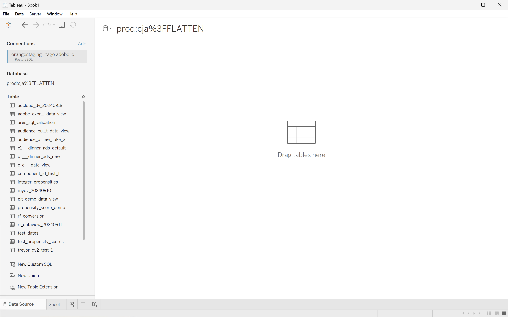
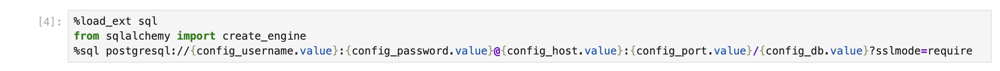

# 연결 및 유효성 검사


이 사용 사례에서는 BI 도구에서 Customer Journey Analytics으로의 연결을 설정하고 사용 가능한 데이터 보기를 나열하며 사용할 데이터 보기를 선택합니다.

+++ Customer Journey Analytics

지침은 다음 개체가 있는 예제 환경을 참조합니다.

* 데이터 보기: **[!UICONTROL C&amp;C - 데이터 보기]** 🅐.
* 차원: **[!UICONTROL 제품 이름]** 🅑 및 **[!UICONTROL 제품 범주]** 🅒.
* 지표: **[!UICONTROL 구매 매출]** 🅓 및 **[!UICONTROL 구매]** 🅔.
* 필터: **[!UICONTROL 낚시 제품]** 🅕.


사용 사례를 살펴볼 때 이러한 예제 객체를 특정 환경에 적합한 객체로 바꾸십시오.

+++

+++ BI 도구

>[!BEGINTABS]

>[!TAB Power BI 데스크톱]

1. Experience Platform 쿼리 서비스 UI에서 필요한 자격 증명 및 매개 변수에 액세스합니다.

   1. Experience Platform 샌드박스로 이동합니다.
   1. 왼쪽 레일에서  **[!UICONTROL 쿼리]**&#x200B;를 선택합니다.
   1. **[!UICONTROL 쿼리]** 인터페이스에서 **[!UICONTROL 자격 증명]** 탭을 선택하십시오.
   1. **[!UICONTROL 데이터베이스]** 드롭다운 메뉴에서 `prod:cja`을(를) 선택합니다.

      

1. Power BI Desktop을 시작합니다.
   1. 주 인터페이스에서 **[!UICONTROL 다른 원본에서 데이터 가져오기]**&#x200B;를 선택합니다.
   1. **[!UICONTROL 데이터 가져오기]** 대화 상자에서:
      
      1. **[!UICONTROL PostgreSQL 데이터베이스]**&#x200B;를 검색하여 선택하십시오.
      1. **[!UICONTROL 연결]**&#x200B;을 선택합니다.
   1. **[!UICONTROL PostgreSQL 데이터베이스]** 대화 상자에서:
      
      1. 를 사용하여 **[!UICONTROL Server]**&#x200B;의 값으로 `:`(으)로 구분된 Experience Platform **[!UICONTROL 쿼리]** **[!UICONTROL 만료 자격 증명]** 패널의 **[!UICONTROL 호스트]** 및 **[!UICONTROL 포트]** 값을 복사하여 붙여넣으십시오. 예: `examplecompany.platform-query.adobe.io:80`.
      1. 를 사용하여 Experience Platform **[!UICONTROL 쿼리]** **[!UICONTROL 만료 자격 증명]** 패널에서 **[!UICONTROL 데이터베이스]** 값을 복사하여 붙여 넣으십시오. 붙여넣은 값에 `?FLATTEN`을(를) 추가합니다. (예: `prod:cja?FLATTEN`)
      1. **[!UICONTROL DirectQuery]**&#x200B;을(를) **[!UICONTROL 데이터 연결 모드]**(으)로 선택합니다.
      1. **[!UICONTROL 확인]**&#x200B;을 선택합니다.
   1. **[!UICONTROL PostgreSQL 데이터베이스]** - **[!UICONTROL 데이터베이스]** 대화 상자에서:
      
      1. 를 사용하여 **[!UICONTROL 사용자 이름]** 및 **[!UICONTROL 암호]** 필드의 Experience Platform **[!UICONTROL 쿼리]** **[!UICONTROL 만료 자격 증명]** 패널에서 **[!UICONTROL 사용자 이름]** 및 **[!UICONTROL 암호]** 값을 복사합니다. [만료되지 않는 자격 증명](https://experienceleague.adobe.com/ko/docs/experience-platform/query/ui/credentials?lang=en#use-credential-to-connect)을 사용하는 경우 만료되지 않는 자격 증명의 암호를 사용하십시오.
      1. **[!UICONTROL 이러한 설정을 적용할 수준 선택]**&#x200B;의 드롭다운 메뉴가 이전에 정의한 **[!UICONTROL 서버]**(으)로 설정되어 있는지 확인하십시오.
      1. **[!UICONTROL 연결]**&#x200B;을 선택합니다.
   1. **[!UICONTROL 탐색기]** 대화 상자에서 데이터 보기를 검색합니다. 이 검색은 시간이 걸릴 수 있습니다. 검색하면 Power BI Desktop에 다음 내용이 표시됩니다.
      
      1. 왼쪽 패널의 목록에서 **[!UICONTROL public.cc_data_view]**&#x200B;을(를) 선택합니다.
      1. 다음 두 가지 옵션이 있습니다.
         1. **[!UICONTROL 로드]**&#x200B;를 선택하여 설치를 계속하고 완료합니다.
         1. **[!UICONTROL 데이터 변환]**&#x200B;을 선택합니다. 구성의 일부로 변환을 선택적으로 적용할 수 있는 대화 상자가 표시됩니다.
            
            * **[!UICONTROL 닫기 및 적용]**&#x200B;을 선택합니다.
   1. 잠시 후 **[!UICONTROL public.cc_data_view]**&#x200B;이(가) **[!UICONTROL 데이터]** 창에 표시됩니다. 차원 및 지표를 표시하려면 를 선택하십시오.
      


## 평면화할지 말지

Power BI Desktop은 `FLATTEN` 매개 변수에 대해 다음 시나리오를 지원합니다. 자세한 내용은 [중첩된 데이터 정리](https://experienceleague.adobe.com/ko/docs/experience-platform/query/key-concepts/flatten-nested-data)를 참조하십시오.

| 평면화 매개 변수 | 예 | 지원됨 | 비고 |
|---|---|:---:|---|
| 없음 | `prod:cja` |  | |
| `?FLATTEN` | `prod:cja?FLATTEN` |  | **사용할 권장 옵션!** |
| `%3FFLATTEN` | `prod:cja%3FFLATTEN` |  | Power BI Desktop에 오류가 표시됩니다. **[!UICONTROL 제공된 자격 증명으로 인증할 수 없습니다. 다시 시도하십시오.]** |

### 추가 정보

* [사전 요구 사항](/help/data-views/bi-extension.md#prerequisites)
* [자격 증명 안내서](https://experienceleague.adobe.com/ko/docs/experience-platform/query/ui/credentials)
* [쿼리 서비스에 Power BI 연결](https://experienceleague.adobe.com/ko/docs/experience-platform/query/clients/power-bi).


>[!TAB 타블로 데스크톱]

1. Experience Platform 쿼리 서비스 UI에서 필요한 자격 증명 및 매개 변수에 액세스합니다.

   1. Experience Platform 샌드박스로 이동합니다.
   1. 왼쪽 레일에서  **[!UICONTROL 쿼리]**&#x200B;를 선택합니다.
   1. **[!UICONTROL 쿼리]** 인터페이스에서 **[!UICONTROL 자격 증명]** 탭을 선택하십시오.
   1. **[!UICONTROL 데이터베이스]** 드롭다운 메뉴에서 `prod:cja`을(를) 선택합니다.

      

1. 타블로를 시작합니다.
   1. **[!UICONTROL 서버로]** 아래의 왼쪽 레일에서 **[!UICONTROL PostgreSQL]**&#x200B;을(를) 선택하십시오. 사용할 수 없는 경우 **[!UICONTROL 자세히...]**&#x200B;를 선택하고 **[!UICONTROL 설치된 커넥터]**&#x200B;에서 **[!UICONTROL PostgreSQL]**&#x200B;을(를) 선택합니다.
      
   1. **[!UICONTROL PostgreSQL]** 대화 상자의 **[!UICONTROL 일반]** 탭에서:
      
      1. 를 사용하여 **[!UICONTROL 호스트]**&#x200B;를 Experience Platform **[!UICONTROL 쿼리]** **[!UICONTROL 만료 자격 증명]** 패널에서 **[!UICONTROL 서버]**&#x200B;로 복사하여 붙여넣으십시오.
      1. 를 사용하여 **[!UICONTROL 포트]**&#x200B;를 Experience Platform **[!UICONTROL 쿼리]** **[!UICONTROL 만료 자격 증명]** 패널에서 **[!UICONTROL 포트]**(으)로 복사하여 붙여넣으십시오.
      1. 를 사용하여 **[!UICONTROL 데이터베이스]**&#x200B;을(를) Experience Platform **[!UICONTROL 쿼리]** **[!UICONTROL 만료 자격 증명]** 패널에서 **[!UICONTROL 데이터베이스]**(으)로 복사하여 붙여넣으십시오. 붙여넣은 값에 `%3FFLATTEN`을(를) 추가합니다. 예: `prod:cja%3FFLATTEN`.
      1. **[!UICONTROL 인증]** 드롭다운 메뉴에서 **[!UICONTROL 사용자 이름 및 암호]**&#x200B;를 선택합니다.
      1. 를 사용하여 **[!UICONTROL 사용자 이름]**&#x200B;을(를) Experience Platform **[!UICONTROL 쿼리]** **[!UICONTROL 만료 자격 증명]** 패널에서 **[!UICONTROL 사용자 이름]**(으)로 복사하여 붙여넣으십시오.
      1. 를 사용하여 Experience Platform **[!UICONTROL 쿼리]** **[!UICONTROL 만료 자격 증명]** 패널에서 **[!UICONTROL 암호]**&#x200B;를 복사하여 **[!UICONTROL 암호]**&#x200B;에 붙여넣으십시오. [만료되지 않는 자격 증명](https://experienceleague.adobe.com/ko/docs/experience-platform/query/ui/credentials?lang=en#use-credential-to-connect)을 사용하는 경우 만료되지 않는 자격 증명의 암호를 사용하십시오.
      1. **[!UICONTROL SSL 필요]**&#x200B;가 선택되어 있는지 확인하십시오.
      1. **[!UICONTROL 로그인]**&#x200B;을 선택합니다.

      Tableau Desktop이 연결을 확인하는 동안 **[!UICONTROL 진행 중인 요청]** 대화 상자가 표시됩니다.
   1. 기본 창의 왼쪽 창에 **[!UICONTROL 데이터 Source]** 페이지가 표시됩니다.
      * **[!UICONTROL 연결]** 아래의 연결 이름입니다.
      * **[!UICONTROL 데이터베이스]** 아래의 데이터베이스 이름입니다.
      * **[!UICONTROL 테이블]** 아래의 테이블 목록입니다.
        
      1. **[!UICONTROL cc_data_view]** 항목을 끌어서 **[!UICONTROL 테이블을 여기로 드래그]**&#x200B;하는 기본 보기에 놓으십시오.
   1. 기본 창에 **[!UICONTROL cc_data_view]** 데이터 보기의 세부 정보가 표시됩니다.
      

## 평면화할지 말지

Tableau Desktop은 `FLATTEN` 매개 변수에 대해 다음 시나리오를 지원합니다. 자세한 내용은 [중첩된 데이터 정리](https://experienceleague.adobe.com/ko/docs/experience-platform/query/key-concepts/flatten-nested-data)를 참조하십시오.

| 평면화 매개 변수 | 예 | 지원됨 | 비고 |
|---|---|:---:|---|
| 없음 | `prod:cja` |  | |
| `?FLATTEN` | `prod:cja?FLATTEN` |  | |
| `%3FFLATTEN` | `prod:cja%3FFLATTEN` |  | **사용할 권장 옵션**. `%3FFLATTEN`은(는) `?FLATTEN`의 URL 인코딩 버전입니다. |

## 추가 정보

* [사전 요구 사항](/help/data-views/bi-extension.md#prerequisites)
* [자격 증명 안내서](https://experienceleague.adobe.com/ko/docs/experience-platform/query/ui/credentials)
* [쿼리 서비스에 타블로 데스크톱 연결](https://experienceleague.adobe.com/ko/docs/experience-platform/query/clients/tableau).


>[!TAB 조회자]

1. Experience Platform 쿼리 서비스 UI에서 필요한 자격 증명 및 매개 변수에 액세스합니다.

   1. Experience Platform 샌드박스로 이동합니다.
   1. 왼쪽 레일에서  **[!UICONTROL 쿼리]**&#x200B;를 선택합니다.
   1. **[!UICONTROL 쿼리]** 인터페이스에서 **[!UICONTROL 자격 증명]** 탭을 선택하십시오.
   1. **[!UICONTROL 데이터베이스]** 드롭다운 메뉴에서 `prod:cja`을(를) 선택합니다.

      

1. Looker에 로그인

   1. 왼쪽 레일에서 **[!UICONTROL 관리]**&#x200B;를 선택합니다.
   1. **[!UICONTROL 연결]**&#x200B;을 선택합니다.
   1. **[!UICONTROL 연결 추가]**&#x200B;를 선택합니다.
   1. **[!UICONTROL Looker 화면에 데이터베이스를 연결]**&#x200B;합니다.

      

      1. 연결에 대한 **[!UICONTROL 이름]**(예: `Example Looker Connection`)을 입력하십시오.
      1. **[!UICONTROL 모든 프로젝트]**&#x200B;가 **[!UICONTROL 연결 범위]**(으)로 선택되었는지 확인하십시오.
      1. 방언으로 **[!UICONTROL PostgreSQL 9.5+]**&#x200B;을(를) 선택합니다.
      1. 을(를) 사용하여 Experience Platform **[!UICONTROL Query]** **[!UICONTROL 만료되는 자격 증명]** 패널에서 **[!UICONTROL Host]** 값을 **[!UICONTROL Host]** 값으로 복사하여 붙여넣으십시오. 예: `examplecompany.platform-query.adobe.io`.
      1. 을(를) 사용하여 Experience Platform **[!UICONTROL Query]** **[!UICONTROL 만료되는 자격 증명]** 패널의 **[!UICONTROL Port]** 값을 **[!UICONTROL Port]** 값으로 복사하여 붙여넣으십시오. 예: `80`.
      1. 를 사용하여 Experience Platform **[!UICONTROL 쿼리]** **[!UICONTROL 만료 자격 증명]** 패널에서 **[!UICONTROL 데이터베이스]** 값을 **[!UICONTROL 데이터베이스]**&#x200B;의 값으로 복사하여 붙여넣으십시오. 붙여넣은 값에 `%3FFLATTEN`을(를) 추가합니다. (예: `prod:cja%3FFLATTEN`)
      1. 를 사용하여 Experience Platform **[!UICONTROL 쿼리]** **[!UICONTROL 만료 자격 증명]** 패널에서 **[!UICONTROL 사용자 이름]** 값을 **[!UICONTROL 사용자 이름]** 값으로 복사하여 붙여넣으십시오.
      1. 를 사용하여 Experience Platform **[!UICONTROL 쿼리]** **[!UICONTROL 만료 자격 증명]** 패널에서 **[!UICONTROL 암호]** 값을 **[!UICONTROL 암호]** 값으로 복사하여 붙여넣으십시오.
      1. **[!UICONTROL 선택적 설정]**&#x200B;에서 **[!UICONTROL 모두 확장]**&#x200B;을 선택합니다.
      1. 노드당 **[!UICONTROL 최대 연결]**&#x200B;을(를) `5`(으)로 설정합니다.
      1. **[!UICONTROL SSL]**&#x200B;이 사용하도록 설정되어 있는지 확인하십시오.
      1. 연결을 테스트하려면 **[!UICONTROL 테스트]**&#x200B;를 선택하십시오. 화면 맨 위에 **[!UICONTROL 성공, JDBC ....]**&#x200B;에 연결할 수 있음 등의 메시지가 표시된 배너가 표시됩니다.
      1. **[!UICONTROL 연결]**&#x200B;을 선택하여 연결을 설정하고 저장합니다.
   1. **[!UICONTROL 연결]** 인터페이스에 새 연결이 표시됩니다.
   1. 왼쪽 레일에서 기본 탐색으로 이동하려면 **[!UICONTROL 관리자]**&#x200B;에서 **←**&#x200B;을(를) 선택하십시오.
   1. **[!UICONTROL 개발]**&#x200B;을 선택합니다.
   1. **[!UICONTROL 프로젝트]**&#x200B;을(를) 선택하십시오.
   1. LookML 프로젝트에서 **[!UICONTROL 새 모델]**&#x200B;을(를) 선택하십시오.
   1. 다른 사용자에게 영향을 주지 않도록 합니다. 메시지가 표시되면 개발 모드 시작 을 선택합니다.
   1. **[!UICONTROL 모델 만들기]** 경험에서:
      1. **[!UICONTROL ➊에서 데이터베이스 연결 선택]**:
         1. **[!UICONTROL 데이터베이스 연결 선택]**&#x200B;에서 데이터베이스 연결을 선택하십시오. 예: **[!UICONTROL example_looker_connection]**.
         1. **[!UICONTROL 이 모델에 대한 새 LookML 프로젝트 만들기]**&#x200B;에서 프로젝트 이름을 지정하십시오. `example: example_looker_project`용.
         1. **[!UICONTROL 다음]**&#x200B;을 선택합니다.
      1. **[!UICONTROL ➋에서 테이블 선택]**:
         1. **[!UICONTROL 공개]**&#x200B;를 선택한 다음 Customer Journey Analytics 데이터 보기를 선택하십시오. 예:  **[!UICONTROL cc_data_view]**.
         1. **[!UICONTROL 다음]**&#x200B;을 선택합니다.
      1. **[!UICONTROL ➌에서 기본 키 선택]**:
         1. **[!UICONTROL 다음]**&#x200B;을 선택합니다.
      1. **[!UICONTROL ➍에서 만들 탐색기를 선택하십시오]**:
         1. 보기를 선택해야 합니다. 예: **[!UICONTROL cc_data_view.view]**.
         1. **[!UICONTROL 다음]**&#x200B;을 선택합니다.
      1. **[!UICONTROL ➎에서 모델 이름]**&#x200B;을(를) 입력하십시오.
         1. 모델 이름을 지정합니다. 예: `example_looker_model`.
      1. **[!UICONTROL 완료 및 데이터 탐색]**&#x200B;을 선택합니다.

   Looker의 **[!UICONTROL Explore]** 인터페이스로 리디렉션되어 데이터를 탐색할 수 있습니다.


## 평면화할지 말지

Looker는 `FLATTEN` 매개 변수에 대해 다음 시나리오를 지원합니다. 자세한 내용은 [중첩된 데이터 정리](https://experienceleague.adobe.com/ko/docs/experience-platform/query/key-concepts/flatten-nested-data)를 참조하십시오.

| 평면화 매개 변수 | 예 | 지원됨 | 비고 |
|---|---|:---:|---|
| 없음 | `prod:cja` |  | |
| `?FLATTEN` | `prod:cja?FLATTEN` |  | |
| `%3FFLATTEN` | `prod:cja%3FFLATTEN` |  | **사용할 권장 옵션**. `%3FFLATTEN`은(는) `?FLATTEN`의 URL 인코딩 버전입니다. |

## 추가 정보

* [사전 요구 사항](/help/data-views/bi-extension.md#prerequisites)
* [자격 증명 안내서](https://experienceleague.adobe.com/ko/docs/experience-platform/query/ui/credentials)


>[!TAB Jupyter 전자 필기장]

1. Experience Platform 쿼리 서비스 UI에서 필요한 자격 증명 및 매개 변수에 액세스합니다.

   1. Experience Platform 샌드박스로 이동합니다.
   1. 왼쪽 레일에서  **[!UICONTROL 쿼리]**&#x200B;를 선택합니다.
   1. **[!UICONTROL 쿼리]** 인터페이스에서 **[!UICONTROL 자격 증명]** 탭을 선택하십시오.
   1. **[!UICONTROL 데이터베이스]** 드롭다운 메뉴에서 `prod:cja`을(를) 선택합니다.

      

1. Jupyter Notebook 환경을 실행하기 위한 전용 Python 가상 환경을 설정했는지 확인하십시오.
1. 가상 환경에 필요한 라이브러리를 설치했는지 확인합니다.
   * ipython-sql: `pip install ipython-sql`.
   * psycopg2-binary: `pip install psycopg-binary`.
   * sqlalchemy: pip `install sqlalchemy`.

1. 가상 환경 `jupyter notebook`에서 Jupyter Notebook을 시작합니다.
1. 새 전자 필기장을 만들거나 [이 샘플 전자 필기장](../assets/BI-Extension.ipynb.zip)을 다운로드하세요.
1. 첫 번째 셀에 다음을 입력하고 실행합니다.

   ```
   %config SqlMagic.style = '_DEPRECATED_DEFAULT'
   ```

1. 새 셀에 연결에 대한 구성 매개 변수를 입력합니다. 를 사용하여 Experience Platform **[!UICONTROL 쿼리]** **[!UICONTROL 만료 자격 증명]** 패널의 값을 구성 매개 변수에 필요한 값으로 복사하고 붙여 넣습니다. 예:

   ```
   import ipywidgets as widgets
   from IPython.display import display
   
   config_host = widgets.Text(description='Host:', value='example.platform-query-stage.adobe.io',
                           layout=widgets.Layout(width="600px"))
   display(config_host)
   config_port = widgets.IntText(description='Port:', value=80,
                              layout=widgets.Layout(width="200px"))
   display(config_port)
   config_db = widgets.Text(description='Database:', value='prod:cja',
                         layout=widgets.Layout(width="300px"))
   display(config_db)
   config_username = widgets.Text(description='Username:', value='EC582F955C8A79F70A49420E@AdobeOrg',
                               layout=widgets.Layout(width="600px"))
   display(config_username)
   config_password = widgets.Password(description='Password:', value='***',
                                   layout=widgets.Layout(width="600px"))
   display(config_password)
   ```

1. 셀을 실행합니다.
1. 를 사용하여 Experience Platform **[!UICONTROL 쿼리]** **[!UICONTROL 만료 자격 증명]** 패널에서 Jupyter Notebook의 **[!UICONTROL 암호]** 필드로 암호를 복사하여 붙여넣으십시오.

   

1. 새 셀에서 SQL 확장, 필수 라이브러리를 로드하고 Customer Journey Analytics과 연결할 명령문을 입력합니다.

   ```python
   %load_ext sql
   from sqlalchemy import create_engine
   %sql postgresql://{config_username.value}:{config_password.value}@{config_host.value}:{config_port.value}/{config_db.value}?sslmode=require
   ```

   셸을 실행합니다. 출력은 표시되지 않지만 셀은 경고 없이 실행됩니다.

   

1. 새 호출에서 문을 입력하여 연결에 따라 사용 가능한 데이터 보기 목록을 가져옵니다.

   ```python
   %%sql
   SELECT n.nspname as "Schema",
      c.relname as "Name",
      CASE c.relkind WHEN 'r' THEN 'table' WHEN 'v' THEN 'view' WHEN 'm' THEN 'materialized view' WHEN 'i' THEN 'index' WHEN 'S' THEN 'sequence' WHEN 's' THEN 'special' WHEN 't' THEN 'TOAST table' WHEN 'f' THEN 'foreign table' WHEN 'p' THEN 'partitioned table' WHEN 'I' THEN 'partitioned index' END as "Type",
      pg_catalog.pg_get_userbyid(c.relowner) as "Owner"
   FROM pg_catalog.pg_class c
   LEFT JOIN pg_catalog.pg_namespace n ON n.oid = c.relnamespace
   WHERE c.relkind IN ('v','')
      AND n.nspname <> 'pg_catalog'
      AND n.nspname !~ '^pg_toast'
      AND n.nspname <> 'information_schema'
      AND pg_catalog.pg_table_is_visible(c.oid)
      AND c.relname NOT LIKE '%test%'
      AND c.relname NOT LIKE '%ajo%'
   ORDER BY 1,2;
   ```

   셸을 실행합니다. 아래 스크린샷과 유사한 출력이 표시됩니다.

   

   데이터 보기 목록에 **[!UICONTROL cc_data_view]**&#x200B;이(가) 표시됩니다.

## 평면화할지 말지

Jupyter Notebook은 `FLATTEN` 매개 변수에 대해 다음 시나리오를 지원합니다. 자세한 내용은 [중첩된 데이터 정리](https://experienceleague.adobe.com/ko/docs/experience-platform/query/key-concepts/flatten-nested-data)를 참조하십시오.

| 평면화 매개 변수 | 예 | 지원됨 | 비고 |
|---|---|:---:|---|
| 없음 | `prod:cja` |  | |
| `?FLATTEN` | `prod:cja?FLATTEN` |  | |
| `%3FFLATTEN` | `prod:cja%3FFLATTEN` |  | **사용할 권장 옵션**. `%3FFLATTEN`은(는) `?FLATTEN`의 URL 인코딩 버전입니다. |

## 추가 정보

* [사전 요구 사항](/help/data-views/bi-extension.md#prerequisites)
* [자격 증명 안내서](https://experienceleague.adobe.com/ko/docs/experience-platform/query/ui/credentials)

>[!TAB 자습서]

1. Experience Platform 쿼리 서비스 UI에서 필요한 자격 증명 및 매개 변수에 액세스합니다.

   1. Experience Platform 샌드박스로 이동합니다.
   1. 왼쪽 레일에서  **[!UICONTROL 쿼리]**&#x200B;를 선택합니다.
   1. **[!UICONTROL 쿼리]** 인터페이스에서 **[!UICONTROL 자격 증명]** 탭을 선택하십시오.
   1. **[!UICONTROL 데이터베이스]** 드롭다운 메뉴에서 `prod:cja`을(를) 선택합니다.

      

1. RStudio를 시작합니다.
1. 새 R Markdown 파일을 만들거나 [이 예제 R Markdown 파일](../assets/BI-Extension.Rmd.zip)을 다운로드합니다.
1. 첫 번째 청크에 ` ` ``{r} `과(와) ` `` ` ` 사이의 다음 문을 입력하십시오. 를 사용하여 Experience Platform **[!UICONTROL 쿼리]** **[!UICONTROL 만료 자격 증명]** 패널의 값을 `host`, `dbname`, `user` 등의 다양한 매개 변수에 필요한 값으로 복사하고 붙여넣으십시오. 예:

   ```R
   library(rstudioapi)
   library(DBI)
   library(dplyr)
   library(tidyr)
   library(RPostgres)
   library(ggplot2)
   
   host <- rstudioapi::showPrompt(title = "Host", message = "Host", default = "orangestagingco.platform-query-stage.adobe.io")
   dbname <- rstudioapi::showPrompt(title = "Database", message = "Database", default = "prod:cja?FLATTEN")
   user <- rstudioapi::showPrompt(title = "Username", message = "Username", default = "EC582F955C8A79F70A49420E@AdobeOrg")
   password <- rstudioapi::askForPassword(prompt = "Password")
   ```

1. 청크를 실행합니다. **[!UICONTROL 호스트]**, **[!UICONTROL 데이터베이스]** 및 **[!UICONTROL 사용자]**&#x200B;를 묻는 메시지가 표시됩니다. 이전 단계의 일부로 제공한 값을 수락하면 됩니다.
1. 를 사용하여 Experience Platform **[!UICONTROL 쿼리]** **[!UICONTROL 만료 자격 증명]** 패널에서 RStudio의 **[!UICONTROL 암호]** 대화 상자 프롬프트로 암호를 복사하고 붙여넣으십시오.

   

1. 새 청크를 만들고 ` ` `` {r} `에서 ` `` ` ` 사이의 다음 문을 입력하십시오.

   ```R
   con <- dbConnect(
      RPostgres::Postgres(),
      host = host,
      port = 80,
      dbname = dbname,
      user = user,
      password = password,
      sslmode = 'require'
   )
   ```

1. 청크를 실행합니다. 연결에 성공하면 출력이 표시되지 않습니다.


1. 새 청크를 만들고 ` ` `` {r} `에서 ` `` ` ` 사이의 다음 문을 입력하십시오.

   ```R
   views <- dbListTables(con)
   print(views)
   ```

1. 청크를 실행합니다. `character(0)`이(가) 유일한 출력으로 표시됩니다.


1. 새 청크를 만들고 ` ` `` {r} `에서 ` `` ` ` 사이의 다음 문을 입력하십시오.

   ```R
   glimpse(dv)
   ```

1. 청크를 실행합니다. 아래 스크린샷과 유사한 출력이 표시됩니다.

   

## 평면화할지 말지

RStudio는 `FLATTEN` 매개 변수에 대해 다음 시나리오를 지원합니다. 자세한 내용은 [중첩된 데이터 정리](https://experienceleague.adobe.com/ko/docs/experience-platform/query/key-concepts/flatten-nested-data)를 참조하십시오.

| 평면화 매개 변수 | 예 | 지원됨 | 비고 |
|---|---|:---:|---|
| 없음 | `prod:cja` |  | |
| `?FLATTEN` | `prod:cja?FLATTEN` |  | **사용할 권장 옵션**. |
| `%3FFLATTEN` | `prod:cja%3FFLATTEN` |  | |

## 추가 정보

* [사전 요구 사항](/help/data-views/bi-extension.md#prerequisites)
* [자격 증명 안내서](https://experienceleague.adobe.com/ko/docs/experience-platform/query/ui/credentials)

>[!ENDTABS]

+++
