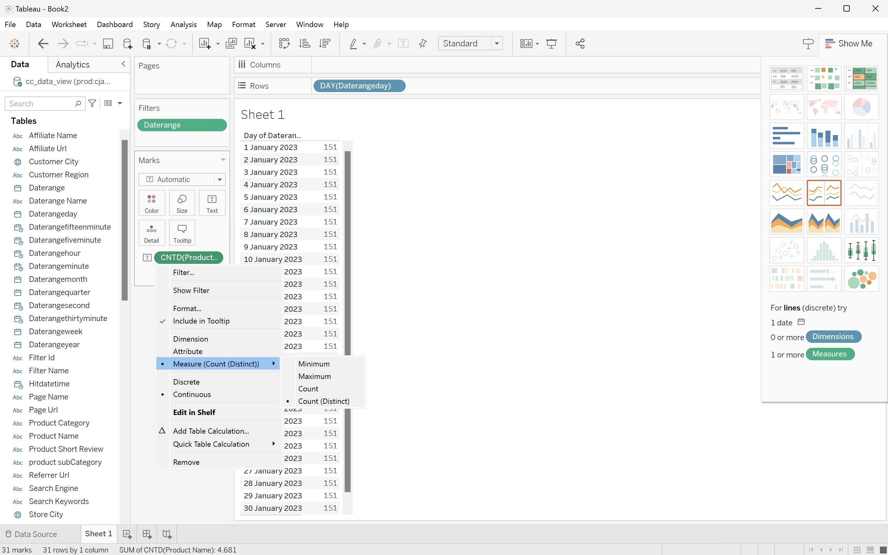

# 고유 값 차원 계산


이 사용 사례에서는 2023년 1월 중에 보고된 고유 제품 이름을 가져옵니다.

+++ Customer Journey Analytics

제품 이름의 고유 개수를 보고하려면 Customer Journey Analytics에서 **[!UICONTROL 제목]** `Product Name (Count Distinct)` 및 **[!UICONTROL 외부 ID]** `product_name_count_distinct`(으)로 계산된 지표를 설정합니다.


그런 다음 사용 사례에 대해 **[!UICONTROL 고유 Dimension 값 계산]** 패널의 예에서 해당 지표를 사용할 수 있습니다.


+++

+++ BI 도구

>[!PREREQUISITES]
>
>[연결에 성공했는지 확인하고, 데이터 보기를 나열하고, 이 사용 사례를 시도하려는 BI 도구에 대해 데이터 보기를 사용](connect-and-validate.md)할 수 있는지 확인하십시오.
>

>[!BEGINTABS]

>[!TAB Power BI 데스크톱]

1. 날짜 범위가 모든 시각화에 적용되도록 하려면 **[!UICONTROL daterangeday]**&#x200B;을(를) **[!UICONTROL 데이터]** 창에서 이 페이지의 **[!UICONTROL 필터]**(으)로 끌어서 놓습니다.
   1. **[!UICONTROL 이 페이지의 필터]**&#x200B;에서 **[!UICONTROL 날짜 범위는 (모두)]**&#x200B;입니다.
   1. **[!UICONTROL 고급 필터링]**&#x200B;을(를) **[!UICONTROL 필터 형식]**(으)로 선택합니다.
   1. **[!UICONTROL 값이]** **[!UICONTROL 이거나]** `1/1/2023` **[!UICONTROL 이거나]** **[!UICONTROL 이(가)]** `2/1/2023` 이전인 경우 항목 표시로 필터를 정의합니다.
   1. **[!UICONTROL 필터 적용]**&#x200B;을 선택하십시오.

1. **[!UICONTROL 데이터]** 창:
   1. **[!UICONTROL datarangeday]**&#x200B;를 선택하십시오.
   1. Customer Journey Analytics에 정의된 계산된 지표인 **[!UICONTROL sum cm_product_name_count_distinct]**&#x200B;을(를) 선택하십시오.

1. 세로 막대형 차트를 표로 수정하려면 차트를 선택하고 **[!UICONTROL 시각화]** 창에서 **[!UICONTROL 표]**&#x200B;를 선택하십시오.

   Power BI 데스크톱은 다음과 같아야 합니다.

   

1. 테이블 시각화를 선택합니다. 컨텍스트 메뉴에서 **[!UICONTROL 복사]** > **[!UICONTROL 시각적 개체 복사]**&#x200B;를 선택합니다.
1. **[!UICONTROL ctrl-v]**&#x200B;을 사용하여 시각화를 붙여 넣습니다. 시각화의 정확한 복사본이 원래 복사본과 겹칩니다. 보고서 영역에서 오른쪽으로 이동합니다.
1. 테이블에서 카드로 복사한 시각화를 수정하려면 **[!UICONTROL 시각화]**&#x200B;에서 **[!UICONTROL 카드]**&#x200B;을(를) 선택하십시오.

   Power BI 데스크톱은 다음과 같아야 합니다.

   

또는 Power BI과 구별되는 고유 개수 기능을 사용할 수 있습니다.

1. **[!UICONTROL product_name]** 차원을 선택하십시오.
1. **[!UICONTROL 열]**&#x200B;의 **[!UICONTROL product_name]** 차원에서 **[!UICONTROL Count(고유)]** 함수를 적용하세요.

   


>[!TAB 타블로 데스크톱]

1. 하단의 **[!UICONTROL 시트 1]** 탭을 선택하여 **[!UICONTROL 데이터 원본]**&#x200B;에서 전환하세요. **[!UICONTROL 시트 1]** 보기에서:
   1. **[!UICONTROL 데이터]** 창의 **[!UICONTROL 테이블]** 목록에서 **[!UICONTROL Daterange]** 항목을 드래그하여 **[!UICONTROL 필터]** 선반에 놓습니다.
   1. **[!UICONTROL 필터 필드 \[Daterange\]]** 대화 상자에서 **[!UICONTROL 날짜 범위]**&#x200B;를 선택하고 **[!UICONTROL 다음 >]**&#x200B;을(를) 선택합니다.
   1. **[!UICONTROL 필터 \[Daterange\]]** 대화 상자에서 **[!UICONTROL 날짜 범위]**&#x200B;를 선택하고 `01/01/2023` - `31/1/2023`을(를) 선택합니다. **[!UICONTROL 적용]** 및 **[!UICONTROL 확인]**&#x200B;을 선택합니다.
   1. **[!UICONTROL Cm 제품 이름 고유 개수]**&#x200B;을(를) **[!UICONTROL 행]**(으)로 드래그합니다. 값이 **[!UICONTROL SUM(Cm 제품 이름 고유 개수)]**(으)로 변경됩니다. 이 필드는 Customer Journey Analytics에서 정의한 계산된 지표입니다.
   1. **[!UICONTROL Daterangeday]**&#x200B;를 드래그하여 **[!UICONTROL 열]** 옆에 놓습니다. **[!UICONTROL 날짜]**&#x200B;을(를) 선택하고 드롭다운 메뉴에서 **[!UICONTROL 일]**&#x200B;을(를) 선택합니다.
   1. 라인 시각화를 테이블로 수정하려면 **[!UICONTROL 표시]**&#x200B;에서 **[!UICONTROL 텍스트 테이블]**&#x200B;을(를) 선택하십시오.
   1. 도구 모음에서 **[!UICONTROL 행 및 열 바꾸기]**&#x200B;를 선택합니다.
   1. **[!UICONTROL 맞춤]** 드롭다운 메뉴에서 **[!UICONTROL 맞춤]**&#x200B;을 선택합니다.

      Tableau Desktop은 다음과 같습니다.

      

1. **[!UICONTROL 시트 1]** 탭 컨텍스트 메뉴에서 **[!UICONTROL 복제]**&#x200B;를 선택하여 두 번째 시트를 만듭니다.
1. **[!UICONTROL 시트 1]** 탭 컨텍스트 메뉴에서 **[!UICONTROL 이름 바꾸기]**&#x200B;를 선택하여 시트의 이름을 `Data`(으)로 변경합니다.
1. **[!UICONTROL 시트 1(2)]** 탭 컨텍스트 메뉴에서 **[!UICONTROL 이름 바꾸기]**&#x200B;를 선택하여 시트의 이름을 `Card`(으)로 변경합니다.

1. **[!UICONTROL 카드]** 보기를 선택했는지 확인하십시오.
1. **[!UICONTROL 일(Daterangeday)]**&#x200B;을 선택하고 드롭다운 메뉴에서 **[!UICONTROL 월]**&#x200B;을(를) 선택합니다. 값이 **[!UICONTROL MONTH(Daterangeday)]**(으)로 변경됩니다.
1. **[!UICONTROL 표시]**&#x200B;에서 **[!UICONTROL SUM(Cm 제품 이름 고유 개수)]**&#x200B;을(를) 선택하고 드롭다운 메뉴에서 **[!UICONTROL 형식]**&#x200B;을(를) 선택합니다.
1. 글꼴 크기를 변경하려면 **[!UICONTROL Format SUM(CM 제품 이름 고유 개수)]** 창에서 **[!UICONTROL Default]** 내의 **[!UICONTROL Font]**&#x200B;을(를) 선택하고 글꼴 크기로 **[!UICONTROL 72]**&#x200B;을(를) 선택하십시오.
1. 숫자를 맞추려면 **[!UICONTROL 맞춤]** 옆에 있는 **[!UICONTROL 자동]**&#x200B;을 선택하고 **[!UICONTROL 가로]**&#x200B;를 가운데로 설정합니다.
1. 정수를 사용하려면 **[!UICONTROL 숫자]** 옆에 있는 **[!UICONTROL 123.456]**&#x200B;을 선택하고 **[!UICONTROL 숫자(사용자 지정)]**&#x200B;을 선택합니다. **[!UICONTROL 소수점 이하 자리 수]**&#x200B;을(를) `0`(으)로 설정합니다.

   Tableau Desktop은 다음과 같습니다.

   

1. **[!UICONTROL 새 대시보드]** 탭 단추(맨 아래)를 선택하여 새 **[!UICONTROL 대시보드 1]** 보기를 만듭니다. **[!UICONTROL 대시보드 1]** 보기에서:
   1. **[!UICONTROL 시트]** 셸프에서 **[!UICONTROL 카드]** 시트를 **[!UICONTROL 여기에 시트 놓기]**&#x200B;를 읽는 *대시보드 1* 보기로 끌어다 놓습니다.
   1. **[!UICONTROL 대시보드 1]** 보기에서 **[!UICONTROL 카드]** 시트 아래의 **[!UICONTROL 시트]** 셸프에서 **[!UICONTROL 데이터]** 시트를 끌어서 놓습니다.

   **[!UICONTROL 대시보드 1]** 보기는 다음과 같습니다.

   


또는 Tableau Desktop의 고유 기능을 사용할 수 있습니다.

1. **[!UICONTROL Cm 제품 이름 개수 고유]** 대신 **[!UICONTROL 제품 이름]**&#x200B;을(를) 사용하십시오.
1. **[!UICONTROL 표시]**&#x200B;의 **[!UICONTROL 제품 이름]**&#x200B;에서 **[!UICONTROL 측정값]** > **[!UICONTROL 개수(고유)]**&#x200B;를 적용합니다.

   


>[!TAB 조회자]

1. Looker의 **[!UICONTROL Explore]** 인터페이스에서 제대로 설정했는지 확인하십시오. 그렇지 않으면  **[!UICONTROL 필드 및 필터 제거]**&#x200B;를 선택하십시오.
1. **[!UICONTROL 필터]** 아래의 **[!UICONTROL + 필터]**&#x200B;을(를) 선택하십시오.
1. **[!UICONTROL 필터 추가]** 대화 상자에서:
   1. **[!UICONTROL ‣Cc 데이터 보기 선택]**
   1. 필드 목록에서 **[!UICONTROL 날짜 범위 날짜]**‣을 선택한 다음 **[!UICONTROL 날짜 범위 날짜]**을 선택합니다.
      
1. **[!UICONTROL 이(가) 범위에 있으므로]** Cc 데이터 보기 날짜&#x200B;**[!UICONTROL 필터를 지정하십시오]** **[!UICONTROL 2023/01/01]** **[!UICONTROL 까지(이전)]** **[!UICONTROL 2023/02/01]**.
1. 왼쪽 레일의 **[!UICONTROL ‣Cc 데이터 보기]** 섹션에서 다음을 수행합니다.
   1. **[!UICONTROL 날짜 범위 날짜]**&#x200B;를 선택한 다음 **[!UICONTROL 날짜]**&#x200B;를 선택합니다.
   1. **[!UICONTROL ‣제품 이름]**&#x200B;의 **자세히**⋮ 컨텍스트 메뉴에서 **[!UICONTROL 고유 개수 집계]**을(를) 선택합니다.
      
1. **[!UICONTROL 실행]**&#x200B;을 선택합니다.
1. **[!UICONTROL ‣ 시각화]**&#x200B;를 선택하고 도구 모음에서 6︎⃣을 선택하여 단일 값 시각화를 표시합니다.

아래 표시된 것처럼 시각화 및 테이블이 표시됩니다.


>[!TAB Jupyter 전자 필기장]

1. 새 셀에 다음 문을 입력합니다.

   ```
   data = %sql SELECT COUNT(DISTINCT(product_name)) AS `Product Name` \
      FROM cc_data_view \
      WHERE daterange BETWEEN '2023-01-01' AND '2023-02-01';
   display(data)
   ```

1. 셀을 실행합니다. 아래 스크린샷과 비슷한 출력이 표시됩니다.

   


>[!TAB 자습서]

1. 새 청크에 ` ```{r} `에서 ` ``` ` 사이의 다음 문을 입력하십시오.

   ```R
   ## Count Distinct
   df <- dv %>%
      filter(daterange >= "2023-01-01" & daterange < "2023-02-01") %>%
      summarise(product_name_count_distinct = n_distinct(product_name))
   print(df)
   ```

1. 청크를 실행합니다. 아래 스크린샷과 비슷한 출력이 표시됩니다.

   


>[!ENDTABS]

+++

