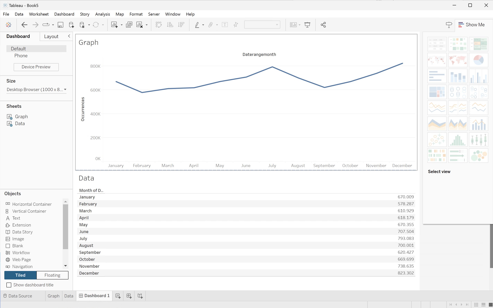

# 월별 트렌드


이 사용 사례에서는 2023년의 월별 발생 트렌드(이벤트)를 보여주는 표와 간단한 선 시각화를 표시할 수 있습니다.

+++ Customer Journey Analytics

사용 사례에 대한 예제 **[!UICONTROL 월별 트렌드]** 패널:


+++

+++ BI 도구

>[!PREREQUISITES]
>
>[연결에 성공했는지 확인하고, 데이터 보기를 나열하고, 이 사용 사례를 시도하려는 BI 도구에 대해 데이터 보기를 사용](connect-and-validate.md)할 수 있는지 확인하십시오.
>

>[!BEGINTABS]

>[!TAB Power BI 데스크톱]

1. **[!UICONTROL 데이터]** 창:
   1. **[!UICONTROL daterangemonth]**&#x200B;을(를) 선택하십시오.
   1. **[!UICONTROL 발생 횟수 합계]**&#x200B;를 선택합니다.

   현재 월의 발생 횟수를 표시하는 테이블이 표시됩니다. 가시성을 높이려면 시각화를 확대하십시오.

1. **[!UICONTROL 필터]** 창:

   1. 이 시각적 개체의 **[!UICONTROL 필터]**&#x200B;에서 **[!UICONTROL daterangemonth is (All)]**&#x200B;을(를) 선택하십시오.
   1. **[!UICONTROL 고급 필터링]**&#x200B;을(를) **[!UICONTROL 필터 형식]**(으)로 선택합니다.
   1. **[!UICONTROL 값이]** **[!UICONTROL 이거나]** `1/1/2023` **[!UICONTROL 이거나]** **[!UICONTROL 이거나]** `1/1/2024.` 이전인 경우 항목 표시로 필터를 정의합니다. 달력 아이콘을 사용하여 날짜를 선택하고 선택할 수 있습니다.
   1. **[!UICONTROL 필터 적용]**&#x200B;을 선택하십시오.

   적용된 **[!UICONTROL daterangemonth]** 필터로 업데이트된 표가 표시됩니다.

1. **[!UICONTROL 시각화]** 창에서:

   1. **[!UICONTROL 선 차트]** 시각화를 선택하십시오.

   라인 차트 시각화는 테이블과 동일한 데이터를 사용하면서 테이블을 대체합니다. Power BI 데스크톱은 다음과 같아야 합니다.

   

1. 선 차트 시각화에서:

   1. 를 선택하세요.
   1. 컨텍스트 메뉴에서 **[!UICONTROL 표로 표시]**&#x200B;를 선택합니다.

   기본 보기가 라인 시각화와 테이블을 모두 표시하도록 업데이트되었습니다. Power BI 데스크톱은 다음과 같아야 합니다.

   

>[!TAB 타블로 데스크톱]

1. 하단의 **[!UICONTROL 시트 1]** 탭을 선택하여 **[!UICONTROL 데이터 원본]**&#x200B;에서 전환하세요. **[!UICONTROL 시트 1]** 보기에서:
   1. **[!UICONTROL 데이터]** 창의 **[!UICONTROL 테이블]** 목록에서 **[!UICONTROL Daterange]** 항목을 드래그하여 **[!UICONTROL 필터]** 선반에 놓습니다.
   1. **[!UICONTROL 필터 필드 \[Daterange\]]** 대화 상자에서 **[!UICONTROL 날짜 범위]**&#x200B;를 선택하고 **[!UICONTROL 다음 >]**&#x200B;을(를) 선택합니다.
   1. **[!UICONTROL 필터 \[Daterange\]]** 대화 상자에서 **[!UICONTROL 날짜 범위]**&#x200B;를 선택하고 `01/01/2023` - `01/01/2024` 기간을 지정하십시오.

      

   1. **[!UICONTROL 데이터]** 창의 **[!UICONTROL 테이블]** 목록에서 **[!UICONTROL Daterangeday]**&#x200B;을(를) 끌어서 놓고 **[!UICONTROL 열]** 옆에 있는 필드에 항목을 놓습니다.
      * 값이 **[!UICONTROL MONTH(Daterangeday)]**(으)로 업데이트되도록 **[!UICONTROL Daterangeday]** 드롭다운 메뉴에서 **[!UICONTROL MONTH]**&#x200B;을(를) 선택합니다.
   1. **[!UICONTROL 데이터]** 창의 **[!UICONTROL 테이블(*측정값 이름*)]** 목록에서 **[!UICONTROL Occurrences]**&#x200B;을(를) 끌어다 놓고 **[!UICONTROL 행]** 옆의 필드에 항목을 놓습니다. 값이 **[!UICONTROL SUM(발생 횟수)]**(으)로 자동 변환됩니다.
   1. 도구 모음의 **[!UICONTROL 맞춤]** 드롭다운 메뉴에서 **[!UICONTROL 표준]**&#x200B;을(를) **[!UICONTROL 전체 보기]**(으)로 수정합니다.

      Tableau Desktop은 다음과 같습니다.

      

1. **[!UICONTROL 시트 1]** 탭 컨텍스트 메뉴에서 **[!UICONTROL 복제]**&#x200B;를 선택하여 두 번째 시트를 만듭니다.
1. **[!UICONTROL 시트 1]** 탭 컨텍스트 메뉴에서 **[!UICONTROL 이름 바꾸기]**&#x200B;를 선택하여 시트의 이름을 `Graph`(으)로 변경합니다.
1. **[!UICONTROL 시트 1(2)]** 탭 컨텍스트 메뉴에서 **[!UICONTROL 이름 바꾸기]**&#x200B;를 선택하여 시트의 이름을 `Data`(으)로 변경합니다.
1. **[!UICONTROL 데이터]** 시트가 선택되어 있는지 확인하십시오. 데이터 보기에서:
   1. 오른쪽 상단에서 **[!UICONTROL 표시]**&#x200B;를 선택하고 **[!UICONTROL 텍스트 테이블]**(왼쪽 상단 시각화)을 선택하여 데이터 보기의 콘텐츠를 테이블로 수정합니다.
   1. **[!UICONTROL MONTH(Daterangeday)]**&#x200B;을(를) **[!UICONTROL 열]**&#x200B;에서 **[!UICONTROL 행]**(으)로 드래그합니다.
   1. 도구 모음의 **[!UICONTROL 맞춤]** 드롭다운 메뉴에서 **[!UICONTROL 표준]**&#x200B;을(를) **[!UICONTROL 전체 보기]**(으)로 수정합니다.

      Tableau Desktop은 다음과 같습니다.

      

1. **[!UICONTROL 새 대시보드]** 탭 단추(맨 아래)를 선택하여 새 **[!UICONTROL 대시보드 1]** 보기를 만듭니다. **[!UICONTROL 대시보드 1]** 보기에서:
   1. **[!UICONTROL Graph]** 시트를 **[!UICONTROL 시트]** 셸프에서 **[!UICONTROL 여기에 시트 놓기]**&#x200B;를 읽는 *대시보드 1* 보기로 끌어다 놓습니다.
   1. **[!UICONTROL 그래프]** 시트 아래의 **[!UICONTROL 시트]** 셸프에서 **[!UICONTROL 데이터]** 시트를 **[!UICONTROL 대시보드 1]** 보기로 끌어다 놓습니다.
   1. 보기에서 **[!UICONTROL 데이터]** 시트를 선택하고 **[!UICONTROL 전체 보기]**&#x200B;를 **[!UICONTROL 너비 수정]**(으)로 수정합니다.

      Tableau Desktop은 다음과 같습니다.

      


>[!TAB 조회자]

1. Looker의 **[!UICONTROL Explore]** 인터페이스에서 제대로 설정했는지 확인하십시오. 그렇지 않으면  **[!UICONTROL 필드 및 필터 제거]**&#x200B;를 선택하십시오.
1. **[!UICONTROL 필터]** 아래의 **[!UICONTROL + 필터]**&#x200B;을(를) 선택하십시오.
1. **[!UICONTROL 필터 추가]** 대화 상자에서:
   1. **[!UICONTROL ‣Cc 데이터 보기 선택]**
   1. 필드 목록에서 **[!UICONTROL 날짜 범위 날짜]**‣을 선택한 다음 **[!UICONTROL 날짜 범위 날짜]**&#x200B;을 선택합니다.
      
1. **[!UICONTROL 이(가) 범위에 있으므로]** Cc 데이터 보기 날짜&#x200B;**[!UICONTROL 필터를 지정하십시오]** **[!UICONTROL 2023/01/01]** **[!UICONTROL 까지(이전)]** **[!UICONTROL 2024/01/01]**.
1. 왼쪽 **[!UICONTROL Cc 데이터 보기]** 레일에서,
   1. **[!UICONTROL ‣차원]** 목록에서 **[!UICONTROL Daterangemonth 날짜]**&#x200B;를 선택한 다음 **[!UICONTROL 월]**&#x200B;을 선택합니다.
   1. 왼쪽 레일(맨 아래)에서 **[!UICONTROL MEASURES]** 아래의 **[!UICONTROL Count]**&#x200B;을(를) 선택하십시오.
1. **[!UICONTROL 실행]**&#x200B;을 선택합니다.
1. 선 시각화를 ‣ 표시하려면 **[!UICONTROL 시각화]**&#x200B;를 선택하십시오.

아래 표시된 것처럼 시각화 및 테이블이 표시됩니다.


>[!TAB Jupyter 전자 필기장]

1. 새 셀에 다음 문을 입력합니다.

   ```python
   import seaborn as sns
   import matplotlib.pyplot as plt
   data = %sql SELECT daterangemonth AS Month, COUNT(*) AS Events \
               FROM cc_data_view \
               WHERE daterange BETWEEN '2023-01-01' AND '2024-01-01' \
               GROUP BY 1 \
               ORDER BY Month ASC
   df = data.DataFrame()
   df = df.groupby('Month', as_index=False).sum()
   plt.figure(figsize=(15, 3))
   sns.lineplot(x='Month', y='Events', data=df)
   plt.show()
   display(data)
   ```

1. 셀을 실행합니다. 아래 스크린샷과 비슷한 출력이 표시됩니다.

   


>[!TAB 자습서]

1. 새 청크에 ` ` ``{r} `에서 ` `` ` ` 사이의 다음 문을 입력하십시오.

   ```R
   ## Hourly Events
   df <- dv %>%
      filter(daterange >= "2023-01-01" & daterange < "2023-01-02") %>%
      group_by(daterangehour) %>%
      count() %>%
      arrange(daterangehour, .by_group = FALSE)
   ggplot(df, aes(x = daterangehour, y = n)) +
      geom_line(color = "#69b3a2") +
      ylab("Events") +
      xlab("Hour")
   print(df)
   ```

1. 청크를 실행합니다. 아래 스크린샷과 비슷한 출력이 표시됩니다.

   

>[!ENDTABS]

+++
