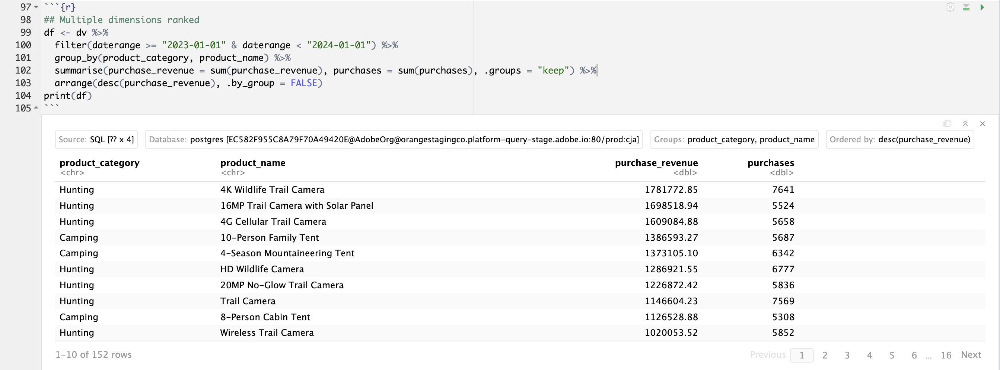

# 여러 차원 등급


이 사용 사례에서는 2023년 이상의 제품 범주 내에서 제품 이름에 대한 구매 매출 및 구매를 분류한 표를 표시할 수 있습니다. 그 위에 몇 가지 시각화를 사용하여 각 제품 카테고리 내의 제품 카테고리 분포와 제품 이름 기여도를 모두 표시하려고 합니다.

+++ Customer Journey Analytics

사용 사례에 대한 **[!UICONTROL 여러 Dimension 등급]** 패널 예:


+++

+++ BI 도구

>[!PREREQUISITES]
>
>[연결에 성공했는지 확인하고, 데이터 보기를 나열하고, 이 사용 사례를 시도하려는 BI 도구에 대해 데이터 보기를 사용](connect-and-validate.md)할 수 있는지 확인하십시오.
>

>[!BEGINTABS]

>[!TAB Power BI 데스크톱]

1. 날짜 범위가 모든 시각화에 적용되도록 하려면 **[!UICONTROL daterangeday]**&#x200B;을(를) **[!UICONTROL 데이터]** 창에서 **[!UICONTROL 이 페이지의 필터]**(으)로 끌어서 놓습니다.
   1. **[!UICONTROL 이 페이지의 필터]**&#x200B;에서 **[!UICONTROL 날짜 범위는 (모두)]**&#x200B;입니다.
   1. **[!UICONTROL 상대적 날짜]**&#x200B;을(를) **[!UICONTROL 필터 형식]**(으)로 선택합니다.
   1. **[!UICONTROL 값이 마지막]** **&#x200B;**&#x200B;역년`1`에 있을 때 **&#x200B;**&#x200B;항목을 표시하도록 필터를 정의합니다.
   1. **[!UICONTROL 필터 적용]**&#x200B;을 선택하십시오.

1. **[!UICONTROL 데이터]** 창:
   1. **[!UICONTROL datarangeday]**&#x200B;를 선택하십시오.
   1. **[!UICONTROL product_category]**&#x200B;을(를) 선택하십시오.
   1. **[!UICONTROL product_name]**&#x200B;을(를) 선택하십시오.
   1. **[!UICONTROL purchase_revenue 합계]** 선택
   1. **[!UICONTROL 총 구매]** 선택

1. 세로 막대형 차트를 표로 수정하려면 표를 선택하고 **[!UICONTROL 시각화]** 창에서 **[!UICONTROL 매트릭스]**&#x200B;를 선택하십시오.
   * **[!UICONTROL 열]**&#x200B;에서 **[!UICONTROL product_name]**&#x200B;을(를) 끌어다 놓고 [!UICONTROL 시각화] 창의 **[!UICONTROL 행]**&#x200B;에서 **&#x200B;**&#x200B;[!UICONTROL product_categor]&#x200B;**&#x200B;**&#x200B;y 아래에 필드를 놓습니다.

1. 테이블에 표시되는 제품 수를 제한하려면 **[!UICONTROL 필터]** 창에서 **[!UICONTROL product_name is (All)]**&#x200B;을(를) 선택하십시오.

   1. **[!UICONTROL 고급 필터링]**&#x200B;을 선택합니다.
   1. **[!UICONTROL 필터 유형]** **[!UICONTROL 상위 N]** **[!UICONTROL 항목 표시]** **[!UICONTROL 상위]** `15` **[!UICONTROL 값별]**&#x200B;을(를) 선택합니다.
   1. **[!UICONTROL 데이터]** 창에서 **[!UICONTROL 여기에 데이터 필드 추가]**(으)로 **[!UICONTROL 구매]**&#x200B;를 끌어옵니다.
   1. **[!UICONTROL 필터 적용]**&#x200B;을 선택하십시오.

1. 가독성을 향상시키려면 상단 메뉴에서 **[!UICONTROL 보기]**&#x200B;를 선택하고 **[!UICONTROL 페이지 보기]** > **[!UICONTROL 실제 크기]**&#x200B;를 선택하고 테이블 시각화 크기를 조정합니다.

1. 테이블의 각 범주를 분류하려면 제품 범주 수준에서 **[!UICONTROL +]**&#x200B;을(를) 선택합니다. Power BI 데스크톱은 다음과 같아야 합니다.

   

1. 상단 메뉴에서 **[!UICONTROL 홈]**&#x200B;을 선택하고 **[!UICONTROL 새 비주얼]**&#x200B;을 선택합니다. 보고서에 새 시각적 개체가 추가됩니다.

1. **[!UICONTROL 데이터]** 창:
   1. **[!UICONTROL product_category]**&#x200B;을(를) 선택하십시오.
   1. **[!UICONTROL product_name]**&#x200B;을(를) 선택하십시오.
   1. **[!UICONTROL purchase_revenue]**&#x200B;을(를) 선택하십시오.

1. 시각적 개체를 수정하려면 막대 차트를 선택하고 **[!UICONTROL 시각화]** 창에서 **[!UICONTROL 트리맵]**&#x200B;을(를) 선택하십시오.
1. **[!UICONTROL product_category]**&#x200B;이(가) **[!UICONTROL Category]** 아래에 나열되어 있는지 확인하고 **[!UICONTROL product_name]**&#x200B;이(가) **[!UICONTROL 시각화]** 창의 **[!UICONTROL 세부 정보]** 아래에 나열되어 있는지 확인하십시오.

   Power BI 데스크톱은 다음과 같아야 합니다.

   

1. 상단 메뉴에서 **[!UICONTROL 홈]**&#x200B;을 선택하고 **[!UICONTROL 새 비주얼]**&#x200B;을 선택합니다. 보고서에 새 시각적 개체가 추가됩니다.

1. **[!UICONTROL 데이터]** 창:
   1. **[!UICONTROL product_category]**&#x200B;을(를) 선택하십시오.
   1. **[!UICONTROL purchase_revenue]**&#x200B;을(를) 선택하십시오.
   1. **[!UICONTROL 구매]**&#x200B;를 선택하십시오.

1. **[!UICONTROL 시각화]** 창에서:
   1. 시각화를 수정하려면 **[!UICONTROL 선 및 누적 세로 막대형 차트]**&#x200B;를 선택하세요.
   1. **[!UICONTROL sum_of_purchases]**&#x200B;을(를) **[!UICONTROL 열 y축]**&#x200B;에서 **[!UICONTROL 선 y축]**(으)로 끕니다.

1. 보고서에서 개별 시각화를 재구성하십시오.

   Power BI 데스크톱은 다음과 같아야 합니다.

   


>[!TAB 타블로 데스크톱]

1. 하단의 **[!UICONTROL 시트 1]** 탭을 선택하여 **[!UICONTROL 데이터 원본]**&#x200B;에서 전환하세요. **[!UICONTROL 시트 1]** 보기에서:
   1. **[!UICONTROL 데이터]** 창의 **[!UICONTROL 테이블]** 목록에서 **[!UICONTROL Daterange]** 항목을 드래그하여 **[!UICONTROL 필터]** 선반에 놓습니다.
   1. **[!UICONTROL 필터 필드 \[Daterange\]]** 대화 상자에서 **[!UICONTROL 날짜 범위]**&#x200B;를 선택하고 **[!UICONTROL 다음 >]**&#x200B;을(를) 선택합니다.
   1. **[!UICONTROL 필터 \[Daterange\]]** 대화 상자에서 **[!UICONTROL 상대적 날짜]**&#x200B;을 선택하고 **[!UICONTROL 연도]**&#x200B;를 선택한 다음 **[!UICONTROL 이전 연도]**&#x200B;을 지정하십시오. **[!UICONTROL 적용]** 및 **[!UICONTROL 확인]**&#x200B;을 선택합니다.

      Tableau Desktop은 다음과 같습니다.

      

   1. **[!UICONTROL 제품 범주]**&#x200B;을 드래그하여 **[!UICONTROL 열]** 옆에 놓습니다.
   1. **[!UICONTROL 구매 매출]**&#x200B;을 드래그하여 **[!UICONTROL 행]** 옆에 놓으십시오. 값이 **[!UICONTROL SUM(구매 매출)]**(으)로 변경됩니다.
   1. 구매를 드래그하여 **[!UICONTROL 행]** 옆에 놓습니다. 값이 **[!UICONTROL SUM(구매)]**(으)로 변경됩니다.
   1. **[!UICONTROL SUM(구매)]**&#x200B;을 선택하고 드롭다운 메뉴에서 **[!UICONTROL 이중 축]**&#x200B;을 선택합니다.
   1. **[!UICONTROL 표시]**&#x200B;에서 **[!UICONTROL SUM(구매)]**&#x200B;을(를) 선택하고 드롭다운 메뉴에서 **[!UICONTROL 줄]**&#x200B;을(를) 선택하십시오.
   1. **[!UICONTROL 표시]**&#x200B;에서 **[!UICONTROL SUM(구매 매출)]**&#x200B;을(를) 선택하고 드롭다운 메뉴에서 **[!UICONTROL 막대]**&#x200B;를 선택합니다.
   1. **[!UICONTROL 전체 보기]** 메뉴에서 **[!UICONTROL 전체 보기]**&#x200B;를 선택합니다.
   1. 차트에서 **[!UICONTROL 구매 매출]** 제목을 선택하고 구매 매출을 오름차순으로 정렬하십시오.

      Tableau Desktop은 다음과 같습니다.

      

1. 현재 **[!UICONTROL 시트 1]** 시트의 이름을 `Category`(으)로 바꾸십시오.
1. **[!UICONTROL 새 워크시트]**&#x200B;를 선택하여 새 시트를 만들고 이름을 `Data`(으)로 바꾸십시오.

   1. **[!UICONTROL 데이터]** 창의 **[!UICONTROL 테이블]** 목록에서 **[!UICONTROL Daterange]** 항목을 드래그하여 **[!UICONTROL 필터]** 선반에 놓습니다.
   1. **[!UICONTROL 필터 필드 \[Daterange\]]** 대화 상자에서 **[!UICONTROL 날짜 범위]**&#x200B;를 선택하고 **[!UICONTROL 다음 >]**&#x200B;을(를) 선택합니다.
   1. **[!UICONTROL 필터 \[Daterange\]]** 대화 상자에서 **[!UICONTROL 상대적 날짜]**&#x200B;을 선택하고 **[!UICONTROL 연도]**&#x200B;를 선택한 다음 **[!UICONTROL 이전 연도]**&#x200B;을 지정하십시오. **[!UICONTROL 적용]** 및 **[!UICONTROL 확인]**&#x200B;을 선택합니다.
   1. **[!UICONTROL 데이터]** 창에서 **[!UICONTROL 열]**(으)로 **[!UICONTROL 구매 매출]**&#x200B;을(를) 끌어옵니다. 값이 **[!UICONTROL SUM(구매 매출)]**(으)로 변경됩니다.
   1. **[!UICONTROL Purchase]**&#x200B;을(를) **[!UICONTROL 데이터]** 창에서 **[!UICONTROL 구매 매출]** 옆의 **[!UICONTROL 열]**(으)로 끌어옵니다. 값이 **[!UICONTROL SUM(구매)]**(으)로 변경됩니다.
   1. **[!UICONTROL 데이터]** 창에서 **[!UICONTROL 행]**(으)로 **[!UICONTROL 제품 범주]**&#x200B;을(를) 끕니다.
   1. **[!UICONTROL 데이터]** 창에서 **[!UICONTROL 제품 범주]** 옆의 **[!UICONTROL 행]**(으)로 **[!UICONTROL 제품 이름]**&#x200B;을(를) 끕니다.
   1. 두 가로 막대를 표로 변경하려면 **[!UICONTROL 표시]**&#x200B;에서 **[!UICONTROL 텍스트 표]**&#x200B;를 선택하십시오.
   1. 제품 수를 제한하려면 **[!UICONTROL 측정값]**&#x200B;에서 **[!UICONTROL 구매]**&#x200B;를 선택하세요. 드롭다운 메뉴에서 **[!UICONTROL 필터]**&#x200B;를 선택합니다.
   1. **[!UICONTROL 필터 \[Purchases\]]** 대화 상자에서 **[!UICONTROL 최소]**&#x200B;을 선택하고 `7000`을(를) 입력하십시오. **[!UICONTROL 적용]** 및 **[!UICONTROL 확인]**&#x200B;을 선택합니다.
   1. **[!UICONTROL 맞춤]** 드롭다운 메뉴에서 **[!UICONTROL 맞춤]**&#x200B;을 선택합니다.

      Tableau Desktop은 다음과 같습니다.

      

1. **[!UICONTROL 새 워크시트]**&#x200B;를 선택하여 새 시트를 만들고 이름을 **[!UICONTROL 트리맵]**(으)로 바꾸십시오.
   1. **[!UICONTROL 데이터]** 창의 **[!UICONTROL 테이블]** 목록에서 **[!UICONTROL Daterange]** 항목을 드래그하여 **[!UICONTROL 필터]** 선반에 놓습니다.
   1. **[!UICONTROL 필터 필드 \[Daterange\]]** 대화 상자에서 **[!UICONTROL 날짜 범위]**&#x200B;를 선택하고 **[!UICONTROL 다음 >]**&#x200B;을(를) 선택합니다.
   1. **[!UICONTROL 필터 \[Daterange\]]** 대화 상자에서 **[!UICONTROL 상대적 날짜]**&#x200B;을 선택하고 **[!UICONTROL 연도]**&#x200B;를 선택한 다음 **[!UICONTROL 이전 연도]**&#x200B;을 지정하십시오. **[!UICONTROL 적용]** 및 **[!UICONTROL 확인]**&#x200B;을 선택합니다.
   1. **[!UICONTROL 데이터]** 창에서 **[!UICONTROL 행]**(으)로 **[!UICONTROL 구매 매출]**&#x200B;을(를) 끌어옵니다. 값이 **[!UICONTROL SUM(구매 매출)]**(으)로 변경됩니다.
   1. **[!UICONTROL 데이터]** 창에서 **[!UICONTROL 구매 매출]** 옆의 **[!UICONTROL 행]**(으)로 **[!UICONTROL 구매]**&#x200B;을(를) 끌어옵니다. 값이 **[!UICONTROL SUM(구매)]**(으)로 변경됩니다.
   1. **[!UICONTROL 데이터]** 창에서 **[!UICONTROL 열]**(으)로 **[!UICONTROL 제품 범주]**&#x200B;을(를) 끕니다.
   1. **[!UICONTROL 데이터]** 창에서 **[!UICONTROL 열]**(으)로 **[!UICONTROL 제품 이름]**&#x200B;을(를) 끌어옵니다.
   1. 두 세로 막대형 차트를 트리맵으로 변경하려면 **[!UICONTROL 표시]**&#x200B;에서 **[!UICONTROL 트리맵]**&#x200B;을(를) 선택하십시오.
   1. 제품 수를 제한하려면 **[!UICONTROL 측정값]**&#x200B;에서 **[!UICONTROL 구매]**&#x200B;를 선택하세요. 드롭다운 메뉴에서 **[!UICONTROL 필터]**&#x200B;를 선택합니다.
   1. **[!UICONTROL 필터 \[Purchases\]]** 대화 상자에서 **[!UICONTROL 최소]**&#x200B;을 선택하고 `7000`을(를) 입력하십시오. **[!UICONTROL 적용]** 및 **[!UICONTROL 확인]**&#x200B;을 선택합니다.
   1. **[!UICONTROL 맞춤]** 드롭다운 메뉴에서 **[!UICONTROL 맞춤]**&#x200B;을 선택합니다.

      Tableau Desktop은 다음과 같습니다.

      

1. **[!UICONTROL 새 대시보드]** 탭 단추(맨 아래)를 선택하여 새 **[!UICONTROL 대시보드 1]** 보기를 만듭니다. **[!UICONTROL 대시보드 1]** 보기에서:
   1. **[!UICONTROL Category]** 시트를 **[!UICONTROL Sheets]** 셸프에서 **[!UICONTROL 여기에 시트 놓기]**&#x200B;를 실행하는 *대시보드 1* 보기로 끌어다 놓습니다.
   1. **[!UICONTROL 대시보드 1]** 보기에서 **[!UICONTROL 시트]** 셸프의 **[!UICONTROL 카테고리]** 시트 아래에 있는 **[!UICONTROL 트리맵]** 시트를 끌어서 놓습니다.
   1. **[!UICONTROL 대시보드 1]** 보기에서 **[!UICONTROL 트리맵]** 시트 아래의 **[!UICONTROL 시트]** 셸프에서 **[!UICONTROL 데이터]** 시트를 끌어서 놓습니다.
   1. 뷰에서 각 시트의 크기를 조정합니다.

   **[!UICONTROL 대시보드 1]** 보기는 다음과 같습니다.

   


>[!TAB 조회자]

1. Looker의 **[!UICONTROL Explore]** 인터페이스에서 제대로 설정했는지 확인하십시오. 그렇지 않으면  **[!UICONTROL 필드 및 필터 제거]**&#x200B;를 선택하십시오.
1. **[!UICONTROL 필터]** 아래의 **[!UICONTROL + 필터]**&#x200B;을(를) 선택하십시오.
1. **[!UICONTROL 필터 추가]** 대화 상자에서:
   1. **[!UICONTROL ‣Cc 데이터 보기 선택]**
   1. 필드 목록에서 **[!UICONTROL 날짜 범위 날짜]**‣을 선택한 다음 **[!UICONTROL 날짜 범위 날짜]**&#x200B;을 선택합니다.
      
1. **[!UICONTROL 이(가) 범위에 있으므로]** Cc 데이터 보기 날짜&#x200B;**[!UICONTROL 필터를 지정하십시오]** **[!UICONTROL 2023/01/01]** **[!UICONTROL 까지(이전)]** **[!UICONTROL 2024/01/01]**.
1. 왼쪽 레일의 **[!UICONTROL ‣Cc 데이터 보기]** 섹션에서 다음을 수행합니다.
   1. **[!UICONTROL 제품 범주]**&#x200B;을 선택하세요.
   1. **[!UICONTROL 제품 이름]**&#x200B;을 선택하세요.
1. 왼쪽 레일의 {0‣} 사용자 지정 필드&#x200B;**[!UICONTROL 섹션에서 다음을 수행합니다.]**
   1. **[!UICONTROL + 추가]** 드롭다운 메뉴에서 **[!UICONTROL 사용자 지정 측정값]**&#x200B;을(를) 선택합니다.
   1. **[!UICONTROL 사용자 지정 측정값 만들기]** 대화 상자에서 다음을 수행합니다.
      1. **[!UICONTROL 측정할 필드]** 드롭다운 메뉴에서 **[!UICONTROL 구매 매출]**&#x200B;을(를) 선택합니다.
      1. **[!UICONTROL 측정값 유형]** 드롭다운 메뉴에서 **[!UICONTROL 합계]**&#x200B;를 선택합니다.
      1. **[!UICONTROL 이름]**&#x200B;의 사용자 지정 필드 이름을 입력하십시오. 예: `Sum of Purchase Revenue`.
      1. **[!UICONTROL 필드 세부 정보]** 탭을 선택합니다.
      1. **[!UICONTROL 형식]** 드롭다운 메뉴에서 **[!UICONTROL 소수 자릿수]**&#x200B;을(를) 선택하고 `0`이(가) **[!UICONTROL 소수 자릿수]**&#x200B;에 입력되었는지 확인하십시오.
         
      1. **[!UICONTROL 저장]**&#x200B;을 선택합니다.
   1. **[!UICONTROL + 추가]** 드롭다운 메뉴에서 **[!UICONTROL 사용자 지정 측정값]**&#x200B;을(를) 한 번 더 선택합니다. **[!UICONTROL 사용자 지정 만들기]** 측정값 대화 상자에서 다음을 수행합니다.
      1. **[!UICONTROL 측정할 필드]** 드롭다운 메뉴에서 **[!UICONTROL 구매]**&#x200B;를 선택합니다.
      1. **[!UICONTROL 측정값 유형]** 드롭다운 메뉴에서 **[!UICONTROL 합계]**&#x200B;를 선택합니다.
      1. **[!UICONTROL 이름]**&#x200B;의 사용자 지정 필드 이름을 입력하십시오. 예: `Sum of Purchases`.
      1. **[!UICONTROL 필드 세부 정보]** 탭을 선택합니다.
      1. **[!UICONTROL 형식]** 드롭다운 메뉴에서 **[!UICONTROL 소수 자릿수]**&#x200B;을(를) 선택하고 `0`이(가) **[!UICONTROL 소수 자릿수]**&#x200B;에 입력되었는지 확인하십시오.
      1. **[!UICONTROL 저장]**&#x200B;을 선택합니다.
   1. 두 필드 모두 데이터 보기에 자동으로 추가됩니다.
1. **[!UICONTROL 필터]** 섹션에서 **[!UICONTROL + 필터]**&#x200B;을(를) 선택합니다. **[!UICONTROL 필터 추가]** 대화 상자에서 **[!UICONTROL 개‣의 사용자 정의 필드]**&#x200B;을 선택한 다음 **[!UICONTROL 구매 매출]**&#x200B;을 선택하십시오.
1. 결과를 제한하려면 **[!UICONTROL is >]**&#x200B;을(를) 선택하고 `800000`을(를) 입력하십시오.
1. **[!UICONTROL 실행]**&#x200B;을 선택합니다.
1. 선 시각화를 ‣ 표시하려면 **[!UICONTROL 시각화]**&#x200B;를 선택하십시오.
1. 시각화를 업데이트하려면 **[!UICONTROL 시각화]**&#x200B;에서 **[!UICONTROL 편집]**&#x200B;을(를) 선택하십시오. 팝업 대화 상자에서:
   1. **[!UICONTROL 그림]** 탭을 선택합니다.
   1. 아래로 스크롤하여 **[!UICONTROL 차트 구성 편집]**&#x200B;을 선택합니다.
   1. 아래 스크린샷과 같이 **[!UICONTROL 차트 구성(재정의)]**&#x200B;에서 JSON을 수정한 다음 **[!UICONTROL 미리 보기]**&#x200B;를 선택합니다.

      

   1. **[!UICONTROL 적용]**&#x200B;을 선택합니다.
   1. 팝업 대화 상자를 숨기려면  옆에 있는 **[!UICONTROL CrossSize75]**&#x200B;을(를) 선택하십시오

아래 표시된 것처럼 시각화 및 테이블이 표시됩니다.


>[!TAB Jupyter 전자 필기장]

1. 새 셀에 다음 문을 입력합니다.

   ```
   import seaborn as sns
   import matplotlib.pyplot as plt
   data = %sql SELECT product_category AS `Product Category`, product_name AS `Product Name`, SUM(purchase_revenue) AS `Purchase Revenue`, SUM(purchases) AS `Purchases` \
               FROM cc_data_view \
               WHERE daterange BETWEEN '2023-01-01' AND '2024-01-01' \
               GROUP BY 1, 2 \
               ORDER BY `Purchase Revenue` DESC \
               LIMIT 10;
   df = data.DataFrame()
   df = df.groupby(['Product Category', 'Product Name'], as_index=False).sum()
   plt.figure(figsize=(8, 8))
   sns.scatterplot(x='Product Category', y='Product Name', size='Purchase Revenue', sizes=(10, 200), hue='Purchases', palette='husl', data=df)
   plt.show()
   display(data)
   ```

1. 셀을 실행합니다. 아래 스크린샷과 비슷한 출력이 표시됩니다.

   


>[!TAB 자습서]

1. 새 청크에 ` ` ``{r} `에서 ` `` ` ` 사이의 다음 문을 입력하십시오.

   ```R
   ## Multiple dimensions ranked
   df <- dv %>%
      filter(daterange >= "2023-01-01" & daterange < "2024-01-01") %>%
      group_by(product_category, product_name) %>%
      summarise(purchase_revenue = sum(purchase_revenue), purchases = sum(purchases), .groups = "keep") %>%
      arrange(desc(purchase_revenue), .by_group = FALSE)
   print(df)
   ```

1. 청크를 실행합니다. 아래 스크린샷과 비슷한 출력이 표시됩니다.

   


>[!ENDTABS]

+++
