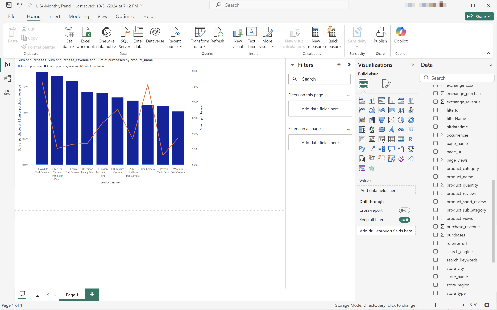

# 단일 차원 등급


이 사용 사례에서는 2023년 이상의 제품 이름에 대한 구매 및 구매 매출을 보여주는 표와 간단한 막대 시각화를 표시할 수 있습니다.

+++ Customer Journey Analytics

사용 사례에 대한 **[!UICONTROL 단일 Dimension 등급]** 패널 예:


+++

+++ BI 도구

>[!PREREQUISITES]
>
>[연결에 성공했는지 확인하고, 데이터 보기를 나열하고, 이 사용 사례를 시도하려는 BI 도구에 대해 데이터 보기를 사용](connect-and-validate.md)할 수 있는지 확인하십시오.
>

>[!BEGINTABS]

>[!TAB Power BI 데스크톱]

1. **[!UICONTROL 데이터]** 창:
   1. **[!UICONTROL 날짜 범위]**&#x200B;를 선택합니다.
   1. **[!UICONTROL product_name]**&#x200B;을(를) 선택하십시오.
   1. **[!UICONTROL purchase_revenue 합계]**&#x200B;를 선택하십시오.
   1. **[!UICONTROL 총 구매]**&#x200B;를 선택하세요.

   선택한 요소의 열 머리글만 표시하는 빈 테이블이 표시됩니다. 가시성을 높이려면 시각화를 확대하십시오.

1. **[!UICONTROL 필터]** 창:

   1. 이 시각적 개체의 **[!UICONTROL 필터]**&#x200B;에서 **[!UICONTROL 날짜 범위는 (모두)]**&#x200B;입니다.
   1. **[!UICONTROL 상대적 날짜]**&#x200B;을(를) **[!UICONTROL 필터 형식]**(으)로 선택합니다.
   1. **[!UICONTROL 값이 마지막]** **&#x200B;**&#x200B;역년`1`에 있을 때 **&#x200B;**&#x200B;항목을 표시하도록 필터를 정의합니다.
   1. **[!UICONTROL 필터 적용]**&#x200B;을 선택하십시오.

   적용된 **[!UICONTROL daterange]** 필터로 업데이트된 표가 표시됩니다.

1. **[!UICONTROL 시각화]** 창에서:

   1. 을(를) 사용하여 **[!UICONTROL 열]**&#x200B;에서 **[!UICONTROL daterange]**&#x200B;을(를) 제거하십시오.
   1. **[!UICONTROL 열]**&#x200B;에서 **[!UICONTROL 구매 총액]**&#x200B;을 **[!UICONTROL 구매 총액]** 아래에 끌어다 놓습니다.

1. 테이블 시각화에서:

   1. **[!UICONTROL purchase_revenue의 합계]**&#x200B;를 선택하여 내림차순 구매 매출 순서로 제품 이름을 정렬합니다. Power BI 데스크톱은 다음과 같아야 합니다.

   

1. **[!UICONTROL 필터]** 창:

   1. **[!UICONTROL product_name은 (모두)]**&#x200B;을(를) 선택합니다.
   1. **[!UICONTROL 필터 형식]**&#x200B;을(를) **[!UICONTROL 상위 N]**(으)로 설정합니다.
   1. 필터를 **[!UICONTROL 항목 표시]** **[!UICONTROL 상위]** `10` **[!UICONTROL 값별]**(으)로 정의합니다.
   1. **[!UICONTROL purchase_revenue]**&#x200B;을(를) **[!UICONTROL 값별]** **[!UICONTROL 여기에 데이터 필드 추가]**(으)로 끌어다 놓습니다.
   1. **[!UICONTROL 필터 적용]**&#x200B;을 선택하십시오.

   Analysis Workspace의 자유 형식 테이블 시각화와 동기화된 구매 매출 값으로 업데이트된 테이블이 표시됩니다.

1. **[!UICONTROL 시각화]** 창에서:

   1. **[!UICONTROL 선 및 누적 세로 막대형 차트]** 시각화를 선택하십시오.

   선 및 누적 세로 막대형 차트 시각화는 테이블과 동일한 데이터를 사용하면서 테이블을 대체합니다.

1. **[!UICONTROL 구매]**&#x200B;를 **[!UICONTROL 시각화]** 창의 **[!UICONTROL 선 y축]**(으)로 끌어서 놓습니다.

   선 및 누적 세로 막대형 차트가 업데이트됩니다. Power BI 데스크톱은 다음과 같아야 합니다.

   

1. 선 및 누적 세로 막대형 차트 시각화에서:

   1. 를 선택하세요.
   1. 컨텍스트 메뉴에서 **[!UICONTROL 표로 표시]**&#x200B;를 선택합니다.

   기본 보기가 라인 시각화와 테이블을 모두 표시하도록 업데이트되었습니다.

   

>[!TAB 타블로 데스크톱]

1. 하단의 **[!UICONTROL 시트 1]** 탭을 선택하여 **[!UICONTROL 데이터 원본]**&#x200B;에서 전환하세요. **[!UICONTROL 시트 1]** 보기에서:
   1. **[!UICONTROL 데이터]** 창의 **[!UICONTROL 테이블]** 목록에서 **[!UICONTROL Daterange]** 항목을 드래그하여 **[!UICONTROL 필터]** 선반에 놓습니다.
   1. **[!UICONTROL 필터 필드 \[Daterange\]]** 대화 상자에서 **[!UICONTROL 날짜 범위]**&#x200B;를 선택하고 **[!UICONTROL 다음 >]**&#x200B;을(를) 선택합니다.
   1. **[!UICONTROL 필터 \[Daterange\]]** 대화 상자에서 **[!UICONTROL 날짜 범위]**&#x200B;를 선택하고 `01/01/2023` - `31/12/2023` 기간을 지정하십시오. **[!UICONTROL 적용]** 및 **[!UICONTROL 확인]**&#x200B;을 선택합니다.

      

   1. **[!UICONTROL 데이터]** 창의 **[!UICONTROL 테이블]** 목록에서 **[!UICONTROL 제품 이름]**&#x200B;을(를) 끌어서 놓고 **[!UICONTROL 행]** 옆에 있는 필드에 항목을 놓습니다.
   1. **[!UICONTROL 데이터]** 창의 **[!UICONTROL 테이블(*측정값 이름*)]** 목록에서 **[!UICONTROL 구매]**&#x200B;를 끌어다 놓고 **[!UICONTROL 행]** 옆에 있는 필드에 항목을 놓습니다. 값이 **[!UICONTROL SUM(구매)]**(으)로 자동 변환됩니다.
   1. **[!UICONTROL 데이터]** 창의 **[!UICONTROL 테이블(*측정값 이름*)]** 목록에서 **[!UICONTROL 구매 매출]**&#x200B;을(를) 끌어다 놓고 **[!UICONTROL 열]** 옆의 필드에 항목을 끌어다 놓고 **[!UICONTROL SUM(구매)]**&#x200B;에서 왼쪽으로 놓습니다. 값이 **[!UICONTROL SUM(구매 매출)]**(으)로 자동 변환됩니다.
   1. 두 차트를 내림차순 구매 매출 순서로 정렬하려면 **[!UICONTROL 구매 매출]** 제목 위로 마우스를 가져간 후 정렬 아이콘을 선택하십시오.
   1. 차트의 항목 수를 제한하려면 **[!UICONTROL 행]**&#x200B;에서 **[!UICONTROL SUM(구매 매출)]**&#x200B;을 선택하고 드롭다운 메뉴에서 **[!UICONTROL 필터]**&#x200B;를 선택합니다.
   1. **[!UICONTROL 필터 \[구매 매출\]]** 대화 상자에서 **[!UICONTROL 값 범위]**&#x200B;를 선택하고 적절한 값을 입력합니다. 예: `1,000,000` - `2,000,000`. **[!UICONTROL 적용]** 및 **[!UICONTROL 확인]**&#x200B;을 선택합니다.
   1. 두 막대 차트를 이중 결합 차트로 변환하려면 **[!UICONTROL 행]**&#x200B;에서 **[!UICONTROL SUM(구매)]**&#x200B;을(를) 선택하고 드롭다운 메뉴에서 **[!UICONTROL 이중 축]**&#x200B;을(를) 선택합니다. 막대 차트는 산포도로 변형됩니다.
   1. 분산형 플롯을 막대 차트로 수정하려면 다음을 수행합니다.
      1. **[!UICONTROL 표시]** 영역에서 **[!UICONTROL SUM(구매)]**&#x200B;을(를) 선택하고 드롭다운 메뉴에서 **[!UICONTROL 줄]**&#x200B;을(를) 선택합니다.
      1. **[!UICONTROL 표시]** 영역에서 **[!UICONTROL SUM(구매 매출)]**&#x200B;을(를) 선택하고 드롭다운 메뉴에서 **[!UICONTROL 막대]**&#x200B;를 선택합니다.

   Tableau Desktop은 다음과 같습니다.

   

1. **[!UICONTROL 시트 1]** 탭 컨텍스트 메뉴에서 **[!UICONTROL 복제]**&#x200B;를 선택하여 두 번째 시트를 만듭니다.
1. **[!UICONTROL 시트 1]** 탭 컨텍스트 메뉴에서 **[!UICONTROL 이름 바꾸기]**&#x200B;를 선택하여 시트의 이름을 `Data`(으)로 변경합니다.
1. **[!UICONTROL 시트 1(2)]** 탭 컨텍스트 메뉴에서 **[!UICONTROL 이름 바꾸기]**&#x200B;를 선택하여 시트의 이름을 `Graph`(으)로 변경합니다.
1. **[!UICONTROL 데이터]** 시트가 선택되어 있는지 확인하십시오.
   1. 오른쪽 상단에서 **[!UICONTROL 표시]**&#x200B;를 선택하고 **[!UICONTROL 텍스트 테이블]**(왼쪽 상단 시각화)을 선택하여 두 차트의 콘텐츠를 테이블로 수정합니다.
   1. 구매 매출을 내림차순으로 정렬하려면 테이블에서 **[!UICONTROL 구매 매출]** 위로 마우스를 가져간 후 을 선택하세요.
   1. **[!UICONTROL 전체 보기]** 드롭다운 메뉴에서 **[!UICONTROL 전체 보기]**&#x200B;를 선택합니다.

   Tableau Desktop은 다음과 같습니다.

   

1. **[!UICONTROL 새 대시보드]** 탭 단추(맨 아래)를 선택하여 새 **[!UICONTROL 대시보드 1]** 보기를 만듭니다. **[!UICONTROL 대시보드 1]** 보기에서:
   1. **[!UICONTROL Graph]** 시트를 **[!UICONTROL 시트]** 셸프에서 **[!UICONTROL 여기에 시트 놓기]**&#x200B;를 읽는 *대시보드 1* 보기로 끌어다 놓습니다.
   1. **[!UICONTROL 그래프]** 시트 아래의 **[!UICONTROL 시트]** 셸프에서 **[!UICONTROL 데이터]** 시트를 **[!UICONTROL 대시보드 1]** 보기로 끌어다 놓습니다.
   1. 보기에서 **[!UICONTROL 데이터]** 시트를 선택하고 **[!UICONTROL 전체 보기]**&#x200B;를 **[!UICONTROL 너비 수정]**(으)로 수정합니다.

   **[!UICONTROL 대시보드 1]** 보기는 다음과 같습니다.

   


>[!TAB 조회자]

1. Looker의 **[!UICONTROL Explore]** 인터페이스에서 제대로 설정했는지 확인하십시오. 그렇지 않으면  **[!UICONTROL 필드 및 필터 제거]**&#x200B;를 선택하십시오.
1. **[!UICONTROL 필터]** 아래의 **[!UICONTROL + 필터]**&#x200B;을(를) 선택하십시오.
1. **[!UICONTROL 필터 추가]** 대화 상자에서:
   1. **[!UICONTROL ‣Cc 데이터 보기 선택]**
   1. 필드 목록에서 **[!UICONTROL 날짜 범위 날짜]**‣을 선택한 다음 **[!UICONTROL 날짜 범위 날짜]**&#x200B;을 선택합니다.
      
1. **[!UICONTROL 이(가) 범위에 있으므로]** Cc 데이터 보기 날짜&#x200B;**[!UICONTROL 필터를 지정하십시오]** **[!UICONTROL 2023/01/01]** **[!UICONTROL 까지(이전)]** **[!UICONTROL 2024/01/01]**.
1. 왼쪽 레일의 **[!UICONTROL ‣Cc 데이터 보기]** 섹션에서 **[!UICONTROL 제품 이름]**&#x200B;을(를) 선택합니다.
1. 왼쪽 레일의 {0‣} 사용자 지정 필드&#x200B;**[!UICONTROL 섹션에서 다음을 수행합니다.]**
   1. **[!UICONTROL + 추가]** 드롭다운 메뉴에서 **[!UICONTROL 사용자 지정 측정값]**&#x200B;을(를) 선택합니다.
   1. **[!UICONTROL 사용자 지정 측정값 만들기]** 대화 상자에서 다음을 수행합니다.
      1. **[!UICONTROL 측정할 필드]** 드롭다운 메뉴에서 **[!UICONTROL 구매 매출]**&#x200B;을(를) 선택합니다.
      1. **[!UICONTROL 측정값 유형]** 드롭다운 메뉴에서 **[!UICONTROL 합계]**&#x200B;를 선택합니다.
      1. **[!UICONTROL 이름]**&#x200B;의 사용자 지정 필드 이름을 입력하십시오. 예: `Purchase Revenue`.
      1. **[!UICONTROL 필드 세부 정보]** 탭을 선택합니다.
      1. **[!UICONTROL 형식]** 드롭다운 메뉴에서 **[!UICONTROL 소수 자릿수]**&#x200B;을(를) 선택하고 `0`이(가) **[!UICONTROL 소수 자릿수]**&#x200B;에 입력되었는지 확인하십시오.
         
      1. **[!UICONTROL 저장]**&#x200B;을 선택합니다.
   1. **[!UICONTROL + 추가]** 드롭다운 메뉴에서 **[!UICONTROL 사용자 지정 측정값]**&#x200B;을(를) 한 번 더 선택합니다. **[!UICONTROL 사용자 지정 만들기]** 측정값 대화 상자에서 다음을 수행합니다.
      1. **[!UICONTROL 측정할 필드]** 드롭다운 메뉴에서 **[!UICONTROL 구매]**&#x200B;를 선택합니다.
      1. **[!UICONTROL 측정값 유형]** 드롭다운 메뉴에서 **[!UICONTROL 합계]**&#x200B;를 선택합니다.
      1. **[!UICONTROL 이름]**&#x200B;의 사용자 지정 필드 이름을 입력하십시오. 예: `Sum of Purchases`.
      1. **[!UICONTROL 필드 세부 정보]** 탭을 선택합니다.
      1. **[!UICONTROL 형식]** 드롭다운 메뉴에서 **[!UICONTROL 소수 자릿수]**&#x200B;을(를) 선택하고 `0`이(가) **[!UICONTROL 소수 자릿수]**&#x200B;에 입력되었는지 확인하십시오.
      1. **[!UICONTROL 저장]**&#x200B;을 선택합니다.
   1. 두 필드 모두 데이터 보기에 자동으로 추가됩니다.
1. 다른 **[!UICONTROL 필터]**&#x200B;을(를) 추가하고 데이터를 제한하려면 **[!UICONTROL + 필터]**&#x200B;을(를) 선택하십시오.
1. **[!UICONTROL 필터 추가]** 대화 상자에서 **[!UICONTROL ‣개의 사용자 지정 필드]**&#x200B;을 선택한 다음 **[!UICONTROL 구매 매출]**&#x200B;을 선택하십시오.
1. 필터를 적절하게 선택하고 제안된 값을 입력하면 **[!UICONTROL 이(가)]** `1000000` **[!UICONTROL 과(와)]** `2000000` 사이에 있습니다.
1. **[!UICONTROL 실행]**&#x200B;을 선택합니다.
1. 선 시각화를 ‣ 표시하려면 **[!UICONTROL 시각화]**&#x200B;를 선택하십시오.
1. 시각화를 업데이트하려면 **[!UICONTROL 시각화]**&#x200B;에서 **[!UICONTROL 편집]**&#x200B;을(를) 선택하십시오. 팝업 대화 상자에서:
   1. **[!UICONTROL 계열]** 탭을 선택합니다.
   1. 아래로 스크롤하여 **[!UICONTROL 구매]**&#x200B;를 확인하고 **[!UICONTROL Type]**&#x200B;을(를) **[!UICONTROL Line]**(으)로 변경합니다.
   1. **[!UICONTROL Y]** 탭을 선택합니다.
   1. **[!UICONTROL 왼쪽 1]** 컨테이너에서 **[!UICONTROL 구매]**&#x200B;를 **[!UICONTROL *새 왼쪽 축을 만들려면&#x200B;*]**&#x200B;시리즈를 여기로 드래그하세요. 이 작업은&#x200B;**[!UICONTROL &#x200B;왼쪽 2 &#x200B;]**&#x200B;컨테이너를 만듭니다.
      
   1. 팝업 대화 상자를 숨기려면  옆에 있는 **[!UICONTROL CrossSize75]**&#x200B;을(를) 선택하십시오

아래 표시된 것처럼 시각화 및 테이블이 표시됩니다.


>[!TAB Jupyter 전자 필기장]

1. 새 셀에 다음 문을 입력합니다.

   ```
   import seaborn as sns
   import matplotlib.pyplot as plt
   data = %sql SELECT product_name AS `Product Name`, SUM(purchase_revenue) AS `Purchase Revenue`, SUM(purchases) AS `Purchases` \
               FROM cc_data_view \
               WHERE daterange BETWEEN '2023-01-01' AND '2024-01-01' \
               GROUP BY 1 \
               LIMIT 10;
   df = data.DataFrame()
   df = df.groupby('Product Name', as_index=False).sum()
   plt.figure(figsize=(15, 3))
   sns.barplot(x='Purchase Revenue', y='Product Name', data=df)
   plt.show()
   display(data)
   ```

1. 셀을 실행합니다. 아래 스크린샷과 비슷한 출력이 표시됩니다.

   


>[!TAB 자습서]

1. 새 청크에 ` ` ``{r} `에서 ` `` ` ` 사이의 다음 문을 입력하십시오.

   ```R
   library(tidyr)
   
   ## Single dimension ranked
   df <- dv %>%
      filter(daterange >= "2023-01-01" & daterange < "2024-01-01") %>%
      group_by(product_name) %>%
      summarise(purchase_revenue = sum(purchase_revenue), purchases = sum(purchases)) %>%
      arrange(product_name, .by_group = FALSE)
   dfV <- df %>%
      head(5)
   ggplot(dfV, aes(x = purchase_revenue, y = product_name)) +
      geom_col(position = "dodge") +
      geom_text(aes(label = purchase_revenue), vjust = -0.5)
   print(df)
   ```

1. 청크를 실행합니다. 아래 스크린샷과 비슷한 출력이 표시됩니다.

   

>[!ENDTABS]

+++

