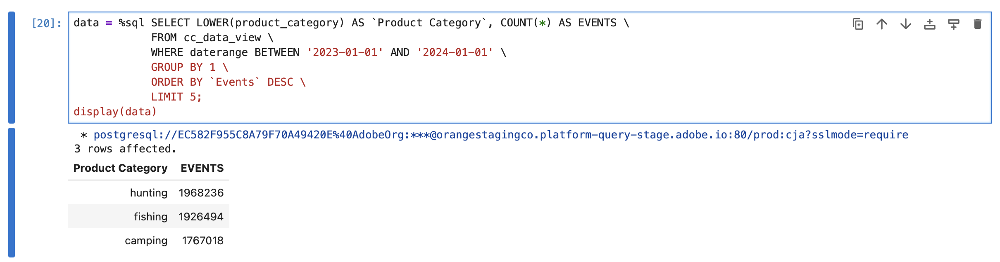

# 변형


다양한 BI 도구에 의한 차원, 지표, 필터, 계산된 지표 및 날짜 범위와 같은 Customer Journey Analytics 객체의 변환을 이해하려고 합니다.

+++ Customer Journey Analytics

Customer Journey Analytics에서는 [데이터 보기](/help/data-views/data-views.md)에서 데이터 세트의 구성 요소가 [차원](/help/components/dimensions/overview.md) 및 [지표](/help/components/apply-create-metrics.md)(으)로 노출되는 방식과 방식을 정의합니다. 차원 및 지표의 해당 정의는 BI 확장을 사용하여 BI 도구에 노출됩니다.
[필터](/help/components/segments/seg-overview.md), [계산된 지표](/help/components/calc-metrics/calc-metr-overview.md) 및 [날짜 범위](/help/components/date-ranges/overview.md)와 같은 구성 요소를 Workspace 프로젝트의 일부로 사용합니다. 이러한 구성 요소는 BI 확장을 사용하여 BI 도구에도 노출됩니다.

+++

+++ BI 도구

>[!PREREQUISITES]
>
>[연결에 성공했는지 확인하고, 데이터 보기를 나열하고, 이 사용 사례를 시도하려는 BI 도구에 대해 데이터 보기를 사용](connect-and-validate.md)할 수 있는지 확인하십시오.
>

>[!BEGINTABS]

>[!TAB Power BI 데스크톱]

Customer Journey Analytics 개체는 **[!UICONTROL 데이터]** 창에서 사용할 수 있으며 Power BI Desktop에서 선택한 테이블에서 검색됩니다. 예: **[!UICONTROL public.cc_data_view]**. 테이블 이름은 Customer Journey Analytics에서 데이터 보기에 정의한 외부 ID와 동일합니다. 예를 들어 **[!UICONTROL 제목]** `C&C - Data View` 및 **[!UICONTROL 외부 ID]** `cc_data_view`의 데이터 보기입니다.

**차원**
Customer Journey Analytics의 차원은 [!UICONTROL 구성 요소 ID]로 식별됩니다. [!UICONTROL 구성 요소 ID]이(가) Customer Journey Analytics 데이터 보기에 정의되어 있습니다. 예를 들어 Customer Journey Analytics의 **[!UICONTROL 제품 이름]** 차원에는 Power BI Desktop에 있는 차원의 이름인 [!UICONTROL 구성 요소 ID] **[!UICONTROL product_name]**&#x200B;이(가) 있습니다.
**[!UICONTROL 일]**, **[!UICONTROL 주]**, **[!UICONTROL 월]** 등과 같은 Customer Journey Analytics의 날짜 범위 차원은 **[!UICONTROL 날짜 범위]**, **[!UICONTROL 날짜 범위]**, **[!UICONTROL 날짜 범위]** 등으로 사용할 수 있습니다.

**지표**
Customer Journey Analytics의 지표는 [!UICONTROL 구성 요소 ID]로 식별됩니다. [!UICONTROL 구성 요소 ID]이(가) Customer Journey Analytics 데이터 보기에 정의되어 있습니다. 예를 들어 Customer Journey Analytics의 **[!UICONTROL 구매 매출]** 지표에는 Power BI Desktop에 있는 지표의 이름인 [!UICONTROL 구성 요소 ID] **[!UICONTROL 구매_매출]**&#x200B;이(가) 있습니다. **[!UICONTROL ∑]**&#x200B;은(는) 지표를 나타냅니다. 시각화에서 지표를 사용하면 지표 이름이 **[!UICONTROL 지표 합계&#x200B;*로 변경됩니다.*]**

**필터**
Customer Journey Analytics에서 정의하는 필터는 **[!UICONTROL filterName]** 필드의 일부로 사용할 수 있습니다. Power BI Desktop에서 **[!UICONTROL filterName]** 필드를 사용하는 경우 사용할 필터를 지정할 수 있습니다.

**계산된 지표**
Customer Journey Analytics에서 정의하는 계산된 지표는 계산된 지표에 대해 정의한 [!UICONTROL 외부 ID]로 식별됩니다. 예를 들어 계산된 지표 **[!UICONTROL 제품 이름(고유 개수)]**&#x200B;에는 [!UICONTROL 외부 ID] **[!UICONTROL product_name_count_distinct]**&#x200B;가 있으며 Power BI Desktop에는 **[!UICONTROL cm_product_name_count_distinct]**&#x200B;t로 표시됩니다.

**날짜 범위**
Customer Journey Analytics에서 정의하는 날짜 범위는 **[!UICONTROL daterangeName]** 필드의 일부로 사용할 수 있습니다. **[!UICONTROL daterangeName]** 필드를 사용하는 경우 사용할 날짜 범위를 지정할 수 있습니다.

**사용자 지정 변형**
Power BI Desktop은 [데이터 분석 표현식(DAX)](https://learn.microsoft.com/en-us/dax/dax-overview)을 사용하여 사용자 지정 변환 기능을 제공합니다. 예를 들어 제품 이름이 소문자인 [등급 단일 차원](#single-dimension-ranked) 사용 사례를 실행하려고 합니다.

1. 보고서 보기에서 막대 시각화를 선택합니다.
1. 데이터 창에서 **[!UICONTROL product_name]**&#x200B;을(를) 선택합니다.
1. 도구 모음에서 **[!UICONTROL 새 열]**&#x200B;을 선택합니다.
1. 수식 편집기에서 `product_name_lower`과(와) 같은 이름이 `product_name_lower = LOWER('public.cc_data_view[product_name])`인 새 열을 정의합니다.
   (으)로 변환
1. **[!UICONTROL 데이터]** 창에서 **[!UICONTROL product_name]** 열 대신 새 **[!UICONTROL product_name_lower]** 열을 선택하십시오.
1. 테이블 시각화의 **[!UICONTROL 자세히]**&#x200B;에서 를 선택합니다.

   Power BI 데스크톱은 다음과 같아야 합니다.
   

사용자 지정 변환으로 인해 SQL 쿼리가 업데이트됩니다. 아래 SQL 예제에서 `lower` 함수 사용을 참조하십시오.

```sql
select "_"."product_name_lower",
    "_"."a0",
    "_"."a1"
from 
(
    select "rows"."product_name_lower" as "product_name_lower",
        sum("rows"."purchases") as "a0",
        sum("rows"."purchase_revenue") as "a1"
    from 
    (
        select "_"."daterange" as "daterange",
            "_"."product_name" as "product_name",
            "_"."purchase_revenue" as "purchase_revenue",
            "_"."purchases" as "purchases",
            lower("_"."product_name") as "product_name_lower"
        from 
        (
            select "_"."daterange",
                "_"."product_name",
                "_"."purchase_revenue",
                "_"."purchases"
            from 
            (
                select "daterange",
                    "product_name",
                    "purchase_revenue",
                    "purchases"
                from "public"."cc_data_view" "$Table"
            ) "_"
            where ("_"."daterange" < date '2024-01-01' and "_"."daterange" >= date '2023-01-01') and ("_"."product_name" in ('4G Cellular Trail Camera', '4K Wildlife Trail Camera', 'Wireless Trail Camera', '8-Person Cabin Tent', '20MP No-Glow Trail Camera', 'HD Wildlife Camera', '4-Season Mountaineering Tent', 'Trail Camera', '16MP Trail Camera with Solar Panel', '10-Person Family Tent'))
        ) "_"
    ) "rows"
    group by "product_name_lower"
) "_"
where not "_"."a0" is null or not "_"."a1" is null
limit 1000001
```

>[!TAB 타블로 데스크톱]

시트에서 작업할 때마다 **[!UICONTROL 데이터]** 사이드바에서 Customer Journey Analytics 개체를 사용할 수 있습니다. 및 은(는) Tableau의 **[!UICONTROL 데이터 원본]** 페이지의 일부로 선택한 테이블에서 검색됩니다. 예: **[!UICONTROL cc_data_view]**. 테이블 이름은 Customer Journey Analytics에서 데이터 보기에 정의한 외부 ID와 동일합니다. 예를 들어 **[!UICONTROL 제목]** `C&C - Data View` 및 **[!UICONTROL 외부 ID]** `cc_data_view`의 데이터 보기입니다.

**차원**
Customer Journey Analytics의 차원은 [!UICONTROL 구성 요소 이름]으로 식별됩니다. [!UICONTROL 구성 요소 이름]이(가) Customer Journey Analytics 데이터 보기에 정의되어 있습니다. 예를 들어, Customer Journey Analytics의 **[!UICONTROL 제품 이름]** 차원에는 Tableau의 차원 이름인 [!UICONTROL 구성 요소 이름] **[!UICONTROL 제품 이름]**&#x200B;이(가) 있습니다. 모든 차원은 **[!UICONTROL Abc]**(으)로 식별됩니다.
**[!UICONTROL 일]**, **[!UICONTROL 주]**, **[!UICONTROL 월]** 등과 같은 Customer Journey Analytics의 날짜 범위 차원은 **[!UICONTROL Daterangeday]**, **[!UICONTROL Daterangeweek]**, **[!UICONTROL Daterangemonth]** 등으로 사용할 수 있습니다. 날짜 범위 차원을 사용하는 경우 드롭다운 메뉴에서 해당 날짜 범위 차원에 적용할 적절한 날짜 또는 시간 정의를 선택해야 합니다. 예: **[!UICONTROL 년]**, **[!UICONTROL 분기]**, **[!UICONTROL 월]**, **[!UICONTROL 일]**.

**지표**
Customer Journey Analytics의 지표는 [!UICONTROL 구성 요소 이름]으로 식별됩니다. [!UICONTROL 구성 요소 이름]이(가) Customer Journey Analytics 데이터 보기에 정의되어 있습니다. 예를 들어, Customer Journey Analytics의 지표 **[!UICONTROL 구매 매출]**&#x200B;에는 Tableau의 지표 이름인 [!UICONTROL 구성 요소 이름] **[!UICONTROL 구매 매출]**&#x200B;이(가) 있습니다. 모든 지표는 **[!UICONTROL #]**(으)로 식별됩니다. 시각화에서 지표를 사용하면 지표 이름이 **[!UICONTROL Sum(*지표*)]**(으)로 바뀝니다.

**필터**
Customer Journey Analytics에서 정의하는 필터는 **[!UICONTROL 필터 이름]** 필드의 일부로 사용할 수 있습니다. Tableau에서 **[!UICONTROL 필터 이름]** 필드를 사용하는 경우 사용할 필터를 지정할 수 있습니다.

**계산된 지표**
Customer Journey Analytics에서 정의하는 계산된 지표는 계산된 지표에 대해 정의한 [!UICONTROL 제목]으로 식별됩니다. 예를 들어 계산된 지표 **[!UICONTROL 제품 이름(고유 개수)]**&#x200B;에는 [!UICONTROL 제목] **[!UICONTROL 제품 이름(고유 개수)]**&#x200B;이 있으며 Tableau에서는 **[!UICONTROL Cm 제품 이름 고유 개수]**&#x200B;로 표시됩니다.

**날짜 범위**
Customer Journey Analytics에서 정의하는 날짜 범위는 **[!UICONTROL 날짜 범위 이름]** 필드의 일부로 사용할 수 있습니다. **[!UICONTROL 날짜 범위 이름]** 필드를 사용하는 경우 사용할 날짜 범위를 지정할 수 있습니다.

**사용자 지정 변형**
Tableau Desktop은 [계산된 필드](https://help.tableau.com/current/pro/desktop/en-us/calculations_calculatedfields_create.htm)를 사용하여 사용자 지정 변환 기능을 제공합니다. 예를 들어 제품 이름이 소문자인 [등급 단일 차원](#single-dimension-ranked) 사용 사례를 실행하려고 합니다.

1. 기본 메뉴에서 **[!UICONTROL 분석]** > **[!UICONTROL 계산된 필드 만들기]**&#x200B;를 선택합니다.
   1. **[!UICONTROL 함수를 사용하여]**&#x200B;소문자 제품 이름`LOWER([Product Name])`을(를) 정의합니다.
      
   1. **[!UICONTROL 확인]**&#x200B;을 선택합니다.
1. **[!UICONTROL 데이터]** 시트를 선택하십시오.
   1. **[!UICONTROL 테이블]**&#x200B;에서 **[!UICONTROL 소문자 제품 이름]**&#x200B;을(를) 드래그하고 **[!UICONTROL 행]** 옆의 필드에 항목을 놓습니다.
   1. **[!UICONTROL 행]**&#x200B;에서 **[!UICONTROL 제품 이름]**&#x200B;을(를) 제거합니다.
1. **[!UICONTROL 대시보드 1]** 보기를 선택하십시오.

Tableau Desktop은 다음과 같습니다.


사용자 지정 변환으로 인해 SQL 쿼리가 업데이트됩니다. 아래 SQL 예제에서 `LOWER` 함수 사용을 참조하십시오.

```sql
SELECT LOWER(CAST(CAST("cc_data_view"."product_name" AS TEXT) AS TEXT)) AS "Calculation_1562467608097775616",
  SUM("cc_data_view"."purchase_revenue") AS "sum:purchase_revenue:ok",
  SUM("cc_data_view"."purchases") AS "sum:purchases:ok"
FROM "public"."cc_data_view" "cc_data_view"
WHERE (("cc_data_view"."daterange" >= (DATE '2023-01-01')) AND ("cc_data_view"."daterange" <= (DATE '2023-12-31')))
GROUP BY 1
HAVING ((SUM("cc_data_view"."purchase_revenue") >= 999999.99999998999) AND (SUM("cc_data_view"."purchase_revenue") <= 2000000.00000002))
```

>[!TAB 조회자]

Customer Journey Analytics 개체는 **[!UICONTROL 탐색]** 인터페이스에서 사용할 수 있습니다. 및 는 Looker에서 연결, 프로젝트 및 모델 설정의 일부로 검색됩니다. 예: **[!UICONTROL cc_data_view]**. 보기 이름은 Customer Journey Analytics에서 데이터 보기에 대해 정의한 외부 ID와 동일합니다. 예를 들어 **[!UICONTROL 제목]** `C&C - Data View` 및 **[!UICONTROL 외부 ID]** `cc_data_view`의 데이터 보기입니다.

**차원**
Customer Journey Analytics의 차원은 **[!UICONTROL Cc 데이터 보기]** 왼쪽 레일에 **[!UICONTROL DIMENSION]**(으)로 나열됩니다. 차원은 Customer Journey Analytics 데이터 보기에서 정의됩니다. 예를 들어 Customer Journey Analytics의 **[!UICONTROL 제품 이름]** 차원에는 Looker의 차원 이름인 **[!UICONTROL DIMENSION]** **[!UICONTROL 제품 이름]**&#x200B;이(가) 있습니다.
**[!UICONTROL 일]**, **[!UICONTROL 주]**, **[!UICONTROL 월]** 등과 같은 Customer Journey Analytics의 날짜 범위 차원은 **[!UICONTROL Daterangeday 날짜]**, **[!UICONTROL Daterangeweek 날짜]**, **[!UICONTROL Daterangemonth 날짜]** 등으로 사용할 수 있습니다.  날짜 범위 차원을 사용하는 경우 적절한 날짜 또는 시간 정의를 선택해야 합니다. 예: **[!UICONTROL 년]**, **[!UICONTROL 분기]**, **[!UICONTROL 월]**, **[!UICONTROL 날짜]**.

**지표**
Customer Journey Analytics의 지표는 **[!UICONTROL Cc 데이터 보기]** 왼쪽 레일에서 **[!UICONTROL DIMENSION]**(으)로 나열됩니다. 예를 들어 Customer Journey Analytics의 **[!UICONTROL 구매 매출]** 지표에는 **[!UICONTROL DIMENSION]** **[!UICONTROL 구매 매출]**&#x200B;이 있습니다. 실제로 지표로 사용하려면 위의 예제에 표시된 대로 사용자 지정 측정값 필드를 생성하거나 차원에 대한 단축키를 사용하십시오. 예를 들어 **[!UICONTROL ⋮]**&#x200B;을(를) 선택하고 **[!UICONTROL 집계]**&#x200B;을(를) 선택한 다음 **[!UICONTROL 합계]**&#x200B;를 선택합니다.

**필터**
Customer Journey Analytics에서 정의하는 필터는 **[!UICONTROL 필터 이름]** 필드의 일부로 사용할 수 있습니다. Looker에서 **[!UICONTROL 필터 이름]** 필드를 사용하는 경우 사용할 필터를 지정할 수 있습니다.

**계산된 지표**
Customer Journey Analytics에서 정의하는 계산된 지표는 계산된 지표에 대해 정의한 [!UICONTROL 제목]으로 식별됩니다. 예를 들어, 계산된 지표 **[!UICONTROL 제품 이름(고유 개수)]**&#x200B;에는 [!UICONTROL 제목] **[!UICONTROL 제품 이름(고유 개수)]**&#x200B;이 있으며 **[!UICONTROL Cm 제품 이름 고유 개수]**&#x200B;로 표시됩니다.

**날짜 범위**
Customer Journey Analytics에서 정의하는 날짜 범위는 **[!UICONTROL 날짜 범위 이름]** 필드의 일부로 사용할 수 있습니다. **[!UICONTROL 날짜 범위 이름]** 필드를 사용하는 경우 사용할 날짜 범위를 지정할 수 있습니다.

**사용자 지정 변형**
Looker는 위에 표시된 대로 사용자 지정 필드 빌더를 사용하여 사용자 지정 변환 기능을 제공합니다. 예를 들어 제품 이름이 소문자인 [등급 단일 차원](#single-dimension-ranked) 사용 사례를 실행하려고 합니다.

1. 왼쪽 레일의 {0‣} 사용자 지정 필드&#x200B;**[!UICONTROL 섹션에서 다음을 수행합니다.]**
   1. **[!UICONTROL + 추가]** 드롭다운 메뉴에서 **[!UICONTROL 사용자 지정 Dimension]**&#x200B;을(를) 선택합니다.
   1. `lower(${cc_data_view.product_name})`식&#x200B;**[!UICONTROL 텍스트 영역에]**&#x200B;을(를) 입력하십시오. `Product Name`을(를) 입력할 때 올바른 구문이 도움이 됩니다.
      
   1. `product name`을(를) **[!UICONTROL 이름]**(으)로 입력하십시오.
   1. **[!UICONTROL 저장]**&#x200B;을 선택합니다.

아래 표시된 것과 유사한 표가 표시됩니다.


사용자 지정 변환으로 인해 SQL 쿼리가 업데이트됩니다. 아래 SQL 예제에서 `LOWER` 함수 사용을 참조하십시오.

```sql
SELECT
    LOWER((cc_data_view."product_name")) AS "product_name",
    COALESCE(SUM(CAST(( cc_data_view."purchase_revenue"  ) AS DOUBLE PRECISION)), 0) AS "sum_of_purchase_revenue",
    COALESCE(SUM(CAST(( cc_data_view."purchases"  ) AS DOUBLE PRECISION)), 0) AS "sum_of_purchases"
FROM public.cc_data_view  AS cc_data_view
WHERE ((( cc_data_view."daterange"  ) >= (DATE_TRUNC('day', DATE '2023-01-01')) AND ( cc_data_view."daterange"  ) < (DATE_TRUNC('day', DATE '2024-01-01'))))
GROUP BY
    1
ORDER BY
    2 DESC
FETCH NEXT 500 ROWS ONLY
```

>[!TAB Jupyter 전자 필기장]

Customer Journey Analytics 개체(차원, 지표, 필터, 계산된 지표 및 날짜 범위)는 사용자가 구성하는 포함된 SQL 쿼리의 일부로 사용할 수 있습니다. 이전 예를 참조하십시오.

**사용자 지정 변형**

1. 새 셀에 다음 문을 입력합니다.

   ```python
   data = %sql SELECT LOWER(product_category) AS `Product Category`, COUNT(*) AS EVENTS \
               FROM cc_data_view \
               WHERE daterange BETWEEN '2023-01-01' AND '2024-01-01' \
               GROUP BY 1 \
               ORDER BY `Events` DESC \
               LIMIT 5;
   display(data)
   ```

1. 셀을 실행합니다. 아래 스크린샷과 비슷한 출력이 표시됩니다.

   

이 쿼리는 Jupyter Notebook에 정의된 BI 확장에서 실행됩니다.

>[!TAB 자습서]

Customer Journey Analytics 구성 요소(차원, 지표, 필터, 계산된 지표 및 날짜 범위)는 R 언어에서 이름이 비슷한 객체로 사용할 수 있습니다. 구성 요소를 사용하여 구성 요소를 참조하십시오. 이전 예제를 참조하십시오.

**사용자 지정 변형**

1. 새 청크에 ` ` ``{r} `에서 ` `` ` ` 사이의 다음 문을 입력하십시오.

   ```R
   df <- dv %>%
      filter(daterange >= "2023-01-01" & daterange <= "2024-01-01") %>%
      mutate(d2=lower(product_category)) %>%
      group_by(d2) %>%
      count() %>%
      arrange(d2, .by_group = FALSE)
   print(df)
   ```

1. 청크를 실행합니다. 아래 스크린샷과 비슷한 출력이 표시됩니다.

   

BI 확장을 사용하여 RStudio에서 생성된 쿼리에 `lower`이(가) 포함되어 있습니다. 이는 사용자 지정 변환이 RStudio 및 BI 확장에 의해 실행됨을 의미합니다.

```sql
SELECT "d2", COUNT(*) AS "n"
FROM (
  SELECT "cc_data_view".*, lower("product_category") AS "d2"
  FROM "cc_data_view"
  WHERE ("daterange" >= '2023-01-01' AND "daterange" <= '2024-01-01')
) AS "q01"
GROUP BY "d2"
ORDER BY "d2"
LIMIT 1000
```

>[!ENDTABS]

+++

