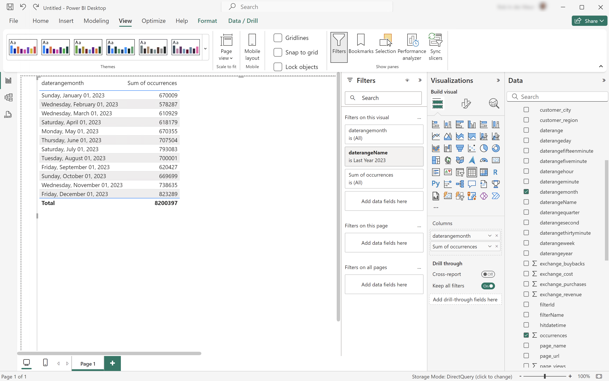

# 날짜 범위 이름을 사용하여 필터링

이 사용 사례에서는 Customer Journey Analytics에서 정의한 날짜 범위를 사용하여 지난 해 동안의 발생 횟수(이벤트)를 필터링하고 보고하려고 합니다.

+++ Customer Journey Analytics

날짜 범위를 사용하여 보고하려면 Customer Journey Analytics에서 **[!UICONTROL 제목]** `Last Year 2023`(으)로 날짜 범위를 설정합니다.


그런 다음 사용 사례에 대해 **[!UICONTROL 날짜 범위 이름을 사용하여 필터링]** 패널의 예에서 해당 날짜 범위를 사용할 수 있습니다.


자유 형식 테이블 시각화에 정의된 날짜 범위가 패널에 적용된 날짜 범위를 어떻게 오버룰하는지 확인합니다.

+++

+++ BI 도구

>[!PREREQUISITES]
>
>[연결에 성공했는지 확인하고, 데이터 보기를 나열하고, 이 사용 사례를 시도하려는 BI 도구에 대해 데이터 보기를 사용](connect-and-validate.md)할 수 있는지 확인하십시오.
>

>[!BEGINTABS]

>[!TAB Power BI 데스크톱]

1. **[!UICONTROL 데이터]** 창:
   1. **[!UICONTROL daterangemonth]**&#x200B;을(를) 선택하십시오.
   1. **[!UICONTROL daterangeName]** 선택
   1. **[!UICONTROL 발생 횟수 합계]**&#x200B;를 선택합니다.

   **[!UICONTROL 이 비주얼에 대한 데이터를 가져오는 동안 오류가 발생했습니다]**&#x200B;을(를) 표시하는 시각화가 표시됩니다.

1. **[!UICONTROL 필터]** 창:

   1. 이 시각적 개체의 **[!UICONTROL 필터]**&#x200B;에서 **[!UICONTROL daterangeName is (All)]**&#x200B;을(를) 선택하십시오.
   1. **[!UICONTROL 기본 필터링]**&#x200B;을(를) **[!UICONTROL 필터 형식]**(으)로 선택합니다.
   1. **[!UICONTROL 검색]** 필드 아래에서 Customer Journey Analytics에 정의된 날짜 범위의 이름인 **[!UICONTROL Last Year 2023]**&#x200B;을(를) 선택합니다.
   1. 에서 **[!UICONTROL daterangeName]**&#x200B;을(를) 제거하려면 **[!UICONTROL CrossSize75]**&#x200B;을(를) 선택하십시오.

   적용된 **[!UICONTROL daterangeName]** 필터로 업데이트된 표가 표시됩니다. Power BI 데스크톱은 다음과 같아야 합니다.

   

>[!TAB 타블로 데스크톱]

1. 하단의 **[!UICONTROL 시트 1]** 탭을 선택하여 **[!UICONTROL 데이터 원본]**&#x200B;에서 전환하세요. **[!UICONTROL 시트 1]** 보기에서:
   1. **[!UICONTROL 필터]** 셸프의 **[!UICONTROL 테이블]** 목록에서 **[!UICONTROL Daterange 이름]** 항목을 드래그합니다.
   1. **[!UICONTROL 필터 \[Daterange Name\]]** 대화 상자에서 **[!UICONTROL 목록에서 선택]**&#x200B;을 선택하고 목록에서 **[!UICONTROL 지난 2023년]**&#x200B;을 선택하십시오. **[!UICONTROL 적용]** 및 **[!UICONTROL 확인]**&#x200B;을 선택합니다.
   1. **[!UICONTROL 테이블]** 목록에서 **[!UICONTROL Daterangemonth]** 항목을 드래그하여 **[!UICONTROL 행]** 옆의 필드에 항목을 놓습니다. **[!UICONTROL Daterangemonth]**&#x200B;을(를) 선택하고 **[!UICONTROL 월]**&#x200B;을(를) 선택합니다. 값이 **[!UICONTROL MONTH(Daterangemonth)]**(으)로 변경됩니다.
   1. **[!UICONTROL 테이블]** 목록에서 **[!UICONTROL 발생 횟수]** 항목을 드래그하여 **[!UICONTROL 열]** 옆의 필드에 항목을 놓습니다. 값이 **[!UICONTROL SUM(발생 횟수)]**(으)로 변경됩니다.
   1. **[!UICONTROL 표시]**&#x200B;에서 **[!UICONTROL 텍스트 테이블]**&#x200B;을(를) 선택하십시오.
   1. 도구 모음에서 **[!UICONTROL 행 및 열 바꾸기]**&#x200B;를 선택합니다.
   1. **[!UICONTROL 맞춤]** 드롭다운 메뉴에서 **[!UICONTROL 맞춤]**&#x200B;을 선택합니다.

      Tableau Desktop은 다음과 같습니다.

      

>[!TAB 조회자]

1. Looker의 **[!UICONTROL Explore]** 인터페이스에서 제대로 설정했는지 확인하십시오. 그렇지 않으면  **[!UICONTROL 필드 및 필터 제거]**&#x200B;를 선택하십시오.
1. **[!UICONTROL 필터]** 아래의 **[!UICONTROL + 필터]**&#x200B;을(를) 선택하십시오.
1. **[!UICONTROL 필터 추가]** 대화 상자에서:
   1. **[!UICONTROL ‣Cc 데이터 보기 선택]**
   1. 필드 목록에서 **[!UICONTROL 날짜 범위 ‣ 이름]**&#x200B;을(를) 선택합니다.
1. **[!UICONTROL Cc 데이터 보기 날짜 범위 이름]** 필터를 **[!UICONTROL is]**(으)로 지정하고 값 목록에서 **[!UICONTROL 지난해 2023년]**&#x200B;을(를) 선택합니다.
1. 왼쪽 레일의 **[!UICONTROL ‣Cc 데이터 보기]** 섹션에서 다음을 수행합니다.
   1. **[!UICONTROL 날짜 범위 월]**&#x200B;을 선택한 다음 **[!UICONTROL 월]**&#x200B;을 선택합니다.
   1. 왼쪽 레일(맨 아래)에서 **[!UICONTROL MEASURES]** 아래의 **[!UICONTROL Count]**&#x200B;을(를) 선택하십시오.
1. **[!UICONTROL 실행]**&#x200B;을 선택합니다.
1. **[!UICONTROL ‣개의 시각화]**&#x200B;를 선택하십시오.

아래 표시된 것처럼 시각화 및 테이블이 표시됩니다.


>[!TAB Jupyter 전자 필기장]

1. 새 셀에 다음 문을 입력합니다.

   ```python
   data = %sql SELECT daterangeName FROM cc_data_view;
   style = {'description_width': 'initial'}
   daterange_name = widgets.Dropdown(
      options=[d for d, in data],
      description='Date Range Name:',
      style=style
   )
   display(daterange_name)
   ```

1. 셀을 실행합니다. 아래 스크린샷과 비슷한 출력이 표시됩니다.

   

1. 드롭다운 메뉴에서 **[!UICONTROL 낚시 제품]**&#x200B;을(를) 선택합니다.

1. 새 셀에 다음 문을 입력합니다.

   ```python
   import seaborn as sns
   import matplotlib.pyplot as plt
   data = %sql SELECT daterangemonth AS Month, COUNT(*) AS Events \
               FROM cc_data_view \
               WHERE daterangeName = '{daterange_name.value}' \
               GROUP BY 1 \
               ORDER BY Month ASC
   df = data.DataFrame()
   df = df.groupby('Month', as_index=False).sum()
   plt.figure(figsize=(15, 3))
   sns.lineplot(x='Month', y='Events', data=df)
   plt.show()
   display(data)
   ```

1. 셀을 실행합니다. 아래 스크린샷과 비슷한 출력이 표시됩니다.

   


>[!TAB 자습서]

1. 새 청크에 ` ` ``{r} `에서 ` `` ` ` 사이의 다음 문을 입력하십시오. 적절한 날짜 범위 이름을 사용해야 합니다. (예: `Last Year 2023`)

   ```R
   ## Monthly Events for Last Year
   df <- dv %>%
      filter(daterangeName == "Last Year 2023") %>%
      group_by(daterangemonth) %>%
      count() %>%
      arrange(daterangemonth, .by_group = FALSE)
   ggplot(df, aes(x = daterangemonth, y = n)) +
      geom_line(color = "#69b3a2") +
      ylab("Events") +
      xlab("Hour")
   print(df)
   ```

1. 청크를 실행합니다. 아래 스크린샷과 비슷한 출력이 표시됩니다.

   

>[!ENDTABS]

+++

