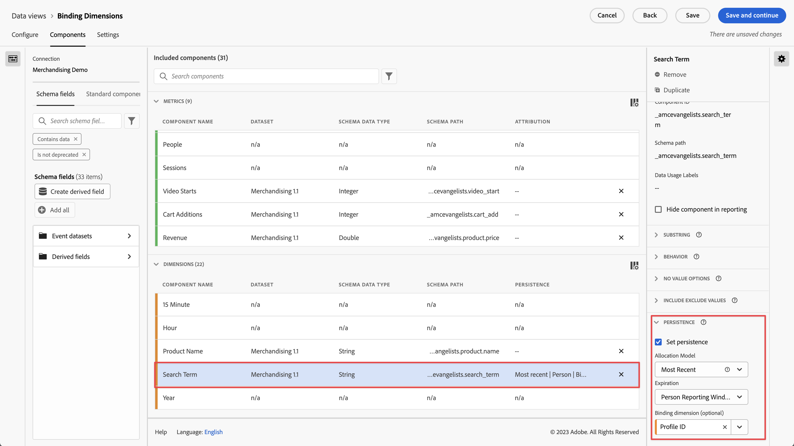

# Customer Journey Analytics에서 바인딩 차원 및 지표 사용

Customer Journey Analytics는 설정된 히트 이후에 차원 값이 유지하는 몇 가지 방법을 제공합니다. Adobe가 제공하는 지속성 방법 중 하나는 바인딩이라고 합니다. 이전 버전의 Adobe Analytics에서는 이 개념을 머천다이징이라고 했습니다.

최상위 이벤트 데이터로 바인딩 차원을 사용할 수 있지만 이 개념은 [개체 배열](/help/use-cases/object-arrays.md)로 작업할 때 가장 적합합니다. 해당 이벤트의 모든 속성에 차원을 적용하지 않고 개체 배열의 한 부분에 차원을 지정할 수 있습니다. 예를 들어 검색어를 전체 이벤트에 바인딩하지 않고 장바구니 개체 배열의 한 제품에 검색어를 지정할 수 있습니다.

## 예제 1: 바인딩 차원을 사용하여 추가 제품 속성을 구매와 연결

개체 배열 내의 차원 항목을 다른 차원에 바인딩할 수 있습니다. 바인딩된 차원 항목이 표시되면 Customer Journey Analytics은 바인딩된 차원을 호출하여 이벤트에 포함합니다. 다음 고객 여정을 고려하십시오.

1. 방문자가 세탁기의 제품 페이지를 봅니다.

   ```json
   {
       "PersonID": "1",
       "product": [
           {
               "name": "Washing Machine 2000",
               "color": "white",
               "type": "front loader",
           },
       ],
       "timestamp": 1534219229
   }
   ```

1. 그런 다음 방문자는 건조기의 제품 페이지를 봅니다.

   ```json
   {
       "PersonID": "1",
       "product": [
           {
               "name": "Dryer 2000",
               "color": "neon orange",
           },
       ],
       "timestamp": 1534219502
   }
   ```

1. 궁극적으로 방문자는 구매를 합니다. 각 제품의 색상은 구매 이벤트에 포함되지 않았습니다.

   ```json
   {
       "PersonID": "1",
       "orders": 1,
       "product": [
           {
               "name": "Washing Machine 2000",
               "price": 1600,
           },
           {
               "name": "Dryer 2000",
               "price": 499
           }
       ],
       "timestamp": 1534219768
   }
   ```

바인딩 차원 없이 색상별로 매출을 확인하려는 경우 차원 `product.color`가 지속되며 건조기 색상에 대한 크레딧이 잘못 부여됩니다.

| product.color | 매출 |
| --- | --- |
| 네온 오렌지 | 2099 |

로 이동 **[!UICONTROL 데이터 보기]** 및 바인딩 [!DNL Product Color] 차원 대상 [!DNL Product Name]:


이 지속성 모델을 설정하면 Customer Journey Analytics은 제품 색상이 설정될 때마다 제품 이름을 기록합니다. 이 사용자에 대한 후속 이벤트에서 동일한 제품 이름을 인식하면 제품 색상도 가져옵니다. 제품 색상을 제품 이름에 바인딩할 때 동일한 데이터는 다음과 유사하게 표시됩니다.

| product.color | 매출 |
| --- | --- |
| 흰색 | 1600 |
| 네온 오렌지 | 499 |

## 예제 2: 바인딩 지표를 사용하여 검색어를 제품 구매와 연결

Adobe Analytics에서 가장 일반적인 머천다이징 방법 중 하나는 검색어를 제품에 바인딩하여 각 검색어가 해당 제품에 대한 크레딧을 얻도록 하는 것입니다. 다음 고객 여정을 고려하십시오.

1. 방문자가 사이트에 와서 “복싱 글러브”를 검색합니다. 검색 지표가 하나씩 증가하고 상위 3개의 검색 결과가 표시됩니다.

   ```json
   {
       "PersonID": "1",
       "page_name": "Search results",
       "search": "1",
       "search_term": "boxing gloves",
       "product": [
           {
               "name": "Beginner gloves",
           },
           {
               "name": "Tier 3 gloves",
           },
           {
               "name": "Professional gloves",
           }
       ]
   }
   ```

2. 마음에 드는 글러브를 찾아 장바구니에 추가합니다.

   ```json
   {
       "PersonID": "1",
       "page_name": "Shopping cart",
       "cart_add": "1",
       "product": [
           {
               "name": "Tier 3 gloves",
           }
       ]
   }
   ```

3. 그런 다음 방문자는 “테니스 라켓”을 검색합니다. 검색 지표가 하나씩 증가하고 상위 3개의 검색 결과가 표시됩니다.

   ```json
   {
       "PersonID": "1",
       "page_name": "Search results",
       "search": "1",
       "search_term": "tennis racket",
       "product": [
           {
               "name": "Shock absorb racket",
           },
           {
               "name": "Women's open racket",
           },
           {
               "name": "Extreme racket",
           }
       ]
   }
   ```

4. 마음에 드는 라켓을 찾아 장바구니에 담습니다.

   ```json
   {
       "PersonID": "1",
       "page_name": "Shopping cart",
       "cart_add": "1",
       "product": [
           {
               "name": "Tier 3 gloves",
           },
           {
               "name": "Shock absorb racket",
           }
       ]
   }
   ```

5. 방문자는 세 번째로 “신발”을 검색합니다. 검색 지표가 하나씩 증가하고 상위 3개의 검색 결과가 표시됩니다.

   ```json
   {
       "PersonID": "1",
       "page_name": "Search results",
       "search": "1",
       "search_term": "shoes",
       "product": [
           {
               "name": "Men's walking shoes",
           },
           {
               "name": "Tennis shoes",
           },
           {
               "name": "Skate shoes",
           }
       ]
   }
   ```

6. 마음에 드는 신발을 찾아 장바구니에 추가합니다.

   ```json
   {
       "PersonID": "1",
       "page_name": "Shopping cart",
       "cart_add": "1",
       "product": [
           {
               "name": "Tier 3 gloves",
           },
           {
               "name": "Shock absorb racket",
           },
           {
               "name": "Skate shoes",
           }
       ]
   }
   ```

7. 방문자는 체크아웃 프로세스를 거쳐 이 세 가지 물건을 구매합니다.

   ```json
   {
       "PersonID": "1",
       "page_name": "Thank you for your purchase",
       "purchase": "1",
       "product": [
           {
               "name": "Tier 3 gloves",
               "price": "89.99"
           },
           {
               "name": "Shock absorb racket",
               "price": "34.99"
           },
           {
               "name": "Skate shoes",
               "price": "79.99"
           }
       ]
   }
   ```

검색어와 함께 바인딩 차원이 포함되지 않은 배분 모델을 사용하는 경우 세 가지 제품 모두 단일 검색어에만 매출을 연결합니다. 예를 들어 [!UICONTROL 원본] 검색어 차원을 사용한 할당:

| search_term | 매출 |
| --- | --- |
| 복싱 글러브 | $204.97 |

을 사용한 경우 [!UICONTROL 가장 최근] 검색어 차원을 사용하여 할당하면 세 가지 제품 모두 단일 검색어에 매출을 연결합니다.

| search_term | 매출 |
| --- | --- |
| 신발 | $204.97 |

이 예는 한 사람만 포함되지만, 다른 항목을 검색하는 많은 사람은 검색어를 다른 제품에 잘못 지정할 수 있으므로 실제로 최상의 검색 결과가 무엇인지 판단하기 어렵습니다.

이제 바인딩할 수 있습니다. [!DNL Search Term] 끝 [!DNL Product Name] 다음 시간 마다 [!DNL Searches] 검색어를 매출에 올바로 연결할 수 있는 지표가 있습니다.


Analysis Workspace에서 결과 보고서는 다음과 유사합니다.

| search_term | 매출 |
| --- | --- |
| 복싱 글러브 | $89.99 |
| 테니스 라켓 | $34.99 |
| 신발 | $79.99 |

Customer Journey Analytics은 선택한 차원과 바인딩 차원 간의 관계를 자동으로 감지합니다. 선택한 차원이 상위 수준에 있고 바인딩 차원이 개체 배열에 있는 경우 바인딩 지표가 필요합니다. 바인딩 지표는 바인딩 차원의 트리거 역할을 하므로 바인딩 지표가 있는 이벤트에만 바인딩됩니다. 위의 예에서 검색 결과 페이지에는 항상 검색어 차원과 검색 지표가 포함됩니다.

검색어 차원을 이 지속성 모델로 설정하면 다음 논리가 실행됩니다.

* 검색어 차원이 설정되면 제품 이름이 있는지 확인합니다.
* 제품 이름이 없으면 아무 것도 하지 마십시오.
* 제품 이름이 있으면 검색 지표가 있는지 확인합니다.
* 검색 지표가 없으면 아무 것도 하지 마십시오.
* 검색 지표가 있으면 검색어를 해당 이벤트의 모든 제품 이름에 바인딩합니다. 해당 이벤트에 대한 제품 이름과 동일한 수준으로 복사됩니다. 이 예제에서는 product.search_term으로 처리됩니다.
* 후속 이벤트에서 동일한 제품 이름이 표시되면 바인딩된 검색어도 해당 이벤트로 이월됩니다.

## 예제 3: 비디오 검색어를 사용자 프로필에 바인딩

프로필 간의 지속성이 완전히 분리된 상태로 유지되도록 검색어를 사용자 프로필에 바인딩할 수 있습니다. 예를 들어 조직에서 중요한 계정이 여러 프로필을 보유할 수 있는 스트리밍 서비스를 실행합니다. 방문자는 아동 프로필과 성인 프로필을 보유하고 있습니다.

1. 해당 계정은 아동 프로필로 로그인하여 아동 TV 프로그램을 검색합니다. `"ProfileID"`은`2` 아동 프로필을 나타냅니다.

   ```json
   {
       "PersonID": "7078",
       "ProfileID": "2",
       "Searches": "1",
       "search_term": "kids show"
   }
   ```

1. 그들은 “Orangey” 프로를 찾아 자녀가 볼 수 있도록 재생합니다.

   ```json
   {
       "PersonID": "7078",
       "ProfileID": "2",
       "ShowName": "Orangey",
       "VideoStarts": "1"
   }
   ```

1. 그날 저녁 늦게 부모는 프로필로 전환하고 시청할 성인 콘텐츠를 검색합니다. `"ProfileID"`은`1` 성인 프로필을 나타냅니다. 두 프로필 모두 동일한 계정에 속하며 동일한 `"PersonID"`(으)로 표시됩니다.

   ```json
   {
       "PersonID": "7078",
       "ProfileID": "1",
       "Searches": "1",
       "search_term": "grownup movie"
   }
   ```

1. 부모는 “Analytics After Hours” 프로를 찾아서 시청하며 저녁을 보냅니다.

   ```json
   {
       "PersonID": "7078",
       "ProfileID": "1",
       "ShowName": "Analytics After Hours",
       "VideoStarts": "1"
   }
   ```

1. 다음 날, 그들은 자녀를 위해 “Orangey” 프로를 계속 재생합니다. 그들은 이미 프로를 알고 있기 때문에 검색할 필요가 없습니다.

   ```json
   {
       "PersonID": "7078",
       "ProfileID": "2",
       "ShowName": "Orangey",
       "VideoStarts": "1"
   }
   ```

개인 만료와 함께 가장 최근 할당을 사용하는 경우 `"grownup movie"` 검색어는 아동용 프로그램의 마지막 보기에 기인합니다.

| 검색어 | 비디오 시작 |
| --- | --- |
| 성인용 영화 | 2 |
| 아동용 프로그램 | 1 |

그러나 `search_term`을(를) `ProfileID`에 바인딩하면 각 프로필의 검색은 찾고 있는 프로그램에 기인하여 자체 프로필로 분리됩니다.



Analysis Workspace는 다른 프로필의 검색을 고려하지 않고 Orangey의 두 번째 에피소드를 검색어 `"kids show"`로 올바르게 지정합니다.

| 검색어 | 비디오 시작 |
| --- | --- |
| 아동용 프로그램 | 2 |
| 성인용 영화 | 1 |

## 예제 4: 검색 평가 및 소매 환경에서 검색 행동을 비교

이전 이벤트에 설정된 차원에 값을 바인딩할 수 있습니다. 바인딩 차원으로 변수를 설정하면 Customer Journey Analytics에서 지속 값을 고려합니다. 이 동작을 원하지 않는 경우 바인딩 차원의 지속성 설정을 조정할 수 있습니다. `product_finding_method`가 이벤트에 설정된 후 이벤트에서 장바구니 추가 지표에 바인딩되는 다음 예를 참조하십시오.

1. 방문자가 `"camera"`에 대한 검색을 수행합니다. 이 페이지에는 상품이 설정되어 있지 않습니다.

   ```json
   {
       "search_term": "camera",
       "product_finding_method": "search"
   }
   ```

1. 방문자는 마음에 드는 카메라를 클릭하고 장바구니에 추가합니다.

   ```json
   {
       "Product": [
           {
               "name": "DSLR Camera"
           }
       ],
       "CartAdd": "1"
   }
   ```

1. 그런 다음 검색을 수행하지 않고 남성 벨트 범주를 탐색합니다. 이 페이지에는 상품이 설정되어 있지 않습니다.

   ```json
   {
       "category": "Men's belts",
       "product_finding_method": "browse"
   }
   ```

1. 방문자는 마음에 드는 벨트를 클릭하고 장바구니에 추가합니다.

   ```json
   {
       "Product": [
           {
               "name": "Ratchet belt"
           }
       ],
       "CartAdd": "1"
   }
   ```

1. 체크아웃 프로세스를 거쳐 이 두 가지 물건을 구매합니다.

   ```json
   {
       "Product": [
           {
               "name": "DSLR Camera",
               "price": "399.99"
           },
           {
               "name": "Ratchet belt",
               "price": "19.99"
           }
       ],
       "Purchase": "1"
   }
   ```

지속성이 바인딩 차원 없이 가장 최근의 할당으로 설정된 경우, 매출의 $419.98은 모두 `browse` 검색 방법에 연결됩니다.

| 제품 검색 방법 | 매출 |
| --- | --- |
| 검색 | 419.98 |

지속성이 바인딩 차원 없이 원본 할당을 사용하여 설정된 경우, 매출의 $419.98은 모두 `search` 검색 방법에 연결됩니다.

| 제품 검색 방법 | 매출 |
| --- | --- |
| 검색 | 419.98 |

그러나 `product_finding_method`를 장바구니 추가 지표에 바인딩하면 결과 보고서에서 각 제품을 적합한 검색 방법으로 표시합니다.

| 제품 검색 방법 | 매출 |
| --- | --- |
| 검색 | 399.99 |
| 검색 | 19.99 |


>[!MORELIKETHIS]
>
>[데이터 보기의 바인딩 Dimension](https://experienceleague.adobe.com/docs/customer-journey-analytics-learn/tutorials/data-views/binding-dimensions-in-data-views.html?lang=ko) 튜토리얼.
