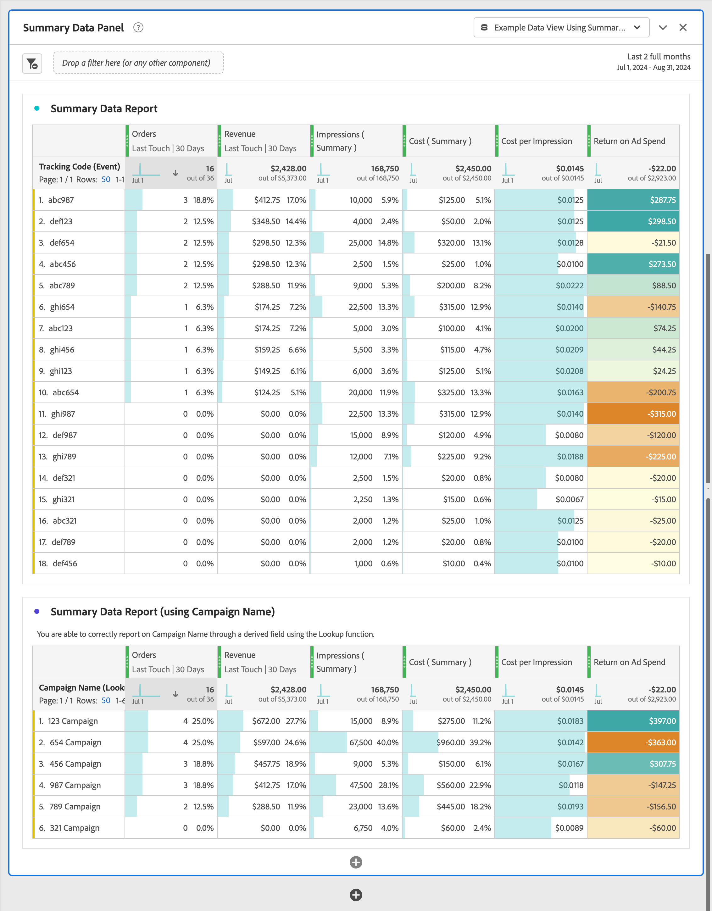

# 요약 데이터 사용

이 사용 사례는 보고 및 분석에서 요약 데이터를 사용하는 방법을 이해하는 데 도움이 됩니다. 사용 사례에서는 Customer Journey Analytics에서 요약 데이터를 사용하는 데 필요한 모든 단계를 자세히 설명합니다.

- Experience Platform에서 요약 데이터 및 기타 데이터 원본을 [수집](#ingest)합니다.
- 요약 데이터 및 기타 데이터 원본에 대해 [연결](#connection)을 설정합니다.
- 데이터 원본을 결합하려면 [데이터 보기](#data-view)를 구성하세요.
- 결합된 데이터에 대해 [Workspace](#workspace)에서 보고 및 분석하세요.

사용 사례에서는 요약 데이터, 이벤트 데이터 및 조회 데이터에 대한 샘플 데이터를 제공합니다. 모든 데이터에는 임의 값이 포함됩니다.

## 수집

이 사용 사례에는 Facebook에서 캠페인을 실행하기 위한 요약 데이터를 보여주는 다음 샘플 요약 데이터를 사용합니다.

+++요약 데이터

| _ID | campaign_name | 비용 | 노출 횟수 | campaign_id | network | ad_group | timestamp |
|---|---|---:|---:|---|---|---|---|
| 1 | 123 캠페인 | 100 | 5000 | abc123 | facebook | 광고 그룹 | 2024-07-18T18:20:39.000Z |
| 2 | 123 캠페인 | 50 | 4000 | def123 | facebook | def-adgroup | 2024-07-18T18:20:39.000Z |
| 3 | 123 캠페인 | 125 | 6000 | ghi123 | facebook | -그룹 | 2024-07-18T18:20:39.000Z |
| 4 | 캠페인 | 25 | 2500 | abc456 | facebook | 광고 그룹 | 2024-07-18T18:20:39.000Z |
| 5 | 캠페인 | 10 | 1000 | def456 | facebook | def-adgroup | 2024-07-18T18:20:39.000Z |
| 6 | 캠페인 | 115 | 5500 | ghi456 | facebook | -그룹 | 2024-07-18T18:20:39.000Z |
| 7 | 캠페인 | 200 | 9000 | abc789 | facebook | 광고 그룹 | 2024-07-18T18:20:39.000Z |
| 8 | 캠페인 | 20 | 2000 | def789 | facebook | def-adgroup | 2024-07-18T18:20:39.000Z |
| 9 | 캠페인 | 225 | 12000 | ghi789 | facebook | -그룹 | 2024-07-18T18:20:39.000Z |
| 10 | 캠페인 | 125 | 10000 | abc987 | facebook | 광고 그룹 | 2024-07-18T18:20:39.000Z |
| 11 | 캠페인 | 120 | 15000 | def987 | facebook | def-adgroup | 2024-07-18T18:20:39.000Z |
| 12 | 캠페인 | 315 | 22500 | ghi987 | facebook | -그룹 | 2024-07-18T18:20:39.000Z |
| 13 | 캠페인 | 325 | 20000 | abc654 | facebook | 광고 그룹 | 2024-07-18T18:20:39.000Z |
| 14 | 캠페인 | 320 | 25000 | def654 | facebook | def-adgroup | 2024-07-18T18:20:39.000Z |
| 15 | 캠페인 | 315 | 22500 | ghi654 | facebook | -그룹 | 2024-07-18T18:20:39.000Z |
| 16 | 캠페인 | 25 | 2000 | abc321 | facebook | 광고 그룹 | 2024-07-18T18:20:39.000Z |
| 17 | 캠페인 | 20 | 2500 | def321 | facebook | def-adgroup | 2024-07-18T18:20:39.000Z |
| 18 | 캠페인 | 15 | 2250 | ghi321 | facebook | -그룹 | 2024-07-18T18:20:39.000Z |

+++

Customer Journey Analytics의 요약 데이터를 보고서나 Workspace의 데이터 분석의 일부로 사용하려면 다음을 수행해야 합니다

- Experience Platform의 요약 스키마,
- Experience Platform의 요약 데이터 세트
- 요약 데이터 세트 를 사용하도록 구성된 Customer Journey Analytics의 연결
- 요약 데이터에 대한 지표 및 차원으로 올바르게 구성된 Customer Journey Analytics의 데이터 보기.

이 요약 데이터를 이벤트 데이터의 데이터 세트 및 조회 데이터의 데이터 세트와 함께 사용합니다.

+++이벤트 데이터

이벤트 데이터는 예제 이벤트 데이터 데이터 데이터 세트에서 사용할 수 있습니다. 샘플 데이터는 다음과 같습니다.

| timestamp | _ID | page_name | person_id | tracking_code | 주문 수 | revenue_mount |
|---|---:|---|---|---|---:|---:|
| 2024-07-18T19:15:39+00:00 | 1 | 홈 페이지 | person-1abc123 | abc123 |  |  |
| 2024-07-18T19:15:39+00:00 | 2 | 확인 페이지 | person-1abc123 |  | 1 | 174.25 |
| 2024-07-18T19:15:39+00:00 | 3 | 홈 페이지 | person-2def123 | def123 |  |  |
| 2024-07-18T19:15:39+00:00 | 4 | 홈 페이지 | person-3ghi123 | ghi123 |  |  |
| 2024-07-18T19:15:39+00:00 | 5 | 확인 페이지 | person-3ghi123 |  | 1 | 149.25 |
| 2024-07-18T19:15:39+00:00 | 6 | 홈 페이지 | person-4abc456 | abc456 |  |  |
| 2024-07-18T19:15:39+00:00 | 7 | 홈 페이지 | person-5def456 | def456 |  |  |
| 2024-07-18T19:15:39+00:00 | 8 | 홈 페이지 | person-6ghi456 | ghi456 |  |  |
| 2024-07-18T19:15:39+00:00 | 9 | 확인 페이지 | person-6ghi456 |  | 1 | 159.25 |
| 2024-07-18T19:15:39+00:00 | 10 | 홈 페이지 | person-7abc789 | abc789 |  |  |
| 2024-07-18T19:15:39+00:00 | 11 | 홈 페이지 | person-8def789 | def789 |  |  |
| 2024-07-18T19:15:39+00:00 | 12 | 홈 페이지 | person-9ghi789 | ghi789 |  |  |
| 2024-07-18T19:15:39+00:00 | 13 | 확인 페이지 | person-9ghi789 |  | 1 | 124.25 |
| 2024-07-18T19:15:39+00:00 | 14 | 홈 페이지 | person-10abc987 | abc987 |  |  |
| 2024-07-18T19:15:39+00:00 | 15 | 홈 페이지 | person-11def987 | def987 |  |  |
| 2024-07-18T19:15:39+00:00 | 16 | 홈 페이지 | person-12ghi987 | ghi987 |  |  |
| 2024-07-18T19:15:39+00:00 | 17 | 홈 페이지 | person-13abc654 | abc654 |  |  |
| 2024-07-18T19:15:39+00:00 | 18 | 홈 페이지 | person-14def654 | def654 |  |  |
| 2024-07-18T19:15:39+00:00 | 19 | 홈 페이지 | person-15ghi654 | ghi654 |  |  |
| 2024-07-18T19:15:39+00:00 | 20 | 확인 페이지 | person-15ghi654 |  | 1 | 174.25 |
| 2024-07-18T19:15:39+00:00 | 21 | 홈 페이지 | person-16abc321 | abc321 |  |  |
| 2024-07-18T19:15:39+00:00 | 22 | 홈 페이지 | person-17def321 | def321 |  |  |
| 2024-07-18T19:15:39+00:00 | 23 | 홈 페이지 | person-18ghi321 | ghi321 |  |  |
| 2024-07-18T19:15:39+00:00 | 24 | 홈 페이지 | person-19abc123 | abc123 |  |  |
| 2024-07-18T19:15:39+00:00 | 25 | 홈 페이지 | person-20def123 | def123 |  |  |
| 2024-07-18T19:15:39+00:00 | 26 | 홈 페이지 | person-21ghi123 | ghi123 |  |  |
| 2024-07-18T19:15:39+00:00 | 27 | 확인 페이지 | person-21ghi123 |  | 1 | 149.25 |
| 2024-07-18T19:15:39+00:00 | 28 | 홈 페이지 | person-22abc456 | abc456 |  |  |
| 2024-07-18T19:15:39+00:00 | 29 | 홈 페이지 | person-23def456 | def456 |  |  |
| 2024-07-18T19:15:39+00:00 | 30 | 홈 페이지 | person-24ghi456 | ghi456 |  |  |
| 2024-07-18T19:15:39+00:00 | 31 | 홈 페이지 | person-25abc789 | abc789 |  |  |
| 2024-07-18T19:15:39+00:00 | 32 | 확인 페이지 | person-25abc789 |  | 1 | 139.25 |
| 2024-07-18T19:15:39+00:00 | 33 | 홈 페이지 | person-26abc987 | abc987 |  |  |
| 2024-07-18T19:15:39+00:00 | 34 | 홈 페이지 | person-27def987 | def987 |  |  |
| 2024-07-18T19:15:39+00:00 | 35 | 홈 페이지 | person-28ghi987 | ghi987 |  |  |
| 2024-07-18T19:15:39+00:00 | 36 | 홈 페이지 | person-29abc654 | abc654 |  |  |
| 2024-07-18T19:15:39+00:00 | 37 | 확인 페이지 | person-29abc654 |  | 1 | 124.25 |
| 2024-07-18T19:15:39+00:00 | 38 | 홈 페이지 | person-30def654 | def654 |  |  |
| 2024-07-18T19:15:39+00:00 | 39 | 홈 페이지 | person-31ghi654 | ghi654 |  |  |
| 2024-07-18T19:15:39+00:00 | 40 | 홈 페이지 | person-32abc321 | abc321 |  |  |
| 2024-07-18T19:15:39+00:00 | 41 | 홈 페이지 | person-33ghi456 | ghi456 |  |  |
| 2024-07-18T19:15:39+00:00 | 42 | 확인 페이지 | person-33ghi456 |  | 1 | 174.25 |
| 2024-07-18T19:15:39+00:00 | 43 | 홈 페이지 | person-34abc789 | abc789 |  |  |
| 2024-07-18T19:15:39+00:00 | 44 | 홈 페이지 | person-35def789 | def789 |  |  |
| 2024-07-18T19:15:39+00:00 | 45 | 홈 페이지 | person-36ghi789 | ghi789 |  |  |
| 2024-07-18T19:15:39+00:00 | 46 | 확인 페이지 | person-36ghi789 |  | 1 | 149.25 |
| 2024-07-18T19:15:39+00:00 | 47 | 홈 페이지 | person-37abc987 | abc987 |  |  |
| 2024-07-18T19:15:39+00:00 | 48 | 홈 페이지 | person-38def987 | def987 |  |  |
| 2024-07-18T19:15:39+00:00 | 49 | 홈 페이지 | person-39ghi987 | ghi987 |  |  |
| 2024-07-18T19:15:39+00:00 | 50 | 홈 페이지 | person-40abc654 | abc654 |  |  |
| 2024-07-18T19:15:39+00:00 | 51 | 확인 페이지 | person-40abc654 |  | 1 | 124.25 |
| 2024-07-18T19:15:39+00:00 | 52 | 홈 페이지 | person-41def654 | def654 |  |  |
| 2024-07-18T19:15:39+00:00 | 53 | 홈 페이지 | person-42ghi654 | ghi654 |  |  |
| 2024-07-18T19:15:39+00:00 | 54 | 홈 페이지 | person-43abc321 | abc321 |  |  |
| 2024-07-18T19:15:39+00:00 | 55 | 홈 페이지 | person-44def321 | def321 |  |  |
| 2024-07-18T19:15:39+00:00 | 56 | 홈 페이지 | person-45ghi321 | ghi321 |  |  |
| 2024-07-18T19:15:39+00:00 | 57 | 홈 페이지 | person-46abc123 | abc123 |  |  |
| 2024-07-18T19:15:39+00:00 | 58 | 확인 페이지 | person-46abc123 |  | 1 | 174.25 |
| 2024-07-18T19:15:39+00:00 | 59 | 홈 페이지 | person-47def123 | def123 |  |  |
| 2024-07-18T19:15:39+00:00 | 60 | 홈 페이지 | person-48ghi123 | ghi123 |  |  |
| 2024-07-18T19:15:39+00:00 | 61 | 홈 페이지 | person-49abc456 | abc456 |  |  |
| 2024-07-18T19:15:39+00:00 | 62 | 홈 페이지 | person-50def456 | def456 |  |  |
| 2024-07-18T19:15:39+00:00 | 63 | 홈 페이지 | person-51ghi456 | ghi456 |  |  |
| 2024-07-18T19:15:39+00:00 | 64 | 홈 페이지 | person-52abc789 | abc789 |  |  |
| 2024-07-18T19:15:39+00:00 | 65 | 확인 페이지 | person-52abc789 |  | 1 | 149.25 |
| 2024-07-18T19:15:39+00:00 | 66 | 홈 페이지 | person-53abc987 | abc987 |  |  |
| 2024-07-18T19:15:39+00:00 | 67 | 홈 페이지 | person-54def987 | def987 |  |  |
| 2024-07-18T19:15:39+00:00 | 68 | 홈 페이지 | person-55ghi987 | ghi987 |  |  |
| 2024-07-18T19:15:39+00:00 | 69 | 확인 페이지 | person-55ghi987 |  | 1 | 124.25 |
| 2024-07-18T19:15:39+00:00 | 70 | 홈 페이지 | person-56abc123 | abc123 |  |  |
| 2024-07-18T19:15:39+00:00 | 71 | 홈 페이지 | person-57def123 | def123 |  |  |
| 2024-07-18T19:15:39+00:00 | 72 | 확인 페이지 | person-57def123 |  | 1 | 174.25 |
| 2024-07-18T19:15:39+00:00 | 73 | 홈 페이지 | person-58ghi123 | ghi123 |  |  |
| 2024-07-18T19:15:39+00:00 | 74 | 홈 페이지 | person-59abc456 | abc456 |  |  |
| 2024-07-18T19:15:39+00:00 | 75 | 확인 페이지 | person-59abc456 |  | 1 | 149.25 |
| 2024-07-18T19:15:39+00:00 | 76 | 홈 페이지 | person-60def456 | def456 |  |  |
| 2024-07-18T19:15:39+00:00 | 77 | 홈 페이지 | person-61ghi456 | ghi456 |  |  |
| 2024-07-18T19:15:39+00:00 | 78 | 홈 페이지 | person-62abc789 | abc789 |  |  |
| 2024-07-18T19:15:39+00:00 | 79 | 확인 페이지 | person-62abc789 |  | 1 | 159.25 |
| 2024-07-18T19:15:39+00:00 | 80 | 홈 페이지 | person-63def789 | def789 |  |  |
| 2024-07-18T19:15:39+00:00 | 81 | 홈 페이지 | person-64ghi789 | ghi789 |  |  |
| 2024-07-18T19:15:39+00:00 | 82 | 홈 페이지 | person-65abc987 | abc987 |  |  |
| 2024-07-18T19:15:39+00:00 | 83 | 확인 페이지 | person-65abc987 |  | 1 | 124.25 |
| 2024-07-18T19:15:39+00:00 | 84 | 홈 페이지 | person-66def987 | def987 |  |  |
| 2024-07-18T19:15:39+00:00 | 85 | 홈 페이지 | person-67ghi987 | ghi987 |  |  |
| 2024-07-18T19:15:39+00:00 | 86 | 홈 페이지 | person-68abc654 | abc654 |  |  |
| 2024-07-18T19:15:39+00:00 | 87 | 홈 페이지 | person-69def654 | def654 |  |  |
| 2024-07-18T19:15:39+00:00 | 88 | 홈 페이지 | person-70ghi654 | ghi654 |  |  |
| 2024-07-18T19:15:39+00:00 | 89 | 홈 페이지 | person-71abc321 | abc321 |  |  |
| 2024-07-18T19:15:39+00:00 | 90 | 확인 페이지 | person-71abc321 |  | 1 | 174.25 |
| 2024-07-18T19:15:39+00:00 | 91 | 홈 페이지 | person-72def321 | def321 |  |  |
| 2024-07-18T19:15:39+00:00 | 92 | 홈 페이지 | person-73ghi321 | ghi321 |  |  |
| 2024-07-18T19:15:39+00:00 | 93 | 홈 페이지 | person-74abc123 | abc123 |  |  |
| 2024-07-18T19:15:39+00:00 | 94 | 홈 페이지 | person-75def123 | def123 |  |  |
| 2024-07-18T19:15:39+00:00 | 95 | 홈 페이지 | person-76ghi123 | ghi123 |  |  |
| 2024-07-18T19:15:39+00:00 | 96 | 홈 페이지 | person-77abc456 | abc456 |  |  |
| 2024-07-18T19:15:39+00:00 | 97 | 확인 페이지 | person-77abc456 |  | 1 | 149.25 |
| 2024-07-18T19:15:39+00:00 | 98 | 홈 페이지 | person-78def456 | def456 |  |  |
| 2024-07-18T19:15:39+00:00 | 99 | 홈 페이지 | person-79ghi456 | ghi456 |  |  |
| 2024-07-18T19:15:39+00:00 | 100 | 홈 페이지 | person-80abc789 | abc789 |  |  |
| 2024-07-18T19:15:39+00:00 | 101 | 홈 페이지 | person-81abc987 | abc987 |  |  |
| 2024-07-18T19:15:39+00:00 | 102 | 확인 페이지 | person-81abc987 |  | 1 | 139.25 |
| 2024-07-18T19:15:39+00:00 | 103 | 홈 페이지 | person-82def987 | def987 |  |  |
| 2024-07-18T19:15:39+00:00 | 104 | 홈 페이지 | person-83ghi987 | ghi987 |  |  |
| 2024-07-18T19:15:39+00:00 | 105 | 홈 페이지 | person-84abc654 | abc654 |  |  |
| 2024-07-18T19:15:39+00:00 | 106 | 홈 페이지 | person-85def654 | def654 |  |  |
| 2024-07-18T19:15:39+00:00 | 107 | 확인 페이지 | person-85def654 |  | 1 | 124.25 |
| 2024-07-18T19:15:39+00:00 | 108 | 홈 페이지 | person-86ghi654 | ghi654 |  |  |
| 2024-07-18T19:15:39+00:00 | 109 | 홈 페이지 | person-87abc321 | abc321 |  |  |
| 2024-07-18T19:15:39+00:00 | 110 | 홈 페이지 | person-88ghi456 | ghi456 |  |  |
| 2024-07-18T19:15:39+00:00 | 111 | 홈 페이지 | person-89abc789 | abc789 |  |  |
| 2024-07-18T19:15:39+00:00 | 112 | 확인 페이지 | person-89abc789 |  | 1 | 174.25 |
| 2024-07-18T19:15:39+00:00 | 113 | 홈 페이지 | person-90def789 | def789 |  |  |
| 2024-07-18T19:15:39+00:00 | 114 | 홈 페이지 | person-91ghi789 | ghi789 |  |  |
| 2024-07-18T19:15:39+00:00 | 115 | 홈 페이지 | person-92abc987 | abc987 |  |  |
| 2024-07-18T19:15:39+00:00 | 116 | 확인 페이지 | person-92abc987 |  | 1 | 149.25 |
| 2024-07-18T19:15:39+00:00 | 117 | 홈 페이지 | person-93def987 | def987 |  |  |
| 2024-07-18T19:15:39+00:00 | 118 | 홈 페이지 | person-94ghi987 | ghi987 |  |  |
| 2024-07-18T19:15:39+00:00 | 119 | 홈 페이지 | person-95abc654 | abc654 |  |  |
| 2024-07-18T19:15:39+00:00 | 120 | 홈 페이지 | person-96def654 | def654 |  |  |
| 2024-07-18T19:15:39+00:00 | 121 | 확인 페이지 | person-96def654 |  | 1 | 124.25 |
| 2024-07-18T19:15:39+00:00 | 122 | 홈 페이지 | person-97ghi654 | ghi654 |  |  |
| 2024-07-18T19:15:39+00:00 | 123 | 홈 페이지 | person-98abc321 | abc321 |  |  |
| 2024-07-18T19:15:39+00:00 | 124 | 홈 페이지 | person-99def321 | def321 |  |  |
| 2024-07-18T19:15:39+00:00 | 125 | 홈 페이지 | person-100ghi321 | ghi321 |  |  |
| 2024-07-18T19:15:39+00:00 | 126 | 홈 페이지 | person-101abc123 | abc123 |  |  |
| 2024-07-18T19:15:39+00:00 | 127 | 홈 페이지 | person-102def123 | def123 |  |  |
| 2024-07-18T19:15:39+00:00 | 128 | 확인 페이지 | person-102def123 |  | 1 | 174.25 |
| 2024-07-18T19:15:39+00:00 | 129 | 홈 페이지 | person-103ghi123 | ghi123 |  |  |
| 2024-07-18T19:15:39+00:00 | 130 | 홈 페이지 | person-104abc456 | abc456 |  |  |
| 2024-07-18T19:15:39+00:00 | 131 | 홈 페이지 | person-105def456 | def456 |  |  |
| 2024-07-18T19:15:39+00:00 | 132 | 홈 페이지 | person-106ghi456 | ghi456 |  |  |
| 2024-07-18T19:15:39+00:00 | 133 | 홈 페이지 | person-107abc789 | abc789 |  |  |
| 2024-07-18T19:15:39+00:00 | 134 | 홈 페이지 | person-108abc987 | abc987 |  |  |
| 2024-07-18T19:15:39+00:00 | 135 | 확인 페이지 | person-108abc987 |  | 1 | 149.25 |
| 2024-07-18T19:15:39+00:00 | 136 | 홈 페이지 | person-109def987 | def987 |  |  |
| 2024-07-18T19:15:39+00:00 | 137 | 홈 페이지 | person-110ghi987 | ghi987 |  |  |
| 2024-07-18T19:15:39+00:00 | 138 | 확인 페이지 | person-110ghi987 |  |  |  |
| 2024-07-18T19:15:39+00:00 | 139 | 홈 페이지 | person-111def987 | def987 |  |  |
| 2024-07-18T19:15:39+00:00 | 140 | 홈 페이지 | person-112def987 |  | 1 | 124.25 |
| 2024-07-18T19:15:39+00:00 | 141 | 확인 페이지 | person-112def987 |  | 1 | 149.25 |
| 2024-07-18T19:15:39+00:00 | 142 | 홈 페이지 | person-113ghi987 | ghi987 |  |  |
| 2024-07-18T19:15:39+00:00 | 143 | 홈 페이지 | person-114abc654 | abc654 |  |  |
| 2024-07-18T19:15:39+00:00 | 144 | 홈 페이지 | person-115def654 | def654 |  |  |
| 2024-07-18T19:15:39+00:00 | 145 | 확인 페이지 | person-115def654 |  | 1 | 159.25 |
| 2024-07-18T19:15:39+00:00 | 146 | 홈 페이지 | person-116ghi654 | ghi654 |  |  |
| 2024-07-18T19:15:39+00:00 | 147 | 홈 페이지 | person-117abc321 | abc321 |  |  |
| 2024-07-18T19:15:39+00:00 | 148 | 홈 페이지 | person-118def321 | def321 |  |  |
| 2024-07-18T19:15:39+00:00 | 149 | 확인 페이지 | person-118def321 |  | 1 | 124.25 |
| 2024-07-18T19:15:39+00:00 | 150 | 홈 페이지 | person-119ghi321 | ghi321 |  |  |
| 2024-07-18T19:15:39+00:00 | 151 | 홈 페이지 | person-120abc123 | abc123 |  |  |
| 2024-07-18T19:15:39+00:00 | 152 | 홈 페이지 | person-121def123 | def123 |  |  |
| 2024-07-18T19:15:39+00:00 | 153 | 홈 페이지 | person-122ghi123 | ghi123 |  |  |
| 2024-07-18T19:15:39+00:00 | 154 | 홈 페이지 | person-123abc456 | abc456 |  |  |
| 2024-07-18T19:15:39+00:00 | 155 | 홈 페이지 | person-124def456 | def456 |  |  |
| 2024-07-18T19:15:39+00:00 | 156 | 확인 페이지 | person-124def456 |  | 1 | 174.25 |
| 2024-07-18T19:15:39+00:00 | 157 | 홈 페이지 | person-125ghi456 | ghi456 |  |  |
| 2024-07-18T19:15:39+00:00 | 158 | 홈 페이지 | person-126abc789 | abc789 |  |  |
| 2024-07-18T19:15:39+00:00 | 159 | 홈 페이지 | person-127abc987 | abc987 |  |  |
| 2024-07-18T19:15:39+00:00 | 160 | 홈 페이지 | person-128def987 | def987 |  |  |
| 2024-07-18T19:15:39+00:00 | 161 | 홈 페이지 | person-129ghi987 | ghi987 |  |  |
| 2024-07-18T19:15:39+00:00 | 162 | 홈 페이지 | person-130abc654 | abc654 |  |  |
| 2024-07-18T19:15:39+00:00 | 163 | 확인 페이지 | person-130abc654 |  | 1 | 149.25 |
| 2024-07-18T19:15:39+00:00 | 164 | 홈 페이지 | person-131def654 | def654 |  |  |
| 2024-07-18T19:15:39+00:00 | 165 | 홈 페이지 | person-132ghi654 | ghi654 |  |  |
| 2024-07-18T19:15:39+00:00 | 166 | 홈 페이지 | person-133abc321 | abc321 |  |  |
| 2024-07-18T19:15:39+00:00 | 167 | 홈 페이지 | person-134ghi456 | ghi456 |  |  |
| 2024-07-18T19:15:39+00:00 | 168 | 확인 페이지 | person-134ghi456 |  | 1 | 139.25 |
| 2024-07-18T19:15:39+00:00 | 169 | 홈 페이지 | person-135abc789 | abc789 |  |  |
| 2024-07-18T19:15:39+00:00 | 170 | 홈 페이지 | person-136def789 | def789 |  |  |
| 2024-07-18T19:15:39+00:00 | 171 | 홈 페이지 | person-137ghi789 | ghi789 |  |  |
| 2024-07-18T19:15:39+00:00 | 172 | 홈 페이지 | person-138abc987 | abc987 |  |  |
| 2024-07-18T19:15:39+00:00 | 173 | 확인 페이지 | person-138abc987 |  | 1 | 124.25 |
| 2024-07-18T19:15:39+00:00 | 174 | 홈 페이지 | person-139def987 | def987 |  |  |
| 2024-07-18T19:15:39+00:00 | 175 | 홈 페이지 | person-140ghi987 | ghi987 |  |  |
| 2024-07-18T19:15:39+00:00 | 176 | 홈 페이지 | person-141abc654 | abc654 |  |  |
| 2024-07-18T19:15:39+00:00 | 177 | 홈 페이지 | person-142def654 | def654 |  |  |
| 2024-07-18T19:15:39+00:00 | 178 | 확인 페이지 | person-142def654 |  | 1 | 174.25 |
| 2024-07-18T19:15:39+00:00 | 179 | 홈 페이지 | person-143ghi654 | ghi654 |  |  |

+++

+++ 조회 데이터

조회 데이터는 예제 조회 데이터 데이터 세트에서 사용할 수 있습니다. 샘플 데이터는 다음과 같습니다.

| _ID | tracking_code | ad_group | campaign_name |
|---|---|---|---|
| 1 | abc123 | 광고 그룹 | 123 캠페인 |
| 2 | def123 | def-adgroup | 123 캠페인 |
| 3 | ghi123 | -그룹 | 123 캠페인 |
| 4 | abc456 | 광고 그룹 | 캠페인 |
| 5 | def456 | def-adgroup | 캠페인 |
| 6 | ghi456 | -그룹 | 캠페인 |
| 7 | abc789 | 광고 그룹 | 캠페인 |
| 8 | def789 | def-adgroup | 캠페인 |
| 9 | ghi789 | -그룹 | 캠페인 |
| 10 | abc987 | 광고 그룹 | 캠페인 |
| 11 | def987 | def-adgroup | 캠페인 |
| 12 | ghi987 | -그룹 | 캠페인 |
| 13 | abc654 | 광고 그룹 | 캠페인 |
| 14 | def654 | def-adgroup | 캠페인 |
| 15 | ghi654 | -그룹 | 캠페인 |
| 16 | abc321 | 광고 그룹 | 캠페인 |
| 17 | def321 | def-adgroup | 캠페인 |
| 18 | ghi321 | -그룹 | 캠페인 |

[ 샘플 조회 데이터 다운로드](./assets/lookup-data.csv)
+++

>[!INFO]
>
>이벤트 및 조회 데이터에 대한 스키마 및 데이터 세트 설정에 대한 자세한 내용은 제공되지 않습니다. 이 설정은 상식이라고 가정하고 조회 데이터에 대한 것과 동일한 단계를 따릅니다.
>

### 요약 스키마

요약 데이터에는 Experience Platform의 요약 스키마가 필요합니다. 요약 스키마는 XDM 요약 지표를 기본 클래스로 사용하는 스키마입니다.

Experience Platform에서 요약 스키마를 만들려면 다음 작업을 수행하십시오.

1. 다음에서 **[!UICONTROL Experience Platform]** 선택      앱 전환기.
1. 왼쪽 레일에서 **[!UICONTROL 스키마]**&#x200B;를 선택합니다.
1.  **[!UICONTROL 스키마 만들기]**&#x200B;를 선택합니다.
1. **[!UICONTROL 스키마 만들기]** 대화 상자에서 **[!UICONTROL 수동]**&#x200B;을 선택합니다. 계속하려면 **[!UICONTROL 선택]**&#x200B;을 사용하세요.
1. **[!UICONTROL 스키마]** > **[!UICONTROL 스키마 만들기]** 마법사의 **[!UICONTROL 클래스 선택]** 단계에서 **[!UICONTROL 이 스키마에 대한 기본 클래스 선택]** 옵션에서 **[!UICONTROL 기타]**&#x200B;을(를) 선택합니다.
1. 목록에서 **[!UICONTROL XDM 요약 지표]**&#x200B;을(를) 선택하거나  필드를 사용하여 검색하고 **[!UICONTROL 다음]**&#x200B;을(를) 선택합니다.
1. **[!UICONTROL 스키마]** > **[!UICONTROL 스키마 만들기]** 마법사의 **[!UICONTROL 이름 및 검토]** 단계에서 **[!UICONTROL 스키마 표시 이름]**(예: `Example Summary Data Schema`)과 선택적 설명을 입력하십시오. **[!UICONTROL 완료]**&#x200B;를 선택하여 이 단계를 완료합니다.

기본 요약 스키마의 구조가 표시되어 요약 데이터의 필드로 보강할 수 있습니다. 필드 그룹을 사용하여 스키마에 필드를 추가합니다.

샘플 데이터의 필드를 포함하는 필드 그룹을 추가하려면:

1. **[!UICONTROL 필드 그룹]**&#x200B;에서  **[!UICONTROL Add]**&#x200B;을(를) 선택하십시오.
1. **[!UICONTROL 필드 그룹 추가]** 대화 상자에서 **[!UICONTROL 새 필드 그룹 만들기]**&#x200B;를 선택합니다.
1. 필드 그룹의 **[!UICONTROL 표시 이름]**&#x200B;을(를) 입력하십시오(예: `Example Summary Data`). 필요한 경우 설명을 제공합니다.
1. **[!UICONTROL 필드 그룹 추가]**&#x200B;를 선택합니다.
1. 다시 스키마 구조 사용자 인터페이스로 돌아왔습니다. **[!UICONTROL 필드 그룹]**&#x200B;에서 새 **[!UICONTROL 예제 요약 데이터]**&#x200B;를 선택하십시오.
1. 스키마 이름 **[!UICONTROL 예제 요약 데이터 스키마]** 옆에 있는 을(를) 선택합니다. 필드에 대한 세부 정보를 추가할 수 있는 **[!UICONTROL 필드 속성]** 패널이 열립니다.
   1. **[!UICONTROL 필드 이름]** 입력: `campaign_id`
   1. **[!UICONTROL 표시 이름]** 입력: `campaign_id`
   1. **[!UICONTROL 데이터 형식 선택]** 드롭다운에서 **[!UICONTROL 형식]**&#x200B;을 선택합니다. **[!UICONTROL 문자열]**
   1. **[!UICONTROL 할당 대상]** **[!UICONTROL 필드 그룹]**&#x200B;이 선택되었는지 확인하고 드롭다운에서 **[!UICONTROL 예제 요약 데이터]**&#x200B;를 선택합니다.
   1. 아래쪽으로 스크롤하여 **[!UICONTROL 적용]**&#x200B;을 선택합니다.
1. 요약 데이터의 다른 필드에 대해 이전 단계를 반복합니다. 올바른 값에 대해서는 아래 표를 참조하십시오.

   | 필드 이름 | 표시 이름 | 유형 | 필드 그룹 |
   |---|---|---|---|
   | `ad_group` | `ad_group` | 문자열 | 요약 데이터 예 |
   | `campaign_name` | `campaign_name` | 문자열 | 요약 데이터 예 |
   | `cost` | `cost` | 이중 | 요약 데이터 예 |
   | `impression` | `impression` | 정수 | 요약 데이터 예 |
   | `network` | `network` | 문자열 | 요약 데이터 예 |

1. **[!UICONTROL 예제 요약 데이터]** 필드 그룹을 스키마의 일부로 저장하려면 **[!UICONTROL 저장]**&#x200B;을 선택합니다. 스키마가 성공적으로 저장되면 확인 메시지가 표시됩니다.

이제 스키마를 정의하여 요약 데이터에 대한 모델을 자세히 설명합니다. 아래 항목과 유사합니다.

### 요약 데이터 세트

요약 데이터를 Experience Platform에 저장하려면 먼저 데이터 세트를 만든 다음 요약 데이터를 데이터 세트에 업로드해야 합니다.

데이터 세트를 만들려면 다음 작업을 수행하십시오.

1. 다음에서 **[!UICONTROL Experience Platform]** 선택      앱 전환기.
1. 왼쪽 레일에서 **[!UICONTROL 데이터 세트]**&#x200B;를 선택합니다.
1.  **[!UICONTROL 데이터 집합 만들기]**&#x200B;를 선택합니다.
1. **[!UICONTROL 데이터 세트]** > **[!UICONTROL 데이터 세트 만들기]** 화면에서 **[!UICONTROL 스키마에서 데이터 세트 만들기]**&#x200B;를 선택합니다.
1. **[!UICONTROL 워크플로]** > **[!UICONTROL 스키마에서 데이터 세트 만들기]** 마법사의 **[!UICONTROL 스키마 선택]** 단계에서 을(를) 검색하고 **[!UICONTROL 예제 요약 데이터 스키마]**&#x200B;를 선택합니다.
1. **[!UICONTROL 다음]**&#x200B;을 선택합니다.
1. **[!UICONTROL 워크플로]** > **[!UICONTROL 스키마에서 데이터 집합 만들기]** 마법사의 **[!UICONTROL 데이터 집합 구성]** 단계에서 다음을 수행합니다.
   1. 데이터 집합에 대한 **[!UICONTROL 이름]**&#x200B;을(를) 입력하십시오(예: `Example Summary Data Dataset`). 필요한 경우 설명을 제공합니다.
   1. **[!UICONTROL 마침]**&#x200B;을 선택합니다.

새 데이터 세트의 세부 사항을 표시하는 화면이 표시됩니다.

샘플 데이터를 이 데이터 세트에 업로드하려면:

1. 다음에서 **[!UICONTROL Experience Platform]** 선택      앱 전환기.
1. 왼쪽 레일에서 **[!UICONTROL 워크플로]**&#x200B;를 선택합니다.
   1. **[!UICONTROL 워크플로]** 화면의 **[!UICONTROL 데이터 수집]** 옵션에서 **[!UICONTROL XDM 스키마에 CSV 매핑]**&#x200B;을 선택합니다.
   1. **[!UICONTROL XDM 스키마에 CSV 매핑]** 패널에서 **[!UICONTROL 시작]**&#x200B;을(를) 선택합니다.
1. **[!UICONTROL 워크플로]** > **[!UICONTROL XDM 스키마에 CSV 매핑]** 마법사의 **[!UICONTROL 데이터 흐름 세부 정보]** 단계에서:
   1. **[!UICONTROL 대상 데이터 세트]**&#x200B;에 대해 **[!UICONTROL 기존 데이터 세트]**&#x200B;을(를) 선택하십시오.
   1. 드롭다운 목록에서 **[!UICONTROL 예제 요약 데이터 데이터 데이터 세트]**&#x200B;을(를) 선택합니다.
   1. **[!UICONTROL 다음]**&#x200B;을 선택합니다.
1. **[!UICONTROL 워크플로]** > **[!UICONTROL XDM 스키마에 CSV 매핑]** 마법사의 **[!UICONTROL 데이터 선택]** 단계에서:
   1. CSV 형식의 요약 데이터가 있는 파일을 **[!UICONTROL 파일 끌어다 놓기]**(으)로 끌어다 놓습니다. 또는 **[!UICONTROL 파일 선택]**&#x200B;을 사용하여 파일을 선택하십시오.
   1. **[!UICONTROL 데이터 형식]** 및 **[!UICONTROL 구분 기호]**&#x200B;에 샘플 데이터에 대한 올바른 값이 있는지 확인하십시오. 예를 들어 **[!UICONTROL 구분]**&#x200B;은(는) **[!UICONTROL 데이터 형식]**&#x200B;이고 **[!UICONTROL ,]**&#x200B;은(는) **[!UICONTROL 구분 기호]**&#x200B;입니다.
   1. 요약 데이터의 샘플(10개 레코드)이 **[!UICONTROL 샘플 데이터]**&#x200B;에 표시됩니다.
   1. **[!UICONTROL 다음]**&#x200B;을 선택합니다.
1. **[!UICONTROL 워크플로]** > **[!UICONTROL XDM 스키마에 CSV 매핑]** 마법사의 **[!UICONTROL 매핑]** 단계에서 다음을 수행합니다.
   
   1. **[!UICONTROL Source 데이터]**&#x200B;의 모든 데이터 필드가 스키마의 해당 **[!UICONTROL 대상 필드]**&#x200B;에 올바르게 매핑되었는지 확인합니다. 샘플 데이터의 경우 샘플 데이터의 필드 이름과 유사하게 스키마의 필드 이름을 명시적으로 지정했으므로 오류가 보고되지 않습니다. 그렇지 않으면 이 화면을 사용하여 매핑을 수정할 수 있습니다.
   1. 선택적으로  **[!UICONTROL 유효성 검사]**&#x200B;를 선택하여 데이터의 유효성을 검사할 수 있습니다(한 번 더).
   1. 선택적으로  **[!UICONTROL 데이터 미리 보기]**&#x200B;를 선택하여 데이터 집합에 로드된 후 데이터를 미리 보는 대화 상자를 열 수 있습니다.
   1. **[!UICONTROL 마침]**&#x200B;을 선택합니다.

**[!UICONTROL 소스]** > **[!UICONTROL 데이터 흐름 - XX/XX/XXXX, XX:XX XX]**&#x200B;에서 업로드 상태가 표시됩니다. 업로드의 업데이트를 보려면 새로 고침하십시오. 성공하면 샘플 데이터가 Experience Platform에 로드됩니다.

## 연결

Customer Journey Analytics에서 샘플 데이터를 사용하려면 Experience Platform의 예제 요약 데이터 데이터 세트가 포함된 연결을 만듭니다.

1. 다음에서 **[!UICONTROL Customer Journey Analytics]** 선택      앱 전환기.
1. 상단 메뉴에서 **[!UICONTROL 연결]**&#x200B;을 선택합니다.
1. **[!UICONTROL 새 연결 만들기]**&#x200B;를 선택합니다.
1. **[!UICONTROL 연결]** > **[!UICONTROL 제목 없는 연결]**&#x200B;에서:
   1. **[!UICONTROL 연결 이름]**&#x200B;을 입력하십시오(예: `Example Connection Using Summary Data`).
   1. 만든 데이터 세트와 포함할 다른 데이터 세트가 포함된 샌드박스를 샌드박스 드롭다운 목록에서 선택합니다.
   1. **[!UICONTROL 일일 평균 이벤트 수]** 드롭다운 목록에서 **[!UICONTROL 100만 미만]**&#x200B;을(를) 선택합니다.
   1. **[!UICONTROL 데이터 세트 추가]**&#x200B;를 선택합니다.
   1. **[!UICONTROL 데이터 세트 추가]** 마법사의 **[!UICONTROL 데이터 세트 선택]** 단계에서 다음을 수행합니다.
      1. 을 검색하고 **[!UICONTROL 예제 요약 데이터 데이터 데이터 세트]**, **[!UICONTROL 예제 이벤트 데이터 세트]** 및 **[!UICONTROL 예제 조회 데이터 세트]**&#x200B;을(를) 선택합니다.
      1. **[!UICONTROL 다음]**&#x200B;을 선택합니다.
   1. **[!UICONTROL 데이터 세트 추가]** 마법사의 **[!UICONTROL 데이터 세트 설정]** 단계에서 다음을 수행합니다.

      1. **[!UICONTROL 예제 이벤트 데이터 데이터 집합]**&#x200B;의 경우:

         1. **[!UICONTROL 개인 ID]**(`person_id`) 및 **[!UICONTROL 타임스탬프]**&#x200B;에 대한 선택 항목이 올바른지 확인하십시오.
         1. **[!UICONTROL 데이터 원본 형식]**&#x200B;에서 **[!UICONTROL 웹 데이터]**&#x200B;을(를) 선택하십시오.
         1. **[!UICONTROL 새 데이터 모두 가져오기]**&#x200B;를 사용하도록 설정합니다.
         1. **[!UICONTROL 기존 데이터를 모두 다시 채우기]**&#x200B;를 사용하도록 설정합니다.

      1. **[!UICONTROL 예제 조회 데이터 데이터 데이터 세트]**&#x200B;의 경우:

         1. **[!UICONTROL tracking_code]**&#x200B;을(를) **[!UICONTROL Key]**(으)로 선택하고 **[!UICONTROL tracking_code(이벤트 데이터 세트)]**&#x200B;을(를) **[!UICONTROL Matching]** 키로 선택합니다.
         1. **[!UICONTROL 데이터 원본 형식]**&#x200B;에서 **[!UICONTROL 웹 데이터]**&#x200B;을(를) 선택하십시오.
         1. **[!UICONTROL 새 데이터 모두 가져오기]**&#x200B;를 사용하도록 설정합니다.
         1. **[!UICONTROL 기존 데이터를 모두 다시 채우기]**&#x200B;를 사용하도록 설정합니다.

      1. **[!UICONTROL 예제 요약 데이터 데이터 데이터 세트]**&#x200B;의 경우:

         1. **[!UICONTROL 타임스탬프]** 및 **[!UICONTROL 시간대]**&#x200B;에 대한 선택 항목이 올바른지 확인하십시오.
         1. **[!UICONTROL 새 데이터 모두 가져오기]**&#x200B;를 사용하도록 설정합니다.
         1. **[!UICONTROL 기존 데이터를 모두 다시 채우기]**&#x200B;를 사용하도록 설정합니다.

      1. **[!UICONTROL 데이터 세트 추가]**&#x200B;를 선택합니다.

1. **[!UICONTROL 연결]** > **[!UICONTROL 요약 데이터를 사용한 연결 예제]** 연결 화면에서 **[!UICONTROL 저장]**&#x200B;을 선택하여 연결을 저장합니다.

데이터 세트의 데이터가 Customer Journey Analytics에 추가되며, 이 작업은 2시간 정도 소요될 수 있습니다. 그러니 계속하기 전에 인내심을 갖고 기다려 주세요.

잠시 후 데이터 세트의 데이터가 Customer Journey Analytics에 제대로 로드되었는지 확인하십시오.

1. 다음에서 **[!UICONTROL Customer Journey Analytics]** 선택      앱 전환기.
1. 상단 메뉴에서 **[!UICONTROL 연결]**&#x200B;을 선택합니다.
1. 연결을 선택하십시오(예: **[!UICONTROL 요약 데이터를 사용한 연결 예제]**).
1. **[!UICONTROL 연결]** > **[!UICONTROL 요약 데이터를 사용한 연결 예제]** 세부 정보에서 적절한 날짜 범위를 선택하십시오.
   1. 을 선택한 다음 **[!UICONTROL 최근 7일]**&#x200B;을 선택하십시오.
   1. **[!UICONTROL 적용]**&#x200B;을 선택합니다.

**[!UICONTROL 데이터 세트]** 목록에서 **[!UICONTROL 추가된 레코드]** 열의 값은 데이터 세트의 데이터가 이제 Customer Journey Analytics의 일부임을 확인해야 합니다.

## 데이터 보기

Workspace에서 올바른 데이터에 대해 보고할 수 있도록 관련 지표 및 차원이 포함된 데이터 보기를 생성하려고 합니다.

1. 다음에서 **[!UICONTROL Customer Journey Analytics]** 선택      앱 전환기.
1. 상단 메뉴에서 **[!UICONTROL 데이터 보기]**&#x200B;를 선택합니다.
1. **[!UICONTROL 새 데이터 보기 만들기]**&#x200B;를 선택합니다.
1. **[!UICONTROL 데이터 보기]**&#x200B;에서 마법사 화면으로 이동하여 데이터 보기를 구성합니다.
   1. **[!UICONTROL 데이터 보기]**&#x200B;의 **[!UICONTROL 구성]** 단계에서:
      1. **[!UICONTROL 설정]**&#x200B;에서 연결 선택 | **[!UICONTROL 연결]**. 예를 들어 **[!UICONTROL 요약 데이터를 사용한 연결 예제]**&#x200B;를 사용합니다.
      1. 데이터 보기에 대해 **[!UICONTROL 이름]**&#x200B;을(를) 입력하십시오(예: `Example Data View Using Summary Data`).
      1. 다른 모든 설정은 그대로 둡니다.
      1. **[!UICONTROL 저장 후 계속]**&#x200B;을 선택합니다.
   1. **[!UICONTROL 데이터 보기]** > **[!UICONTROL 요약 데이터를 사용한 데이터 보기]**&#x200B;의 **[!UICONTROL 구성 요소]** 단계에서:
      1. 차원 및 지표 목록에 다음 구성 요소를 추가합니다. 구성 요소 이름은 기본 이름에서 수정됩니다. 구성 요소 패널(오른쪽)의 **[!UICONTROL 구성 요소 설정]**&#x200B;에서 **[!UICONTROL 구성 요소 이름]**&#x200B;을(를) 사용합니다.

         **지표**

         | 구성 요소 이름 | 데이터 세트 | 스키마 데이터 유형 | 스키마 경로 |
         |---|---|---|---|
         | 비용 | 예제 요약 데이터 데이터 데이터 세트 | 이중 | *_tenant*.cost |
         | 노출 횟수 | 예제 요약 데이터 데이터 데이터 세트 | 정수 | *_tenant*.impression |
         | 주문 | 예제 이벤트 데이터 데이터 데이터 세트 | 정수 | *_tenant*.orders |
         | 매출 | 예제 이벤트 데이터 데이터 데이터 세트 | 이중 | *_tenant*.revenue_amount |

         **Dimensions**

         | 구성 요소 이름 | 데이터 세트 | 스키마 데이터 유형 | 스키마 경로 |
         |---|---|---|---|
         | 광고 그룹(조회) | 조회 데이터 데이터 세트 예 | 문자열 | *_tenant*.ad_group |
         | 광고 그룹(요약) | 예제 요약 데이터 데이터 데이터 세트 | 문자열 | *_tenant*.ad_group |
         | 캠페인 ID | 예제 요약 데이터 데이터 데이터 세트 | 문자열 | *_tenant*.campaign_id |
         | 캠페인 이름(조회) | 조회 데이터 데이터 세트 예 | 문자열 | *_tenant*.campaign_name |
         | 캠페인 이름(요약) | 예제 요약 데이터 데이터 데이터 세트 | 문자열 | *_tenant*.campaign_name |
         | 네트워크 | 예제 요약 데이터 데이터 데이터 세트 | 문자열 | *_tenant*.network |
         | 페이지 이름 | 예제 이벤트 데이터 데이터 데이터 세트 | 문자열 | *_tenant*.page_name |
         | 개인 ID | 예제 이벤트 데이터 데이터 데이터 세트 | 문자열 | *_tenant*.person_id |
         | 추적 코드(이벤트) | 예제 이벤트 데이터 데이터 데이터 세트 | 문자열 | *_tenant*.tracking_code |
         | 추적 코드(조회) | 조회 데이터 데이터 세트 예 | 문자열 | *_tenant*.tracking_code |

      1. **[!UICONTROL 차원]** 목록에서 **[!UICONTROL 추적 코드(이벤트)]** 차원을 선택합니다. 구성 요소 패널에서 다음을 수행합니다.

         
         1.  **[!UICONTROL 요약 데이터 그룹]**&#x200B;을 펼칩니다.
         1. **[!UICONTROL 그룹화 만들기]**&#x200B;를 사용하도록 설정합니다.
         1. **[!UICONTROL Dimension]** 드롭다운 목록에서 **[!UICONTROL 캠페인 ID]**&#x200B;을(를) 선택하십시오. 이 단계에서는 이벤트 데이터와 요약 데이터가 보고를 위해 적절하게 결합되도록 합니다.
         1. 선택적으로 **[!UICONTROL 보고에서 숨기기]**&#x200B;를 활성화할 수 있습니다. [!UICONTROL 보고에서 숨기기]를 통해 선택한 차원([!UICONTROL 캠페인 ID])을 Analysis Workspace 및 기타 Customer Journey Analytics 보고 도구에서 숨길 수 있습니다. 이 옵션을 활성화한 경우 옵션을 확인할 수 있습니다.
            1. **[!UICONTROL 차원]** 목록에서 **[!UICONTROL 캠페인 ID]** 차원을 선택합니다.
            1. 이제 **[!UICONTROL 구성 요소 설정]**&#x200B;의 **[!UICONTROL 보고에서 구성 요소 숨기기]**&#x200B;가 자동으로 활성화됩니다.

      1. 새 파생 필드(예: `Campaign Name (Lookup Derived Field)`)를 만들어 조회 데이터 데이터 데이터 예제 데이터 세트의 캠페인 이름(조회) 차원을 사용하여 Workspace에서 보고할 수 있도록 합니다.

         

         1. **[!UICONTROL 값]**&#x200B;에 대해 **[!UICONTROL campaign_id]**&#x200B;을(를) 선택하십시오.
         1. **[!UICONTROL 조회 데이터 세트]** 드롭다운 메뉴에서 **[!UICONTROL 조회 데이터 데이터 세트 예제]**&#x200B;을(를) 선택합니다.
         1. **[!UICONTROL 일치하는 키]** 드롭다운 메뉴에서 **[!UICONTROL tracking_code]**&#x200B;을(를) 선택합니다.
         1. **[!UICONTROL 반환할 값]** 드롭다운 메뉴에서 **[!UICONTROL campaign_name]** 선택
         1. **[!UICONTROL 저장]**&#x200B;을 선택합니다.

      1. 새로 만든 파생 필드 **[!UICONTROL 캠페인 이름(조회 파생 필드)]**&#x200B;을(를) **[!UICONTROL 차원]** 구성 요소 목록에 추가합니다.

      1. **[!UICONTROL 차원]** 목록에서 **[!UICONTROL 캠페인 이름(조회)]** 차원을 선택합니다. 구성 요소 패널에서 다음을 수행합니다.

         

         1.  **[!UICONTROL 요약 데이터 그룹]**&#x200B;을 펼칩니다.
         1. **[!UICONTROL 그룹화 만들기]**&#x200B;를 사용하도록 설정합니다.
         1. **[!UICONTROL Dimension]** 드롭다운 목록에서 **[!UICONTROL 캠페인 이름(조회 파생 필드)]**&#x200B;을(를) 선택하십시오. 이 단계에서는 예제 조회 데이터 데이터 데이터 세트의 캠페인 이름(조회)을 보고에 안전하게 사용할 수 있습니다([Workspace](#workspace) 참조).

      1. **[!UICONTROL 지표]** 목록에서 **[!UICONTROL 매출]** 지표를 선택합니다. 구성 요소 패널에서 다음을 수행합니다.

         
         1.  **[!UICONTROL 속성]**&#x200B;을 펼칩니다.
            1. **[!UICONTROL 속성 모델]** 드롭다운 목록에서  **[!UICONTROL 마지막 터치]**&#x200B;를 선택합니다.
            1. **[!UICONTROL 전환 확인 기간]** 드롭다운 목록에서 **[!UICONTROL 30일]**&#x200B;을 선택합니다.
         1.  **형식**&#x200B;을 펼칩니다.
            1. **[!UICONTROL 형식]** 드롭다운 목록에서 **[!UICONTROL 통화]**&#x200B;을(를) 선택합니다.
            1. **[!UICONTROL 소수점 이하 자리 수]** 드롭다운 목록에서 **[!UICONTROL 2]**&#x200B;을(를) 선택합니다.

      1. **[!UICONTROL 지표]** 목록에서 **[!UICONTROL 주문]** 지표를 선택합니다. 구성 요소 패널에서 다음을 수행합니다.

         
         1.  **[!UICONTROL 속성]**&#x200B;을 펼칩니다.
            1. **[!UICONTROL 속성 모델]** 드롭다운 목록에서  **[!UICONTROL 마지막 터치]**&#x200B;를 선택합니다.
            1. **[!UICONTROL 전환 확인 기간]** 드롭다운 목록에서 **[!UICONTROL 30일]**&#x200B;을 선택합니다.
         1.  **[!UICONTROL 형식]**&#x200B;을 펼칩니다.
            1. **[!UICONTROL 형식]** 드롭다운 목록에서 **[!UICONTROL 소수점]**&#x200B;을(를) 선택합니다.
            1. **[!UICONTROL 증가 트렌드를 ▲3} 드롭다운 목록에서**[!UICONTROL &#x200B;양호(녹색)]**을(를) 선택하십시오.]**

      1. **[!UICONTROL 저장 후 계속]**&#x200B;을 선택합니다.

   1. **[!UICONTROL 데이터 보기]**&#x200B;의 **[!UICONTROL 설정]** 단계에서:
      1. 모든 설정을 기본값으로 둡니다.
      1. **[!UICONTROL 저장 후 완료]**&#x200B;를 선택합니다.

이제 요약 데이터에 대한 적절한 보고를 위해 데이터 보기를 설정했습니다.

## 작업 영역

요약 데이터를 보고하려면 Analysis Workspace에서 새 프로젝트를 만듭니다.

1. 다음에서 **[!UICONTROL Customer Journey Analytics]** 선택      앱 전환기.
1. 상단 메뉴에서 **[!UICONTROL Workspace]**&#x200B;을(를) 선택합니다.
1. **[!UICONTROL 프로젝트 만들기]**&#x200B;를 선택합니다.
1. 빈 Workspace 프로젝트를 만들려면 옵션이 있는 대화 상자에서 **[!UICONTROL 빈 Workspace 프로젝트]**&#x200B;를 선택하십시오.
1. **[!UICONTROL 만들기]**&#x200B;를 선택합니다.

빈 [!UICONTROL 자유 형식 테이블]로 구성된 [!UICONTROL 자유 형식] 패널이 있는 빈 캔버스가 표시됩니다.

1. 패널에 대해 선택된 데이터 보기가 요약 데이터에 대한 구성이 포함된 데이터 보기를 참조하는지 확인합니다. 예를들어 **[!UICONTROL 요약 데이터를 사용하는 데이터 보기 예시]**
1. 보고할 데이터에 날짜 범위가 유효한지 확인합니다. 예: **[!UICONTROL 지난 2달]**.
1. **[!UICONTROL 차원]**&#x200B;에서 **[!UICONTROL 추적 코드(이벤트)]**&#x200B;을(를) 끌어와 빈 자유 형식 테이블로 차원을 놓습니다.
1. **[!UICONTROL 지표]**&#x200B;에서 **[!UICONTROL 주문]**&#x200B;을(를) 끌어다 놓고 지표를 **[!UICONTROL 이벤트]** 열로 끌어다 놓아 자유 형식 테이블의 해당 열을 바꿉니다.
1. **[!UICONTROL 지표]**&#x200B;에서 **[!UICONTROL 매출]**&#x200B;을(를) 끌어다 놓고 지표를 끌어 자유 형식 테이블에 추가 열로 추가하십시오.
1. **[!UICONTROL 지표]**&#x200B;에서 **[!UICONTROL 노출 횟수(요약)]**&#x200B;을(를) 끌어다 놓고 지표를 끌어 자유 형식 테이블에 추가 열로 추가합니다.
1. **[!UICONTROL 지표]**&#x200B;에서 **[!UICONTROL 비용(요약)]**&#x200B;을(를) 끌어다 놓고 지표를 끌어 자유 형식 테이블에 추가 열로 추가합니다.
1. 프로젝트를 저장하려면 **[!UICONTROL 프로젝트]** > **[!UICONTROL 저장]**&#x200B;을 선택하고 프로젝트 이름을 입력하십시오. (예: `Example Project Using Summary Data`)

요약 데이터에 대한 보고 기능과 노출당 비용 및 광고 투자 수익률(ROAS)에 대한 보고 기능을 사용하려는 경우 이러한 지표에 대해 보고하려면 두 개의 계산된 지표를 만들어야 합니다.

1. **[!UICONTROL 구성 요소]** > **[!UICONTROL 계산된 지표]**&#x200B;을(를) 선택합니다.
1. 새 계산된 지표를 추가하려면  **[!UICONTROL Add]**&#x200B;을(를) 선택하십시오.
   1. **[!UICONTROL 이름]**&#x200B;에 대해 `Cost per Impression`을(를) 지정하십시오.
   1. **[!UICONTROL 형식]**&#x200B;에 대해 **[!UICONTROL 통화]**&#x200B;을(를) 선택하십시오.
   1. **[!UICONTROL 소수점 이하 자리 수]**&#x200B;에 대해 `4`을(를) 지정하십시오.
   1.  **[!UICONTROL 비용(요약)]** **[!UICONTROL ÷]** **[!UICONTROL 노출 횟수(요약)]**&#x200B;를 **[!UICONTROL 정의]**(으)로 사용합니다.
   1. **[!UICONTROL 저장]**&#x200B;을 선택합니다.
1. 다른 새 계산된 지표를 추가하려면  **[!UICONTROL Add]**&#x200B;을(를) 선택하십시오.
   1. **[!UICONTROL 이름]**&#x200B;에 대해 `Return on Ad Spend`을(를) 지정하십시오.
   1. **[!UICONTROL 형식]**&#x200B;에 대해 **[!UICONTROL 통화]**&#x200B;을(를) 선택하십시오.
   1. **[!UICONTROL 소수점 이하 자리 수]**&#x200B;에 대해 `2`을(를) 선택하십시오.
   1.  **[!UICONTROL 매출 사용(마지막 터치 | 30일)]** **[!UICONTROL −]**  **[!UICONTROL 비용(요약)]**(**[!UICONTROL 정의]**).
   1. **[!UICONTROL 저장]**&#x200B;을 선택합니다.

보고서에 계산된 지표를 추가합니다.

1. **[!UICONTROL 지표]**&#x200B;에서 **[!UICONTROL 노출당 비용]** 를 드래그하여 지표를 끌어 자유 형식 테이블에 추가 열로 추가하십시오.
   1.  열 설정을 선택하십시오.
      1. **[!UICONTROL Percent]**&#x200B;을(를) 사용하지 않도록 설정합니다.
1. **[!UICONTROL 지표]**&#x200B;에서 **[!UICONTROL 광고 투자 수익률]** 를 드래그하여 지표를 끌어 놓아 자유 형식 테이블에 추가 열로 추가하십시오.
   1.  열 설정을 선택하십시오.
      1. **[!UICONTROL Percent]**&#x200B;을(를) 사용하지 않도록 설정합니다.
      1. **[!UICONTROL 조건부 서식]**&#x200B;을 사용하도록 설정합니다.
         1. **[!UICONTROL 자동 생성]**&#x200B;을 선택합니다.
         1. 선호하는 **[!UICONTROL 조건부 서식 팔레트]**&#x200B;를 선택하십시오.
   1. 프로젝트를 저장하려면 **[!UICONTROL 저장]**&#x200B;을 선택하십시오.

추적 코드(이벤트)가 아닌 캠페인 이름에 대해 보고하려면 다음 단계를 수행하십시오.

1. **[!UICONTROL 요약 데이터 보고서]** 자유 형식 테이블 시각화를 복제합니다.
1. 복제된 시각화의 이름을 `Summary Data Report (using Campaign Name)`(으)로 바꾸십시오.
1. 을(를) **[!UICONTROL 추적 코드(이벤트)]** 차원으로 **[!UICONTROL 캠페인 이름(조회)]** 차원으로 바꿉니다.

생성한 파생 필드와 캠페인 이름에 대한 요약 데이터 그룹 구성 요소 구성(조회)으로 인해 캠페인 이름(조회)에 대해 올바르게 보고할 수 있습니다. [데이터 보기](#data-view)를 참조하세요.

최종 프로젝트는 아래 표시된 것과 같아야 합니다.

>[!MORELIKETHIS]
>
>[요약 데이터](/help/data-views/summary-data.md)
>[요약 데이터 그룹 구성 요소 설정](/help/data-views/component-settings/summary-data-group.md)
