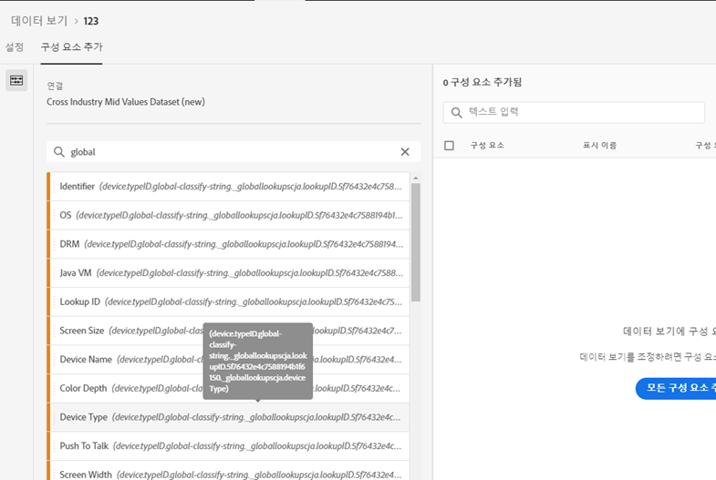
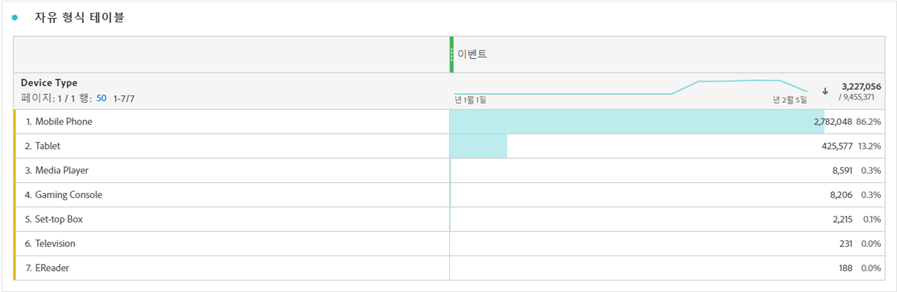

# 데이터 세트에 전역 조회 추가

전역 조회를 사용하면 Customer Journey Analytics 의 기능이 확장되어 자체로는 유용하지 않지만 다른 데이터와 참여할 때 유용하게 사용할 수 있는 일부 차원/속성에 대해 보고할 수 있습니다. 이러한 예로는 모바일 장치의 특성과 브라우저 버전 번호와 같은 OS 및 브라우저 차원의 특성이 있습니다. &#39;전역 조회&#39;는 조회 데이터 세트(기존 Adobe Analytics의 분류라고 함)와 매우 유사합니다. 그러나 Experience Cloud 조직 전체에 대해 글로벌 조회를 적용할 수 있습니다. 전역 조회는 특정 XDM 스키마 필드를 포함하는 모든 이벤트 데이터 세트에 자동으로 적용됩니다(특정 필드는 아래 참조).
Adobe에서 분류하는 각 스키마 위치에 대한 전역 조회 데이터 세트가 있습니다. 전역 조회 데이터 세트를 Analytics 소스 커넥터와 함께 사용하거나 이를 수락할 수 있는 다른 사용자 지정 데이터 세트와 함께 사용할 수 있습니다.

기존 Adobe Analytics에서는 이러한 차원이 개별적으로 표시되지만 CJA에서는 데이터 보기를 만들 때 이러한 차원을 반드시 포함해야 합니다. 사용자가 연결 워크플로우에서 전역 조회 키가 있는 것으로 플래그가 지정된 데이터 세트를 선택하면 데이터 보기 UI에서는 보고에 사용할 수 있는 모든 전역 조회 차원을 포함합니다. 데이터 보기 워크플로우에서는 데이터 보기에 사용할 수 있는 이러한 전역 조회 차원을 포함합니다. 조회 파일은 모든 지역 및 모든 계정에 대해 자동으로 최신 상태로 유지되어 제공됩니다. 이러한 파일은 고객과 연관된 지역별 조직에 저장됩니다.

## Adobe 데이터 커넥터 데이터 세트에서 전역 조회 사용

전역 조회 데이터 세트는 보고서 시간에 자동으로 적용됩니다. [Analytics 데이터 커넥터](https://experienceleague.adobe.com/docs/experience-platform/sources/connectors/adobe-applications/analytics.html?lang=en#connectors)를 사용하고 Adobe에서 전역 조회를 제공하는 차원을 가져오는 경우, 이 전역 조회를 자동으로 적용합니다. 이벤트 데이터 세트에 [XDM](https://experienceleague.adobe.com/docs/experience-platform/xdm/home.html?lang=en) 필드가 포함된 경우 전역 조회를 해당 이벤트에 적용할 수 있습니다.

## 사용자 지정 데이터 세트에서 전역 조회 사용

전역 조회 데이터 세트와 호환되는 이벤트 데이터 세트에 키가 있어야 합니다. 표준 [Adobe Experience Platform 스키마 Mixins](https://experienceleague.adobe.com/docs/experience-platform/xdm/mixins/event/environment-details.html?lang=en#mixins) 중 일부를 추가하여 올바른 XDM 필드를 채우면 사용자 지정 데이터 세트를 전역 조회 작업에 사용할 수 있습니다.

## 사용 가능한 전역 조회 필드

* `browser`
   * `browser`, `group_id`, `id`
* `browser_group`
   * `browser_group`, `id`
* `os`
   * `os`,  `group_id`  `id`
* `os_group`
   * `os_group`,  `id`
* `mobile_audio_support - multi`
* `mobile_color_depth`
* `mobile_cookie_support`
* `mobile_device_name`
* `mobile_device_number_transmit`
* `mobile_device_type`
* `mobile_drm - multi`
* `mobile_image_support - multi`
* `mobile_information_services`
* `mobile_java_vm - multi`
* `mobile_mail_decoration`
* `mobile_manufacturer`
* `mobile_max_bookmark_url_length`
* `mobile_max_browser_url_length`
* `mobile_max_mail_url_length`
* `mobile_net_protocols - multi`
* `mobile_os`
* `mobile_push_to_talk`
* `mobile_screen_height`
* `mobile_screen_size`
* `mobile_screen_width`
* `mobile_video_support - multi`

## 전역 조회 차원에 대한 보고서

전역 조회 차원을 보고하려면 Customer Journey Analytics에서 데이터 보기를 만들 때 차원을 추가해야 합니다.

그러면 작업 공간에서 조회 데이터를 볼 수 있습니다.

