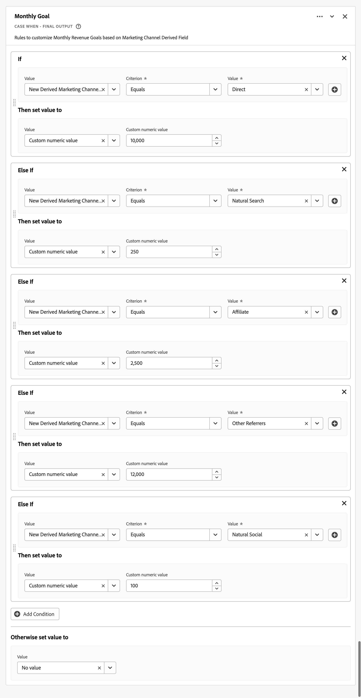

# 파생 필드를 사용하여 목표 보고

이 사용 사례에서는 파생 필드의 기능을 사용하여 특정 차원에 대한 목표를 설정한 다음, Workspace 프로젝트에서 이러한 목표를 사용하는 방법을 설명합니다.

파생 필드에 익숙하지 않은 경우 [자습서](https://experienceleague.adobe.com/docs/customer-journey-analytics-learn/tutorials/data-views/derived-fields-in-cja.html?lang=ko) 및 [설명서](../data-views/derived-fields/derived-fields.md)를 참조하여 소개를 받으십시오.

## 목표 정의

목표를 정의하려면 파생 필드 정의의 이전 부분에서 규칙으로 얻은 값을 사용하여 직접 또는 간접적으로 사용자 정의 숫자 값을 명시적으로 설정하는 새로운 파생 필드를 만듭니다.

### 월별 상품권 주문 목표

2023년 7월부터 2023년 10월까지 4개월 동안 상품권 주문에 대한 목표를 명시적으로 설정하려고 합니다. 다음 작업을 수행하십시오.

1. 이름이 `Monthly Gift Certificate Orders Goal (Incremental)`인 새 파생 필드를 만듭니다.

1. **[!UICONTROL 사용자 지정 숫자 값]**&#x200B;을(를) 설정하여 CASE WHEN RULE을 사용하여 각 달에 대해 정적 값을 설정합니다. 아래의 월별 제품 목표 규칙을 참조하십시오.

   

### 마케팅 채널 매출 목표

각 마케팅 채널에 대한 월별 매출 목표를 설정할 수 있습니다. 다음 작업을 수행하십시오.

1. 이름이 [인 &#x200B;](/help/data-views/derived-fields/derived-fields.md#marketing-channels)마케팅 채널 함수 템플릿`Monthly Marketing Channel Revenue Goal (Incremental)`을(를) 사용하여 새 파생 필드를 만드십시오.

1. URL PARSE 및 CASE WHEN 규칙의 조합을 기반으로 각 마케팅 채널을 제대로 식별하도록 모든 규칙을 정의합니다. 예:

   

1. **[!UICONTROL 사용자 지정 숫자 값]**&#x200B;을(를) 설정하여 최종 CASE WHEN 규칙의 특정 마케팅 채널에 대한 월별 매출 목표를 나타내는 정적 값을 명시적으로 설정합니다. 아래의 [!DNL Monthly Goal] 규칙을 참조하십시오.

   

## 목표 사용

Workspace 프로젝트의 목표를 사용하려면 계산된 지표 기능을 사용하여 파생 필드를 원래 정적 값으로 다시 &#39;정규화&#39;합니다. 목표를 정의하는 파생 필드에 설정한 정적 값이 모든 이벤트에 따라 증가하므로 이 표준화가 필요합니다.

### 월별 상품권 주문 목표

1. 다음과 같이 정의된 `Monthly Gift Certificate Orders Goal`(이)라는 계산된 지표 필드를 만듭니다.

   

1. 추가 계산된 필드(예: `% of Monthly Gift Certificate Orders Goal`)를 만들어 목표에 대한 실제 진행 상황을 표시할 수 있습니다. 예:

   

이러한 계산된 지표를 사용하여 자유 형식 테이블 및 시각화에서 진행 상황을 보고할 수 있습니다. 예:

### 마케팅 채널 매출 목표

1. 다음과 같이 정의된 `Marketing Channel Revenue Goal`(이)라는 계산된 지표 필드를 만듭니다.

   

1. 추가 계산된 필드(예: `% of Marketing Channel Revenue Goal`)를 만들어 목표에 대한 실제 진행 상황을 표시할 수 있습니다. 예:

   

이러한 계산된 지표를 사용하여 자유 형식 테이블 및 시각화에서 진행 상황을 보고할 수 있습니다. 예:

