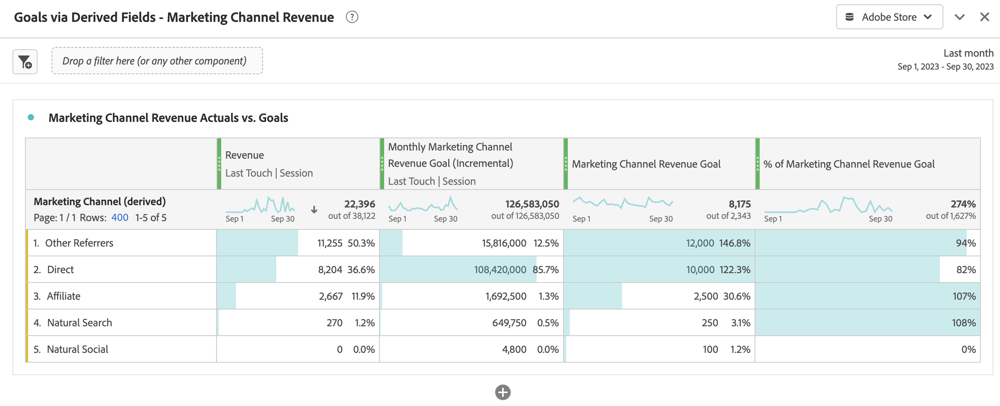

# 파생 필드를 사용하여 목표 보고

이 사용 사례에서는 파생 필드의 기능을 사용하여 특정 차원에 대한 목표를 설정한 다음 작업 영역 프로젝트에서 이러한 목표를 사용하는 방법을 설명합니다.

파생 필드에 익숙하지 않은 경우 [튜토리얼](https://experienceleague.adobe.com/docs/customer-journey-analytics-learn/tutorials/data-views/derived-fields-in-cja.html?lang=en) 및 [설명서](../data-views/derived-fields/derived-fields.md) 소개.

## 목표 정의

목표를 정의하려면 파생 필드 정의의 이전 부분에서 규칙으로 얻은 값을 사용하여 직접 또는 간접적으로 사용자 정의 숫자 값을 명시적으로 설정하는 새로운 파생 필드를 만듭니다.

### 월별 상품권 주문 목표

2023년 7월부터 2023년 10월까지 4개월 동안 상품권 주문에 대한 목표를 명시적으로 설정하려고 합니다. 다음 작업을 수행하십시오.

1. 이름으로 새 파생 필드 만들기 `Monthly Gift Certificate Orders Goal (Incremental)`.

1. CASE WHEN RULE을 사용하여 각 달에 대해 정적 값을 설정합니다. **[!UICONTROL 사용자 지정 숫자 값]**. 아래의 월별 제품 목표 규칙을 참조하십시오.

   

### 마케팅 채널 매출 목표

각 마케팅 채널에 대한 월별 매출 목표를 설정할 수 있습니다. 다음 작업을 수행하십시오.

1. 다음을 사용하여 새 파생 필드를 만듭니다. [마케팅 채널 기능 템플릿](/help/data-views/derived-fields/derived-fields.md#marketing-channels) (이름 포함) `Monthly Marketing Channel Revenue Goal (Incremental)`.

1. URL PARSE 및 CASE WHEN 규칙의 조합을 기반으로 각 마케팅 채널을 제대로 식별하도록 모든 규칙을 정의합니다. 예:

   

1. 최종 CASE WHEN 규칙의 특정 마케팅 채널에 대한 월별 매출 목표를 나타내는 정적 값을 를 설정하여 명시적으로 설정합니다. **[!UICONTROL 사용자 지정 숫자 값]**. 다음을 참조하십시오. [!DNL Monthly Goal] 아래의 규칙입니다.

   

## 목표 사용

Workspace 프로젝트의 목표를 사용하려면 계산된 지표 기능을 사용하여 파생 필드를 원래 정적 값으로 다시 &#39;정규화&#39;합니다.

### 월별 상품권 주문 목표

1. (이)라는 이름의 계산된 지표 필드 만들기 `Monthly Gift Certificate Orders Goal`, 다음으로 정의됨:

   

1. 예를 들어 계산된 필드를 추가로 생성할 수 있습니다 `% of Monthly Gift Certificate Orders Goal`목표에 대한 실제 진행 상황을 표시하려면 다음을 수행합니다.

   

이러한 계산된 지표를 사용하여 자유 형식 테이블 및 시각화에서 진행 상황을 보고할 수 있습니다. 예:

### 마케팅 채널 매출 목표

1. (이)라는 이름의 계산된 지표 필드 만들기 `Marketing Channel Revenue Goal`, 다음으로 정의됨:

   

1. 예를 들어 계산된 필드를 추가로 생성할 수 있습니다 `% of Marketing Channel Revenue Goal`목표에 대한 실제 진행 상황을 표시하려면 다음을 수행합니다.

   

이러한 계산된 지표를 사용하여 자유 형식 테이블 및 시각화에서 진행 상황을 보고할 수 있습니다. 예:

