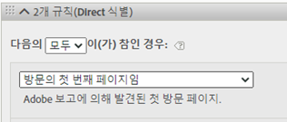
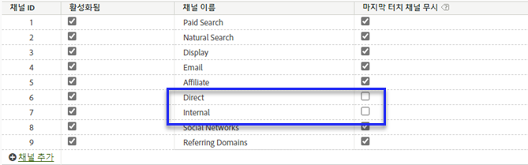
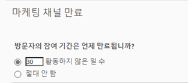

# Adobe Experience Platform에서 마케팅 채널 차원 사용

조직에서 [Analytics 데이터 커넥터](https://docs.adobe.com/content/help/ko-KR/experience-platform/sources/connectors/adobe-applications/analytics.html)를 사용하여 보고서 세트 데이터를 CJA로 가져오는 경우 CJA에서 연결을 구성하여 마케팅 채널 차원에 대해 보고할 수 있습니다.

## 전제 조건

* 보고서 세트 데이터는 이미 [분석 데이터 커넥터](https://docs.adobe.com/content/help/en/experience-platform/sources/connectors/adobe-applications/analytics.html)를 사용하여 Adobe Experience Platform으로 가져와야 합니다. 마케팅 채널은 Analytics 보고서 세트의 처리 규칙에 의존하므로 다른 데이터 소스는 지원되지 않습니다.
* 마케팅 채널 처리 규칙을 이미 설정해야 합니다. 기존 Analytics 구성 요소 안내서의 [마케팅 채널 처리 규칙](https://docs.adobe.com/content/help/ko-KR/analytics/components/marketing-channels/c-rules.html)을 참조하십시오.

## 마케팅 채널 스키마 요소

원하는 보고서 세트에서 Analytics 데이터 커넥터를 설정하면 XDM 스키마가 만들어집니다. 이 스키마에는 모든 Analytics 차원 및 지표가 원시 데이터로 포함되어 있습니다. 이 원시 데이터는 기여도 또는 지속성을 포함하지 않습니다. 대신 각 이벤트는 마케팅 채널 처리 규칙을 통해 실행되고 일치하는 첫 번째 규칙을 기록합니다. CJA에서 데이터 보기를 만들 때 속성 및 지속성을 지정합니다.

1. [Analytics ](/help/connections/create-connection.md) 데이터 커넥터를 기반으로 하는 데이터 세트를 포함하는 연결을 만듭니다.
2. [다음 차원](/help/data-views/create-dataview.md) 을 포함하는 데이터 보기를 만듭니다.
   * **`channel.typeAtSource`**:Marketing  [Channel 차원에 ](https://docs.adobe.com/content/help/en/analytics/components/dimensions/marketing-channel.html) 해당합니다.
   * **`channel._id`**:마케팅  [채널 세부 정보에 해당합니다.](https://docs.adobe.com/content/help/en/analytics/components/dimensions/marketing-detail.html)
3. 각 차원에 원하는 속성 모델과 지속성을 지정합니다. 첫 번째 및 마지막 터치 차원을 모두 사용하려면 각 마케팅 채널 차원을 구성 요소 영역으로 여러 번 드래그합니다. 각 차원에 원하는 속성 모델과 지속성을 지정합니다. 또한 Adobe에서는 작업 공간에서 쉽게 사용할 수 있도록 각 차원에 표시 이름을 지정하는 것이 좋습니다.
4. 데이터 보기를 만듭니다.

이제 마케팅 채널 차원을 Analysis Workspace에서 사용할 수 있습니다.

## 처리 및 아키텍처 차이점

>[!IMPORTANT]
>
>보고서 세트 데이터와 플랫폼 데이터에는 몇 가지 기본적인 데이터 차이가 있습니다. Adobe은 플랫폼에서 적절한 데이터 수집을 용이하게 하기 위해 보고서 세트의 마케팅 채널 처리 규칙을 조정하는 것이 좋습니다.

마케팅 채널 설정은 플랫폼 데이터와 보고서 세트 데이터 간에 다르게 작동합니다. CJA용 마케팅 채널을 설정할 때 다음 차이점을 고려하십시오.

* **방문의 첫 페이지임**:이 규칙 기준은 여러 기본 마케팅 채널 정의에 공통으로 사용됩니다. 이 기준을 포함하는 처리 규칙은 플랫폼에서 무시됩니다(동일한 규칙의 다른 기준은 여전히 적용). 세션은 데이터 수집 시간이 아니라 데이터 쿼리 시간에 결정되므로 플랫폼에서 이 특정 규칙 기준을 사용할 수 없습니다. Adobe은 각 마케팅 채널 처리 규칙에서 &#39;방문의 첫 번째 페이지임&#39; 기준을 제거하는 것이 좋습니다.

   

* **마지막 접촉 채널** 재정의:마케팅 채널 관리자의 이 설정은 일반적으로 특정 채널이 마지막 터치 채널 크레딧을 받지 못하게 합니다. 플랫폼은 이 설정을 무시하므로 &#39;직접&#39; 또는 &#39;내부&#39;와 같은 광범위한 채널이 잠재적으로 원치 않는 방식으로 지표에 속성을 지정할 수 있습니다. &#39;마지막 접촉 채널 무시&#39;를 선택 취소한 채널을 제거하는 것이 좋습니다.
   * 마케팅 채널 관리자에서 &#39;직접&#39; 마케팅 채널을 삭제한 다음 해당 채널에 대해 CJA의 &#39;값 없음&#39; 차원 항목을 사용할 수 있습니다. 데이터 보기를 구성할 때 이 차원 항목의 이름을 &#39;직접&#39;으로 바꾸거나 차원 항목을 완전히 제외할 수도 있습니다.
   * 또는 CJA에서 제외하려는 채널을 제외하고 각 값을 자체적으로 분류하여 마케팅 채널 분류를 만들 수 있습니다. 그런 다음 데이터 보기를 만들 때 `channel.typeAtSource` 대신 이 분류 차원을 사용할 수 있습니다.

   

* **마케팅 채널 만료**:이 참여 기간 설정은 방문자가 보고서 세트 데이터에서 새 첫 번째 접촉 채널을 획득하기 전에 활동이 없는 기간을 결정합니다. 플랫폼에서는 자체 속성 설정을 사용하므로 이 설정은 CJA에서 완전히 무시됩니다.

   

## CJA와 기존 분석 간의 데이터 비교

Adobe Experience Platform의 아키텍처는 기존의 Analytics 보고서 세트와 다르므로 결과가 일치할 것으로 보장되지 않습니다. 그러나 다음 팁을 사용하여 이러한 비교를 쉽게 할 수 있습니다.

* 위에 나열된 아키텍처 차이점이 비교에 영향을 주지 않는지 확인합니다. 여기에는 마지막 접촉 채널을 무시하지 않는 채널을 제거하고 방문의 첫 번째 히트인 규칙 기준을 제거하는 작업이 포함됩니다(세션).
* 연결에 기존 Analytics와 동일한 보고서 세트가 사용되는지 다시 확인하십시오. CJA 연결에 자체 마케팅 채널 처리 규칙이 있는 여러 보고서 세트가 있는 경우 기존 Analytics와 비교하는 쉬운 방법이 없습니다. 데이터를 비교하기 위해 각 보고서 세트에 대해 별도의 연결을 만들어야 합니다.
* 동일한 날짜 범위를 비교하고 데이터 보기의 표준 시간대 설정이 보고서 세트의 표준 시간대와 같은지 확인합니다.
* 보고서 세트 데이터를 볼 때 사용자 지정 속성 모델을 사용합니다. 예를 들어 기본이 아닌 속성 모델을 사용하는 지표와 함께 [마케팅 채널](https://experienceleague.adobe.com/docs/analytics/components/dimensions/marketing-channel.html) 차원을 사용합니다. Adobe은 보고서 세트에서 수집된 속성에 의존하므로 기본 차원 [첫 번째 접촉 채널](https://experienceleague.adobe.com/docs/analytics/components/dimensions/first-touch-channel.html) 또는 [마지막 접촉 채널](https://experienceleague.adobe.com/docs/analytics/components/dimensions/last-touch-channel.html)을(를) 비교하지 않도록 권장합니다. CJA는 보고서 세트의 속성 데이터에 의존하지 않습니다.대신 CJA 보고서가 실행되면 계산됩니다.
* 일부 지표는 보고서 세트 데이터와 플랫폼 데이터 간의 아키텍처 차이로 인해 적절한 비교가 되지 않습니다. 방문 횟수/세션, 방문자 수/사람 및 발생 횟수/이벤트 등을 예로 들 수 있습니다.
