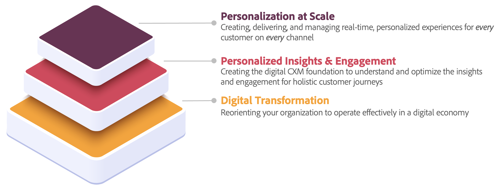

# 개인화된 인사이트 및 관리 사용 사례

귀사는 이미 디지털 전환 이니셔티브를 완성하거나 구축하기 위해 수년을 소비했을 수 있으며, 이는 디지털 경제 환경에서 조직 전체를 재조정할 수 있도록 귀사가 발전해야 하는 방법에 대한 훌륭한 기준입니다. 하지만 어떻게 그 정점을 달성할 수 있는지를 보면 *규모에 맞는 개인화*, 많은 것이 필요한 것처럼 보일 수 있습니다. 규모에 맞게 개인화를 달성하려면 콘텐츠 공급망을 구축하는 기능, 개인화된 통찰력과 참여를 갖는 기능, 상거래 및 모든 접점을 지원하는 기타 다양한 애플리케이션을 갖는 기능이 필요합니다.

개인화된 인사이트와 참여는 규모에 맞게 디지털 전환과 개인화 사이에 있는 계층입니다. 그러나 규모에 맞게 개인화를 수행하고 기존 디지털 전환 노력을 최대한 활용하려면 보유한 모든 풍부한 데이터를 이해 및 최적화하고 전체 고객 여정 전반에 걸쳐 해당 데이터를 참여하도록 준비하는 기반이 있어야 합니다. 전체 고객의 프로필이 있으면 규모에 맞게 개인화할 수 있습니다.

## 사용 사례

현재 많은 개인화된 통찰력 및 참여 사용 사례가 식별되었습니다.

| 사용 사례 | 설명 | 솔루션 |
|---|---|---|
| [지능형 재참여](https://experienceleague.adobe.com/en/docs/experience-platform/rtcdp/use-cases/personalization-insights-engagement/intelligent-re-engagement) | 전환을 완료하기 전에 포기한 고객을 지능적이고 책임감 있게 다시 참여시킵니다. 미리 알림이 아닌 경험을 만들기 위해 지능과 공감을 가지고 행동합니다. | Customer Journey Analytics Real-time Customer Data Platform Journey Optimizer |
| 캠페인 &quot;지지 않음&quot; | 더 늦기 전에 고객 이탈을 줄이십시오. 낙후된 고객을 다시 참여시켜 전환율을 높이고 고객 생애 가치 성장을 촉진합니다. | Customer Journey Analytics Real-time Customer Data Platform Journey Optimizer |
| [고객 전환 최적화](customer-conversion-optimization.md) | 현재 고려 단계에 있는 잠재 고객을 전환된 고객으로 전환합니다. 집계된 전환율만 보는 대신 각 고객의 전환 요구 사항을 고려합니다. | Customer Journey Analytics Real-time Customer Data Platform Journey Optimizer |
| 문맥 인식 | 현재 인증 상태에 관계없이 인식된 사용자를 개인화합니다. 즉각적인 컨텍스트를 설명하고 최상의 개인화된 경험을 제공합니다. | Real-time Customer Data Platform Customer Journey Analytics |
| [일회성 값을 라이프타임 값으로 진화](https://experienceleague.adobe.com/en/docs/experience-platform/rtcdp/use-cases/personalization-insights-engagement/evolve-one-time-value-to-lifetime-value) | 특정 고객의 특성, 동작 및 과거 구매를 기반으로 최상의 보완 제품 또는 서비스를 제공하는 개인화된 캠페인을 만드십시오. | Real-time Customer Data Platform Journey Optimizer |
| 잠재 고객부터 후원자까지 | 서드파티 쿠키 없이 새로운 고객을 찾고 획득하여 비즈니스를 성장시키십시오. 세분화 및 경험을 더 잘 최적화하기 위해 이러한 새로운 잠재 고객의 성능 및 효과를 모두 이해합니다. | Real-time Customer Data Platform Customer Journey Analytics |

각 사용 사례(다음으로 시작하는 고객 전환 최적화)는 다음 구조에 따라 문서화됩니다

- 개요
   - 옛 것을 가지고, 새 것을 가지고
   - 목표, 과제 및 차별화 요소
- 전제 조건 및 계획
- 솔루션 및 기능
- 예
- 값

