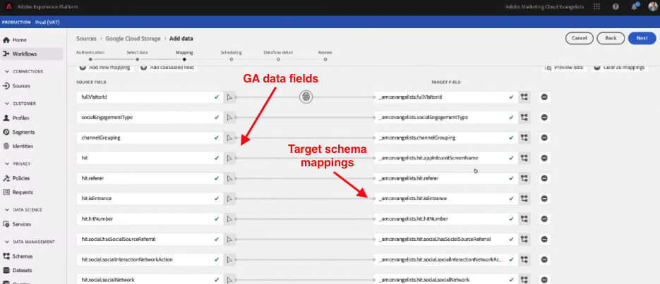
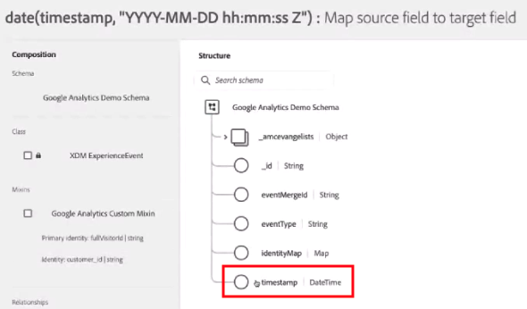

# Google Analytics 내역 데이터 수집

이 페이지에서는 Google Analytics 내역 데이터를 Adobe Experience Platform에 데이터 세트로 수집한 다음 Customer Journey Analytics 내에 있는 데이터 보기에서 수집한 데이터 세트를 참조하는 방법에 중점을 두고 설명합니다. 이 페이지의 단계를 [라이브 Google Analytics 구현 구성](streaming.md)과 결합하여 반복 데이터 세트를 생성할 수 있습니다. 이 내역 데이터 세트를 현재 구현의 데이터 세트와 결합하여 현재 데이터 및 채워진 데이터와 함께 Customer Journey Analytics 데이터를 원활하게 볼 수 있습니다.

## 사전 요구 사항

이러한 작업을 달성하려면 다음의 액세스 및 권한이 필요합니다.

* Adobe Experience Platform 액세스
* Google Analytics 액세스(GA Standard 또는 GA 360))
* Customer Journey Analytics에 대한 [관리자 액세스](/help/technotes/access-control.md)

## BigQuery 내보내기 설정

Universal Analytics 속성의 데이터 구조는 Google Analytics 4 속성의 데이터 구조와 다릅니다. 데이터를 내보내고자 하는 속성 유형에 따라 BigQuery 내보내기를 설정하십시오.

* [Universal Analytics 속성에 대해 BigQuery 내보내기 설정](https://support.google.com/analytics/answer/3416092)
* [Google Analytics 4 속성에 대해 BigQuery 내보내기 설정](https://support.google.com/analytics/answer/9823238)

### Universal Analytics 속성에 대한 추가 요구 사항

>[!NOTE]
>
>이 섹션은 Universal Analytics 속성에만 적용됩니다. GA4 속성에서 내보내는 경우 [Google Cloud Platform으로 데이터 내보내기](#export-gcp)로 계속 진행하십시오.

Universal Analytics 속성은 각 기록을 그 데이터 안에 개별 이벤트가 아닌 사용자 세션으로서 보관합니다. Universal Analytics 데이터를 Adobe Experience Platform과 호환되는 형식으로 변환하려면 SQL 쿼리가 필요합니다. GA 스키마에서 `UNNEST` 함수를 `hits` 필드에 적용한 다음 BigQuery 테이블로 저장합니다.


>[!BEGINSHADEBOX]

데모 비디오는  [Google Analytics에서 Customer Journey Analytics으로 이동](https://video.tv.adobe.com/v/332634?quality=12&learn=on){target="_blank"}을 참조하십시오.

>[!ENDSHADEBOX]


```sql
SELECT
   *,
   timestamp_seconds(`visitStartTime` + hit.time) AS `timestamp` 
FROM
   (
      SELECT
         fullVisitorId,
         visitNumber,
         visitId,
         visitStartTime,
         trafficSource,
         socialEngagementType,
         channelGrouping,
         device,
         geoNetwork,
         hit 
      FROM
         `example_bq_table_*`,
         UNNEST(hits) AS hit 
   )
```

## Google Cloud Platform으로 데이터 내보내기 {#export-gcp}

Google Cloud Platform에서 **내보내기 > GCS로 내보내기**&#x200B;로 이동합니다. 데이터를 Google Cloud Storage로 내보내면 데이터가 Adobe Experience Platform으로 옮겨질 수 있게 준비됩니다.

## Google Cloud Storage에서 Experience Platform으로 데이터 가져오기

1. Adobe Experience Platform에서 왼쪽의 **[!UICONTROL 소스]**&#x200B;를 선택합니다.
1. [카탈로그]에서 **[!UICONTROL Google Cloud Storage]** 옵션을 찾습니다. **[!UICONTROL 데이터 추가]**&#x200B;를 클릭합니다.


>[!BEGINSHADEBOX]

데모 비디오를 보려면  [Adobe Experience Platform으로 Google Analytics 데이터 가져오기](https://video.tv.adobe.com/v/3437173?captions=kor&quality=12&learn=on){target="_blank"}를 참조하십시오.

>[!ENDSHADEBOX]


>[!TIP]
>
>내역 Google Analytics 데이터와 라이브 스트리밍 Google Analytics 데이터를 모두 내보내려면 각 데이터 세트에 동일한 스키마를 사용해야 합니다. [결합된 데이터 세트](/help/connections/combined-dataset.md)를 사용하여 Customer Journey Analytics의 데이터 세트를 병합할 수 있습니다.

선택한 XDM 스키마를 사용하여, 이전에 생성한 기존의 데이터 세트에 GA 이벤트 데이터를 매핑하거나 새 데이터 세트를 만들 수 있습니다. 스키마를 선택하면 Experience Platform이 머신 러닝을 적용해 Google Analytics 데이터의 각 필드를 해당 [XDM 스키마](https://experienceleague.adobe.com/docs/experience-platform/xdm/home.html?lang=ko#ui)에 자동으로 사전 매핑합니다.



XDM 스키마로의 필드 매핑을 완료한 뒤에는 이 가져오기를 반복해서 예약하고 수집 프로세스 중 오류 유효성 검사를 적용할 수도 있습니다. 이 유효성 검사는 가져온 데이터에 아무 문제도 없음을 보장해 줍니다.

## 필수 XDM 필드

데이터를 올바르게 처리하려면 Platform의 특정 XDM 필드에 올바른 형식이 필요합니다.

* **`timestamp`**: Experience Platform 스키마 UI에 특수한 계산된 필드를 생성합니다. **[!UICONTROL 계산된 필드 추가]**&#x200B;를 클릭하고 `date` 함수에서 `timestamp` 문자열을 래핑합니다.

  `date(timestamp, "yyyy-MM-dd HH:mm:ssZ")`

  계산된 필드를 스키마의 타임스탬프 데이터 구조에 저장합니다.

  

* **`_id`**: 이 필드에는 값이 있어야 합니다. Customer Journey Analytics은 값이 무엇이든 상관하지 않습니다. 이 필드에 “1”을 추가할 수 있습니다.

  

## 다음 단계

* 현재 데이터를 Adobe Experience Platform으로 스트리밍하려면 [Google Analytics 데이터 스트리밍 설정](streaming.md)을 참조하십시오.
* 채워진 데이터에 대한 보고를 시작하려면 [연결 만들기](/help/connections/create-connection.md)를 참조하십시오.
