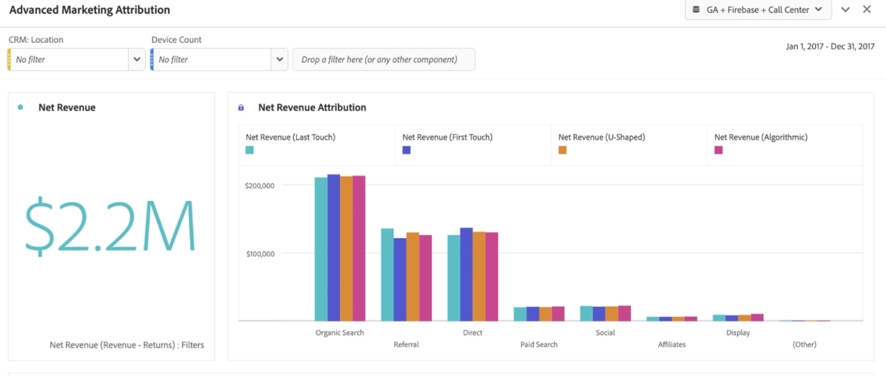
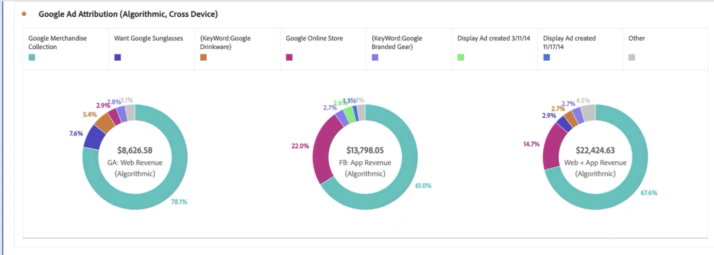

# Google Analytics 데이터에 대한 보고

이제 Customer Journey Analytics에서 데이터를 사용할 수 있으니 다음 예제를 통해 이러한 데이터에 대한 보고를 수행하는 데 유용한 시나리오를 살펴보십시오.

## 웹 데이터와 앱 데이터를 통합된 데이터 세트로 시각화

이 Venn 다이어그램은 웹 사이트의 사용자(Google Analytics 데이터 기반), 모바일 앱 사용자(Firebase 데이터 기반), 콜센터의 사용자를 중첩하여 보여 줍니다. 또한 성과가 가장 좋은 제품들을 웹뿐 아니라 모바일 앱에서도 볼 수 있습니다. 계산된 지표를 사용하여 두 플랫폼 모두로부터 총 매출을 산출할 수도 있습니다. 통합된 매출을 살펴보면 최우수 제품에 대해 미처 파악하지 못했던 정보를 파악할 수 있습니다. 통합된 데이터 세트가 없었다면 &quot;트윌 캡&quot;이 우수한 성과를 보이는 제품이었다는 사실을 절대 몰랐을 것입니다.

## 문의 전화의 이유 파악 및 문의 전화량 감소

지난 2개월 동안 콜센터에서 소요한 시간의 추세를 분석하여 문의 전화량을 파악할 수 있습니다. 다음 예제는 지난 2개월 간 이 데이터의 추세 분석을 보여 줍니다. 다음 예제는 운영비에 영향을 미칠 수 있는 증가 추세를 보여 줍니다.

&#39;통화 이유&#39; 차원을 사용하면 웹 경험을 개선하는 방법에 대한 힌트를 얻어 사용자가 처음에 이 문제를 제기하지 못하도록 할 수 있습니다. 위의 예제는 “제품 손상”이 문의 전화당 평균 통화 시간이 거의 3분임을 보여 주며, 귀사가 고객 경험을 개선하고 콜센터 운영비를 낮출 수 있는 정확한 방법을 제시합니다.

콜센터에 접수되는 문의 전화 대부분의 원인이 되는 제품이 무엇인지 그리고 얼마나 많은 고객이 이러한 문의 전화를 했는지 확인할 수 있습니다. 이 버블 차트에 따르면 20,000명이 문의 전화를 했고 4시간 30분이 넘는 시간을 소모했으며 “남성용 반팔티” 제품 33개를 반품했습니다.

“통화 이유”의 차원 분류를 적용하여 이 예제는 “손상된 제품” 차원 항목을 보여 줍니다. 다음 단계는 품질 관리 부서에 문의하여 고객들이 왜 손상된 티셔츠를 받게 되었는지 알아보는 것입니다.

이제 어떤 웹 사이트 페이지가 콜센터에 접수되는 문의 전화를 유도했는지 살펴볼 수 있습니다. 이 보고서를 통해 웹 사이트 내에서 성과가 부진한 경험이 어디에 위치해 있는지 알 수 있으며 제품 관리자가 이러한 어려움을 해결하는 데 도움을 줄 수 있습니다. 다음 예에서는 기여도 속성 모델과 함께 계산된 지표를 사용하여 콜센터 문의 전화를 유도한 세션만 볼 수 있도록 세부 필터링합니다.

다음 예제는 “장바구니”와 “체크아웃 정보” 페이지가 문의 전화의 대부분을 유도한 것을 알 수 있습니다.

집단 테이블을 사용하면 사용자들이 웹 사이트를 방문한 후 콜센터에 문의 전화를 하기까지 대체로 얼마나 걸렸는지 알아볼 수 있습니다. 다음 예제는 이 예제 데이터 세트의 평균 시간이 3~4주임을 나타냅니다.

## 고급 마케팅 속성 사용

Customer Journey Analytics에서는 채널 간 데이터에 대해 정교한 속성 모델을 사용할 수 있습니다. 다음의 예에서는 Google Analytics 채널 그룹화 차원에 매출의 마지막 터치, 첫 번째 터치, U자형, 그리고 알고리즘 속성을 적용한 경우를 비교해 볼 수 있습니다.

계산된 지표를 사용하면 이러한 속성을 웹 매출과 모바일 앱 매출에 적용할 수 있으며 심지어 제품 반품을 제외할 수 있습니다. 그리고 결과적으로 각 마케팅 채널의 진정한 순 매출을 볼 수 있습니다.

Attribution IQ을 사용하면 데이터를 세그먼트화할 수도 있습니다. 예를 들어 두 개 이상의 디바이스를 사용하는 사용자 등 특정한 사용자 집합에 대해서만 속성을 볼 수 있습니다.

Google Ad 콘텐츠에도 웹 및 앱 매출을 귀속시킬 수 있습니다. 이 데이터 세트의 예제에서는 웹보다 모바일 앱에서 온라인 Google Ads를 통해 유도된 매출이 더 컸습니다. 광고를 웹 매출과 앱 매출에 따라 정렬하면 어떤 Google Ads의 성과가 가장 좋았는지에 대해 예상하지 못했던 정보를 파악할 수 있게 됩니다.

Customer Journey Analytics의 데이터 세트를 결합하면 이 예제에서 온라인 광고가 모바일 앱에서 구매되는 제품에 영향을 미치고 있었다는 것을 알 수 있습니다. 다음 시각화는 Google Ads로부터 발생한 모바일 앱 매출이 웹 자체에서만 발생한 매출에 비해 14,000~15,000달러 더 많다는 것을 보여 줍니다.

